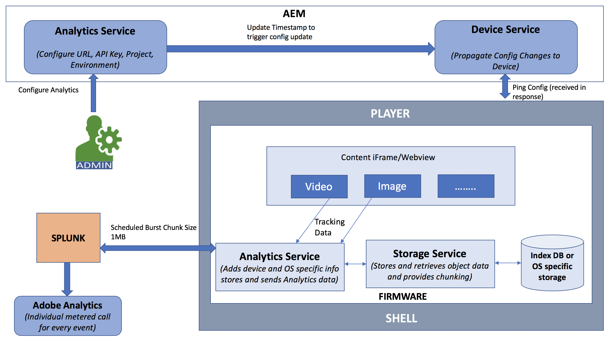

# Integração do Adobe Analytics com o AEM Screens {#adobe-analytics-integration-with-aem-screens}

>[!CAUTION]
>
>Essa funcionalidade do AEM Screens só estará disponível se você tiver instalado a versão mínima do AEM 6.4.2 Feature Pack 2 ou AEM 6.3.3 Feature Pack 4. Para clientes do AEM Screens Cloud Service, entre em contato com o Gerente de relacionamento de Adobe para ativar o Adobe Analytics na Screens Cloud.

>[!NOTE]
>
>Para obter acesso a qualquer um desses Feature Packs, entre em contato com o Suporte da Adobe e solicite acesso. Você pode baixar o pacote de recursos mais recente para o AEM Screens na [Portal de distribuição de software](https://experience.adobe.com/#/downloads/content/software-distribution/br/aem.html) usando sua Adobe ID.

Esta seção abrange os seguintes tópicos:

* **Visão geral**
* **Detalhes da arquitetura**
* **Configuração das propriedades**

## Visão geral {#overview}

***AEM Screens*** O usa o Adobe Analytics e, com isso, você pode alcançar algo único no mercado: o cross-channel analytics, que ajuda a correlacionar o conteúdo mostrado no local com outras fontes de dados.

O AEM Screens fornece uma integração imediata com o Adobe Analytics e uma prova de atividade.

Esta seção descreve a seguinte funcionalidade envolvida na conexão de um projeto do AEM Screens com o Adobe Analytics:

* Permite o relatório de prova de reprodução por dispositivo
* Permite relatórios de prova de reprodução por ativo
* Garante que todos os eventos do player sejam capturados e carimbados com data e hora
* Garante que todos os eventos do player sejam armazenados localmente se a reprodução não estiver conectada a uma rede
* Permite a criação de loops de comentários que rastreiam eventos de reprodução ao longo do tempo
* Permite que o sistema modifique o conteúdo e os layouts com base nos critérios de sucesso definidos pelo autor de conteúdo

A integração do Adobe Analytics com o AEM Screens impõe o seguinte *metas*:

* Habilitar o ROI de implementações de sinalização digital
* Integre o Analytics como base para viabilização futura da coleta e análise de informações de uso

## Detalhes da arquitetura {#architectural-details}

Um cliente do AEM Screens deseja entender qual conteúdo foi mostrado, em que momento e por quanto tempo (agregado). Esse é um recurso comum da solução de sinalização. Em vez de criar um aplicativo de análise separado, o AEM Screens usa o Adobe Analytics. A combinação nos permite alcançar algo único no mercado: a análise entre canais, que ajuda a correlacionar o conteúdo mostrado no local com outras fontes de dados.

O diagrama de arquitetura a seguir explica a integração do Adobe Analytics com o AEM Screens:

## Habilitar o Adobe Analytics no AEM Screens {#enabling-adobe-analytics-in-aem-screens}

As configurações do Adobe Analytics podem ser definidas no console OSGi.

Navegue até **Configuração do console da Web do Adobe Experience Manager** para configurar o Adobe Analytics para AEM Screens.

## Screens Analytics: Fluxo de ativação {#screens-analytics-enablement-flow}

>[!CAUTION]
>
>Antes de configurar as propriedades, entre em contato com o Gerente de relacionamento de Adobe para criar um tíquete e obter uma **Chave da API do Analytics** e **Projeto do Analytics** para uso com o AEM Screens.

### Configuração das propriedades {#configuring-the-properties}

>[!CAUTION]
>
>Antes de configurar as propriedades, entre em contato com o Gerente de relacionamento de Adobe para criar um tíquete e obter uma **Chave da API do Analytics** e **Projeto do Analytics** para uso com o AEM Screens.

A tabela a seguir destaca as propriedades e a descrição para configurar o Adobe Analytics para AEM Screens:

<table>
 <tbody>
  <tr>
   <td><strong>Propriedade</strong></td>
   <td><strong>Descrição</strong></td>
  </tr>
  <tr>
   <td><strong>URL do Analytics</strong></td>
   <td>URL para publicar dados de análise do reprodutor.  
   Para desenvolvimento/estágio</em> - https://cc-api-data-stage.adobe.io/ingest/  <em>Para produção</em> - https://cc-api-data.adobe.io/ingest/   </td>
  </tr>
  <tr>
   <td><strong>Chave da API do Analytics</strong></td>
   <td>Chave da API para autenticar no servidor do Adobe Analytics (fornecida pelo Gerente de contas).</td>
  </tr>
  <tr>
   <td><strong>Projeto do Analytics</strong></td>
   <td>Projeto do AEM Screens configurado em suas análises para receber dados (fornecidos pelo Gerente de contas).</td>
  </tr>
  <tr>
   <td><strong>Ambiente</strong></td>
   <td>
Ambiente de preparo ou produção (escolha Preparo ou Produção).
</td>
  </tr>
  <tr>
   <td><strong>Frequência de envio do Analytics</strong></td>
   <td>Frequência em minutos para envio de dados de análise dos reprodutores. Por padrão, é definido como 15 minutos.</td>
  </tr>
 </tbody>
</table>

>[!NOTE]
>
>Por padrão, a variável **Frequência de envio do Analytics** é de 15 minutos.

#### Utilização do serviço Adobe Analytics no AEM Screens {#using-adobe-analytics-service-in-aem-screens}

Esse cenário chama a API do Analytics por meio de chamadas REST de um serviço de análise no firmware. Ele também instrumenta componentes principais de telas AEM para criar e enviar eventos explicitamente específicos para um caso de uso específico. Tudo isso enquanto permite a extensibilidade, onde qualquer mensagem personalizada pode ser enviada para o Analytics a partir de um canal desenvolvido de forma personalizada.

Os eventos do Analytics são armazenados offline no indexedDB e, posteriormente, fragmentados e enviados para a nuvem.

>[!NOTE]
>
>Para saber mais sobre o ***Sequenciamento*** e ***Modelo de dados padrão para eventos***, consulte **[Configuração do Adobe Analytics para AEM Screens](configuring-adobe-analytics-aem-screens.md)**.
