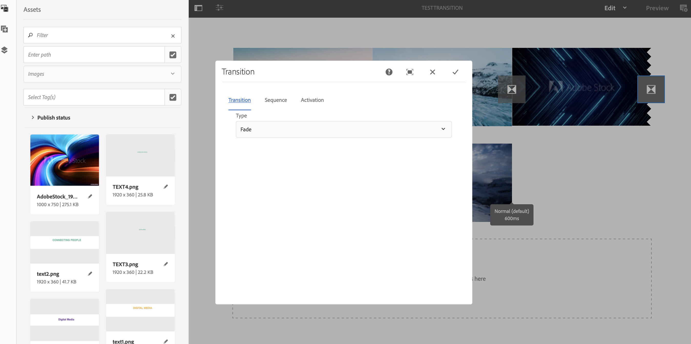

# Aplicar transições {#applying-transitions}

Esta seção descreve como você pode aplicar o componente **Transição** entre diferentes ativos (imagens e vídeos) e sequências incorporadas em um canal.

>[!CAUTION]
>
>Para saber mais detalhes sobre as propriedades do componente **Transição** , consulte [Transições](adding-components-to-a-channel.md#transition).

## Adicionar componente de transição aos ativos em um canal {#adding-transition}

Siga as etapas abaixo para adicionar um componente de transição ao seu projeto do AEM Screens:

>[!NOTE]
>
>**Pré-requisitos**
> Crie um projeto do AEM Screens **TestProject** com um canal **TestTransition**. Além disso, configure um local e uma tela para exibir a saída.

1. Navegue até Channel **TestTransition** e clique em **Edit (Editar** ) na barra de ações.

   

   >[!NOTE]
   >
   >O canal **TestTransition** já tem poucos ativos (imagens e vídeos) nele. Por exemplo, o canal **TestTransition** inclui três imagens e dois vídeos, como mostrado abaixo:

   

1. Arraste e solte o componente **Transição** no editor.
   >[!CAUTION]
   >
   >Antes de adicionar a transição aos ativos no canal, certifique-se de não adicionar a transição antes do primeiro ativo no canal sequencial. O primeiro item em seu canal deve ser um ativo e não uma transição.

   

   > [!NOTE]
   >
   >Por padrão, as propriedades do componente de transição, como **Tipo** , estão definidas como **Normal** e a **Duração** está definida como *600 ms*.  Além disso, não é aconselhável definir um tempo de duração de transição maior do que o ativo ao qual está sendo aplicado.

1. Além disso, se você adicionar um componente de Sequência **** incorporada (que inclui um canal de sequência) a esse editor de canal, poderá adicionar um componente de transição no final, para que o conteúdo seja reproduzido em ordem, como demonstrado na figura abaixo:

   

## Adicionar componente de transição a vídeos em um canal {#adding-transition-videos}

Ao aplicar o componente de transição entre vídeos, é recomendável definir o **Tipo** como **Desvanecer** e a Duração **da** sequência como **1600 ms**.

