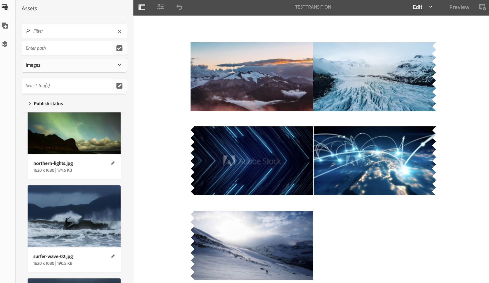

# Aplicar transições {#applying-transitions}

Esta seção descreve como você pode aplicar o componente **Transição** entre diferentes ativos (imagens e vídeos) e sequências inseridas em um canal.

>[!CAUTION]
>
>Para saber mais detalhes sobre as propriedades do componente **Transição**, consulte [Transições](adding-components-to-a-channel.md#transition).

## Adicionar componente de transição ao Assets em um canal {#adding-transition}

Siga as etapas abaixo para adicionar um componente de transição ao seu projeto do AEM Screens:

>[!NOTE]
>
>**Pré-requisitos**
>
>Crie um projeto do AEM Screens **TestProject** com um canal **TestTransition**. Além disso, configure um local e uma exibição para visualizar a saída.

1. Navegue até o Canal **TestTransition** e clique em **Editar** na barra de ações.

   

   >[!NOTE]
   >
   >O canal **TestTransition** já contém alguns ativos (imagens e vídeos). Por exemplo, o canal **TestTransition** inclui três imagens e dois vídeos, conforme mostrado abaixo:

   

1. Arraste e solte o componente **Transição** no editor.

   >[!CAUTION]
   >
   >Antes de adicionar a transição aos seus ativos no canal, certifique-se de não adicionar a transição antes do primeiro ativo no canal sequencial. O primeiro item no canal deve ser um ativo e não uma transição.

   

   >[!NOTE]
   >
   >Por padrão, as propriedades do componente de transição, como **Type**, estão definidas como **Fade** e a **Duration** está definida como *1600 milissegundos*. Além disso, não é aconselhável definir um tempo de duração de transição mais longo que o ativo ao qual está sendo aplicado.

1. Além disso, se você adicionar um componente de **Sequência inserida** (que inclui um canal de sequência) a esse editor de canal, será possível adicionar um componente de transição ao final. Isso garante que o conteúdo seja reproduzido na ordem correta, conforme ilustrado na imagem a seguir:

   
