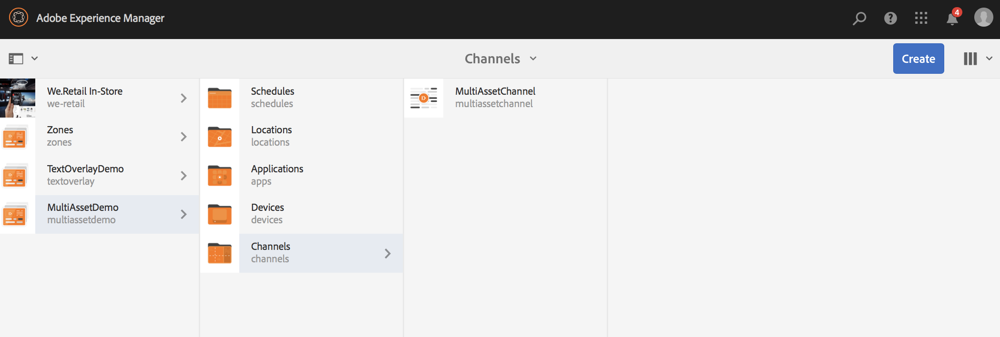

# Ativação de nível de ativo {#asset-level-scheduling}

Esta página descreve a ativação de nível de ativo para os ativos usados em Canais.

Os seguintes tópicos são abordados nesta seção:

* Visão geral
* Janela de ativação
* Reprodução de evento único
* Tratamento de recorrência em ativos
   * Programação de anúncios
   * Semana de Partida
   * Mês de separação
* Ativação de vários ativos

>[!CAUTION]
>
>Esta funcionalidade do AEM Screens só estará disponível se você tiver instalado o AEM 6.3 Feature Pack 3 ou o AEM 6.4 Screens Pack 1.
>
>Para obter acesso a esse Feature Pack, você deve entrar em contato com o Suporte da Adobe e solicitar acesso. Com as devidas permissões, você pode baixá-lo em Compartilhamento de pacotes.

## Visão geral {#overview}

***Ativação*** de nível de ativo, permite ativar um ativo específico em um canal para um período agendado no fuso horário local do player. Isso está disponível para imagens, vídeos, transições, páginas e canais incorporados (dinâmicos ou estáticos).

*Por exemplo*, você deseja que uma promoção especial seja exibida somente durante a hora de felicidade (de 2h às 5h) nas segundas e quartas-feiras.

Com esse recurso, não somente você pode especificar a data e a hora de início e término, como também um padrão de recorrência.

## Reprodução de evento único {#single-event-playback}

A Ativação no nível do ativo é feita configurando a guia **Ativação** ao acessar as propriedades de um ativo.

Siga as etapas abaixo para executar a programação de nível de ativos:

1. Selecione qualquer canal e clique em **Editar** na barra de ações para adicionar ou editar conteúdo em seu canal.

   

   >[!NOTE]
   >
   >Para saber mais detalhes sobre como
   >
   >* Crie um projeto, consulte [Criação de um novo projeto](creating-a-screens-project.md).
   >* Crie e adicione conteúdo a um canal, consulte [Gerenciamento de canais](managing-channels.md).

1. Clique em **Editar** para abrir o editor de canal e selecionar um ativo ao qual deseja aplicar o agendamento.

   

1. Selecione o ativo e clique no canto superior esquerdo de **Configurar** (ícone de chave) para abrir as propriedades da imagem.

   Click the **Activation** tab.

   

1. Você pode especificar a data do seletor de datas usando os campos **Ativo de** e **Ativo até** .

   Se você selecionar **Ativo de e** Ativo até **** a data e hora, o ativo será exibido e fará loop apenas entre a data/hora de início e a data/hora de término, respectivamente.

   

## Tratamento de recorrência em ativos {#handling-recurrence-in-assets}

Você pode programar a recorrência de ativos em determinados intervalos, diariamente, semanalmente ou mensalmente, de acordo com sua necessidade.

Suponha que você queira exibir uma imagem somente às sextas-feiras das 13:00 às 10:00 horas. Você pode usar a guia **Ativação** para definir o intervalo recorrente desejado para o ativo.

### Programação de anúncios {#day-parting}

1. Selecione o ativo e clique em **Configurar** (ícone de chave) para abrir a caixa de diálogo de propriedades.

1. Depois de inserir a data/hora de início e a hora de término/data, você pode usar uma expressão ou uma versão de texto natural para especificar a programação de recorrência.

   > [!NOTE]
   > Você pode ignorar ou incluir os campos **Ativo de e** Ativo Até **** e adicionar a expressão ao campo Programações, conforme sua necessidade.

1. Informe a expressão na **Programação** e seu ativo será exibido para o intervalo específico de dia e hora.

#### Expressões de exemplo para programação de anúncios {#example-one}

A tabela a seguir resume algumas expressões de exemplo que podem ser adicionadas ao agendamento enquanto o canal é atribuído a uma exibição.

| **Expressão** | **Interpretação** |
|---|---|
| antes das 8:00 | o ativo no canal é reproduzido antes das 8:00 da manhã todos os dias |
| depois das 14:00 | o ativo no canal é reproduzido depois das 14:00 horas todos os dias |
| depois das 12:15 e antes das 12:45 | o ativo no canal é reproduzido depois das 12h15 todos os dias por 30 minutos |
| antes das 12:15 também depois das 12:45 | o ativo no canal é reproduzido antes das 12h15 todos os dias e depois também depois das 12h45 |
| Seg,Ter,Qua ou Qua | o ativo é reproduzido no ativo no canal de segunda a quarta |
| no primeiro dia de janeiro depois das 14:00 também no dia 2 de janeiro também no dia 3 de janeiro antes das 15:00 | o ativo no canal começa a ser reproduzido depois das 14:00 horas do dia 1º de janeiro, continua sendo reproduzido durante todo o dia do dia 2 de janeiro até as 15:00 da manhã do dia 3 de janeiro |
| no dia 1-2 de janeiro depois das 14:00 também no dia 2-3 de janeiro antes das 3:00 | o ativo no canal inicia o player depois das 14:00 horas de 1º de janeiro, continua reproduzindo até as 15:00 da manhã de 2º de janeiro, e começa novamente em 2º de janeiro às 14:00 e continua reproduzindo até as 15:00 da manhã de 3 de janeiro |

>[!NOTE]
>Você também pode usar a notação _militar do tempo_ (ou seja, 14:00) em vez da notação *am/pm* (ou seja, 14:00).

### Semana de Partida {#week-parting}

1. Selecione o ativo e clique em **Configurar** (ícone de chave) para abrir a caixa de diálogo de propriedades.

1. Depois de inserir a data/hora de início e a hora de término/data, você pode usar uma expressão ou uma versão de texto natural para especificar a programação de recorrência.

   > [!NOTE]
   > Você pode ignorar ou incluir os campos **Ativo de e** Ativo Até **** e adicionar a expressão ao campo Programações, conforme sua necessidade.

1. Informe a expressão na **Programação** e seu ativo será exibido para o intervalo específico de dia e hora.

#### Expressões de exemplo para programação de semana {#example-two}

A tabela a seguir resume algumas expressões de exemplo que podem ser adicionadas ao agendamento enquanto o canal é atribuído a uma exibição.

| **Expressão** | **Interpretação** |
|---|---|
| Seg,Ter,Qua ou Qua | o ativo é reproduzido no ativo no canal de segunda a quarta |
| antes das 8:00 | o ativo no canal é reproduzido antes das 8:00 da manhã todos os dias |
| depois das 14:00 | o ativo no canal é reproduzido depois das 14:00 horas todos os dias |
| depois das 12:15 e antes das 12:45 | o ativo no canal é reproduzido depois das 12h15 todos os dias por 30 minutos |
| antes das 12:15 também depois das 12:45 | o canal é reproduzido antes das 12h15 todos os dias e depois também depois das 12h45 |

>[!NOTE]
>Você também pode usar a notação _militar do tempo_ (ou seja, 14:00) em vez da notação *am/pm* (ou seja, 14:00).

### Mês de separação {#month-parting}

1. Selecione o ativo e clique em **Configurar** (ícone de chave) para abrir a caixa de diálogo de propriedades.

1. Depois de inserir a data/hora de início e a hora de término/data, você pode usar uma expressão ou uma versão de texto natural para especificar a programação de recorrência.

   > [!NOTE]
   > Você pode ignorar ou incluir os campos **Ativo de e** Ativo Até **** e adicionar a expressão ao campo Programações, conforme sua necessidade.

1. Informe a expressão na **Programação** e seu ativo será exibido para o intervalo específico de dia e hora.

#### Expressões de exemplo para a separação mensal {#example-three}

A tabela a seguir resume algumas expressões de exemplo que podem ser adicionadas ao agendamento enquanto o canal é atribuído a uma exibição.

| **Expressão** | **Interpretação** |
|---|---|
| de fevereiro,maio,agosto,novembro | o ativo é reproduzido no canal em fevereiro, maio, agosto, novembro |

> [!NOTE]
> Ao definir dias da semana e meses, você pode usar as notas de mão curta e de nome completo, como Mon/Segunda e Jan/Janeiro.

>[!NOTE]
> Você também pode usar a notação _militar do tempo_ (ou seja, 14:00) em vez da notação *am/pm* (ou seja, 14:00).

## Ativação de vários ativos {#multi-asset-scheduling}

>[!CAUTION]
>
>O recurso Ativação **de** vários ativos só estará disponível se você tiver instalado o AEM 6.3 Feature Pack 5 ou o AEM 6.4 Feature Pack 3.

***A Ativação*** de vários ativos permite que o usuário selecione vários ativos e aplique um cronograma de reprodução a todos os ativos selecionados.

### Pré-requisitos {#prerequisites}

Para usar a ativação em nível de vários ativos, crie um projeto do AEM Screens com um canal de sequência. Por exemplo, o caso de uso a seguir mostra a implementação do recurso:

* Criar um projeto do AEM Screens chamado de **MultiAssetDemo**
* Crie um canal chamado **MultiAssetChannel** e adicione conteúdo ao canal, como mostrado na figura abaixo

Siga as etapas abaixo para selecionar vários ativos e agendar sua exibição em um projeto do AEM Screens:

1. Select **MultiAssetChannel** and click **Edit** from the action bar to open the editor.

   

1. Selecione vários ativos no editor e clique em **Editar ativação** (ícone superior esquerdo).

   

1. Selecione a data e a hora em **Ativo** e **Ativo até** na caixa de diálogo Ativação **de** componente. Clique no ícone da marca de seleção quando terminar de selecionar os agendamentos.

   

1. Clique em atualizar para verificar os ativos aos quais a programação de vários ativos é aplicada.

   >[!NOTE]
   >
   >O ícone de programação fica visível no canto superior direito para os ativos que têm ativação de vários ativos.

   

