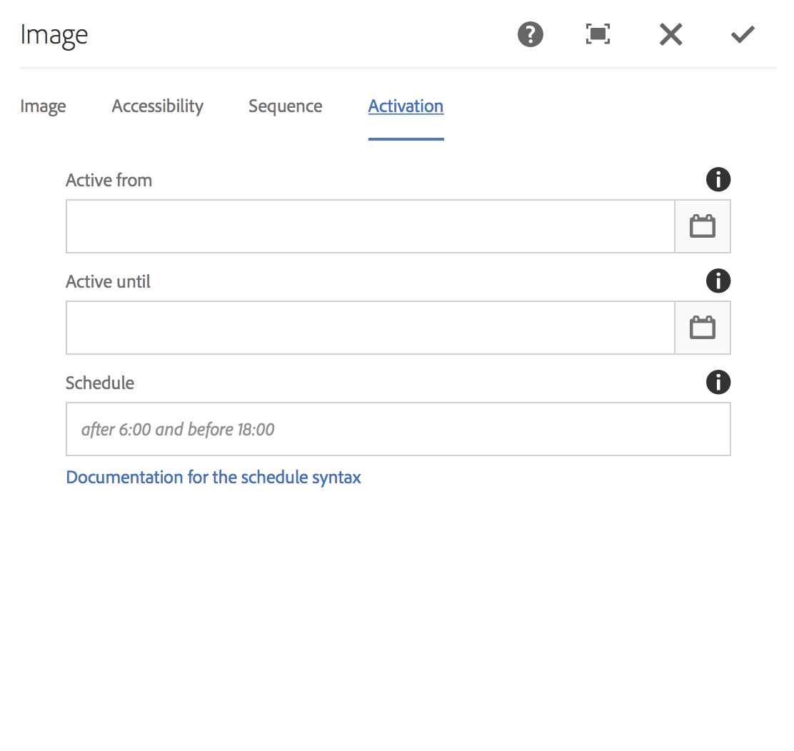

# Agendamento do nível do ativo {#asset-level-scheduling}

Esta seção descreve o agendamento do nível do ativo para os ativos usados em Canais.

Os seguintes tópicos são abordados nesta seção:

* Visão geralW
* Usando o Agendamento de Nível de Ativo
* Tratamento de recorrência em ativos
* Agendamento de vários ativos

>[!CAUTION]
>
>Esta funcionalidade do AEM Screens só estará disponível se você tiver instalado o AEM 6.3 Feature Pack 3 ou o AEM 6.4 Screens Pack 1.
>
>Para obter acesso a esse Feature Pack, você deve entrar em contato com o Suporte da Adobe e solicitar acesso. Com as devidas permissões, você pode baixá-lo em Compartilhamento de pacotes.

## Visão geral {#overview}

***Agendamento*** de nível de ativo, permite ativar um ativo específico em um canal para um período agendado no fuso horário local do player. Isso está disponível para imagens, vídeos, transições, páginas e canais incorporados (dinâmicos ou estáticos).

*Por exemplo*, você deseja que uma promoção especial seja exibida somente durante a hora de felicidade (de 2h às 5h) nas segundas e quartas-feiras.

Com esse recurso, não somente você pode especificar a data e a hora de início e término, como também um padrão de recorrência.

## Usando o Agendamento de Nível de Ativo {#using-asset-level-scheduling}

O Agendamento de nível de ativo é feito configurando a guia **Ativação** ao acessar as propriedades de um ativo.

Siga as etapas abaixo para executar a programação de nível de ativos:

1. Selecione qualquer canal e clique em **Editar** na barra de ações para adicionar ou editar conteúdo em seu canal.

   

   >[!NOTE]
   >
   >Para saber mais detalhes sobre como
   >
   >* Crie um projeto, consulte [Criação de um novo projeto](creating-a-screens-project.md).
   >* Crie e adicione conteúdo a um canal, consulte [Gerenciamento de canais](managing-channels.md).

1. Clique em **Editar** para abrir o editor de canal e selecionar um ativo ao qual deseja aplicar o agendamento.

   

1. Selecione o ativo e clique no ícone **Configurar** na parte superior esquerda para abrir as propriedades da imagem.

   Click the **Activation** tab.

   

1. É possível especificar a data no seletor de datas nos campos **Ativo de** e **Ativo até** .

   Se você selecionar **Ativo de e** Ativo até **** a data e hora, o ativo será exibido e fará loop apenas entre a data/hora de início e a data/hora de término, respectivamente.

   

## Tratamento de recorrência em ativos {#handling-recurrence-in-assets}

Você pode programar a recorrência de ativos em determinados intervalos, diariamente, semanalmente ou mensalmente, de acordo com sua necessidade.

Suponha que você queira exibir uma imagem somente às sextas-feiras das 13:00 às 10:00 horas. Você pode usar a guia Ativação para definir o intervalo recorrente desejado para o ativo.

### Adicionar um evento recorrente para seu ativo {#adding-a-recurring-event-for-your-asset}

1. Selecione o ativo e clique no ícone **Configurar** para abrir a caixa de diálogo de propriedades.
1. Depois de inserir a data/hora de início e a hora de término/data, você pode usar uma expressão cron ou uma versão de texto natural para especificar a programação de recorrência.

   Você pode pesquisar na Web um gerador de expressão cron livre e, em seguida, copiar e colar a expressão cron na **Programação** e seu ativo será exibido para o intervalo específico de dia e hora.

   *Como alternativa*, em vez de usar a expressão cron, você também pode usar a versão de texto natural, como *depois das 6:00 e antes das 18:00* da sexta-feira, para realizar sua tarefa. Insira o texto na **Programação** para exibir o ativo.

## Agendamento de vários ativos {#multi-asset-scheduling}

>[!CAUTION]
>
>O recurso Agendamento **** de vários ativos só estará disponível se você tiver instalado o AEM 6.3 Feature Pack 5 ou o AEM 6.4 Feature Pack 3.

***O Multi-asset Scheduling*** permite que o usuário selecione vários ativos e aplique um cronograma de reprodução a todos os ativos selecionados.

### Pré-requisitos {#prerequisites}

Para usar a programação de vários ativos em nível para seus ativos, crie um projeto do AEM Screens com um canal de sequência. Por exemplo, o caso de uso a seguir mostra a implementação do recurso:

* Criar um projeto do AEM Screens chamado de **MultiAssetDemo**
* Crie um canal chamado **MultiAssetChannel** e adicione conteúdo ao canal, como mostrado na figura abaixo

Siga as etapas abaixo para selecionar vários ativos e agendar sua exibição em um projeto do AEM Screens:

1. Select **MultiAssetChannel** and click **Edit** from the action bar to open the editor.

   

1. Selecione vários ativos no editor e clique em **Editar ativação** (ícone superior esquerdo).

   

1. Selecione a data e a hora em **Ativo** e **Ativo até** na caixa de diálogo Ativação **de** componente. Clique no ícone da marca de seleção quando terminar de selecionar os agendamentos.

   

1. Clique em atualizar para verificar os ativos aos quais a programação de vários ativos é aplicada.

   >[!NOTE]
   >
   >O ícone de programação fica visível no canto superior direito para os ativos que têm programação de vários ativos.

   

