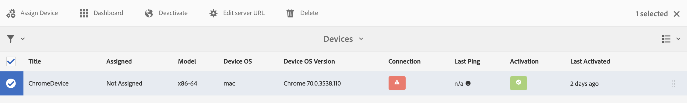

# Configuração do autor e publicação no AEM Screens {#configuring-author-and-publish-in-aem-screens}

Esta página destaca os seguintes tópicos:

* **Configuração de instâncias de autor e publicação**
* **Configuração da topologia de publicação**
* **Gerenciando a publicação: Fornecer atualizações de conteúdo do autor para o dispositivo**

## Pré-requisitos {#prerequisites}

Antes de começar a usar os servidores de autor e publicação, você deve ter conhecimento prévio de:

* **Topologia do AEM**
* **Criação e gerenciamento do projeto do AEM Screens**
* **Processo de registro do dispositivo**

>[!NOTE]
>
>Essa funcionalidade do AEM Screens só estará disponível se você tiver instalado o AEM 6.4 Screens Pack 2. Para obter acesso a esse Feature Pack, você deve entrar em contato com o Suporte da Adobe e solicitar acesso. Com as devidas permissões, você pode baixá-lo em Compartilhamento de pacotes.

## Configuração de instâncias de autor e publicação {#configuring-author-and-publish-instances}

>[!NOTE]
>
>Para saber mais sobre o autor e publicar a visão geral da arquitetura e como o conteúdo é criado em uma instância do autor de AEM e, em seguida, replicado para várias instâncias de publicação, consulte Visão geral [da arquitetura do](author-publish-architecture-overview.md)autor e publicação.

A seção a seguir explica como configurar agentes de replicação na topologia de criação e publicação.

Você pode configurar um exemplo simples, no qual você hospeda um autor e duas instâncias de publicação:

* Autor —&gt; localhost:4502
* Publicar 1 (pub1) —&gt; localhost:4503
* Publicar (pub2) —&gt; localhost:4504

## Configuração de agentes de replicação no autor {#setting-replication-agents}

Para criar agentes de replicação, você deve aprender a criar um agente de replicação padrão.

Há três agentes de replicação necessários para o Screens:

1. **Agente de Replicação Padrão ***(especificado como ***Agente** de Replicação Padrão)
1. **Screens Replication Agent**
1. **Reverter agente de replicação**

### Etapa 1: Criando um Agente de Replicação Padrão {#step-creating-a-default-replication-agent}

Siga as etapas abaixo para criar um agente de replicação padrão:

1. Navegue até sua instância do AEM —&gt; ícone de martelo —&gt; **Operações** —&gt; **Configuração**.

   

1. Selecione a **Replicação** na árvore de navegação esquerda.

   

1. Selecione os **Agentes do autor** na pasta **Replicação** e clique em **Novo** para criar um novo agente de replicação padrão.

   

1. Insira o **Título** e o **Nome** para criar o agente de replicação e clique em **Criar**.

   

1. Clique com o botão direito do mouse no agente de replicação e clique em **Abrir** para editar as configurações.

   

1. Clique em **Editar** para abrir a caixa de diálogo Configurações **do** agente para inserir os detalhes.

   

1. Navegue até a guia **Transporte** e digite o **URI**, o **Usuário** e a **Senha**.

   

   >[!NOTE]
   >
   >Também é possível copiar e renomear um agente de replicação padrão existente.

#### Criando Agentes de Replicação Padrão {#creating-standard-replication-agents}

1. Criar agente de replicação padrão para pub1 (o agente padrão predefinido já deve estar configurado) (por exemplo, *https://&lt;nome do host&gt;:4503/bin/receive?sling:authRequestLogin=1*)
1. Criar agente de replicação padrão para pub2. Você pode copiar o agente rep para pub1 e atualizar o transporte a ser usado para pub2 alterando a porta na configuração de transporte. (por exemplo, *https://&lt;nome do host&gt;:4504/bin/receive?sling:authRequestLogin=1*)

#### Criando Agentes de Replicação de Telas {#creating-screens-replication-agents}

1. Criar agente de replicação do AEM Screens para pub1. Completo, há um chamado Screens Replication Agent que aponta para a porta 4503. Isso precisa ser habilitado.
1. Criar agente de replicação do AEM Screens para pub2. Copie o agente de replicação Screens para pub1 e altere a porta para 4504 para pub2.

#### Criando Agentes de Replicação Reversa de Telas {#creating-screens-reverse-replication-agents}

1. Criar agente de replicação reversa padrão para pub1.
1. Criar agente de replicação reversa padrão para pub2. Você pode copiar o agente de representante reverso para pub1 e atualizar o transporte a ser usado para pub2 alterando a porta na configuração de transporte.

## Configuração da topologia de publicação {#setting-up-publish-topology}

### Etapa 1: Configurar Descoberta Baseada Em Oak Do Apache Sling {#step-configure-apache-sling-oak-based-discovery}

Configurar a descoberta baseada no Apache Sling Oak para todas as instâncias de publicação na topologia

Para cada instância de publicação:

1. Vá até `https://<host>:<port>/system/console/configMgr`
1. Selecione **Apache Sling Oak Discovery Service** Configuration.
1. Atualizar URLs do conector de topologia: adicionar URLs de todas as instâncias de publicação de participação que sejam, `https://localhost:4502/libs/sling/topology/connector`
1. Lista de permissões do conector de topologia: adaptar a IPs ou sub-redes que abrangem instâncias de publicação de participação
1. Ativar loops locais de **interrupção automática**

A configuração deve ser idêntica para cada instância de publicação e o loop Local de interrupção automática impede um loop infinito.

#### Etapa 2: Verificar topologia de publicação {#step-verify-publish-topology}

Para qualquer uma das instâncias de Publicação, navegue até `https://<host>:<port>/system/console/topology`. Cada instância de publicação deve ser exibida na topologia.

#### Etapa 3: Configurar Cluster de Artemis AtiveMQ {#step-setup-activemq-artemis-cluster}

Esta etapa permite que você crie uma senha criptografada para o cluster AtiveMQ Artemis.
O usuário do cluster e a senha de todas as instâncias de publicação na topologia precisam ser idênticos. A senha da configuração do AtiveMQ Artemis precisa ser criptografada. Como cada instância tem sua própria chave de criptografia, é necessário usar o Suporte de criptografia para criar uma string de senha criptografada. Em seguida, a senha criptografada será usada na configuração OSGi para AtiveMQ.

Em cada instância de publicação:

1. No console OSGi, navegue até **MAIN** —&gt; Suporte **** Crypto (*https://&lt;host&gt;:&lt;porta&gt;/system/console/crypto*).
1. Digite a senha de texto sem formatação desejada (a mesma para todas as instâncias) em Texto **sem formatação**
1. Clique em **Proteger**.
1. Copie o valor Texto **** protegido para o bloco de notas ou editor de texto. Esse valor será usado na configuração OSGi para AtiveMQ.

Como cada instância de publicação por padrão tem chaves de criptografia exclusivas, é necessário executar essa etapa em cada instância de pub e salvar a chave exclusiva para a próxima configuração.

*Por exemplo*,

Pub1 - `{1ec346330f1c26b5c48255084c3b7272a5e85260322edd59119828d1fa0a610e}`Pub2 - `{8d3d113c834cc4f52c2daee0da3cb0a21122a31f0138bfe4b70c9ead79415f41}`

#### Etapa 4: Ativar Cluster de Artemis AtiveMQ {#step-activate-activemq-artemis-cluster}

Em cada instância de publicação:

1. Navegue até o gerenciador de configuração OSGi *https://&lt;host&gt;:&lt;porta&gt;/system/console/configMgr*
1. Selecione a configuração do provedor **** JMS Apache AtiveMQ Artemis
1. Atualize o seguinte:

* ***Senha*** do cluster: (usar valor criptografado de etapa anterior por instância respectiva)
* ***Tópicos***: {nome: 'command', endereço: 'com.adobe.cq.screens.command', maxConsumers: 50}

#### Verifique o cluster AtiveMQ Artemis {#verify-activemq-artemis-cluster}

Siga as etapas abaixo em cada instância de publicação:

1. Navegue até Console OSGi -&gt; Principal &gt; Áreas AtiveMQ `[https://localhost:4505/system/console/mq`.
1. Verifique e verifique para exibir as portas de outras instâncias em Informações do cluster &gt; Topologia &gt; nós=2, membros=2.
1. Enviar uma mensagem de teste (parte superior da tela em Informações do agente)
1. Digite as seguintes alterações nos campos:

   1. **Destino**: /com.adobe.cq.screens/devTestTopic
   1. **Texto**: Hello World
   1. Visualize o error.log de cada instância para ver se a mensagem foi enviada e recebida pelo cluster

>[!NOTE]
>
>Navegar até o console OSGI pode levar alguns segundos depois de salvar a configuração na etapa anterior. Você também pode verificar error.log para obter mais detalhes.

Como exemplo, a imagem a seguir é exibida na configuração bem-sucedida do AtiveMQ Artemis Server.

Se você não vir a seguinte configuração de */system/console/mq*, navegue até */system/console/mq* e clique em **Reiniciar** para reiniciar o agente.

#### Remover requisito do cabeçalho do referenciador {#remove-referrer-header-requirement}

Siga as etapas em cada instância de Publicação:

1. Navegue até o Console **do** OSGi &gt; Gerenciador **de configuração**
1. Selecionar o filtro de referência do **Apache Sling**
1. Atualizar configuração e **marcar Permitir vazio**

### Configuração da instância de autor e publicação {#configuring-author-and-publish-instance}

Depois de configurar a ferramenta de publicação, é necessário configurar as instâncias de autor e publicação para exibir os resultados práticos da implementação:

>[!NOTE]
>
>**Pré-requisitos**
>
>Para começar a usar este exemplo, crie um novo projeto do AEM Screens seguido de criar um local, exibição e canal no seu projeto. Adicione conteúdo ao seu canal e atribua o canal a uma tela.

#### Etapa 1: Iniciar um AEM Screens Player (dispositivo) {#step-starting-an-aem-screens-player-device}

1. Inicialize uma janela de navegador separada.
1. Go to Screens player using the *web browser*, that is,`https://localhost:4502/content/mobileapps/cq-screens-player/firmware.html` or launch the AEM Screens app. Ao abrir o dispositivo, você perceberá o estado do dispositivo como não registrado.

>[!NOTE]
>
>Você pode abrir um AEM Screens player usando o aplicativo AEM Screens que você baixou ou usando o navegador da Web.

#### Etapa 2: Registrando um dispositivo no autor {#step-registering-a-device-on-author}

1. Vá para `https://localhost:4502/screens.html/content/screens/we-retail` ou selecione seu projeto e navegue até Dispositivos &gt; Gerenciador de dispositivos.
1. Selecione **Registrar dispositivo**.
1. Clique em **Device Registration (Registro** do dispositivo) para exibir o dispositivo.
1. Select the device you want to register and click **Register Device**.
1. Verifique o código de registro e clique em **Validar**.
1. Insira um título para o seu dispositivo e clique em **Registrar**.

#### Etapa 3: Atribuindo o dispositivo à exibição {#step-assigning-the-device-to-display}

1. Clique em **Atribuir exibição** na caixa de diálogo da etapa anterior.
1. Selecione o caminho de exibição do seu canal na pasta **Locais** .
1. Click **Assign**.
1. Click **Finish** to complete the process, and now the device is assigned.

Verifique seu player e você verá o conteúdo que você adicionou ao seu canal.

#### Etapa 4: Configuração do dispositivo de publicação para instâncias de publicação {#step-publishing-device-configuration-to-publish-instances}

**Verificação do dispositivo**

Antes, execute as etapas abaixo para verificar a ID do dispositivo. Para verificar, procure a ID do dispositivo no CRXDELite, com o caminho como */home/users/screens/{project}/devices*.

Siga as etapas abaixo para replicar o usuário do dispositivo:

1. Navegue até a página de administração do usuário (por exemplo: `https://localhost:4502/useradmin`
1. Procurar o grupo **screens-devices-master**
1. Clique com o botão direito do mouse no grupo e clique em **Ativar**

>[!CAUTION]
>
>Não ative author-publish-screens-service, pois é um usuário do sistema, usado pelo trabalho do autor.

Você também pode ativar o dispositivo no Console de Gerenciamento de Dispositivos. Siga as etapas abaixo:

1. Navegue até o projeto do Screens —&gt; **Dispositivos**.
1. Clique em **Gerenciador de dispositivos **na barra de ações.
1. Selecione o dispositivo e clique em **Ativar** na barra de ação, como mostrado na figura abaixo.

>[!NOTE]
>
>Como alternativa, depois de ativar o dispositivo, você também pode editar ou atualizar o URL do servidor clicando em **Editar URL do servidor **na barra de ação, como mostrado na figura abaixo, e suas alterações serão propagadas para o player do AEM Screens.

### Lista de verificação de publicação {#publishing-check-list}

Os pontos a seguir resumem a lista Verificação de publicação:

* *Usuário* do dispositivo de telas - é armazenado como um usuário do AEM e deve ser ativado em **Ferramentas** &gt; **Segurança** &gt; **Usuários**. O usuário receberá o prefixo "telas" com uma string serializada longa.

* *Projeto* - O projeto do AEM Screens.
* *Localização* - Local ao qual o dispositivo está conectado.
* *Canal(s)* - um ou mais canais que estão sendo exibidos no local
* *Agendamento* - se estiver usando um agendamento, verifique se isso foi publicado
* *Localização, Agendamentos e Pasta* de canal - se os recursos correspondentes estiverem dentro de uma pasta.

Depois de verificar a lista de verificação, é necessário verificar as seguintes alterações/comportamento em seu canal:

* Depois de publicar a configuração do dispositivo, abra a configuração do player do Screens e aponte-a para a instância de Publicação. Além disso, você também pode ativar o dispositivo no console de gerenciamento de dispositivos.
* Atualize algum conteúdo de canal no Autor e publique-o e verifique se o canal atualizado agora é exibido no player do AEM Screens.
* Conecte o player do Screens a uma instância de publicação diferente e verifique o comportamento acima.

#### Etapa 5: Apontar o dispositivo para publicar a instância no painel Admin {#step-pointing-the-device-to-publish-instance-in-the-admin-panel}

1. Visualize a interface do usuário do administrador no player do Screens, pressione no canto superior esquerdo para abrir o menu Admin, no player do AEM Screens ativado pelo toque ou usando um mouse.
1. Clique na opção **Configuração** no painel lateral.
1. Altere a instância do autor para publicar a instância no **Servidor**.

Visualize as alterações no player do AEM Screens.

Como alternativa, você também pode atualizar/editar o URL do servidor no console de gerenciamento de dispositivos usando as seguintes etapas:

1. Navegue até o projeto do AEM Screens e selecione a pasta **Dispositivos** .
1. Click **Device Manager** from the action bar.
1. Selecione o dispositivo e clique em **Editar URL do servidor **na barra de ação, como mostrado na figura abaixo, e suas alterações serão propagadas para o AEM Screens player.

