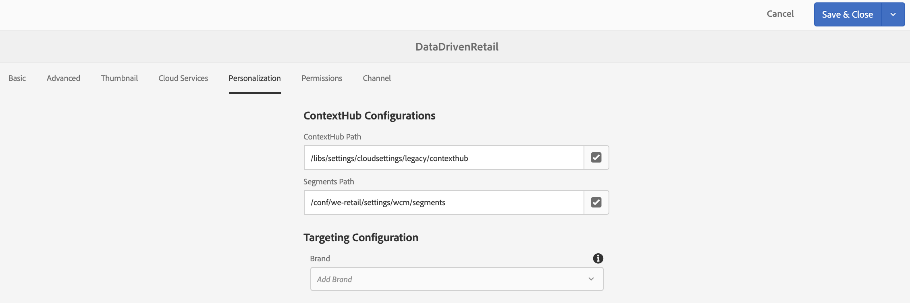
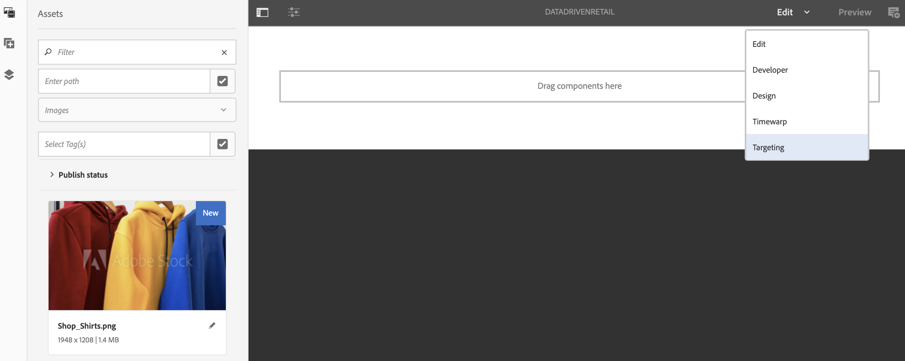

# Criação com acionadores de dados {#authoring-with-data-triggers}

>[!IMPORTANT]
>Esse conteúdo é válido para o AEM no local/AMS (AEM 6.5LTS e AEM 6.5). Para ver o conteúdo do AEM as a Cloud Service Screens, consulte o [guia do AEM as a Cloud Service](https://experienceleague.adobe.com/pt-br/docs/experience-manager-cloud-service/content/screens-as-cloud-service/overview/introduction).

Esta seção destaca como ativar o direcionamento em seus canais.

>[!IMPORTANT]
>
>A versão mínima que oferece suporte a acionadores de dados em um canal do AEM Screens é a AEM 6.5.3 Feature Pack 3.

## Pré-requisitos {#prereqs}

Antes de seguir as etapas abaixo para habilitar o direcionamento em canais, aprenda os [Termos principais em Configuração no AEM Screens](configuring-context-hub.md) necessários para entender o ContextHub e o Direcionamento no AEM Screens.

>[!IMPORTANT]
>
>É recomendável entender e definir as configurações do ContextHub antes de ativar o direcionamento em um canal do AEM Screens.

Siga os links abaixo para obter mais informações:

1. **[Configurando o Repositório de Dados](configuring-context-hub.md)**
1. **[Configurando a Segmentação de Público](configuring-context-hub.md)**

Após concluir as etapas anteriores, você estará pronto para ativar o direcionamento em seus canais.

## Visão geral da criação com acionadores de dados {#author-targeting}

>[!VIDEO](https://video.tv.adobe.com/v/31921)

## Ativação do direcionamento em um canal do AEM Screens {#enabling-targeting}

Siga as etapas abaixo para ativar o direcionamento em seus canais.

1. Navegue até um dos canais do AEM Screens. As etapas a seguir demonstram como habilitar o direcionamento usando o **DataDrivenRetail** *(canal de sequência)* criado em um canal do AEM Screens.

1. Clique no canal **DataDrivenRetail** e clique em **Properties** na barra de ações.

   

1. Clique na guia **Personalization** para poder definir as configurações do ContextHub e clicar no caminho do ContextHub e Segmentos.

   1. Clique no **Caminho do ContextHub** como **bibliotecas** > **configurações** > **cloudsettings** > **padrão** > **Configurações do ContextHub** e clique em **Clicar**.

   1. Clique no **Caminho dos Segmentos** como **conf** > **`We.Retail`** > **configurações** > **wcm** > **segmentos** e clique em **Clicar**.

   1. Clique em **Salvar e fechar**.

   >[!NOTE]
   >
   >Use o ContextHub e o caminho Segmentos, onde você salvou inicialmente as configurações e os segmentos do seu hub de contexto.

   

1. Navegue e clique em **DataDrivenRetail** em **DataDrivenAssets** > **Channels** e clique em **Editar** na barra de ações. Arraste e solte os ativos no editor de canais.

   >[!NOTE]
   >
   >Se você configurou tudo corretamente, verá a opção **Direcionamento** no menu suspenso do editor, como mostrado na figura abaixo.

   

1. Clique em **Direcionamento**.

1. Clique em **Marca** e na **Atividade** no menu suspenso e clique em **Iniciar o Direcionamento**.

### Saiba Mais: Exemplo De Casos De Uso {#learn-more-example-use-cases}

Depois de configurar o ContextHub para seu projeto do AEM Screens, você pode seguir os diferentes Casos de uso para entender como os ativos acionados por dados desempenham um papel vital em diferentes setores:

1. **[Ativação Direcionada para Estoque de Varejo](retail-inventory-activation.md)**
1. **[Ativação da temperatura do centro de viagens](local-temperature-activation.md)**
1. **[Ativação de Reserva de Hospitalidade](hospitality-reservation-activation.md)**
