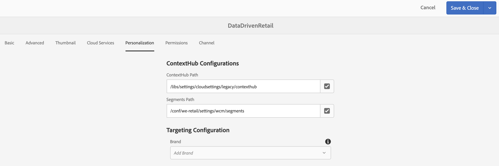

# Criação com acionadores de dados {#authoring-with-data-triggers}

Esta seção destaca como ativar o direcionamento em seus canais.

>[!IMPORTANT]
>
>A versão mínima que suporta acionadores de dados em um canal AEM Screens é AEM 6.5.3 Feature Pack 3.

## Pré-requisitos {#prereqs}

Antes de seguir as etapas abaixo para ativar o direcionamento nos canais, você deve aprender os [Principais termos em Configurar no AEM Screens](configuring-context-hub.md) necessários para entender o ContextHub e a Direcionamento no AEM Screens.

>[!IMPORTANT]
>
>É recomendável compreender e configurar as configurações do ContextHub, antes de ativar o direcionamento em um canal do AEM Screens.

Siga os links abaixo para obter mais informações:

1. **[Configuração do armazenamento de dados](configuring-context-hub.md)**
1. **[Configuração da segmentação de público-alvo](configuring-context-hub.md)**

Depois de concluir as etapas anteriores, você estará pronto para ativar o direcionamento em seus canais.

## Visão geral da criação com acionadores de dados {#author-targeting}

>[!VIDEO](https://video.tv.adobe.com/v/31921)

## Ativar a definição de metas em um canal AEM Screens {#enabling-targeting}

Siga as etapas abaixo para ativar o direcionamento em seus canais.

1. Navegue até um dos canais do AEM Screens. As etapas a seguir demonstram como habilitar o direcionamento usando **DataDrivenRetail** *(canal de sequência)* criado em um Canal AEM Screens.

1. Selecione o canal **DataDrivenRetail** e clique em **Propriedades** na barra de ações.

   

1. Selecione a guia **Personalization** para configurar as configurações do ContextHub e selecione o caminho do ContextHub e Segmentos.

   1. Selecione o **Caminho do ContextHub** como **libs** > **configurações** > **cloudsettings** > **padrão** > **Configurações do ContextHub** e clique em &lt;a1 Selecione **.**

   1. Selecione o **Caminho de segmentos** como **conf** > **We.Retail** > **configurações** > **wcm** > **segmentos** e clique em **Selecionar 13/>.**

   1. Clique em **Salvar e fechar**.
   >[!NOTE]
   >
   >Use o ContextHub e o caminho Segmentos, onde você salvou inicialmente suas configurações e segmentos do hub de contexto.

   

1. Navegue e selecione o **DataDrivenRetail** de **DataDrivenAssets** > **Canais** e clique em **Editar** na barra de ações. Arraste e solte os ativos no editor de canal.

   >[!NOTE]
   >
   >Se tiver configurado tudo corretamente, você verá a opção **Direcionamento** no menu suspenso do editor, como mostrado na figura abaixo.

   

1. Clique em **Direcionamento**.

1. Selecione **Marca** e **Atividade** no menu suspenso e clique em **Iniciar Direcionamento**.

### Saiba mais: Exemplo de casos de uso {#learn-more-example-use-cases}

Depois de configurar o ContextHub para seu projeto do AEM Screens, você pode seguir os diferentes Casos de uso para entender como os ativos acionados por dados desempenham um papel vital em diferentes setores:

1. **[Ativação direcionada para inventário de varejo](retail-inventory-activation.md)**
1. **[Ativação da temperatura do centro de viagens](local-temperature-activation.md)**
1. **[Ativação de Reserva de Hospitalidade](hospitality-reservation-activation.md)**
