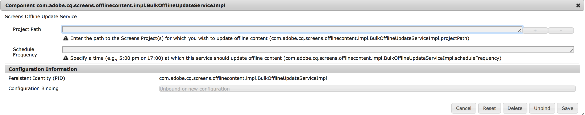

# Atualização offline em massa {#bulk-offline-update}

Esta seção aborda os seguintes tópicos sobre Atualização em massa offline:

* **Visão geral**
* **Usando atualização off-line em massa**

<!-- OBSOLETE VERSIONS
>[!CAUTION]
>
>This AEM Screens functionality is only available, if you have installed AEM 6.3 Feature Pack 3 or AEM 6.4 Screens Feature Pack 1.
>
>To get access to this Feature Pack, you must contact Adobe Support and request access. Once you have permissions you can download it from Package Share. -->

## Visão geral {#overview}

Atualização offline em massa, permite atualizar todos os canais em massa. Isso evita o incômodo de navegar até um canal específico e atualizar o conteúdo. Em vez disso, você pode atualizar todo o conteúdo dos canais de um projeto específico em um instante.

Você também pode agendar essa atividade para um horário de tráfego de rede mais baixo.

>[!NOTE]
>
>O recurso Atualização offline em massa é otimizado para atualizar apenas os canais que foram modificados.

## Usando atualização off-line em massa {#using-bulk-offline-update}

Você pode usar a atualização offline em massa manualmente na interface do usuário ou agendar a atualização em massa dos serviços OSGi.

### Utilização da interface do usuário do AEM Screens {#using-aem-screens-user-interface}

Siga as etapas abaixo para usar a atualização em massa offline para um projeto do AEM Screens:

1. Navegue até o projeto do AEM Screens.
1. Selecione o projeto e **Atualizar conteúdo offline** na barra de ações, para que você possa atualizar manualmente o conteúdo do canal.

   

### Configuração do console da Web do Adobe Experience Manager {#adobe-experience-manager-web-console-configuration}

Siga as etapas abaixo para usar a atualização em massa offline para um projeto do AEM Screens:

1. Configuração do console da Web do Adobe Experience Manager.
1. Procurar serviços de atualização offline em massa.

   

1. Adicione as seguintes propriedades:

   **Caminho do projeto** Especifique o caminho do projeto do AEM Screens. Normalmente, o caminho é `/content/screens/<Name of your project>`.

   *Por exemplo*, `/content/screens/we-retail`. Você pode encontrar esse caminho no URL selecionando qualquer projeto no AEM Screens (não clique no ícone ).

   >[!NOTE]
   >
   >Especifique o caminho do projeto relativo ao seu canal.

   **Frequência de programação** Especifique um horário, por exemplo, 17:00 ou 17:00 em que esse serviço deve atualizar o conteúdo offline.

1. Selecionar **Salvar** para salvar suas configurações. Seu conteúdo é atualizado no horário especificado.
