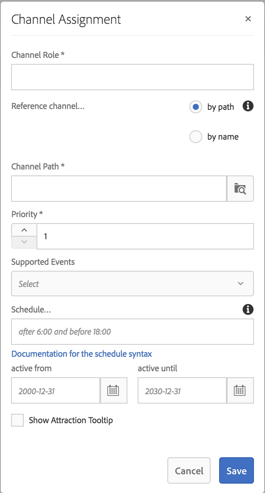

# Atribuição de canal {#channel-assignment}

Esta seção aborda os seguintes tópicos:

* **Atribuindo um canal**
* **Noções Gerais das Propriedades da caixa de diálogo Atribuição de Canal**
* **Segmentação de dia**

Depois de definir uma exibição, é necessário atribuir um canal a ela.

Essa página mostra a atribuição de um canal às suas exibições.

**Pré-requisitos**:

* [Configuração e implantação do Screens](configuring-screens-introduction.md)
* [Criar e gerenciar projetos de telas](creating-a-screens-project.md)
* [Criar e gerenciar canais](managing-channels.md)
* [Criar e gerenciar locais](managing-locations.md)
* [Criar e gerenciar exibições](managing-displays.md)

## Atribuir um canal {#assign-a-channel}

Siga as etapas abaixo para atribuir um canal a uma exibição:

1. Navegue até a exibição desejada, por exemplo, **DemoProject** —> **Locais** —> **SanJose** —> **StoreDisplay**.

   

1. Tap/click **Assign Channel** in the action bar

   Ou,

   Tap/click **Dashboard** and click **+Assign Channel** from the **ASSIGNED CHANNNELS** panel to open the **Channel Assignment** dialog box.

   

   É possível configurar as seguintes propriedades na caixa de diálogo **Atribuição de canal**:

   **Função de canal**:

   A função de canal define o contexto da exibição. A função é o alvo de várias ações e não depende do canal real que a atende.

   **Fazer referência ao canal**:

   A opção Fazer referência ao canal permite que você forneça uma referência ao canal desejado, seja por nome ou por caminho do canal.

   * **por caminho**: você fornece uma referência explícita usando o caminho absoluto do canal.
   * **pelo nome**: Insira o nome do canal que será resolvido para um canal real por contexto. Esse recurso permite que você crie a versão local de um canal para resolver dinamicamente o conteúdo específico da localização. For example, a channel with name *deals of the day*, where the actual content would be different in two cities, but you still have the sane channel role on all the displays.
   **Prioridade:**

   A prioridade é usada para ordenar as atribuições, no caso de várias delas corresponderem aos critérios de reprodução. A atribuição com o valor mais alto sempre terá precedência sobre aquelas com valores mais baixos. Por exemplo, se houver dois canais, A e B, em que A tem uma prioridade de 1 e B tem uma prioridade de 2, o canal B será exibido, pois tem uma prioridade mais alta que A.

   A prioridade de um canal é definida como um número (1 para o valor mínimo) na caixa de diálogo **Atribuição de canal**, conforme mencionado acima. Além disso, os canais atribuídos são classificados com base em uma prioridade decrescente.

   **Eventos compatíveis**:

   * **Carga inicial**: carrega o canal quando o player é iniciado. Esse evento pode ser atribuído a vários canais em combinação com o agendamento
   * **Tela inativa**: carregado quando a tela está inativa. Esse evento pode ser atribuído a vários canais em combinação com o agendamento
   * **Temporizador**: precisa ser definido quando um agendamento é fornecido
   * **Interação do usuário**: o player mudará para o canal especificado se houver uma interação de usuário na tela (toque) em um canal inativo e será carregado quando a tela for tocada
   **Agendamento**:

   o agendamento permite que você forneça uma descrição no texto informando quando o canal deve aparecer. Ele também permite definir uma data de início (**ativo desde**) e uma data de término (**ativo até**) para o canal a ser mostrado. A sintaxe da expressão de agendamento é baseada nas sintaxes de text e cron de later.js:

   * [https://bunkat.github.io/later/parsers.html#text](https://bunkat.github.io/later/parsers.html#text)
   * [https://bunkat.github.io/later/parsers.html#cron](https://bunkat.github.io/later/parsers.html#cron)
   **Mostrar dica de ferramenta da atração**:

   Mostrar dica de ferramenta da atração define se a dica de ferramenta de atração (“*Toque em qualquer lugar para começar*”) deve ser mostrada ou não enquanto o canal está em execução.

1. Clique em **Salvar** para atribuir o canal criado a uma exibição.

### Segmentação de dia {#dayparting}

Schedules when combined with **Dayparting**, allows you to set a global schedule with multiple channels running at specific times of the day, and re-use that setup for all your displays at once.

A Segmentação de dia refere-se ao processo de dividir um dia em períodos de tempo e especificar qual conteúdo é reproduzido no horário desejado. O AEM Screens permite agendar canais em termos de segmentação de dia para uma frequência diária, semanal ou mensal, de acordo com a sua exigência.

Os exemplos a seguir explicam a segmentação de dia em três cenários diferentes:

#### Reprodução do conteúdo em um único dia, dividido em vários períodos de tempo {#playing-content-on-a-single-day-divided-into-multiple-time-slots}

Este exemplo mostra como um restaurante usa a segmentação de dia para mostrar seu menu de café da manhã, almoço e jantar.

Aqui, dividiremos cada dia em três períodos de tempo diferentes, para que o conteúdo do canal seja reproduzido de acordo com o horário do dia especificado:

| **Canal** | **Função** | **Prioridade** | **Agendamento** |
|---|---|---|---|
| Menu_A | Café da manhã |  | após 6:00 e antes de 11:00 |
| Menu_B | Almoço |  | após 11:00 e antes de 15:00 |
| Menu_C | Jantar |  | após 15:00 e antes de 20:00 |

#### Reprodução do conteúdo em um determinado dia da semana {#playing-content-on-a-particular-day-of-the-week}

Este exemplo mostra a segmentação de dia feita em um cassino que apresenta um evento ao vivo todos os finais de semana, das 20h às 22h, e disponibiliza opções especiais para o menu do jantar das 22h à 1h da manhã.

<table>
 <tbody>
  <tr>
   <td><strong>Canal</strong></td>
   <td><strong>Função</strong></td>
   <td><strong>Prioridade</strong></td>
   <td><strong>Agendamento</strong></td>
  </tr>
  <tr>
   <td>LiveConcert</td>
   <td>Final de semana</td>
   <td> </td>
   <td>21 de out de 2017 - 22 de outubro de 2017   depois das 20:00 antes das 22:00</td>
  </tr>
  <tr>
   <td>JantarEspeciais</td>
   <td>Final de semana</td>
   <td> </td>
   <td>21 de out de 2017 - 22 de outubro de 2017   depois das 22:00 antes das 13:00</td>
  </tr>
 </tbody>
</table>

#### Reprodução do conteúdo para um ou mais meses específicos {#playing-content-for-a-particular-month-months}

Este exemplo mostra a segmentação de dia para uma loja que exibe sua coleção de inverno de junho a agosto e sua coleção de primavera de setembro até o final de outubro.

Aqui, você criará a segmentação de dia com base em meses, de modo que o conteúdo do canal seja reproduzido de acordo com os meses especificados do ano.

| **Canal** | **Função** | **Prioridade** | **Agendamento** |
|---|---|---|---|
| SummerCollection | Verão |  | 01 de junho de 2017 - 31 de agosto de 2017 |
| FallCollection | Queda |  | 01 de set de 2017 - 30 de outubro de 2017 |

>[!NOTE]
>
>Além disso, você pode definir uma ***Prioridade*** para cada um dos canais. Por exemplo, se dois canais forem definidos para o mesmo dia e horário ou para o mesmo mês, o canal com prioridade mais alta será reproduzido primeiro. O valor mínimo para a prioridade pode ser definido como 0.

#### Reprodução do conteúdo para canais com a mesma prioridade {#playing-content-for-channels-with-same-priority}

Este exemplo mostra a segmentação de dia para uma loja que exibe sua coleção de verão com o mesmo agendamento no mês de dezembro. Porém, como o Canal B tem a prioridade definida como 2, na semana em questão, ele reproduzirá seu conteúdo no lugar do Canal A.

| **Canal** | **Função** | **Prioridade** | **Agendamento** |
|---|---|---|---|
| A | inverno | 1 | 01 de dez de 2017 - 31 de dez de 2017 |
| B | Natal | 2 | 24 de dez de 2017 - 31 de dez de 2017 |

