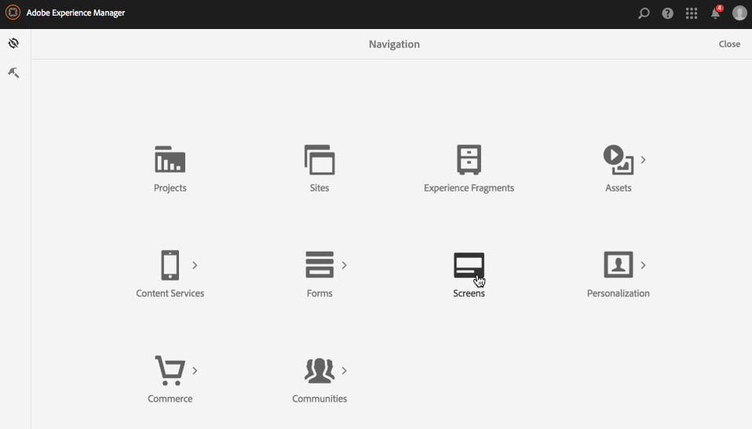
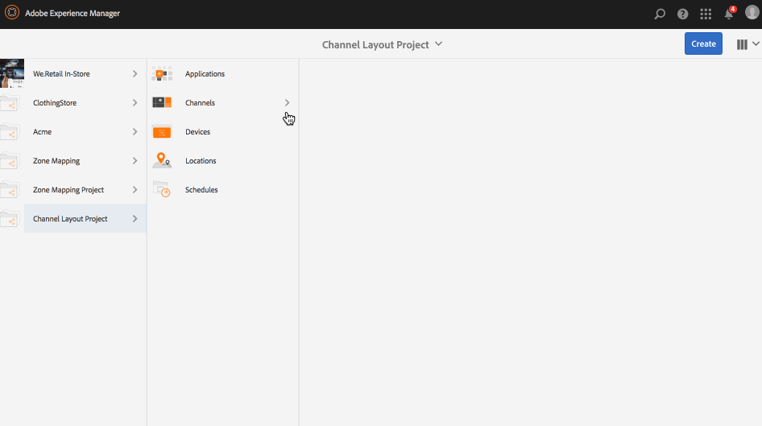

# Editor de layout de canal {#channel-layout-editor}

***O Editor de layout de canal*** permite que você crie conteúdo de várias zonas e use diversos ativos, como vídeos, imagens e texto, que podem ser combinados em uma única tela de formas contextuais. É possível extrair imagens, vídeos e textos e permitir que tudo se misture para criar uma experiência digital intuitiva e interativa.

De acordo com os requisitos do projeto, às vezes você precisa usar várias zonas em um canal e editá-las como uma unidade abrangente. Por exemplo, uma sequência de produtos com um feed de redes sociais relacionado executado em três zonas separadas em um único canal.

## Visão geral {#overview}

Ao criar um canal, você pode usar modelos diferentes para criar zonas no seu canal. Você pode adicionar uma imagem, um vídeo ou um canal incorporado para aproveitar o conteúdo de acordo com os requisitos do projeto.

### Descrição do caso de uso {#use-case-description}

O caso de uso a seguir descreve a criação de várias zonas em um canal.

1. ***Criação de um projeto do Screens***

   1. Selecione o link do Adobe Experience Manager (parte superior esquerda) e o **Screens**. Alternatively, you can go directly to: `http://localhost:4502/screens.html/content/screens`.
   1. Click **Create** to create a new Screens project.
   1. Select **Screens** from the **Create Screens Project** wizard and click **Next**.
   1. Enter the title as **Channel Layout Project** and click **Create**.
   

1. ***Criação de um canal***

   1. Navigate to **Channel Layout Project**.
   1. Clique em **Criar** na barra de ações. Um assistente será aberto.
   1. Choose the **1x2 Split Screen Channel** and click **Next**.
   1. Enter the **Title** as **Split horizontal** and click **Create**.
   

1. ***Adição de conteúdo ao seu canal***

   1. Navigate to the **Channel Layout Project** you created and select the channel (**Split Channel**).
   1. Click **Edit** from the action bar and the editor for the **Split Channel** opens.
   1. Clique no ícone que alterna o painel lateral no lado esquerdo da barra de ações para abrir os ativos e componentes. Arraste e solte os componentes que você deseja adicionar ao seu canal.
   

   >[!NOTE]
   >
   >Como exemplo, as seguintes duas imagens são adicionadas ao canal no editor.

   

1. ***Criação de uma localização***

   1. Navigate to the Locations folder where you want to create your display (**Channel Layout Project**--&gt; **Locations**).
   1. Clique em **Criar** na barra de ações.
   1. Select **Location** from the **Create** wizard and click **Next**.
   1. Enter **Title** for your location as **San Jose**.
   1. Clique em **Criar**.
   

1. ***Criação de uma nova exibição***

   1. Navigate to the location where you want to create your display (**Acme** --&gt; **Locations** --&gt; **San Jose**) and select **San Jose**.
   1. Clique em **Criar** na barra de ações. Select **Display** from the **Create** wizard and click **Next**.
   1. Enter **Title** for your display location (enter the title as **Split Display)**.
   1. Under the **Display** tab, choose the details of the Layout. Choose the **Resolution** as **Full HD**. Choose the **Number of Devices Horizontally** as 1 and the **Number of Devices Vertically** as **1**.
   1. Clique em **Criar**.
   

1. ***Atribuição de um canal***

   1. Navigate to the display from **Channel Layout Project** --&gt; **Locations** --&gt; **San Jose** --&gt; **Split Display**.
   1. Select **Split Display** and tap/click **Assign Channel** from the action bar, Or,
   1. Click **Dashboard** and select **+Assign Channel** at the top right from **ASSIGNED CHANNELS &amp; SCHEDULES** panel. **A caixa de diálogo Atribuição** de canal é aberta.
   1. Enter the **Channel Role** as **Split**.
   1. Select **Reference Channel** by path. Select the channel folder path (**Channel Layout Project** --&gt; **Channels** --&gt; **Split horizontal**) in the Channel.
   1. Select the **Priority** for this channel as **1**.
   1. Choose the **Supported Events** as **Initial Load** and **Idle Screen**.
   1. Clique em **Salvar**.
   

1. ***Registro e atribuição do dispositivo***

   1. Inicialize uma janela de navegador separada. Vá para o player do Screens usando o navegador da Web ou inicie o aplicativo do AEM Screens.
   1. Ao abrir o dispositivo, você perceberá o estado do dispositivo como não registrado. From the AEM dashboard, navigate to **Channel Layout Project** --&gt; **Devices**.
   1. Click **Device Manager** from the action bar.
   1. Click **Device Registration** and you will see the pending devices. Select the device you want to register and click **Register Device**.
   1. Você precisará validar o código verificando-o no navegador da web ou no player do AEM Screens. Click **Validate** to navigate to **Device Registration** screen.
   1. Enter Title as **NewD** and click **Register** and the device will be registered.
   1. Click **Assign Display** to move on to the next step where you assign the device to a display.
   1. Clique em Atribuir fand do dispositivo para selecionar o caminho de exibição para seu canal () como /content/screens/Test_Project/Locations/TestLocation/TestLocation/TestDisplay. Click **Assign**.
   1. Click **Finish** to complete the process, and now the device is assigned.
   

#### Visualização de conteúdo no player do AEM Screens {#viewing-content-in-aem-screens-player}

Carregue o Player do AEM Screens ou use o navegador da web. Você notará o conteúdo do canal exibido no player do Screens. O conteúdo é exibido como um modelo de canal de tela dividida 1x2.

### Inferência {#inference}

Usar os modelos disponíveis ao criar um canal permite aproveitar e exibir seu conteúdo em diferentes zonas. O exemplo acima mostra o caso de uso do modelo 2x2.

As imagens a seguir mostram o layout que pode ser obtido usando modelos diferentes.
