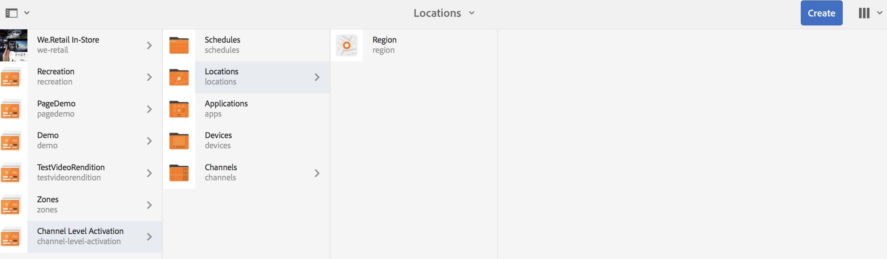
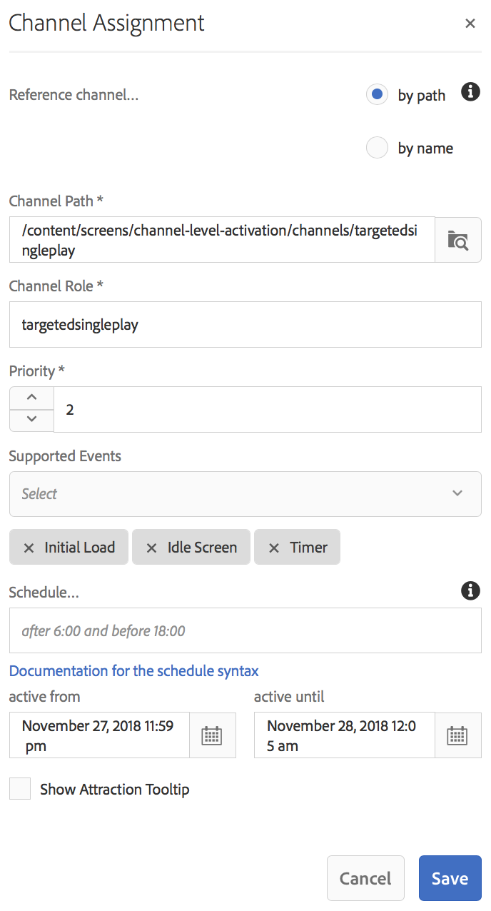

# Ativação em Nível de Canal {#channel-level-activation-single-event-playback}

>[!IMPORTANT]
>Esse conteúdo é válido para o AEM no local/AMS (AEM 6.5LTS e AEM 6.5). Para ver o conteúdo do AEM as a Cloud Service Screens, consulte o [guia do AEM as a Cloud Service](https://experienceleague.adobe.com/en/docs/experience-manager-cloud-service/content/screens-as-cloud-service/overview/introduction).

Esta página descreve a ativação no nível do canal para os ativos usados em Canais.

Os seguintes tópicos são abordados nesta seção:

* Visão geral
* Janela de ativação
* Utilização da Ativação no nível do canal como uma reprodução de evento único
* Manipulação de recorrência do Assets em um canal
   * DayParting
   * WeekParting
   * MonthParting
   * Combinação de Peças
* Utilização da Ativação no nível do canal como uma reprodução de evento único

## Visão geral {#overview}

A ***Ativação no Nível de Canal*** permite que os canais alternem após um cronograma definido específico. O canal de evento único substitui o canal principal após um agendamento definido e é reproduzido por um tempo específico, até que o canal principal reproduza seu conteúdo novamente.

O exemplo a seguir fornece uma solução com foco nos seguintes termos principais:

* um ***canal de sequência principal*** para a sequência global
* um ***único canal de evento*** que é executado apenas uma vez em um horário definido
* um ***definir agenda e prioridade*** para o evento de reprodução único que ocorre dentro do canal da sequência principal

## Janela de ativação {#using-channel-level-activation}

A seção a seguir explica a criação de uma única reprodução de evento em um canal para um projeto do AEM Screens.

### Pré-requisitos {#prerequisites}

Antes de começar a implementar essa funcionalidade, verifique se você tem os seguintes pré-requisitos prontos para começar a implementar a ativação no nível do canal:

* Crie um projeto AEM Screens, neste exemplo, **Ativação no Nível de Canal**.

* Crie um canal como **MainAdChannel** na pasta **Channels**.

* Crie outro canal como **TargetedSinglePlay** na pasta **Channels**.

* Adicione ativos relevantes a ambos os canais.

A imagem a seguir mostra o projeto **Ativação no Nível de Canal** com os canais **MainAdChannel** e **TargetedSinglePlay** na pasta **Channels**.

>[!NOTE]
>
>Para obter informações adicionais sobre como criar um projeto e criar um canal de sequência, consulte os seguintes recursos:
>
>* [Criação e gerenciamento de projetos](creating-a-screens-project.md)
>
>* [Gerenciando um Canal](managing-channels.md)
>

### Implementação {#implementation}

A implementação da Ativação no nível do canal em um projeto do AEM Screens envolve três tarefas principais:

1. **Configurando a taxonomia do projeto, incluindo Canais, Locais e Exibições**
1. **Atribuindo canais para exibição**
1. **Configurando um Agendamento e uma Prioridade**

Siga as etapas abaixo para implementar a funcionalidade:

1. **Criar um Local**

   Navegue até a pasta **Locais** do projeto do AEM Screens e crie um local como **Região**.

   

   >[!NOTE]
   >
   >Para saber como criar um local, consulte **[Criação e Gerenciamento de Locais](managing-locations.md)**.

1. **Criar Exibição no Local**

   1. Navegue até **Ativação no Nível de Canal** > **Locais** > **Região**.
   1. Clique em **Região** e em **+ Criar** na barra de ações.
   1. Clique em **Exibir** no assistente e crie uma exibição chamada **RegionDisplay.**

   

1. **Atribuir canais para exibição**

   Para **MainAdChannel:**

   1. Navegue até **Ativação no Nível de Canal** > **Locais** > **Região** > **RegionDisplay** e clique em **Atribuir Canal** na barra de ações.
   1. Na caixa de diálogo **Atribuição de canal**, clique em **Canal de Referência** por caminho.
   1. Clique no **Caminho do Canal** e em **Ativação no Nível do Canal** > ***Canais*** > ***MainAdChannel***.
   1. A **Função de Canal** está populada como **mainadchannel**.
   1. Clique em **Prioridade** e defina como **1**.
   1. Clique nos **Eventos com Suporte**, como **Carregamento Inicial** e **Tela Inativa**.
   1. Clique em **Salvar**.

   

   >[!NOTE]
   >
   >Você também pode atribuir o canal no painel de exibição. Navegue até **Ativação no Nível de Canal** > **Locais** > **Região** > **RegionDisplay**. Na barra de ações, selecione **Painel**. No painel **CANAIS ATRIBUÍDOS E AGENDAMENTOS**, clique em **+ Atribuir canal**.

   Da mesma forma, atribua o canal **TargetedSinglePlay** para exibição**:

   1. Navegue até **Ativação no Nível de Canal** > **Locais** > **Região** > **RegionDisplay** e clique em **Atribuir Canal** na barra de ações.
   1. Na caixa de diálogo **Atribuição de canal**, clique em **Canal de Referência** por caminho.
   1. Clique no **Caminho do Canal** e em **Ativação no Nível do Canal** > ***Canais*** > ***TargetedSinglePlay***.
   1. A **Função de Canal** está preenchida como **targetedsingleplay**.
   1. Defina a **Prioridade** como **2**.
   1. Clique em **Eventos com Suporte** e defina **Carregamento Inicial**, **Tela Inativa** e **Timer**, conforme mostrado na figura abaixo.
   1. No **ativo de**, definido como 27 de novembro de 2018, 23h:59 e no **ativo até**, definido como 28 de novembro de 2018, 12h:05.
   1. Clique em **Salvar**.

   >[!CAUTION]
   >
   >Defina a prioridade do canal **TargetedSinglePlay** como superior ao canal **MainAdSegment**.

   

   >[!NOTE]
   >
   >Para escolher o mesmo dia, clique no dia seguinte e edite manualmente a data para o mesmo dia, mas para uma hora posterior. Isso restringe o usuário de selecionar uma data passada. Consulte o exemplo a seguir:

   

## Exibir os resultados {#viewing-the-results}

Quando a configuração dos canais e a exibição estiverem concluídas, inicie o AEM Screens Player para visualizar o conteúdo.

O player exibe o conteúdo do **MainAdChannel** e exatamente às 23:59 (conforme definido no agendamento), o canal **TargetedSinglePlay** exibe seu conteúdo até às 12:05 da manhã e, em seguida, o **MainAdChannel** retoma a reprodução do conteúdo novamente.

>[!NOTE]
>
>Para saber mais sobre o AEM Screen Player, consulte os seguintes recursos:Downloads do AEM Screens PlayerTrabalhando com o AEM Screens Player&rbrack;(working-with-screens-player.md)

## Manipulação de recorrência do Assets em um canal {#handling-recurrence-in-assets}

Você pode agendar ativos em um canal para recorrência em determinados intervalos diariamente, semanalmente ou mensalmente, de acordo com sua necessidade.

Suponha que você deseja exibir o conteúdo de um canal somente nas Sextas-feiras, das 22h00 às 22h10. Você pode usar a guia **Ativação** para definir o intervalo recorrente desejado para o ativo.:00:00

### Divisão de dia {#day-parting}

1. Clique no canal e, em seguida, clique em **Painel** na barra de ações.

1. Depois de inserir a data/hora inicial e a data/hora final na caixa de diálogo **Atribuição de canal**, você pode usar uma expressão ou uma versão de texto natural para especificar seu cronograma de recorrência.

   >[!NOTE]
   >
   >Você pode ignorar ou incluir os campos **Ativo de** e **Ativo até** e adicionar a expressão ao campo Agendamentos, de acordo com sua necessidade.

1. Insira a expressão no **Agendamento** e seu ativo será exibido para o intervalo específico de dia e hora.

#### Expressões de Exemplo para Divisão de Dia {#example-one}

A tabela a seguir resume algumas expressões de exemplo que você pode adicionar ao agendamento ao atribuir um canal a uma exibição.

| **Expressão** | **Interpretação** |
|---|---|
| antes das 8:00 | o ativo no canal é reproduzido antes das 8:00 da manhã todos os dias |
| depois das 2:00 P.M. | o ativo no canal é reproduzido depois das 2:00 da tarde todos os dias |
| após 12:15 e antes de 12:45 | o ativo no canal é reproduzido depois das 12h todos os dias por 30 minutos:15 |
| antes de 12:15 também depois de 12:45 | o ativo no canal é reproduzido antes das 12h00 todos os dias e também depois das 12h10.:15:45 |
| Seg, Ter, Qua ou Seg-Qua | o ativo é reproduzido no ativo no canal de segunda a quarta-feira |
| no primeiro dia de janeiro após as 2:00 P.M., também no segundo dia de janeiro e também no terceiro dia de janeiro antes das 3:00 A.M. | o ativo no canal começa a ser reproduzido depois das 2:00 P.M. em 1º de janeiro, continua sendo reproduzido durante todo o dia em 2 de janeiro até as 3:00 A.M. em 3 de janeiro |
| no dia 1-2 de janeiro após as 2:00 da tarde também nos dias 2-3 de janeiro antes das 3:00 da manhã. | o ativo no canal inicia o player depois das 2:00 P.M. em 1º de janeiro, continua sendo reproduzido até as 3:00 A.M. em 2 de janeiro, em seguida, começa novamente em 2 de janeiro às 2:00 P.M. e continua sendo reproduzido até as 3:00 A.M. em 3 de janeiro |

>[!NOTE]
>
>Você também pode usar a notação _tempo militar_ (14:00) em vez de *A.M./P.M.* (2:00 P.M.).

### WeekParting {#week-parting}

1. Clique no canal e, em seguida, clique em **Painel** na barra de ações.

1. Depois de inserir a data/hora inicial e a data/hora final na caixa de diálogo **Atribuição de canal**, você pode usar uma expressão ou uma versão de texto natural para especificar seu cronograma de recorrência.

   >[!NOTE]
   >
   >Você pode ignorar ou incluir os campos **Ativo de** e **Ativo até** e adicionar a expressão ao campo Agendamentos, de acordo com sua necessidade.

1. Insira a expressão no **Agendamento** e seu ativo será exibido para o intervalo específico de dia e hora.

#### Expressões de exemplo para WeekParting {#example-two}

A tabela a seguir resume algumas expressões de exemplo que você pode adicionar ao agendamento ao atribuir um canal a uma exibição.

| **Expressão** | **Interpretação** |
|---|---|
| Seg, Ter, Qua ou Seg-Qua | o ativo é reproduzido no ativo no canal de segunda a quarta-feira |
| antes das 8:00 | o ativo no canal é reproduzido antes das 8:00 da manhã todos os dias |
| depois das 2:00 P.M. | o ativo no canal é reproduzido depois das 2:00 da tarde todos os dias |
| após 12:15 e antes de 12:45 | o ativo no canal é reproduzido depois das 12h todos os dias por 30 minutos:15 |
| antes de 12:15 também depois de 12:45 | o canal é reproduzido antes das 12h00 todos os dias e também depois das 12h10.:15:45 |

>[!NOTE]
>
>Você também pode usar a notação _tempo militar_ (14:00) em vez de *A.M./P.M.* (2:00 P.M.).

### MonthParting {#month-parting}

1. Clique no canal e, em seguida, clique em **Painel** na barra de ações.

1. Depois de inserir a data/hora inicial e a data/hora final na caixa de diálogo **Atribuição de canal**, você pode usar uma expressão ou uma versão de texto natural para especificar seu cronograma de recorrência.

   >[!NOTE]
   >
   >Você pode ignorar ou incluir os campos **Ativo de** e **Ativo até** e adicionar a expressão ao campo Agendamentos, de acordo com sua necessidade.

1. Insira a expressão no **Agendamento** e seu ativo será exibido para o intervalo específico de dia e hora.

#### Expressões de exemplo para MonthParting {#example-three}

A tabela a seguir resume algumas expressões de exemplo que você pode adicionar ao agendamento ao atribuir um canal a uma exibição.

| **Expressão** | **Interpretação** |
|---|---|
| de `February,May,August,November` | o ativo é reproduzido no canal em fevereiro, maio, agosto e novembro |

>[!NOTE]
>
>Ao definir dias da semana e meses, você pode usar as notações abreviadas e de nome completo, como Seg/Segunda-feira e Jan/Janeiro.

>[!NOTE]
>
>Você também pode usar a notação _tempo militar_ (14:00) em vez de *A.M./P.M.* (2:00 P.M.).

### Combinação de Peças {#combined-parting}

1. Clique no canal e, em seguida, clique em **Painel** na barra de ações.

1. Depois de inserir a data/hora inicial e a data/hora final na caixa de diálogo **Atribuição de canal**, você pode usar uma expressão ou uma versão de texto natural para especificar seu cronograma de recorrência.

   >[!NOTE]
   >
   >Você pode ignorar ou incluir os campos **Ativo de** e **Ativo até** e adicionar a expressão ao campo Agendamentos, de acordo com sua necessidade.

1. Insira a expressão no **Agendamento** e seu ativo será exibido para o intervalo específico de dia e hora.

#### Expressões de Exemplo para Combinação de Parcelas {#example-four}

A tabela a seguir resume algumas expressões de exemplo que você pode adicionar ao agendamento ao atribuir um canal a uma exibição.

| **Expressão** | **Interpretação** |
|---|---|
| depois de 6:00 e antes de 18:00 de Seg, Qua de Jan-Mar | o ativo é reproduzido no canal entre 6h e 18h, nas segundas e quartas-feiras de janeiro até o final de março |
| no primeiro dia de janeiro após as 2:00 P.M., também no segundo dia de janeiro e também no terceiro dia de janeiro antes das 3:00 A.M. | o ativo no canal começa a ser reproduzido depois das 2:00 P.M. em 1º de janeiro, continua sendo reproduzido durante todo o dia em 2 de janeiro até as 3:00 A.M. em 3 de janeiro |
| no dia 1-2 de janeiro após as 2:00 da tarde também nos dias 2-3 de janeiro antes das 3:00 da manhã. | o ativo no canal inicia o player depois das 2:00 P.M. em 1º de janeiro, continua sendo reproduzido até as 3:00 A.M. em 2 de janeiro, em seguida, começa novamente em 2 de janeiro às 2:00 P.M. e continua sendo reproduzido até as 3:00 A.M. em 3 de janeiro |

>[!NOTE]
>
>Ao definir dias da semana e meses, você pode usar as notações abreviadas e de nome completo, como Seg/Segunda-feira e Jan/Janeiro. Além disso, você também pode usar a notação _tempo militar_ (14:00) em vez de *A.M./P.M.* (2:00 P.M.).

