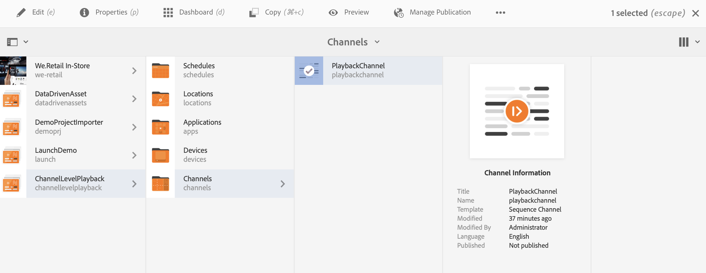
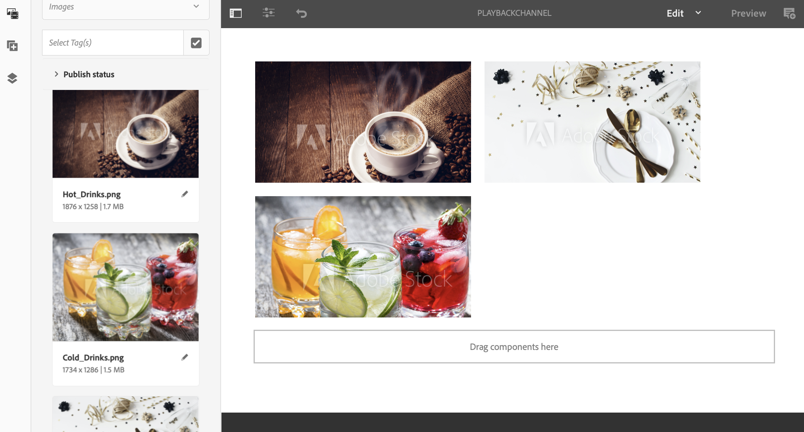

# Duração da reprodução de imagem em massa no nível do canal {#channel-level-bulk-image-playback-duration}

## Visão geral {#overview}

>[!IMPORTANT]
>Esse conteúdo é válido para o AEM no local/AMS (AEM 6.5LTS e AEM 6.5). Para ver o conteúdo do AEM as a Cloud Service Screens, consulte o [guia do AEM as a Cloud Service](https://experienceleague.adobe.com/en/docs/experience-manager-cloud-service/content/screens-as-cloud-service/overview/introduction).

Ao criar um canal de sequência e adicionar imagens a ele, por padrão, todas as imagens assumem a duração da reprodução definida na configuração Nível de canal. Qualquer imagem individual ainda pode substituir o padrão e ter uma duração de reprodução diferente. Essa capacidade é alcançada ao editar a duração de reprodução do componente de imagem específico.

### Pré-requisitos {#prerequisites}

Antes de começar a implementar essa funcionalidade, verifique se você configurou um projeto como pré-requisito para começar a implementá-la. Por exemplo,

1. Crie um exemplo de projeto do AEM Screens, **ChannelLevelPlayback**.

1. Crie um canal de sequência como **PlaybackChannel** na pasta **Channels**.

1. Adicionar conteúdo a **PlaybackChannel**.

## Edição de atribuição da duração da reprodução da imagem no nível do canal {#editing-channel-level-image-playback-duration-assignment}

A seção abaixo explica como editar a duração da reprodução do conteúdo em um canal AEM Screens.

### Atualização da duração da reprodução de imagens em um canal {#updating-the-playback-duration-for-images-in-a-channel}

Siga as etapas abaixo para saber como atualizar a Atribuição de duração da reprodução da imagem no nível do canal:

1. Navegue até o canal de sequência **PlaybackChannel**.

   

1. Clique em **Editar** na barra de ações.

   

1. Adicione duas ou mais imagens no editor de canal, como mostrado na figura abaixo.

   

1. Clique em todas as imagens no canal e clique no ícone da chave inglesa no canto superior esquerdo (como mostrado na figura abaixo) para abrir a caixa de diálogo Configurar nível de canal.

   

1. A caixa de diálogo **Página** é aberta.

   >[!NOTE]
   >Por padrão, as imagens em um canal são definidas com uma duração de reprodução de 8 segundos.

   

   Edite a **Duração** de 8000 (milissegundos) para 3000 (milissegundos), ou seja, 3 segundos. Clique na marca de seleção na parte superior direita da caixa de diálogo **Página** para salvar suas alterações.

   

### Exibir o resultado {#viewing-the-result}

Depois de atualizar a duração da reprodução do canal (neste exemplo, todas as três imagens), observe que as imagens agora são reproduzidas por 3 segundos em vez de 8 segundos (o valor padrão).

