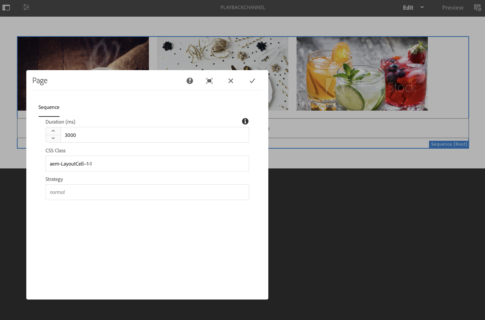

# Duração da reprodução de imagem em massa no nível do canal {#channel-level-bulk-image-playback-duration}

## Visão geral {#overview}

Depois de criar um canal de sequência e adicionar imagens a ele, por padrão, todas as imagens assumirão a duração da reprodução definida na configuração Nível de canal. Qualquer imagem individual ainda pode substituir o padrão e ter uma duração de reprodução diferente; isso é feito ao editar a duração de reprodução do componente de imagem específico.

### Pré-requisitos {#prerequisites}

Antes de começar a implementar essa funcionalidade, configure um projeto como pré-requisito para começar a implementá-la. Por exemplo,

1. Criar um exemplo de projeto do AEM Screens, **ChannelLevelPlayback**.

1. Criar um canal de sequência como **PlaybackChannel** em **Canais** pasta.

1. Adicionar conteúdo a **PlaybackChannel**.

## Edição de atribuição da duração da reprodução da imagem no nível do canal {#editing-channel-level-image-playback-duration-assignment}

A seção abaixo explica como editar a duração da reprodução do conteúdo em um canal AEM Screens.

### Atualização da duração da reprodução de imagens em um canal {#updating-the-playback-duration-for-images-in-a-channel}

Siga as etapas abaixo para saber como atualizar a Atribuição de duração da reprodução da imagem no nível do canal:

1. Navegar até o canal de sequência **PlaybackChannel**.

   

1. Clique em **Editar** na barra de ações para abrir o editor.

   

1. Adicione duas ou mais imagens no editor de canal, como mostrado na figura abaixo.

   

1. Selecione todas as imagens no canal e clique no ícone da chave inglesa na parte superior esquerda (como mostrado na figura abaixo) para abrir a caixa de diálogo Configurar nível de canal.

   

1. **Página** é aberta.

   >[!NOTE]
   >Por padrão, as imagens em um canal são definidas com uma duração de reprodução de 8 segundos.

   

   Edite o **Duração** de 8000 (ms) a 3000 (ms), ou seja, 3 segundos. Clique na marca de seleção na parte superior direita do **Página** para salvar as alterações.

   

### Exibir o resultado {#viewing-the-result}

Depois de atualizar a duração da reprodução do canal (neste exemplo, todas as três imagens), você notará que as imagens serão reproduzidas por 3 segundos em vez de 8 segundos (valor padrão).

