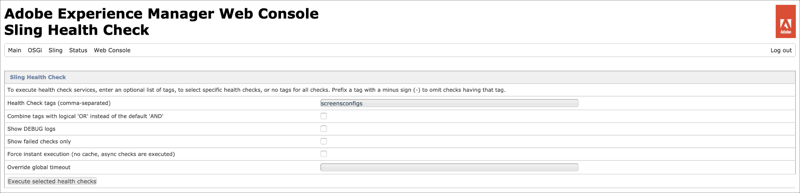
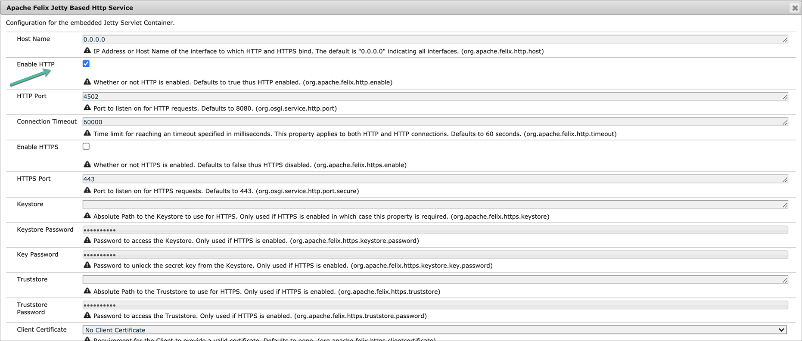
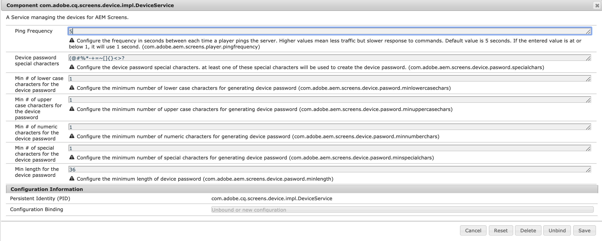

# Configuração e implantação do AEM Screens {#configuring-and-deploying-aem-screens}

Esta página mostra como instalar e configurar os players do Screens em seus dispositivos.

## Configuração do servidor {#server-configuration}

>[!NOTE]
>
>**Importante**:
>
>O reprodutor AEM Screens não usa o token CSRF (Cross-Site Request Forgery). Portanto, para configurar e AEM o servidor para estar pronto para usar no AEM Screens, pule o filtro do referenciador permitindo referenciadores vazios.

## Estrutura de verificação de integridade {#health-check-framework}

A estrutura de Verificação de integridade permite que o usuário verifique se duas configurações necessárias estão configuradas antes de executar um projeto do AEM Screens.

Ela permite que o usuário verifique as duas verificações de configuração a seguir para executar um projeto do AEM Screens, ou seja, para verificar o estado dos dois filtros a seguir:

1. **Permitir referenciador vazio**
2. **https**

Siga as etapas abaixo para verificar se essas duas configurações vitais estão habilitadas para o AEM Screens:

1. Navegue até [Verificação de Integridade do Sling do Console da Web do Adobe Experience Manager](http://localhost:4502/system/console/healthcheck?tags=screensconfigs&amp;overrideGlobalTimeout=).

   

2. Clique em **Executar verificações de integridade selecionadas** para executar a validação para duas propriedades listadas acima.

   Se ambos os filtros estiverem ativados, o **Serviço de Integridade de Configuração do Screens** mostrará o **Resultado** como **OK** com as duas configurações como habilitadas.

   

   Se um ou ambos os filtros estiverem desativados, um alerta será exibido para o usuário, como mostrado na figura abaixo.

   O alerta a seguir mostra se ambos os filtros estão desativados:
   

>[!NOTE]
>
>* Para ativar o **Apache Sling Referrer Filter**, consulte [Permitir solicitações vazias do referenciador](/help/user-guide/configuring-screens-introduction.md#allow-empty-referrer-requests).
>* Para habilitar o serviço **HTTP**, consulte [Apache Felix Jetty Based HTTP Service](/help/user-guide/configuring-screens-introduction.md#allow-apache-felix-service).

### Pré-requisitos {#prerequisites}

Os pontos-chave a seguir ajudam a configurar e AEM o servidor a estar pronto para uso no AEM Screens.

#### Permitir solicitações de referenciador vazias {#allow-empty-referrer-requests}

1. Navegue até **Configuração do Adobe Experience Manager Web Console** por meio de AEM instância —> ícone de martelo —> **Operações** —> **Web Console**.

   

1. **A** Configuração do Console da Web do Adobe Experience Manager é aberta. Procure por referenciador do sling.

   Para pesquisar a propriedade do referenciador do sling, pressione **Command+F** para **Mac** e **Control+F** para **Windows**.

1. Marque a opção **Permitir vazio**, conforme mostrado na figura abaixo.

   

1. Clique em **Save** para ativar o Apache Sling Referrer Filter Allow Empty (Filtro de referência do Apache Sling Permitir vazio).

#### Serviço HTTP Baseado em Apache Felix Jetty {#allow-apache-felix-service}

1. Navegue até **Configuração do Adobe Experience Manager Web Console** por meio de AEM instância —> ícone de martelo —> **Operações** —> **Web Console**.

   

1. **A** Configuração do Console da Web do Adobe Experience Manager é aberta. Procure por Serviço HTTP Baseado em Apache Felix Jetty.

   Para pesquisar essa propriedade, pressione **Command+F** para **Mac** e **Control+F** para **Windows**.

1. Marque a opção **ENABLE HTTP**, conforme mostrado na figura abaixo.

   

1. Clique em **Save** para ativar o serviço *http*.

#### Ativar a interface do usuário de toque para AEM Screens {#enable-touch-ui-for-aem-screens}

O AEM Screens requer a interface TOUCH e não funcionará com a interface CLASSIC do Adobe Experience Manager (AEM).

1. Navegue até *&lt;yourAuthorInstance>/system/console/configMgr/com.day.cq.wcm.core.impl.AuthoringUIModeServiceImpl*
1. Certifique-se de que o **Modo de interface de criação padrão** esteja definido como **TOUCH**, conforme mostrado na figura abaixo

Como alternativa, você também pode executar a mesma configuração usando as ferramentas *->* do AuthorInstance (ícone de martelo) -> **Operações** -> **Console da Web** e procurar **Serviço de modo da interface de criação do WCM**.

>[!NOTE]
>
>Você sempre pode ativar a interface clássica para usuários específicos usando preferências de usuário.

#### AEM no modo de execução NOSAMPLECONTENT {#aem-in-nosamplecontent-runmode}

A execução de AEM na produção usa o modo de execução **NOSAMPLECONTENT**. Remova o cabeçalho *X-Frame-Options=SAMEORIGIN* (na seção do cabeçalho de resposta adicional) de

`https://localhost:4502/system/console/configMgr/org.apache.sling.engine.impl.SlingMainServlet`.

Isso é necessário para que o Player do AEM Screens reproduza canais online.

#### Restrições de senha {#password-restrictions}

Com as alterações mais recentes em ***DeviceServiceImpl***, não é necessário remover as restrições de senha.

Você pode configurar ***DeviceServiceImpl*** a partir do link abaixo para ativar a restrição de senha enquanto cria a senha para os usuários do dispositivo de telas:

`https://localhost:4502/system/console/configMgr/com.adobe.cq.screens.device.impl.DeviceService`

Siga as etapas abaixo para configurar ***DeviceServiceImpl***:

1. Navegue até **Configuração do Adobe Experience Manager Web Console** por meio de AEM instância —> ícone de martelo —> **Operações** —> **Web Console**.

1. **A** Configuração do Console da Web do Adobe Experience Manager é aberta. Procure por *deviceservice*. Para pesquisar a propriedade, pressione **Command+F** para macOS e **Control+F** para Microsoft Windows.

#### Configuração do Dispatcher {#dispatcher-configuration}

Para saber como configurar o dispatcher para um projeto do AEM Screens, consulte [Configuração do Dispatcher para um projeto do AEM Screens](dispatcher-configurations-aem-screens.md).

#### Codificação Java {#java-encoding}

Defina ***Codificação Java*** como Unicode. Por exemplo, *Dfile.encoding=Cp1252* não funcionará.

>[!NOTE]
>**Recomendação:**
>É recomendável usar HTTPS para o AEM Screens Server em uso de produção.
