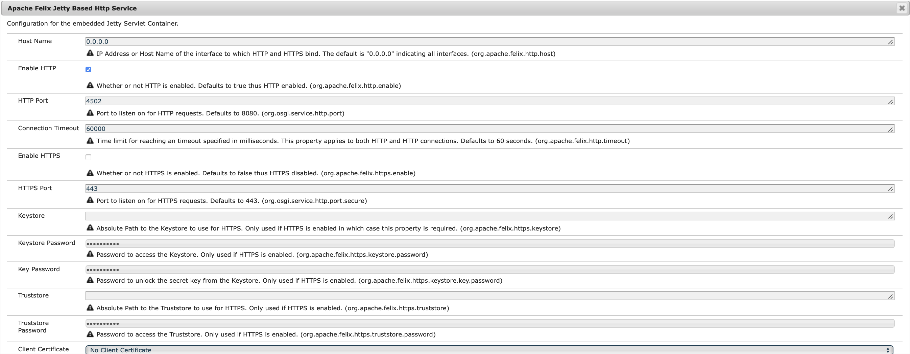

# Configuring and Deploying AEM Screens {#configuring-and-deploying-aem-screens}

Esta página mostra como instalar e configurar os players do Screens em seus dispositivos.

## Server Configuration {#server-configuration}

>[!NOTE]
>
>**Importante**:
>
>O AEM Screens player não usa o token Cross-Site Request Forgery (CSRF). Portanto, para configurar e AEM o servidor para estar pronto para uso no AEM Screens, ignore o filtro de quem indicou permitindo quens indicou vazias.

## Estrutura de verificação de integridade {#health-check-framework}

A estrutura de verificação de integridade permite que o usuário verifique se duas configurações necessárias estão configuradas antes de executar um projeto AEM Screens.

Ele permite que o usuário verifique as duas verificações de configuração a seguir para executar um projeto AEM Screens, ou seja, para verificar o estado dos dois filtros a seguir:

1. **Permitir Quem indicou vazia**
2. **https**

Siga as etapas abaixo para verificar se essas duas configurações vitais estão habilitadas para AEM Screens:

1. Navegue até Verificação [de integridade de sling do Console da Web](http://localhost:4502/system/console/healthcheck?tags=screensconfigs&amp;overrideGlobalTimeout=)Adobe Experience Manager.

   

2. Clique em **Executar verificações** de integridade selecionadas para executar a validação de duas propriedades listadas acima.

   Se ambos os filtros estiverem ativados, o Serviço **de Integridade da Configuração da** Tela mostrará o **Resultado** como **OK** com ambas as configurações como ativado.

   

   Se um ou ambos os filtros estiverem desativados, um alerta será exibido para o usuário, como mostrado na figura abaixo.

   O alerta a seguir mostra se ambos os filtros estão desativados:
   

>[!NOTE]
>
>* Para ativar o Filtro **de Quem indicou** Apache Sling, consulte [Permitir solicitações](/help/user-guide/configuring-screens-introduction.md#allow-empty-referrer-requests)de Quem indicou vazias.
>* Para habilitar o serviço **HTTP** , consulte [Apache Felix Jetty Based HTTP Service](/help/user-guide/configuring-screens-introduction.md#allow-apache-felix-service).

### Pré-requisitos {#prerequisites}

Os seguintes pontos chave abaixo ajudam a configurar e AEM o servidor a estar pronto para uso no AEM Screens.

#### Permitir solicitações de Quem indicou vazias {#allow-empty-referrer-requests}

1. Navegue até Configuração **do console da Web do** Adobe Experience Manager por AEM instância —> ícone de martelo —> **Operações** —> Console **da** Web.

   

1. **A Configuração** do Adobe Experience Manager Web Console é aberta. Procure por quem indicou de sling.

   Para pesquisar a propriedade sling quem indicou, pressione **Command+F** para **Mac** e **Control+F** para **Windows**.

   

1. Marque a opção **Permitir vazio** , conforme mostrado na figura abaixo.

   

1. Clique em **Salvar** para ativar o Filtro de Quem indicou Apache Sling Permitir vazio.

#### Serviço HTTP Apache Felix Jetty {#allow-apache-felix-service}

1. Navegue até Configuração **do console da Web do** Adobe Experience Manager por AEM instância —> ícone de martelo —> **Operações** —> Console **da** Web.

   

1. **A Configuração** do Adobe Experience Manager Web Console é aberta. Procure o serviço HTTP baseado em Jetty do Apache Felix.

   Para pesquisar essa propriedade, pressione **Command+F** para **Mac** e **Control+F** para **Windows**.

1. Marque a opção **ATIVAR HTTP** , conforme mostrado na figura abaixo.

   

1. Clique em **Salvar** para ativar o serviço *http* .

#### Ativar interface de usuário para AEM Screens {#enable-touch-ui-for-aem-screens}

A AEM Screens exige a interface do usuário TOQUE e não funcionará com a interface do usuário CLASSIC do Adobe Experience Manager (AEM).

1. Navegue até *&lt;yourAuthorInstance>/system/console/configMgr/com.day.cq.wcm.core.impl.AuthoringUIModeServiceImpl*
1. Certifique-se de que o modo **de criação da interface de usuário** padrão esteja definido como **TOUCH (TOQUE**), como mostrado na figura abaixo

Como alternativa, você também pode executar a mesma configuração usando *&lt;yourAuthorInstance>*->*ferramentas (ícone de martelo)* -> **Operações** -> Console **da** Web e pesquisar o Serviço **de modo de interface de criação** WCM.

>[!NOTE]
>
>Você sempre pode ativar a interface clássica para usuários específicos usando as preferências do usuário.

#### AEM no modo de execução NOSAMPLECONTENT {#aem-in-nosamplecontent-runmode}

A execução de AEM na produção usa o modo de execução **NOSAMPLECONTENT** . *Remova o cabeçalho X-Frame-Options=SAMEORIGIN* (na seção do cabeçalho de resposta adicional) de

`https://localhost:4502/system/console/configMgr/org.apache.sling.engine.impl.SlingMainServlet`.

Isso é necessário para que o AEM Screens Player reproduza canais online.

#### Restrições de senha {#password-restrictions}

Com as alterações mais recentes em ***DeviceServiceImpl***, não é necessário remover as restrições de senha.

Você pode configurar ***DeviceServiceImpl*** a partir do link abaixo para habilitar a restrição de senha ao criar a senha para os usuários do dispositivo de telas:

`https://localhost:4502/system/console/configMgr/com.adobe.cq.screens.device.impl.DeviceService`

Siga as etapas abaixo para configurar ***DeviceServiceImpl***:

1. Navegue até Configuração **do console da Web do** Adobe Experience Manager por AEM instância —> ícone de martelo —> **Operações** —> Console **da** Web.

1. **Configuração do Adobe Experience Manager Web Console **abre. Procure o serviço de dispositivos. Para pesquisar a propriedade, pressione **Command+F** para **Mac** e **Control+F** para **Windows**.

#### Configuração do Dispatcher {#dispatcher-configuration}

Para saber como configurar o dispatcher para um projeto da AEM Screens, consulte [Configuração do Dispatcher para um projeto](dispatcher-configurations-aem-screens.md)da AEM Screens.

#### Codificação Java {#java-encoding}

Defina a codificação ****** Java como Unicode. Por exemplo, *Dfile.encoding=Cp1252* não funcionará.

>[!NOTE]
>
>**Recomendação:**
>
>É recomendável usar HTTPS para AEM Screens Server na produção.

