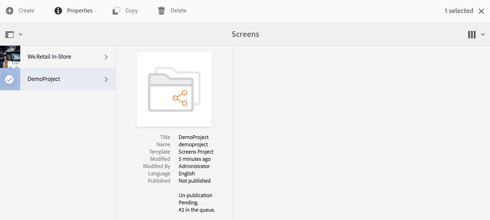

# Criação e gerenciamento de projetos {#creating-and-managing-projects}

O AEM Screens está disponível com a seleção do link do Adobe Experience Manager (no canto superior esquerdo) e, em seguida, do Screens.

Em alternativa, pode aceder diretamente a: `http://localhost:4502/screens.html/content/screens`

Diferentes projetos podem ser de marcas, implantações e clientes distintos, entre outros.

>[!NOTE]
>
>**Dica de navegação:**
>
>Você também pode usar as teclas de cursor para navegar por pastas diferentes no AEM. Além disso, depois de selecionar uma entidade específica, pressione a barra de espaço para editar ou visualizar as propriedades dessa pasta específica.

## Criação de um novo projeto do Screens {#creating-a-new-screens-project}

Siga as etapas abaixo para criar um novo projeto do Screens:

1. Selecione **Screens** no painel do AEM.
1. Click **Create **--&gt;** Create Project **and **Create Screens Project** wizard will open.

1. Select the **Screens** template and click **Next**.

1. Enter the properties (**Title** and **Name**) as required and click **Create**.

>[!NOTE]
>
>By default, the initial structure will contain the **Schedules**, **Locations**, **Applications**, **Channels**, and **Devices** master pages, but this can be manually adjusted if needed. Você pode remover as opções, se as disponíveis não forem relevantes para o seu projeto.

O projeto é criado, e você retorna ao console Projeto do Screens. Agora, você pode selecionar seu projeto.

Em um projeto, existem quatro tipos de pastas, como mostra a figura abaixo:

* **Agendamentos**
* **Localizações**
* **Aplicativos**
* **Canais**
* **Dispositivos**

### Exibição de propriedades {#viewing-properties}

Once you create the Screens project, click **Properties** on the action bar to edit properties of an exiting AEM Screens project.

The following options allow you to edit/change properties of your *DemoProject*.

### Criação de uma pasta personalizada {#creating-a-custom-folder}

Você também pode criar sua própria pasta personalizada em **Programações**, **Locais**, **Aplicativos**, **Canais** e Páginas mestras **de Dispositivos** disponíveis no projeto.

Para criar uma pasta personalizada:

1. Select your project and click on **Create** next to plus icon in the action bar.
1. O assistente **Criar** é aberto. Selecione a opção apropriada.
1. Clique em **Avançar**.
1. Insira as propriedades e clique em **Criar**.

As etapas a seguir mostram a criação de uma pasta de aplicativos para sua página mestre **Aplicativos** no *DemoProject*.

### Próximas etapas {#the-next-steps}

Once you have created your own project, see [Channel Management](managing-channels.md) to create and manage content in your channel.

Além disso, você pode criar seu próprio agendamento, aplicativo, local ou dispositivo.
