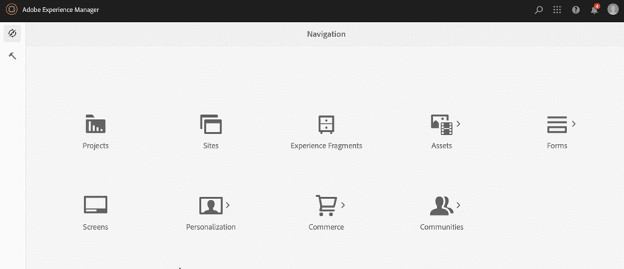

# Criação e gerenciamento de projetos {#creating-and-managing-projects}

A AEM Screens está disponível ao selecionar o link Adobe Experience Manager (parte superior esquerda) e, em seguida, Screens.

Como alternativa, você pode navegar diretamente para: `http://localhost:4502/screens.html/content/screens`

>[!NOTE]
>**Dica de Navegação:**
>Você também pode usar as teclas de cursor para navegar por diferentes pastas no AEM. Além disso, depois de clicar em uma entidade específica, pressione a barra de espaço para editar ou exibir propriedades dessa pasta específica.

## Criação de um novo projeto do Screens

1. Clique em **Screens** da sua instância AEM.
1. Clique em **Criar projeto do Screens**.
1. Insira o título como **TestScreens** e clique em **Salvar**.

O projeto é criado e o traz de volta ao console Projeto do Screens. Agora você pode clicar no seu projeto.

Em um projeto, há cinco tipos de pastas, como mostrado na figura abaixo:

* **Calendários**
* **Locais**
* **Aplicativos**
* **Dispositivos**
* **Canais**

>[!NOTE]
>
>Por padrão, a estrutura inicial contém as páginas principais **Agendas**, **Locais**, **Aplicativos**, **Canais** e **Dispositivos**, mas essa estrutura pode ser ajustada manualmente, se necessário. Você pode remover as opções se as disponíveis não forem relevantes para o seu projeto.

## Visualizando propriedades {#viewing-properties}

Depois de criar o projeto do Screens, clique no projeto e em **Propriedades** na barra de ações para poder editar as propriedades do projeto.

As opções a seguir permitem editar/alterar propriedades de suas **TestScreens**.

## Criação de uma pasta personalizada {#creating-a-custom-folder}

Você também pode criar sua própria pasta personalizada nas **Agendas**, **Locais**, **Aplicativos**, **Canais** e **Dispositivos** páginas principais que estão disponíveis em seu projeto.

Para criar uma pasta personalizada:

1. Clique no projeto e em **Criar** ao lado do ícone de adição na barra de ações.
1. O assistente **Criar** é aberto e clique na opção apropriada.
1. Clique em **Avançar**.
1. Insira as propriedades e clique em **Criar**.

As etapas a seguir mostram a criação de uma pasta de aplicativos para sua página principal de **Aplicativos** em **Telas**.

### Próximas etapas {#the-next-steps}

Depois de criar seu próprio projeto, consulte [Gerenciamento de canal](managing-channels.md) para criar e gerenciar conteúdo no seu canal.
