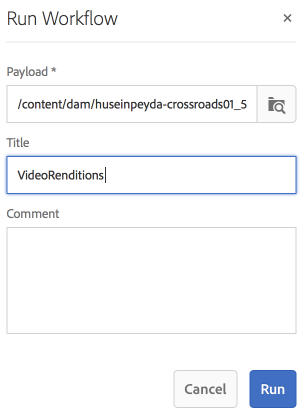

# Criando um fluxo de trabalho de preenchimento de vídeo {#creating-a-video-padding-workflow}

Esta seção aborda os seguintes tópicos:

* **Visão geral**
* **Pré-requisitos**
* **Criação de um fluxo de trabalho de preenchimento de vídeo**
   * **Criação de um fluxo de trabalho**
   * **Uso do fluxo de trabalho no AEM Screens Project**

* **Validando a saída para o fluxo de trabalho**

## Visão geral {#overview}

O caso de uso a seguir envolve a inserção de um vídeo (por exemplo: 1280 x 720) em um canal onde a tela é 1920 x 1080 e o vídeo é colocado em 0x0 (canto superior esquerdo). O vídeo não deve ser esticado ou modificado de nenhuma maneira e não usa **Cover** no componente de vídeo.

O vídeo será exibido como um objeto de pixel 1 a pixel 1280 na parte inferior e de pixel 1 a pixel 720 para baixo, e o restante do canal será de cor padrão.

## Pré-requisitos {#prerequisites}

Antes de criar um fluxo de trabalho para vídeo, conclua os seguintes pré-requisitos:

1. Carregue um vídeo na pasta **Assets** na sua instância AEM
1. Crie um projeto da AEM Screens (por exemplo, **TestVideoRendition**) e um canal chamado (**VideoRendering**), conforme mostrado na figura abaixo:

## Criando um fluxo de trabalho de preenchimento de vídeo {#creating-a-video-padding-workflow-1}

Para criar um fluxo de trabalho de preenchimento de vídeo, você deve criar um fluxo de trabalho para seu vídeo e usar o mesmo no canal do projeto do AEM Screens.

Siga as etapas abaixo para criar e usar o fluxo de trabalho:

1. Criação de um fluxo de trabalho
1. Uso do fluxo de trabalho em um projeto AEM Screens

### Criando um Fluxo de Trabalho {#creating-a-workflow}

Siga as etapas abaixo para criar um fluxo de trabalho para seu vídeo:

1. Navegue até a instância AEM e clique em ferramentas do painel lateral. Selecione **Fluxo de trabalho** —> **Modelos** para criar um novo modelo.

   

1. Clique em **Modelos** —> **Criar** —> **Criar Modelo**. Digite **Title** (como **VideoRendition**) e **Name** no **Adicionar Modelo de Fluxo de Trabalho**. Clique em **Concluído** para adicionar o modelo de fluxo de trabalho.

   

1. Depois de criar o modelo de fluxo de trabalho, selecione o modelo (**VideoRendition**) e clique em **Editar** na barra de ações.

   

1. Arraste e solte o componente **Linha de Comando** no seu fluxo de trabalho.

   

1. Selecione o componente **Linha de Comando** e abra a caixa de diálogo de propriedades.

   

1. Selecione a guia **Argumentos** para inserir os campos na caixa de diálogo **Linha de Comando - Propriedades da Etapa**.

   Digite o formato em **Mime Types** (como ***video/mp4***) e o comando como (***/usr/local/Cellar/ffmpeg -i ${filename} -vf &quot;pad=1920:height=1080:x=0:y=0:color=&quot; cq5dam.video.fullhd-hp.mp4***) para start do fluxo de trabalho no campo **Comandos**.

   Consulte os detalhes de **Mime Types** e **Comandos** na nota abaixo.

   

1. Selecione o fluxo de trabalho (**VideoRenditions**) e clique em **Fluxo de trabalho do Start** na barra de ações para abrir a caixa de diálogo **Executar fluxo de trabalho**.

   

1. Selecione o caminho de seu ativo em **Payload** (como ***/content/dam/huseinpeyda-cross01_512kb 2.mp4***) e digite **Title** como ***RunVideo*** e clique em **Executar a9/>.**

   

### Usando o fluxo de trabalho em um projeto do AEM Screens {#using-the-workflow-in-an-aem-screens-project}

Siga as etapas abaixo para usar o fluxo de trabalho no seu projeto AEM Screens:

1. Navegue até um projeto da AEM Screens (**TestVideoRendition** —> **Canais** —>**VideoRendition**).

   

1. Clique em **Editar** na barra de ações. Arraste e solte o vídeo que você carregou inicialmente para **Assets**.

   

1. Depois de fazer upload do vídeo, clique em **Pré-visualização** para visualização da saída.

   

## Validando a Saída para o Fluxo de Trabalho {#validating-the-output-for-the-workflow}

Você pode validar sua saída:

* Verifique a pré-visualização do vídeo no canal
* Navegue até ***/content/dam/testvideo.mp4/jcr:content/renditions/cq5dam.video.fullhd-hp.mp4*** no CRXDE Lite, conforme mostrado na figura abaixo:

