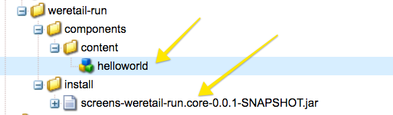

# Desenvolvimento de um componente personalizado para o AEM Screens {#developing-a-custom-component-for-aem-screens}

O tutorial a seguir percorre as etapas para criar um componente personalizado para o AEM Screens. O AEM Screens reutiliza muitos padrões e tecnologias de design existentes de outros produtos AEM. O tutorial destaca diferenças e considerações especiais ao desenvolver para o AEM Screens.

## Visão geral {#overview}

Este tutorial destina-se a desenvolvedores novos no AEM Screens. Neste tutorial, um componente simples &quot;Hello World&quot; é criado para um canal de Sequência no AEM Screens. Uma caixa de diálogo permite que os autores atualizem o texto exibido.


## Pré-requisitos {#prerequisites}

Para concluir este tutorial, é necessário o seguinte:

1. [Pacote de recursos do AEM 6.5](https://helpx.adobe.com/experience-manager/6-4/release-notes.html) ou [AEM 6.3](https://helpx.adobe.com/experience-manager/6-3/release-notes.html) + telas mais recentes

1. [Player do AEM Screens](https://helpx.adobe.com/experience-manager/6-4/sites/deploying/using/configuring-screens-introduction.html)
1. Ambiente de desenvolvimento local

As etapas do tutorial e as capturas de tela são executadas usando o **CRXDE-Lite**. Os IDEs também podem ser usados para concluir o tutorial. Mais informações sobre como usar um IDE para desenvolver [com o AEM podem ser encontradas aqui.](https://helpx.adobe.com/experience-manager/kt/sites/using/getting-started-wknd-tutorial-develop/part1.html#eclipse-ide)


## Configuração do projeto {#project-setup}

O código-fonte de um projeto do Screens geralmente é gerenciado como um projeto Maven de vários módulos. Para acelerar o tutorial, um projeto foi pré-gerado usando o [AEM Project Archetype 13](https://github.com/Adobe-Marketing-Cloud/aem-project-archetype). Mais detalhes sobre a [criação de um projeto com o Maven AEM Project Archetype podem ser encontrados aqui](https://helpx.adobe.com/experience-manager/kt/sites/using/getting-started-wknd-tutorial-develop/part1.html#maven-multimodule).

1. Baixe e instale os seguintes pacotes usando o gerenciador [de pacotes](http://localhost:4502/crx/packmgr/index.jsp)CRX:

   [Obter arquivo](assets/base-screens-weretail-runuiapps-001-snapshot.zip)

   [Obter arquivo](assets/base-screens-weretail-runuicontent-001-snapshot.zip)
   **Opcionalmente** , se estiver trabalhando com o Eclipse ou outro IDE, baixe o pacote de origem abaixo. Implante o projeto para uma instância do AEM local usando o comando Maven:

   **`mvn -PautoInstallPackage clean install`**

   Iniciar o HelloWorld SRC Screens We.Retail Run Project

   [Obter arquivo](assets/src-screens-weretail-run.zip)

1. No [CRX Package Manager](http://localhost:4502/crx/packmgr/index.jsp) , verifique se os dois pacotes a seguir estão instalados:

   1. **screens-weretail-run.ui.content-0.0.1-SNAPSHOT.zip**
   1. **screens-weretail-run.ui.apps-0.0.1-SNAPSHOT.zip**
   

   Screens We.Retail Run Ui.Apps e Pacotes Ui.Content instalados pelo CRX Package Manager

1. O pacote **screens-weretail-run.ui.apps** instala o código abaixo `/apps/weretail-run`.

   Este pacote contém o código responsável pela renderização de componentes personalizados para o projeto. Este pacote inclui o código do componente e qualquer JavaScript ou CSS necessário. Este pacote também incorpora **screens-weretail-run.core-0.0.1-SNAPSHOT.jar** , que contém qualquer código Java necessário para o projeto.

   >[!NOTE]
   >
   >Neste tutorial, nenhum código Java é gravado. Se for necessária uma lógica comercial mais complexa, o Java de back-end poderá ser criado e implantado usando o pacote Java principal.

   

   Representação do código ui.apps no CRXDE Lite

   O componente **helloworld** é atualmente apenas um espaço reservado. Durante o curso do tutorial, a funcionalidade será adicionada, permitindo que o autor atualize a mensagem exibida pelo componente.

1. O pacote **screens-weretail-run.ui.content** instala o código abaixo:

   * `/conf/we-retail-run`
   * `/content/dam/we-retail-run`
   * `/content/screens/we-retail-run`
   Este pacote contém o conteúdo inicial e a estrutura de configuração necessária para o projeto. **`/conf/we-retail-run`** contém todas as configurações para o projeto We.Retail Run. **`/content/dam/we-retail-run`** inclui o início de ativos digitais para o projeto. **`/content/screens/we-retail-run`** contém a estrutura de conteúdo do Screens. O conteúdo abaixo de todos esses caminhos é atualizado principalmente no AEM. Para promover a consistência entre ambientes (local, Dev, Stage, Prod), geralmente uma estrutura de conteúdo base é salva no controle de origem.

1. **Navegue até o projeto AEM Screens > Execução We.Retail:**

   No menu Iniciar do AEM > Clique no ícone Telas. Verifique se o projeto We.Retail Run (Execução do We.Retail) pode ser visto.

   

## Crie o componente Hello World {#hello-world-cmp}

O componente Hello World é um componente simples que permite que um usuário insira uma mensagem para ser exibida na tela. O componente é baseado no modelo de componente do [AEM Screens: https://github.com/Adobe-Marketing-Cloud/aem-screens-component-template](https://github.com/Adobe-Marketing-Cloud/aem-screens-component-template).

O AEM Screens tem algumas limitações interessantes que não são necessariamente verdadeiras para os componentes tradicionais do WCM Sites.

* A maioria dos componentes do Screens precisa ser executada em tela cheia nos dispositivos de sinalização digital de destino
* A maioria dos componentes do Screens precisam ser incorporados nos canais de sequência para gerar apresentações de slides
* A criação deve permitir a edição de componentes individuais em um canal de sequência, de modo que a renderização de componentes em tela cheia está fora de questão

1. Em **CRXDE-Lite** `http://localhost:4502/crx/de/index.jsp` (ou IDE de escolha), navegue até `/apps/weretail-run/components/content/helloworld.`

   Adicione as seguintes propriedades ao `helloworld` componente:

   ```
       jcr:title="Hello World"
       sling:resourceSuperType="foundation/components/parbase"
       componentGroup="We.Retail Run - Content"
   ```

   

   Propriedades para /apps/weretail-run/components/content/helloworld

   O componente **helloworld** estende a **fundação/componentes/componente parbase** para que possa ser usado corretamente dentro de um canal de sequência.

1. Crie um arquivo sob o `/apps/weretail-run/components/content/helloworld` nome `helloworld.html.`

   Preencha o arquivo com o seguinte:

   ```xml
   <!--/*
   
    /apps/weretail-run/components/content/helloworld/helloworld.html
   
   */-->
   
   <!--/* production: preview authoring mode + unspecified mode (i.e. on publish) */-->
   <sly data-sly-test.production="${wcmmode.preview || wcmmode.disabled}" data-sly-include="production.html" />
   
   <!--/* edit: any other authoring mode, i.e. edit, design, scaffolding, etc. */-->
   <sly data-sly-test="${!production}" data-sly-include="edit.html" />
   ```

   Os componentes da tela exigem duas renderizações diferentes, dependendo de qual modo [de](https://helpx.adobe.com/experience-manager/6-4/sites/authoring/using/author-environment-tools.html#PageModes) criação está sendo usado:

   1. **Produção**: Modo de visualização ou publicação (wcmmode=disabled)
   1. **Editar**: usado para todos os outros modos de criação, ou seja, edição, design, andaime, desenvolvedor...
   `helloworld.html`atua como um switch, verificando qual modo de criação está ativo no momento e redirecionando para outro script HTL. Uma convenção comum usada por componentes de tela é ter um `edit.html` script para o modo de edição e um `production.html` script para o modo de produção.

1. Crie um arquivo sob o `/apps/weretail-run/components/content/helloworld` nome `production.html.`

   Preencha o arquivo com o seguinte:

   ```xml
   <!--/*
    /apps/weretail-run/components/content/helloworld/production.html
   
   */-->
   
   <div data-duration="${properties.duration}" class="cmp-hello-world">
    <h1 class="cmp-hello-world__message">${properties.message}</h1>
   </div>
   ```

   Acima está a marcação de produção do componente Hello World. Um `data-duration` atributo é incluído, pois o componente é usado em um canal de Sequência. O `data-duration` atributo é usado pelo canal de sequência para saber por quanto tempo um item de sequência deve ser exibido.

   O componente renderiza uma tag `div` e uma `h1` tag com texto. `${properties.message}` é uma parte do script HTL que resultará no conteúdo de uma propriedade JCR chamada `message`. Uma caixa de diálogo é criada posteriormente, permitindo que o usuário insira um valor para o texto da `message` propriedade.

   Observe também que a notação BEM (Block Element Modifier) é usada com o componente. O BEM é uma convenção de codificação de CSS que facilita a criação de componentes reutilizáveis. BEM é a notação usada pelos Componentes [principais do](https://github.com/Adobe-Marketing-Cloud/aem-core-wcm-components/wiki/CSS-coding-conventions)AEM. Mais informações podem ser encontradas em: [https://getbem.com/](https://getbem.com/)

1. Crie um arquivo sob o `/apps/weretail-run/components/content/helloworld` nome `edit.html.`

   Preencha o arquivo com o seguinte:

   ```xml
   <!--/*
   
    /apps/weretail-run/components/content/helloworld/edit.html
   
   */-->
   
   <!--/* if message populated */-->
   <div
    data-sly-test.message="${properties.message}"
    class="aem-Screens-editWrapper cmp-hello-world">
    <p class="cmp-hello-world__message">${message}</p>
   </div>
   
   <!--/* empty place holder */-->
   <div data-sly-test="${!message}"
        class="aem-Screens-editWrapper cq-placeholder cmp-hello-world"
        data-emptytext="${'Hello World' @ i18n, locale=request.locale}">
   </div>
   ```

   Acima está a marcação de edição do componente Hello World. O primeiro bloco exibe uma versão de edição do componente se a mensagem de diálogo tiver sido preenchida.

   O segundo bloco será renderizado se nenhuma mensagem de diálogo tiver sido inserida. Nesse caso, o rótulo `cq-placeholder` Hello World `data-emptytext` é renderizado e ****** renderizado como um espaço reservado. A string para o rótulo pode ser internacionalizada usando o i18n para oferecer suporte à criação em várias localidades.

1. **Caixa de diálogo Copiar imagem da tela a ser usada para o componente Hello World.**

   É mais fácil começar de uma caixa de diálogo existente e depois fazer modificações.

   1. Copie a caixa de diálogo de: `/libs/screens/core/components/content/image/cq:dialog`
   1. Colar a caixa de diálogo abaixo `/apps/weretail-run/components/content/helloworld`
   

1. **Atualize a caixa de diálogo Hello World para incluir uma guia para a mensagem.**

   Atualize a caixa de diálogo para que ela corresponda ao seguinte. A estrutura do nó JCR da caixa de diálogo final é apresentada abaixo em XML:

   ```xml
   <?xml version="1.0" encoding="UTF-8"?>
   <jcr:root xmlns:sling="https://sling.apache.org/jcr/sling/1.0" xmlns:cq="https://www.day.com/jcr/cq/1.0" xmlns:jcr="https://www.jcp.org/jcr/1.0" xmlns:nt="https://www.jcp.org/jcr/nt/1.0"
       jcr:primaryType="nt:unstructured"
       jcr:title="Hello World"
       sling:resourceType="cq/gui/components/authoring/dialog">
       <content
           jcr:primaryType="nt:unstructured"
           sling:resourceType="granite/ui/components/coral/foundation/tabs"
           size="L">
           <items jcr:primaryType="nt:unstructured">
               <message
                   jcr:primaryType="nt:unstructured"
                   jcr:title="Message"
                   sling:resourceType="granite/ui/components/coral/foundation/fixedcolumns">
                   <items jcr:primaryType="nt:unstructured">
                       <column
                           jcr:primaryType="nt:unstructured"
                           sling:resourceType="granite/ui/components/coral/foundation/container">
                           <items jcr:primaryType="nt:unstructured">
                               <message
                                   jcr:primaryType="nt:unstructured"
                                   sling:resourceType="granite/ui/components/coral/foundation/form/textfield"
                                   fieldDescription="Message for component to display"
                                   fieldLabel="Message"
                                   name="./message"/>
                           </items>
                       </column>
                   </items>
               </message>
               <sequence
                   jcr:primaryType="nt:unstructured"
                   jcr:title="Sequence"
                   sling:resourceType="granite/ui/components/coral/foundation/fixedcolumns">
                   <items jcr:primaryType="nt:unstructured">
                       <column
                           jcr:primaryType="nt:unstructured"
                           sling:resourceType="granite/ui/components/coral/foundation/container">
                           <items jcr:primaryType="nt:unstructured">
                               <duration
                                   jcr:primaryType="nt:unstructured"
                                   sling:resourceType="granite/ui/components/coral/foundation/form/numberfield"
                                   defaultValue=""
                                   fieldDescription="Amount of time the image will be shown in the sequence, in milliseconds"
                                   fieldLabel="Duration (ms)"
                                   min="0"
                                   name="./duration"/>
                           </items>
                       </column>
                   </items>
               </sequence>
           </items>
       </content>
   </jcr:root>
   ```

   O campo de texto para a Mensagem será salvo em uma propriedade chamada `message` e o campo de número para a Duração será salvo em uma propriedade chamada `duration`. Essas duas propriedades são mencionadas em `/apps/weretail-run/components/content/helloworld/production.html` HTL como `${properties.message}` e `${properties.duration}`.

   

   Hello World - diálogo concluído

## Criar bibliotecas do lado do cliente {#clientlibs}

As bibliotecas do lado do cliente fornecem um mecanismo para organizar e gerenciar arquivos CSS e JavaScript necessários para uma implementação do AEM.

Os componentes do AEM Screens são renderizados de forma diferente no modo de edição vs. modo de visualização/produção. Duas bibliotecas clientes serão criadas, uma para o modo de edição e outra para a Visualização/Produção.

1. Crie uma pasta para bibliotecas do lado do cliente para o componente Hello World.

   Abaixo, `/apps/weretail-run/components/content/helloworld`crie uma nova pasta chamada `clientlibs`.

   

1. Abaixo da `clientlibs` pasta, crie um novo nó com o nome `shared` do tipo `cq:ClientLibraryFolder.`

   

1. Adicione as seguintes propriedades à biblioteca de clientes compartilhados:

   * `allowProxy` | Booleano | `true`

   * `categories`| String[] | `cq.screens.components`
   

   Propriedades para /apps/weretail-run/components/content/helloworld/clientlibs/shared

   A propriedade category é uma string que identifica a biblioteca do cliente. A categoria cq.screens.components é usada nos modos Editar e Visualizar/Produção. Portanto, qualquer CSS/JS definido no Shahdclientlib é carregado em todos os modos.

   É uma prática recomendada nunca expor nenhum caminho diretamente para /apps em um ambiente de produção. A propriedade allowProxy garante que a biblioteca do cliente CSS e JS sejam referenciadas por meio de um prefixo of/etc.clientlibs.

1. Crie um arquivo com o nome `css.txt` abaixo da pasta compartilhada.

   Preencha o arquivo com o seguinte:

   ```
   #base=css
   
   styles.less
   ```

1. Crie uma pasta chamada `css` abaixo da `shared` pasta. Adicione um arquivo com o nome `style.less` abaixo da `css` pasta. A estrutura das bibliotecas de clientes agora deve ser parecida com esta:

   

   Em vez de gravar CSS diretamente, este tutorial usa MENOS. [LESS](https://lesscss.org/) é um pré-compilador de CSS popular que suporta variáveis, mixins e funções de CSS. As bibliotecas de clientes AEM oferecem suporte nativo para a compilação LESS. É possível usar Sass ou outros pré-compiladores, mas eles precisam ser compilados fora do AEM.

1. Preencha `/apps/weretail-run/components/content/helloworld/clientlibs/shared/css/styles.less` com o seguinte:

   ```css
   /**
       Shared Styles
      /apps/weretail-run/components/content/helloworld/clientlibs/shared/css/styles.less
   
   **/
   
   .cmp-hello-world {
       background-color: #fff;
   
    &__message {
     color: #000;
     font-family: Helvetica;
     text-align:center;
    }
   }
   ```

1. Copie e cole a pasta da biblioteca do `shared` cliente para criar uma nova biblioteca do cliente chamada `production`.

   

   Copie a biblioteca de cliente compartilhado para criar uma nova biblioteca de cliente de produção

1. Atualizar a `categories` propriedade da biblioteca de cliente de produção a ser `cq.screens.components.production.`

   Isso garante que os estilos sejam carregados somente no modo de Visualização/Produção.

   

   Propriedades para /apps/weretail-run/components/content/helloworld/clientlibs/production

1. Preencha `/apps/weretail-run/components/content/helloworld/clientlibs/production/css/styles.less` com o seguinte:

   ```css
   /**
       Production Styles
      /apps/weretail-run/components/content/helloworld/clientlibs/production/css/styles.less
   
   **/
   .cmp-hello-world {
   
       height: 100%;
       width: 100%;
       position: fixed;
   
    &__message {
   
     position: relative;
     font-size: 5rem;
     top:25%;
    }
   }
   ```

   Os estilos acima exibirão a mensagem centralizada no meio da tela, mas somente no modo de produção.

Uma terceira categoria da biblioteca de clientes: `cq.screens.components.edit` poderia ser usado para adicionar estilos específicos somente para edição ao componente.

| Categoria Clientlib | Uso |
|---|---|
| `cq.screens.components` | Estilos e scripts que são compartilhados entre os modos de edição e produção |
| `cq.screens.components.edit` | Estilos e scripts usados somente no modo de edição |
| `cq.screens.components.production` | Estilos e scripts que são usados apenas no modo de produção |

## Criar uma página de design {#design-page}

O AEM Screens usa modelos [de página](https://helpx.adobe.com/experience-manager/6-5/sites/developing/using/page-templates-static.html) estáticos e configurações [](https://helpx.adobe.com/experience-manager/6-4/sites/authoring/using/default-components-designmode.html) de design para alterações globais. As configurações de design são frequentemente usadas para configurar os componentes permitidos para o Parsys em um canal. A prática recomendada é armazenar essas configurações de uma maneira específica para o aplicativo.

Abaixo de uma página We.Retail Run Design é criada e armazenará todas as configurações específicas do projeto We.Retail Run.

1. No **CRXDE-Lite** `http://localhost:4502/crx/de/index.jsp#/apps/settings/wcm/designs` , navegue para `/apps/settings/wcm/designs`
1. Crie um novo nó abaixo da pasta de designs, nomeado `we-retail-run` com um tipo de `cq:Page`.
1. Abaixo da `we-retail-run` página, adicione outro nó chamado `jcr:content` de tipo `nt:unstructured`. Adicione as seguintes propriedades ao `jcr:content` nó:

   | Nome | Tipo | Valor |
   |---|---|---|
   | jcr:title | Sequência de caracteres | Execução We.Retail |
   | sling:resourceType | Sequência de caracteres | wcm/core/components/designer |
   | cq:doctype | Sequência de caracteres | html_5 |

   

   Página de design em /apps/settings/wcm/designs/we-retail-run

## Criar um canal de sequência {#create-sequence-channel}

O componente Hello World deve ser usado em um Canal de sequência. Para testar o componente, um novo Canal de sequência é criado.

1. No menu Iniciar do AEM, navegue até **Telas** > **We.Retail** Run > e selecione **Canais**.

1. Clique no botão **Criar**

   1. Escolha **Criar entidade**
   

1. No assistente Criar:

1. Etapa do modelo - escolher Canal **de sequência**

   1. Etapa Propriedades
   * Guia Básica > Título = Canal **Ocioso**
   * Guia Canal > marcar **Colocar canal online**
   

1. Abra as propriedades de página do Canal ocioso. Atualize o campo Design para apontar para `/apps/settings/wcm/designs/we-retail-run,`a página de design criada na seção anterior.

   

   Configuração de design apontando para /apps/settings/wcm/designs/we-retail-run

1. Edite o canal ocioso recém-criado para abri-lo.

1. Alternar o modo de página para o Modo **de Design**

   1. Clique no ícone **chave inglesa** no Parsys para configurar os componentes permitidos

   1. Selecione o grupo **Telas** e o grupo Execução **We.Retail - Conteúdo** .
   

1. Alterne o modo de página para **Editar**. O componente Hello World agora pode ser adicionado à página e combinado com outros componentes de canal de sequência.

   

1. Em **CRXDE-Lite** , `http://localhost:4502/crx/de/index.jsp#/apps/settings/wcm/designs/we-retail-run/jcr%3Acontent/sequencechannel/par` navegue até `/apps/settings/wcm/designs/we-retail-run/jcr:content/sequencechannel/par`. Observe que a `components` propriedade agora inclui `group:Screens`, `group:We.Retail Run - Content`.

   

   Configuração de design em /apps/settings/wcm/designs/we-retail-run

## Modelo para manipuladores personalizados {#custom-handlers}

A seção abaixo mostra o modelo para o manipulador personalizado e os requisitos mínimos no pom.xml para esse projeto específico.

```java
   package …;

   import javax.annotation.Nonnull;

   import org.apache.felix.scr.annotations.Component;
   import org.apache.felix.scr.annotations.Reference;
   import org.apache.felix.scr.annotations.Service;
   import org.apache.sling.api.resource.Resource;
   import org.apache.sling.api.resource.ResourceUtil;
   import org.apache.sling.api.resource.ValueMap;

   import com.adobe.cq.screens.visitor.OfflineResourceHandler;

   @Service(value = OfflineResourceHandler.class)
   @Component(immediate = true)
   public class MyCustomHandler extends AbstractResourceHandler 
   {

    @Reference
    private …; // OSGi services injection

    /**
     * The resource types that are handled by the handler.
     * @return the handled resource types
     */
    @Nonnull
    @Override
    public String[] getSupportedResourceTypes() {
        return new String[] { … };
   }

    /**
     * Accept the provided resource, visit and traverse it as needed.
     * @param resource The resource to accept
     */
    @Override
    public void accept(@Nonnull Resource resource) 
      {
        ValueMap properties = ResourceUtil.getValueMap(resource);
        String assetPath = properties.get("myCustomPath", String.class); // retrieve a custom property path
        String referencedResource = properties.get("myOtherResource", String.class); // a dependent resource that also needs parsing
        …
        this.visitor.visit(…); // visit the asset/rendition/path to be added to the manifest
        this.visitor.accept(referencedResource); // accept/parse the dependent resource as well
        …
      }
   }
```

O código a seguir fornece os requisitos mínimos no pom.xml para esse projeto específico:

```css
   <dependencies>
        …
        <!-- Felix annotations -->
        <dependency>
            <groupId>org.apache.felix</groupId>
            <artifactId>org.apache.felix.scr.annotations</artifactId>
            <version>1.9.0</version>
            <scope>provided</scope>
        </dependency>

        <!-- Screens core bundle with OfflineResourceHandler/AbstractResourceHandler -->
        <dependency>
            <groupId>com.adobe.cq.screens</groupId>
            <artifactId>com.adobe.cq.screens</artifactId>
            <version>1.5.90</version>
            <scope>provided</scope>
        </dependency>
        …
      </dependencies>
```

## Juntando tudo {#putting-it-all-together}

O vídeo abaixo mostra o componente finalizado e como ele pode ser adicionado a um canal de Sequência. O Canal é então adicionado a uma exibição Local e, por fim, atribuído a um player do Screens.

>[!VIDEO](https://video.tv.adobe.com/v/22385?quaity=9)

## Código finalizado {#finished-code}

Abaixo está o código finalizado do tutorial. Os **screens-weretail-run.ui.apps-0.0.1-SNAPSHOT.zip** e **screens-weretail-run.ui.content-0.0.1-SNAPSHOT.zip** são os pacotes AEM compilados. O **SRC-screens-weretail-run-0.0.1.zip **é o código fonte não compilado que pode ser implantado usando o Maven.

[Obter arquivo](assets/screens-weretail-runuiapps-001-snapshot.zip)

[Obter arquivo](assets/screens-weretail-runuicontent-001-snapshot.zip)

[Obter arquivo](assets/screens-weretail-run.zip)
