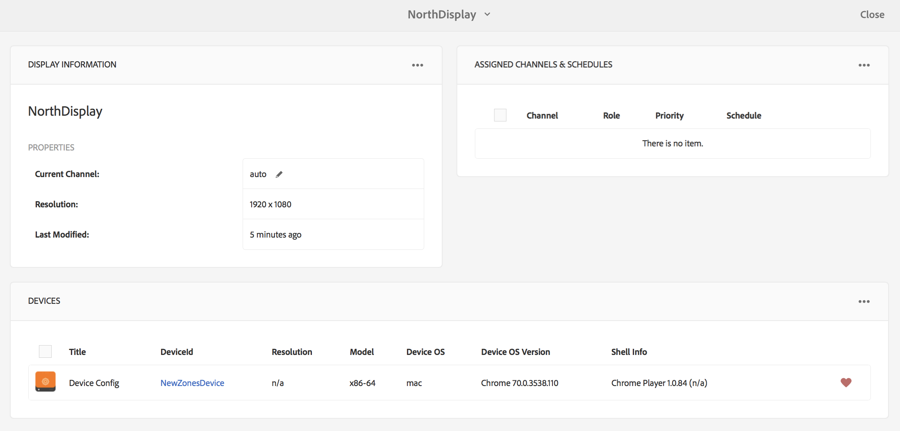

# Registro do dispositivo {#device-registration}

A página a seguir descreve o processo de registro do dispositivo em um projeto do AEM Screens.

## Registrando um dispositivo {#registering-a-device}

O processo de registro do dispositivo é feito em duas máquinas separadas:

* O dispositivo real a ser registrado, por exemplo, a sua Exibição de sinalização
* O servidor de AEM usado para registrar seu dispositivo

>[!NOTE]
>
>Depois de baixar o Windows Player mais recente (*.exe*), na página [AEM 6.4 Player Downloads](https://download.macromedia.com/screens/), siga as etapas no reprodutor para concluir a instalação ad hoc:
>
>1. Pressione e segure no canto superior esquerdo para abrir o painel do administrador.
>1. Navegue até **Configuration** no menu de ação esquerdo e insira o endereço de localização da instância de AEM em **Server** e clique em **Save**.
>1. Clique no link **Registration** no menu de ação esquerdo e nas etapas abaixo para concluir o processo de registro do dispositivo.

>


1. No seu dispositivo, inicie o Player do AEM Screens. A interface do usuário de registro é exibida.

   

1. Em AEM, navegue até a pasta **Devices** do seu projeto.

   >[!NOTE]
   >
   >Para obter mais informações sobre como criar um novo projeto para o Screens no painel AEM, consulte [Criar e gerenciar o projeto do Screens](creating-a-screens-project.md).

1. Toque/clique no botão **Gerenciador de dispositivos** na barra de ações.

   

1. Toque/clique no botão **Device Registration** no canto superior direito.

   

1. Selecione o dispositivo necessário (o mesmo que a etapa 1) e toque/clique em **Registrar dispositivo**.

   

1. No AEM, aguarde o dispositivo enviar seu código de registro.

   

1. No dispositivo, marque o **Código de registro**.

   

1. Se o **Código de Registro** for o mesmo em ambas as máquinas, toque/clique no botão **Validar** no AEM, conforme mostrado na etapa (6).
1. Defina o nome desejado para o dispositivo e clique em **Register**.

   

1. Toque/clique em **Finish** para concluir o processo de registro.

   

   >[!NOTE]
   >
   >O **Register New** permite registrar um novo dispositivo.
   >
   >O **Assign Display** permite adicionar diretamente o dispositivo a uma exibição.

   Se você clicar em **Finish**, será necessário atribuir o dispositivo a uma exibição.

   

   >[!NOTE]
   >
   >Para saber mais sobre como criar e gerenciar uma exibição para o projeto do Screens, consulte [Criação e gerenciamento de exibições](managing-displays.md).

### Atribuindo dispositivo a um monitor {#assigning-device-to-a-display}

Se você não atribuiu o dispositivo a um monitor, siga as etapas abaixo para atribuir seu dispositivo a um monitor em seu projeto do AEM Screens:

1. Selecione o dispositivo e clique em **Atribuir dispositivo** na barra de ações.

   

1. Selecione o caminho da exibição em **Caminho de configuração de exibição/dispositivo**.

   

1. Clique em **Atribuir** ao selecionar o caminho.

   

1. Clique em **Finish** depois que o dispositivo for atribuído com êxito, como mostrado na figura abaixo.

   

   Além disso, você pode exibir o painel de exibição ao clicar em **Finish**.

   

## Pesquisando um dispositivo no Gerenciador de dispositivos {#search-device}

Depois de registrar os dispositivos no player, você pode exibir todos os dispositivos na interface do usuário do Gerenciador de dispositivos.

1. Navegue até a interface do usuário do Gerenciador de dispositivos em seu projeto do AEM Screens, por exemplo, **DemoScreens** —> **Dispositivos**.

1. Selecione a pasta **Dispositivos** e clique em **Gerenciador de Dispositivos** na barra de ações.

   

1. A lista de dispositivos registrados é exibida.

1. Se você tiver uma lista longa de dispositivos registrados, agora poderá pesquisar usando o ícone de pesquisa na barra de ações

   

   Ou,

   Clique em `/` (barra) para invocar a funcionalidade de pesquisa.

   


### Limitações da funcionalidade de pesquisa {#limitations}

* O usuário poderá pesquisar qualquer palavra existente no *ID do dispositivo* ou *Nome do dispositivo*.

   >[!NOTE]
   >É recomendável criar os nomes dos dispositivos em várias palavras, como *Boston Store Lobby*, em vez de um único *BostonStoreLobby*.

* Se você criar nomes de dispositivo como *Boston Store Lobby*, ele permitirá procurar por qualquer palavra *boston*, *store* ou *lobby*, mas se o nome do dispositivo for referido como *BostonStoreLobby* pesquisando *boston* não mostrará os resultados.

* Caractere curinga, `*` é suportado para pesquisa. Nesse caso, você deseja encontrar todos os dispositivos com nomes começando com *boston*, você pode usar *boston**.

* Se o nome do dispositivo for *BostonStoreLobby* e a pesquisa por *boston* não retornará o resultado usando *boston** nos seus critérios de pesquisa retornará o resultado.

## Limitações no Registro do Dispositivo {#limitations-on-device-registration}

Restrições de senha de usuário em todo o sistema podem causar falha no registro do dispositivo. O registro do dispositivo usa uma senha gerada aleatoriamente para criar o usuário do dispositivo.

Se a senha for restrita pela configuração *AuthorizableActionProvider*, a criação do usuário do dispositivo poderá falhar.

>[!NOTE]
>
>A senha aleatória gerada atualmente é composta por 36 caracteres ASCII, variando de 33 a 122 (inclui quase todos os caracteres especiais).

```java
25.09.2016 16:54:03.140 *ERROR* [59.100.121.82 [1474844043109] POST /content/screens/svc/registration HTTP/1.1] com.adobe.cq.screens.device.registration.impl.RegistrationServlet Error during device registration
javax.jcr.nodetype.ConstraintViolationException: Password violates password constraint (^(?=.*\d).{7,9}$).
        at org.apache.jackrabbit.oak.spi.security.user.action.PasswordValidationAction.validatePassword(PasswordValidationAction.java:105)
        at org.apache.jackrabbit.oak.spi.security.user.action.PasswordValidationAction.onPasswordChange(PasswordValidationAction.java:76)
        at org.apache.jackrabbit.oak.security.user.UserManagerImpl.onPasswordChange(UserManagerImpl.java:308)
```

### Recursos adicionais {#additional-resources}

Para saber mais sobre o AEM Screens Player, consulte [AEM Screens Player](working-with-screens-player.md).
