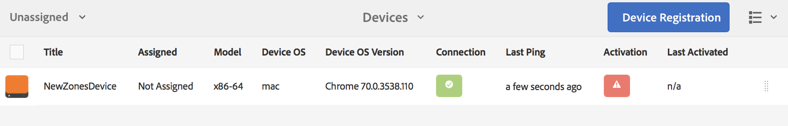

# Registro do dispositivo {#device-registration}

A página a seguir descreve o processo de registro do dispositivo em um projeto do AEM Screens.

## Registrando um dispositivo {#registering-a-device}

O processo de registro do dispositivo é feito em duas máquinas separadas:

* O dispositivo real a ser registrado, por exemplo, sua tela de cartazes
* O servidor AEM usado para registrar seu dispositivo

>[!NOTE]
>
>Depois de baixar o Windows Player mais recente (*.exe*), na página Downloads [do](https://download.macromedia.com/screens/) AEM 6.4 Player, siga as etapas no player para concluir a instalação ad hoc:
>
>1. Pressione longamente no canto superior esquerdo para abrir o painel admin.
>1. Navegue até **Configuração** no menu de ação esquerdo, digite o endereço de localização da instância do AEM no **Servidor** e clique em **Salvar**.
>1. Clique no link **Registro** no menu de ação esquerdo e nas etapas abaixo para concluir o processo de registro do dispositivo.
>


1. Em seu dispositivo, inicie o AEM Screens Player. A interface do usuário de registro é exibida.

   

1. No AEM, navegue até a pasta **Dispositivos** do seu projeto.

   >[!NOTE]
   >
   >Para obter mais informações sobre como criar um novo projeto para o Screens no painel AEM, consulte [Criar e gerenciar projeto](creating-a-screens-project.md)de telas.

1. Toque/clique no botão Gerenciador **de** dispositivos na barra de ações.

   

1. Toque/clique no botão **Device Registration (Registro** do dispositivo) na parte superior direita.

   

1. Selecione o dispositivo desejado (o mesmo que a etapa 1) e toque/clique em **Registrar dispositivo**.

   

1. No AEM, aguarde o dispositivo enviar seu código de registro.

   

1. Em seu dispositivo, verifique o Código **** de registro.

   

1. Se o Código **** de registro for o mesmo em ambos os computadores, toque/clique no botão **Validar** no AEM, como mostrado na etapa (6).
1. Defina o nome desejado para o dispositivo e clique em** Register** (Registrar*).

   

1. Toque/clique em** Finish** para concluir o processo de registro.

   

   >[!NOTE]
   >
   >A opção **Registrar novo** permite registrar um novo dispositivo.
   >
   >A opção **Atribuir exibição** permite que você adicione diretamente o dispositivo a uma tela.

   Se você clicar em **Concluir**, será necessário atribuir o dispositivo a uma tela.

   

   >[!NOTE]
   >
   >Para saber mais sobre como criar e gerenciar uma exibição para o seu projeto do Screens, consulte [Criar e gerenciar exibições](managing-displays.md).

### Atribuindo dispositivo a um monitor {#assigning-device-to-a-display}

Se você não atribuiu o dispositivo a uma tela, siga as etapas abaixo para atribuir seu dispositivo a uma tela no projeto do AEM Screens:

1. Selecione o dispositivo e clique em **Atribuir dispositivo** na barra de ações.

   

1. Selecione o caminho da exibição no Caminho **de configuração de** vídeo/dispositivo.

   

1. Clique em **Atribuir** ao selecionar o caminho.

   

1. Clique em **Concluir** depois que o dispositivo for atribuído com êxito, como mostrado na figura abaixo.

   

   Além disso, você pode exibir o painel ao clicar em **Concluir**.

   

## Limitações no registro do dispositivo {#limitations-on-device-registration}

As restrições de senha de usuário em todo o sistema podem causar falha no registro do dispositivo. O registro do dispositivo usa uma senha gerada aleatoriamente para criar o usuário do dispositivo.

Se a senha for restrita pela configuração *AuthorizableActionProvider* , a criação do usuário do dispositivo poderá falhar.

>[!NOTE]
>
>A senha aleatória gerada atualmente é composta de 36 caracteres ASCII, variando de 33 a 122 (inclui quase todos os caracteres especiais).

```java
25.09.2016 16:54:03.140 *ERROR* [59.100.121.82 [1474844043109] POST /content/screens/svc/registration HTTP/1.1] com.adobe.cq.screens.device.registration.impl.RegistrationServlet Error during device registration
javax.jcr.nodetype.ConstraintViolationException: Password violates password constraint (^(?=.*\d).{7,9}$).
        at org.apache.jackrabbit.oak.spi.security.user.action.PasswordValidationAction.validatePassword(PasswordValidationAction.java:105)
        at org.apache.jackrabbit.oak.spi.security.user.action.PasswordValidationAction.onPasswordChange(PasswordValidationAction.java:76)
        at org.apache.jackrabbit.oak.security.user.UserManagerImpl.onPasswordChange(UserManagerImpl.java:308)
```

### Additional Resources {#additional-resources}

Para saber mais sobre o AEM Screens Player, consulte [AEM Screens Player](working-with-screens-player.md).
