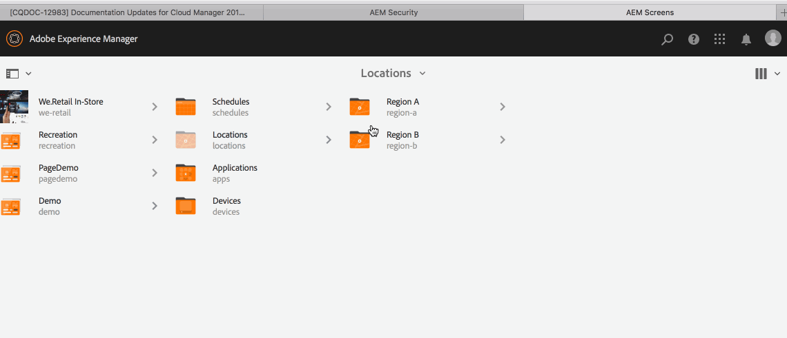

# Uso de sequência incorporada dinâmica {#using-dynamic-embedded-sequence}

O uso de Sequências incorporadas dinâmicas abrange os seguintes tópicos:

* **Visão geral**
* **Usando a Experiência Incorporada Dinâmica no AEM Screens**
* **Exibindo os Resultados**
* **Restrição de Usuários e Modificação de ACLs**

## Visão geral {#overview}

***Sequências Incorporadas Dinâmicas*** são criadas para projetos grandes que seguem uma hierarquia pai-filho, na qual o filho é referenciado dentro de uma pasta de local e não de uma pasta de canal. Ele permite que o usuário insira uma sequência dentro de um canal por ***Função de Canal***. Ele permite que o usuário defina espaços reservados específicos de localização para diferentes escritórios usando uma sequência incorporada dentro de um canal principal.

Ao atribuir um canal a uma exibição, você tem a opção de especificar o caminho da exibição. Ou você pode especificar a função do canal que é resolvido para um canal real por contexto.

Para usar a Sequência Incorporada Dinâmica, atribua um canal por ***Função de Canal***. A Função do canal define o contexto da exibição. A função é direcionada a várias ações e é independente do canal real que cumpre a função. Esta seção descreve um caso de uso que define canais por função e como você pode aplicar esse conteúdo a um canal global. Você também pode considerar a função como um identificador para a atribuição, ou um alias para o canal no contexto do.

### Benefícios do uso de sequências incorporadas dinâmicas {#benefits-of-using-dynamic-embedded-sequences}

Colocar um canal de sequência dentro de um local, em vez da pasta de canais, permite que autores locais ou regionais editem o conteúdo relevante para eles. Também permite que ele seja restrito a editar canais em posições mais altas na hierarquia.

Fazer referência a um *Canal por função* permite criar uma versão local de um canal. Isso resolve dinamicamente o conteúdo específico do local e também permite criar um canal global que usa o conteúdo dos canais específicos do local.

>[!NOTE]
>
>**Sequências Inseridas versus Sequências Inseridas Dinâmicas**
>
>Uma Sequência Incorporada Dinâmica é semelhante a uma sequência incorporada, mas permite que o usuário siga uma hierarquia em que as alterações e as atualizações feitas em um canal são propagadas para outro relacionado. Ela segue uma hierarquia pai-filho e também inclui ativos como imagens ou vídeos.
>
>***As Sequências Incorporadas Dinâmicas*** permitem exibir o conteúdo específico do local, enquanto as ***Sequências Incorporadas*** exibem somente a apresentação de slides geral do conteúdo. Além disso, ao configurar as Sequências Incorporadas Dinâmicas, configure o canal usando a função e o nome do canal. Consulte as etapas abaixo para obter a implementação prática.
>
>Para saber mais sobre como implementar sequências inseridas, consulte [Sequências inseridas](embedded-sequences.md) no AEM Screens.

O exemplo a seguir fornece uma solução com foco nos seguintes termos principais:

* um ***canal de sequência principal*** para a sequência global.
* ***sequência dinâmica inserida*** componentes para cada parte personalizável localmente da sequência.
* ***canais de sequência individuais*** nos respectivos locais com uma *função* na exibição que corresponde à *função&#x200B;*** do componente de sequência dinâmica inserido.**

>[!NOTE]
>
>Para saber mais sobre atribuição de canal, consulte **[Atribuição de canal](channel-assignment.md)** na seção Criação da documentação do AEM Screens.

## Uso de sequência incorporada dinâmica {#using-dynamic-embedded-sequence-2}

A seção a seguir explica a criação de uma Sequência incorporada dinâmica em um canal do AEM Screens.

### Pré-requisitos {#prerequisites}

Antes de começar a implementar essa funcionalidade, verifique se você tem os seguintes pré-requisitos prontos para começar a implementar sequências incorporadas dinâmicas:

* Crie um projeto do AEM Screens (neste exemplo, **Demonstração**).
* Crie um canal **Global** na pasta **Channels**.
* Adicione conteúdo ao seu Canal **Global** (*Verifique **Resources.zip**&#x200B;para ativos relevantes*).

A imagem a seguir mostra o projeto **Demo** com o canal **Global** na pasta **Canais**.

### Recursos {#resources}

Você pode baixar os seguintes recursos (imagens e adicioná-los a ativos) e usá-los como conteúdo de canal para fins de demonstração.

[Obter arquivo](assets/resources.zip)

>[!NOTE]
>
>Para obter informações adicionais sobre como criar um projeto e criar um canal de sequência, consulte os seguintes recursos:
>
>* **[Criação e gerenciamento de projetos](creating-a-screens-project.md)**
>* **[Gerenciando um Canal](managing-channels.md)**
>

A implementação da Sequência dinâmica inserida em um projeto AEM Screens envolve três tarefas principais:

1. **Configurando a taxonomia do projeto, incluindo Canais, Locais e Exibições**
1. **Criando um Cronograma**
1. **Atribuindo agenda a cada exibição**

Siga as etapas abaixo para implementar a funcionalidade:

>[!CAUTION]
>
>Ao implementar as Sequências Incorporadas Dinâmicas, tenha cuidado com os campos **Nome** e **Título** ao criar canais em cada local. Siga cuidadosamente as instruções da nomenclatura.

1. **Criar uma Pasta de Dois Locais.**

   Navegue até a pasta **Locais** do projeto do AEM Screens e crie duas pastas de local como **Região A** e **Região B**.

   >[!NOTE]
   >
   >Ao criar a pasta de local da **Região A**, insira o **Título** como **Região A** e deixe o campo **Nome** vazio para que o nome da **região-a** seja selecionado automaticamente.
   >
   >É o caso semelhante para criar a pasta de local **Região B**, conforme mostrado abaixo:

   

   >[!NOTE]
   >Para saber como criar um local, consulte **[Criação e Gerenciamento de Locais](managing-locations.md)**.

1. **Crie dois Locais e um Canal em cada pasta de local.**

   1. Navegue até **Demonstração** > **Locais** > **Região A**.
   1. Clique em **Região A** e em **+ Criar** na barra de ações.
   1. Clique em **Local** no assistente com **Título** como **Loja 1**. Da mesma forma, crie outro local do assistente denominado **Store 2** com o **Title** como **Store 2**. Você pode deixar o campo **Nome** vazio ao criar a **Loja 1** e a **Loja 2**.
   1. Repita a etapa (b) e clique em **Canal de sequência** no assistente. Insira o **Título** como **Região A** e **Nome** como **região** para este canal.

   >[!CAUTION]
   >
   >Ao criar o canal **Região A**, insira o **Título** como **Região A** e o **Nome** como uma **região**.

   

   Da mesma forma, crie dois locais na **Região B** intitulados **Loja 3** e **Loja 4**. Além disso, crie um **Canal de Sequência** com **Título** como **Região B** e **Nome** como **região**.

   >[!CAUTION]
   >
   >Use o mesmo nome para os canais criados na **Região A** e na **Região B** como **região**.

   

1. **Criar Exibição e Canal em cada Local.**

   1. Navegue até **Demonstração** > **Locais** > **Região A** > **Loja 1**.
   1. Clique em **Armazenar 1** e em **+ Criar** na barra de ações.
   1. Clique em **Exibir** no assistente e crie **`Store1Display`**.
   1. Repita a etapa (b) e desta vez clique em **Canal de sequência** no assistente. Insira o **Título** como **`Store1Channel`** e o **Nome** como **armazenamento**.

   >[!CAUTION]
   >
   >É importante quando você cria um canal de sequência. O **Título** do canal pode ser o seu requisito, mas o **Nome** deve ser o mesmo em todos os canais locais.
   >Neste exemplo, os canais na **Região A** e na **Região B** compartilham o **Nome** como **região** e os canais na **`Store 1`**, **`Store 2`**, **`Store 3`** e **`Store 4`** compartilham o **Nome** como **repositório**.

   

   Da mesma forma, crie uma exibição como **`Store2Display`** e um canal **`Store2Channel`** em **`Store `2** (com o nome como **armazenamento**).

   >[!NOTE]
   >Verifique se você pode usar o mesmo nome dos canais criados em **`Store 1`** e **`Store 2`** que **store**.

   

   Siga as etapas anteriores para criar um canal e exibição em **`Store 3`** e **`Store 4`** na **Região B**. Novamente, certifique-se de usar o mesmo **Nome** que **repositório** ao criar os canais **`Store3Channel`** e **`Store4Channel`**, respectivamente.

   A imagem a seguir mostra a exibição e o canal em **`Store 3`**.

   

   A imagem a seguir mostra a exibição e o canal em **`Store 4`**.

   

1. **Adicionar Conteúdo aos Canais em seus respectivos Locais.**

   Navegue até **Demonstração** > **Locais** > **Região A** > **Região A** e clique em **Editar** na barra de ações. Arraste e solte os ativos que deseja adicionar ao canal.

   >[!NOTE]
   >Você pode usar o arquivo ***Resources.zip*** da seção **Resources** acima para usar as imagens como ativos para o conteúdo do seu canal.

   

   Da mesma forma, navegue até a **Demonstração** > **Locais** > **Região B** > **Região B** e clique em **Editar** na barra de ações para arrastar e soltar os ativos no seu canal, conforme mostrado abaixo:

   

   Siga as etapas e os recursos anteriores para adicionar conteúdo aos seguintes canais:

   * **`Store1Channel`**
   * **`Store2Channel`**
   * **`Store3Channel`**
   * **`Store4Channel`**

1. **Criar um Cronograma**

   Navegue e clique na pasta **Agendamentos** do seu projeto do AEM Screens. Em seguida, clique em **Criar** na barra de ações.

   A imagem a seguir mostra o **AdSchedule** criado no projeto **Demo**.

   

1. **Atribuir Canais a um Agendamento**

   1. Navegue até **Demonstração** > **Agendas** > **AdSchedule** e clique em **Painel** na barra de ações.
   1. Clique em **+ Atribuir canal** no painel **CANAIS ATRIBUÍDOS** para abrir a caixa de diálogo **Atribuição de canal**.
   1. Clique em **Canal de Referência** por caminho.
   1. Clique no **Caminho do canal**, como **Demonstração** > ***Canais*** > ***Global***.
   1. Insira a **Função do canal**, assim como **GlobalAdSegment**.
   1. Clique nos **Eventos com Suporte**, assim como em **Carregamento Inicial**, **Tela Inativa** e **Interação de Usuário**.
   1. Clique em **Salvar**.

   **Atribuir canal por função para região:**

   1. Clique em **+ Atribuir canal** no painel **CANAIS ATRIBUÍDOS**.
   1. Na caixa de diálogo Atribuição de canal, clique em **Canal de Referência** por nome.
   1. Insira o **Nome do Canal** como **região***.
   1. Insira a **Função do canal** como **RegionAdSegment**.
   1. Clique em **Salvar**.

   **Atribuir Canal por Função para Repositório:**

   1. Clique em **+ Atribuir canal** no painel **CANAIS ATRIBUÍDOS**.
   1. Na caixa de diálogo Atribuição de canal, clique em **Canal de Referência** por nome.
   1. Insira o **Nome do canal** como **armazenamento**.
   1. Insira a **Função do canal** como **StoreAdSegment**.
   1. Clique em **Salvar**.

   A imagem a seguir mostra os canais atribuídos por caminho e por função.

   

1. **Configurando a Sequência Incorporada Dinâmica para o Canal Global.**

   Navegue até o Canal **Global** criado inicialmente no projeto **Demonstração**.

   Clique em **Editar** na barra de ações.

   

   No editor, arraste e solte dois componentes de **Sequência Incorporada Dinâmica** no editor de canais.

   Abra as propriedades de um dos componentes e insira a **Função de Atribuição de Canal** como **RegionAdSegment**.

   Da mesma forma, clique nos outros componentes e abra as propriedades para inserir a **Função de atribuição do canal** como **StoreAdSegment**.

   

1. **Atribuindo agenda a cada exibição**

   1. Navegue até cada exibição, como **Demonstração** > **Locais** > **Região A** >**Loja 1** >**`Store1Display`**.
   1. Clique em **Painel** na barra de ações.
   1. No painel, clique em **...** no painel **CANAIS ATRIBUÍDOS E AGENDAMENTOS** e em **+Atribuir Agendamento**.
   1. Clique no caminho para o Cronograma (por exemplo, aqui, **Demonstração** > **Cronogramas** > **AdSchedule**).
   1. Clique em **Salvar**.

## Exibir os resultados {#viewing-the-results}

Quando a configuração dos canais e a exibição estiverem concluídas, inicie o AEM Screens Player para visualizar o conteúdo.

>[!NOTE]
>
>Para saber mais sobre o AEM Screens Player, consulte os seguintes recursos:
>
>* [Baixar o AEM Screens Player](https://download.macromedia.com/screens/)
>* [Trabalhando com o AEM Screens Player](working-with-screens-player.md)

A saída a seguir confirma o conteúdo do canal no AEM Screens Player, dependendo do caminho de exibição.

**Cenário 1**:

Se você atribuir o caminho de exibição como **Demonstração** > **Locais** > **Região A** > **Loja 1** > **`Store1Display`**, o conteúdo a seguir será exibido no AEM Screens Player.

 do canal

**Cenário 1**:

Se você atribuir o caminho de exibição como **Demonstração** > **Locais** > **Região B** > **Loja 3** > **`Store3Display`**, o conteúdo a seguir será exibido no AEM Screens Player.

## Restringindo Usuários e Modificando as ACLs {#restricting-users-and-modifying-the-acls}

Você pode criar autores globais, regionais ou locais para editar conteúdo relevante para eles, enquanto está sendo impedido de editar canais em posições mais altas na hierarquia.

Edite as ACLs para que você possa restringir o acesso do usuário ao conteúdo com base em sua localização.

### Exemplo de caso de uso {#example-use-case}

O exemplo a seguir permite criar três usuários para o projeto de demonstração acima.

Os privilégios atribuídos a cada grupo são os seguintes:

**Grupos**:

* **Global-Author**: Consiste em usuários que têm acesso a todos os locais e canais no projeto **Demo** e têm todas as permissões de leitura, gravação e edição.

* **Region-Author**: Consiste em usuários que têm permissões de leitura, gravação e edição para **Region A** e **Region B**.

* **Store-Author**: Consiste em usuários que têm permissões de leitura, gravação e edição somente para **Store 1**, **Store 2**, **Store 3** e **Store 4**.

#### Etapas para criar grupos de usuários, usuários e configurar ACLs {#steps-for-creating-user-groups-users-and-setting-up-acls}

>[!NOTE]
>
>Para saber mais detalhes sobre como segregar projetos usando ACLs para que cada indivíduo ou equipe lide com seu próprio projeto, consulte **Configurando ACLs**.

Siga as etapas abaixo para criar grupos, usuários e modificar as ACLs de acordo com as permissões:

1. **Criar grupos**

   1. Navegue até **Adobe Experience Manager**.
   1. Clique em **Ferramentas** > **Segurança** > **Grupos**.
   1. Clique em **Criar Grupo** e digite **Global-Author** em **ID**.
   1. Clique em **Salvar e fechar**.

   Da mesma forma, crie dois outros grupos, como **Region-Author** e **Store-Author**.

   

1. **Criar usuários e adicionar usuários a grupos**

   1. Navegue até **Adobe Experience Manager**.
   1. Clique em **Ferramentas** > **Segurança** > **Usuários**.
   1. Clique em **Criar Usuário** e digite **Global-User** em **ID**.
   1. Digite **Password** e confirme a senha para este usuário.
   1. Clique na guia **Grupos** e digite o nome do grupo em **Clique em Grupo**, por exemplo, digite **Global-Author** para adicionar **Global-User** a esse grupo específico.
   1. Clique em **Salvar e fechar**.

   Da mesma forma, crie dois outros usuários, como **Region-User** e **Store-User**, e adicione-os a **Region-Author** e **Store-Author**, respectivamente.

   >[!NOTE]
   >É uma prática recomendada adicionar usuários em um grupo e, em seguida, atribuir permissões a cada grupo específico de usuários.

   

1. **Adicionar todos os grupos aos contribuidores**

   1. Navegue até **Adobe Experience Manager**.
   1. Clique em **Ferramentas** > **Segurança** > **Grupos**.
   1. Clique em **Colaboradores** na lista e clique na guia **Membros**.
   1. Clique no **Grupo**, como **Global-Author**, **Region-Author,** e **Store-Author**, para os colaboradores.
   1. Clique em **Salvar e fechar**.

1. **Acessando Permissões para Cada Grupo**

   1. Navegue até o *Administrador de usuários* e use esta interface para modificar as permissões para grupos diferentes.
   1. Pesquise por **Global-Author** e clique na guia **Permissões**, conforme mostrado na figura abaixo.
   1. Da mesma forma, você pode acessar as permissões para **Region-Author** e **Store-Author**.

   

1. **Modificando Permissões para Cada Grupo**

   **Para Global-Author:**

   1. Navegue até a guia **Permissões**
   1. Navegue até ***/content/screens/demo*** e verifique todas as permissões
   1. Navegue até ***/content/screens/demo/locations*** e verifique todas as permissões
   1. Navegue até ***/content/screens/demo/locations/region-a*** e verifique todas as permissões. Da mesma forma, verifique as permissões para **`region-b`**.

   Consulte a figura a seguir para entender as etapas:
   

   O documento a seguir mostra que o **Global-User** tem acesso ao **Canal Global**. E acesso à **Região A** e à **Região B** com todos os quatro armazenamentos, ou seja, **Loja 1**, **Loja 2**, **Loja 3** e **Loja 4**.

   

   **Para Região-Autor:**

   1. Navegue até a guia **Permissões**.
   1. Navegue até ***/content/screens/demo*** e verifique somente as permissões de **Leitura**.
   1. Navegue até ***/content/screens/demo/locations*** e verifique somente as permissões de **Leitura**.
   1. Navegue até ***/content/screens/demo/channels*** e desmarque as permissões para o canal **Global**.
   1. Navegue até ***/content/screens/demo/locations***/***region-a*** e verifique todas as permissões. Da mesma forma, verifique as permissões para **`region-b`**.

   Veja a imagem a seguir para que você possa entender as etapas:

   

   O código a seguir mostra que o Region-User tem acesso à **Região A** e à **Região B**. E, acesso a todos os quatro armazenamentos, ou seja, **Loja 1**, **Loja 2**, **Loja 3** e **Loja 4**, mas não acessa o Canal **Global**.

   

   **Para Store-Author:**

   1. Navegue até a guia **Permissões**.
   1. Navegue até ***/content/screens/demo*** e verifique somente as permissões de **Leitura**.
   1. Navegue até ***/content/screens/demo/locations*** e verifique somente as permissões de **Leitura**.
   1. Navegue até ***/content/screens/demo/channels*** e desmarque as permissões para o canal **Global**.
   1. Navegue até ***/content/screens/demo/locations/region-a*** e verifique somente as permissões **Read**. Da mesma forma, verifique somente as permissões de **Leitura** para **`region-b`**.
   1. Navegue até ***/content/screens/demo/locations***/***region-a /store-1*** e verifique todas as permissões. Da mesma forma, verifique as permissões para **store-2, store-3,** e **store-4**.

   Veja a imagem a seguir para que você possa entender as etapas:

   

   O item a seguir mostra que o **Store-User** tem acesso somente ao **Store 1**, **Store 2**, **Store 3** e **Store 4**. No entanto, ele não tem permissões para acessar os canais **Global** ou região (**Região A** e **Região B**).

   

>[!NOTE]
>
>Para saber mais detalhes sobre a configuração de permissões, consulte [Configurando ACLs](setting-up-acls.md).
