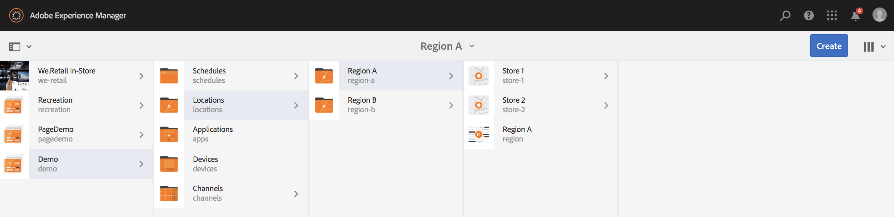
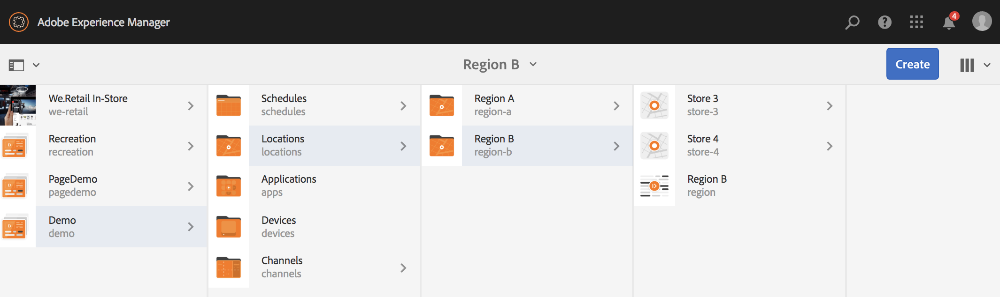

# Uso de uma sequência incorporada dinâmica {#using-dynamic-embedded-sequence}

O uso de Sequências incorporadas dinâmicas abrange os seguintes tópicos:

* **Visão geral**
* **Uso da experiência incorporada dinâmica no AEM Screens**
* **Exibir os resultados**
* **Restrição de usuários e modificação das ACLs**

## Visão geral {#overview}

***As*** Sequências Incorporadas Dinâmicas são criadas para projetos grandes que seguem a hierarquia pai-filho, onde o filho é referenciado dentro de uma pasta de localização e não em uma pasta de canal. Ela permite que o usuário incorpore uma sequência dentro de um canal por ***Função de canal***. Ele permite que o usuário defina espaços reservados específicos da localização para diferentes escritórios usando uma sequência incorporada dentro de um canal principal.

Ao atribuir um canal a uma exibição, você tem a opção de especificar o caminho da exibição ou a função do canal que será resolvida para um canal real por contexto.

Para usar a Sequência dinâmica inserida, atribua um canal por ***Função de canal***. Função do canal define o contexto da exibição. A função é direcionada por várias ações e é independente do canal real que cumpre a função. Esta seção descreve um caso de uso que define canais por função e como você pode aproveitar esse conteúdo para um canal global. Você também pode pensar na função como um identificador para a atribuição ou um alias para o canal no contexto de .

### Benefícios do uso de sequências incorporadas dinâmicas {#benefits-of-using-dynamic-embedded-sequences}

O principal benefício de colocar um canal de sequência dentro de um local em vez da pasta de canais é permitir que autores locais ou regionais editem conteúdo relevante a eles, enquanto são restritos de canais de edição em posições mais altas na hierarquia.

Referenciar um *Canal por função*, permite criar a versão local de um canal, a fim de resolver dinamicamente o conteúdo específico da localização, e também permite criar um canal global que aproveita o conteúdo para os canais específicos da localização.

>[!NOTE]
>
>**Sequências incorporadas versus Sequências incorporadas dinâmicas**
>
>Uma Sequência dinâmica inserida é semelhante a uma sequência incorporada, mas permite que o usuário siga uma hierarquia em que as alterações/atualizações feitas em um canal sejam propagadas para outro relacionado. Ela segue a hierarquia pai/filho e também inclui ativos como imagens ou vídeos.
>
>***As*** Sequências incorporadas dinâmicas permitem exibir conteúdo específico da localização, enquanto as  ***Sequências*** incorporadas exibem apenas a apresentação geral de slides do conteúdo. Além disso, ao configurar as Sequências incorporadas dinâmicas, é necessário configurar o canal usando a função e o nome do canal. Consulte as etapas abaixo para ver a implementação prática.
>
>Para saber mais sobre a implementação de sequências incorporadas, consulte [Sequências incorporadas](embedded-sequences.md) no AEM Screens.

O exemplo a seguir fornece uma solução com foco nos seguintes termos principais:

* um ***canal de sequência principal*** para a sequência global
* ***componentes de*** sequências incorporadas dinâmicas para cada parte da sequência personalizável localmente
* ***os*** canais de sequência individuais nos respectivos locais com uma função  ** na exibição que corresponde à  **função *do componente de sequência incorporada*dinâmica.**

>[!NOTE]
>
>Para saber mais sobre atribuição de canal, consulte **[Atribuição de canal](channel-assignment.md)** na seção Criação na documentação do AEM Screens.

## Uso de uma sequência incorporada dinâmica {#using-dynamic-embedded-sequence-2}

A seção a seguir explica a criação de uma Sequência incorporada dinâmica em um canal AEM Screens.

### Pré-requisitos {#prerequisites}

Antes de começar a implementar essa funcionalidade, verifique se você tem os seguintes pré-requisitos prontos para começar a implementar sequências incorporadas dinâmicas:

* Crie um projeto do AEM Screens (neste exemplo, **Demo**)

* Crie um canal como **Global** na pasta **Canais**

* Adicione conteúdo ao seu canal **Global** (*Verifique **Resources.zip**para obter os ativos relevantes*)

A imagem a seguir mostra o projeto **Demo** com o canal **Global** na pasta **Canais**.

### Recursos {#resources}

Você pode baixar os seguintes recursos (imagens e adicioná-los a ativos) e usá-los ainda mais como conteúdo de canal para fins de demonstração.

[Obter arquivo](assets/resources.zip)

>[!NOTE]
>
>Para obter informações adicionais sobre como criar um projeto e como criar um canal de sequência, consulte os recursos abaixo:
>
>* **[Criação e gerenciamento de projetos](creating-a-screens-project.md)**
>* **[Gerenciamento de um canal](managing-channels.md)**

>

A implementação da sequência incorporada dinâmica em um projeto do AEM Screens envolve três tarefas principais:

1. **Configurar a taxonomia do projeto, incluindo canais, locais e exibições**
1. **Criação de um agendamento**
1. **Atribuir Programação a cada exibição**

Siga as etapas abaixo para implementar a funcionalidade:

>[!CAUTION]
>
>Ao implementar Sequências incorporadas dinâmicas, tenha cuidado com os campos **Nome** e **Título** ao criar canais em cada local. Siga cuidadosamente as instruções de nomenclatura.

1. **Crie duas pastas de locais.**

   Navegue até a pasta **Localizações** no seu projeto do AEM Screens e crie duas pastas de localização como **Região A** e **Região B**.

   >[!NOTE]
   >
   >Ao criar a pasta de localização **Região A**, certifique-se de inserir o **Título** como **Região A** e pode deixar o campo **Nome** vazio, de modo que o nome **region-a** é selecionado automaticamente.
   >
   >Semelhante, é o caso para criar a pasta de localização **Região B**, conforme mostrado abaixo:

   

   >[!NOTE]
   >Para saber como criar uma localização, consulte **[Criação e gerenciamento de localizações](managing-locations.md)**.

1. **Crie dois locais e um canal em cada pasta de localização.**

   1. Navegue até **Demonstração** —> **Localizações** —> **Região A**.
   1. Selecione **Região A** e clique em **+ Criar** na barra de ações.
   1. Selecione **Localização** no assistente com **Título** como **Loja 1**. Da mesma forma, crie outro local no assistente chamado **Loja 2** com **Título** como **Loja 2**. Você pode deixar o campo **Name** vazio ao criar **Store 1** e **Store 2**.
   1. Repita a etapa (b) e agora selecione **Canal de sequência** no assistente. Insira o **Title** como **Região A** e **Nome** como **região** para este canal.

   >[!CAUTION]
   >
   >Certifique-se de que, ao criar o canal **Região A**, digite o **Título** como **Região A** e o **Nome** como **região**.

   

   Da mesma forma, crie duas localizações em **Região B** denominada como **Loja 3** e **Loja 4**. Além disso, crie um **Canal de sequência** com **Título** como **Região B** e **Nome** como **região**.

   >[!CAUTION]
   >
   >Certifique-se de usar o mesmo nome para os canais criados na **Região A** e **Região B** como **região**.

   

1. **Crie Exibições e Canal em cada Local.**

   1. Navegue até **Demo** —> **Localizações** —> **Região A** —> **Loja 1**.
   1. Selecione **Armazenar 1** e clique em **+ Criar** na barra de ações.
   1. Selecione **Exibir** do assistente e crie **Armazenar1Exibição.**
   1. Repita a etapa (b) e, desta vez, selecione **Canal de sequência** no assistente. Insira o **Title** como **Store1Channel** e o **Name** como **store**.

   >[!CAUTION]
   >
   >É importante quando você cria um canal de sequência, o **Title** do canal pode ser o seu requisito, mas o **Name** deve ser o mesmo em todos os canais locais.
   >Neste exemplo, os canais em **Região A** e **Região B** compartilham o mesmo **Nome** como **região** e os canais em **Loja 1**, **Loja 2**, &lt;a1 2/>Loja 3 **e** Loja 4 **compartilham o mesmo** Nome **como** loja **.**

   

   Da mesma forma, crie uma exibição como **Store2Display** e um canal **Store2Channel** em **Store 2** (com o nome como **store**).

   >[!NOTE]
   >Certifique-se de usar o mesmo nome para os canais criados em **Store 1** e **Store 2** como **store**.

   

   Siga as etapas anteriores para criar um canal e exibir em **Loja 3** e **Loja 4** em **Região B**. Novamente, certifique-se de usar o mesmo **Name** como **store** ao criar o canal **Store3Channel** e **Store4Channel** respectivamente.

   A imagem a seguir mostra a exibição e o canal em **Loja 3**.

   

   A imagem a seguir mostra a exibição e o canal em **Store 4**.

   

1. **Adicione conteúdo aos canais em seus respectivos locais.**

   Navegue até **Demo** -> **Localizações** -> **Região A** -> **Região A** e clique em **Editar** na barra de ações. Arraste e solte os ativos que deseja adicionar ao seu canal.

   >[!NOTE]
   >Você pode usar o arquivo ***Resources.zip*** da seção **Resources**, acima, para usar as imagens como ativos para o conteúdo do seu canal.

   

   Da mesma forma, navegue até **Demo** -> **Localizações** -> **Região B** -> **Região B** e clique em **Editar** na barra de ações para arrastar e soltar os ativos no seu canal, conforme mostrado abaixo:

   

   Siga as etapas anteriores e os recursos para adicionar conteúdo aos seguintes canais:

   * **Store1Channel**
   * **Store2Channel**
   * **Store3Channel**
   * **Store4Channel**

1. **Criar um agendamento**

   Navegue e selecione a pasta **Agendamentos** no seu projeto do AEM Screens e clique em **Criar** na barra de ações para criar um novo agendamento.

   A imagem a seguir mostra o **AdSchedule** criado no projeto **Demo**.

   

1. **Atribuir canais a um agendamento**

   1. Navegue até **Demo** —> **Agendamentos** —> **AdSchedule** e clique em **Dashboard** na barra de ações.
   1. Clique em **+ Atribuir canal** a partir do painel **CANAIS ATRIBUÍDOS** para abrir a caixa de diálogo **Atribuição de canal**.
   1. Selecione **Fazer referência ao canal**... por caminho.
   1. Selecione o **Caminho do Canal** como **Demo** —> ***Canais*** —> ***Global***.
   1. Insira a **Função do canal** como **GlobalAdSegment**.
   1. Selecione **Eventos Suportados** como **Carga Inicial**, **Tela Inativa** e **Interação de Utilizador**.
   1. Clique em **Salvar**.

   **Atribuir Canal por Função para Região:**

   1. Clique em **+ Atribuir canal** a partir do painel **CANAIS ATRIBUÍDOS** para abrir a caixa de diálogo **Atribuição de canal**.
   1. Selecione **Fazer referência ao canal**. por nome.
   1. Insira o **Channel Name** como **region***.
   1. Insira o **Channel Role** como **RegionAdSegment**.
   1. Clique em **Salvar**.

   **Atribuir Canal por Função para Loja:**

   1. Clique em **+ Atribuir canal** a partir do painel **CANAIS ATRIBUÍDOS** para abrir a caixa de diálogo **Atribuição de canal**.
   1. Selecione **Fazer referência ao canal**. por nome.
   1. Insira o **Channel Name** como **store**.
   1. Insira o **Channel Role** como **StoreAdSegment**.
   1. Clique em **Salvar**.

   A imagem a seguir mostra os canais atribuídos por caminho e por função.

   

1. **Configuração da Sequência dinâmica inserida no canal global.**

   Navegue até o Canal **Global**, criado inicialmente no projeto **Demo**.

   Clique em **Editar** na ação para abrir o editor.

   

   Arraste e solte dois componentes **Sequência incorporada dinâmica** no editor de canais.

   Abra as propriedades de um dos componentes e insira a **Função de atribuição de canal** como **RegionAdSegment**.

   Da mesma forma, selecione o outro componente e abra as propriedades para inserir a **Função de Atribuição de Canal** como **StoreAdSegment**.

   

1. **Atribuindo Programação a cada Exibição**

   1. Navegue até cada exibição, como **Demo** —> **Localizações** —> **Região A** —>**Loja 1** —>**Loja1Display**.
   1. Clique em **Dashboard** a partir da ação para abrir o painel de visualização.
   1. Clique em **...** no painel **CANAIS ATRIBUÍDOS E AGENDAMENTOS** e clique mais em **+Atribuir agenda**.
   1. Selecione o caminho para o Agendamento (por exemplo, aqui, **Demo** —> **Agendamentos** —>**AdSchedule**).
   1. Clique em **Salvar**.

## Exibir os resultados {#viewing-the-results}

Depois de configurar os canais e exibir, inicie o reprodutor do AEM Screens para exibir o conteúdo.

>[!NOTE]
>
>Para saber mais sobre AEM reprodutor de tela, consulte os seguintes recursos:
>
>* [Downloads do AEM Screens Player](https://download.macromedia.com/screens/)
>* [Trabalhar com o AEM Screens Player](working-with-screens-player.md)

A saída a seguir confirma o conteúdo do canal no player do AEM Screens, dependendo do caminho de exibição.

**Cenário 1**:

Se você atribuir o caminho de exibição como **Demo** —> **Localizações** —> **Região A** —> **Loja 1** —> **Loja1Exibição**, o seguinte conteúdo será exibido no seu reprodutor AEM Screens.

**Cenário 1**:

Se você atribuir o caminho de exibição como **Demo** —> **Localizações** —> **Região B** —> **Loja 3** —> **Loja3Display**, o conteúdo a seguir será exibido no player do AEM Screens.

## Restrição de usuários e modificação das ACLs {#restricting-users-and-modifying-the-acls}

Você pode criar autores globais, regionais ou locais para editar conteúdo relevante a eles, ao mesmo tempo em que é restrito a partir de canais de edição superiores na hierarquia.

Você precisa modificar as ACLs para restringir o acesso dos usuários ao conteúdo com base em sua localização.

### Exemplo de caso de uso {#example-use-case}

O exemplo a seguir permite criar três usuários para o projeto de demonstração acima.

Os privilégios são atribuídos a cada grupo da seguinte maneira:

**Grupos**:

* **Autor global**: Consiste de usuários que têm acesso a todos os locais e canais no  **** Demoproject e têm todas as permissões de leitura, gravação e edição.

* **Autor da região**: Consiste de usuários que têm permissões de leitura, gravação e edição na  **Região** e  **Região B**.

* **Autor da loja**: Consiste de usuários que têm permissões de leitura, gravação e edição somente na  **Loja 1**,  **Loja 2**,  **Loja 3** e  **Loja 4**.

#### Etapas para criar grupos de usuários, usuários e configurar ACLs {#steps-for-creating-user-groups-users-and-setting-up-acls}

>[!NOTE]
Para saber mais detalhadamente como segregar projetos usando ACLs para que cada indivíduo ou equipe gerencie seu próprio projeto, consulte **Configurando ACLs**.

Siga as etapas abaixo para criar grupos, usuários e modificar as ACLs de acordo com as permissões:

1. **Criar grupos**

   1. Navegue até **Adobe Experience Manager**.
   1. Clique em **Ferramentas** —> **Segurança** —> **Grupos**.
   1. Clique em **Criar grupo** e digite **Global-Author** em **ID**.
   1. Clique em **Salvar e fechar**.

   Da mesma forma, crie dois outros grupos, como **Region-Author** e **Store-Author**.

   

1. **Criar usuários e adicionar usuários a grupos**

   1. Navegue até **Adobe Experience Manager**.
   1. Clique em **Ferramentas** —> **Segurança** —> **Usuários**.
   1. Clique em **Criar Usuário** e digite **Usuário Global** em **ID**.
   1. Digite **Password** e confirme a senha deste usuário.
   1. Clique na guia **Groups** e insira o nome do grupo em **Select Group**, por exemplo, digite **Global-Author** para adicionar **Global-User** a esse grupo específico.
   1. Clique em **Salvar e fechar**.

   Da mesma forma, crie dois outros usuários, como **Region-User** e **Store-User**, e adicione-os a **Region-Author** e **Store-Author**, respectivamente.

   >[!NOTE]
É uma prática recomendada adicionar usuários a um grupo e depois atribuir permissões a cada grupo específico de usuários.

   

1. **Adicionar todos os grupos aos colaboradores**

   1. Navegue até **Adobe Experience Manager**.
   1. Clique em **Ferramentas** —> **Segurança** —> **Grupos**.
   1. Selecione **Contributors** na lista e selecione **Membros** na guia.
   1. Selecione o **Grupo** como **Autor Global**, **Autor da Região,** e **Autor da Loja** para contribuidores.
   1. Clique em **Salvar e fechar**.

1. **Acessar permissões para cada grupo**

   1. Navegue até *Useradmin* e use essa interface para modificar as permissões para grupos diferentes.
   1. Procure por **Global-Author** e clique na guia **Permissões**, conforme mostrado na figura abaixo.
   1. Da mesma forma, você pode acessar as permissões para **Region-Author** e **Store-Author**.

   

1. **Modificando permissões para cada grupo**

   **Para autor global:**

   1. Navegue até a guia **Permissões**
   1. Navegue até ***/content/screens/demo*** e verifique todas as permissões
   1. Navegue até ***/content/screens/demo/locations*** e verifique todas as permissões
   1. Navegue até ***/content/screens/demo/locations/region-a*** e verifique todas as permissões. Da mesma forma, verifique as permissões para **region-b**.

   Consulte a figura abaixo para entender as etapas:
   

   A imagem a seguir mostra que agora o **Usuário Global** tem acesso ao **Canal Global** e à **Região A** e **Região B** com todas as quatro lojas, nomeadamente **Loja 1**, **Loja 2&lt;a1 1/>,** Loja 3 **e** Loja 4 **.**

   

   **Para autor de região:**

   1. Navegue até a guia **Permissões** .
   1. Navegue até ***/content/screens/demo*** e verifique somente as permissões **Read**.
   1. Navegue até ***/content/screens/demo/locations*** e verifique somente as permissões **Read**.
   1. Navegue até ***/content/screens/demo/channels*** e desmarque as permissões para o canal **Global**.
   1. Navegue até ***/content/screens/demo/locations***/***region-a*** e verifique todas as permissões. Da mesma forma, verifique as permissões para **region-b**.

   Consulte a figura abaixo para entender as etapas:

   

   A imagem a seguir mostra que agora o Usuário da Região tem acesso a **Região A** e **Região B** com todos os quatro armazenamentos, a saber **Loja 1**, **Loja 2**, **Loja 3** e **Loja 4**, mas não acessa o Canal **Global**.

   

   **Para Autor Da Loja:**

   1. Navegue até a guia **Permissões** .
   1. Navegue até ***/content/screens/demo*** e verifique somente as permissões **Read**.
   1. Navegue até ***/content/screens/demo/locations*** e verifique somente as permissões **Read**.
   1. Navegue até ***/content/screens/demo/channels*** e desmarque as permissões para o canal **Global**.
   1. Navegue até ***/content/screens/demo/locations/region-a*** e verifique somente as permissões **Read**. Da mesma forma, verifique somente as permissões **Read** para **region-b**.
   1. Navegue até ***/content/screens/demo/locations***/***region-a /store-1*** e verifique todas as permissões. Da mesma forma, verifique as permissões para **store-2, store-3,** e **store-4**.

   Consulte a figura abaixo para entender as etapas:

   

   A imagem a seguir mostra que agora o **Store-User** tem acesso somente aos quatro armazenamentos, a saber **Loja 1**, **Loja 2**, **Loja 3** e **Loja 4**, mas não tem permissões para acessar o **Global** ou a região (**Região A** e **Região B**) canais.

   

>[!NOTE]
Para saber mais detalhes sobre como configurar permissões, consulte [Configuração de ACLs](setting-up-acls.md).
