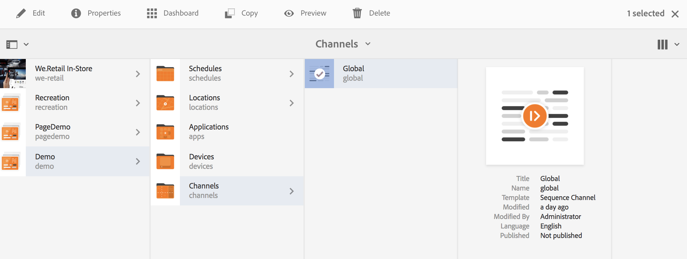

# Uso de sequência incorporada dinâmica {#using-dynamic-embedded-sequence}

O uso de Sequências incorporadas dinâmicas abrange os seguintes tópicos:

* **Visão geral**
* **Uso da experiência dinâmica integrada no AEM Screens**
* **Exibir os resultados**
* **Restringindo Usuários e Modificando as ACLs**

## Visão geral {#overview}

***Sequências incorporadas dinâmicas*** são criados para projetos grandes que seguem a hierarquia pai-filho, em que o filho é referenciado em uma pasta de local e não em uma pasta de canal. Ele permite que o usuário incorpore uma sequência em um canal ao ***Função do canal***. Ele permite que o usuário defina espaços reservados específicos de localização para diferentes escritórios usando uma sequência incorporada dentro de um canal principal.

Ao atribuir um canal a uma exibição, você tem a opção de especificar o caminho da exibição ou a função do canal que é resolvido para um canal real por contexto.

Para usar a Sequência Incorporada Dinâmica, atribua um canal por ***Função do canal***. A Função do canal define o contexto da exibição. A função é direcionada por várias ações e é independente do canal real que desempenha a função. Esta seção descreve um caso de uso que define canais por função e como você pode aplicar esse conteúdo a um canal global. Você também pode considerar a função como um identificador para a atribuição, ou um alias para o canal no contexto do.

### Benefícios do uso de sequências incorporadas dinâmicas {#benefits-of-using-dynamic-embedded-sequences}

O principal benefício de colocar um canal de sequência dentro de um local, em vez da pasta de canais, é permitir que autores locais ou regionais editem conteúdo relevante para eles. Tudo isso, enquanto estiver sendo impedido de editar canais em posições mais altas na hierarquia.

Fazendo referência a um *Canal por função*, permite criar a versão local de um canal para resolver dinamicamente o conteúdo específico do local e também permite criar um canal global que usa o conteúdo dos canais específicos do local.

>[!NOTE]
>
>**Sequências incorporadas versus Sequências incorporadas dinâmicas**
>
>Uma Sequência incorporada dinâmica é semelhante a uma sequência incorporada, mas permite que o usuário siga uma hierarquia em que as alterações/atualizações feitas em um canal são propagadas para outro relacionado. Ela segue a hierarquia pai/filho e também inclui ativos como imagens ou vídeos.
>
>***Sequências incorporadas dinâmicas*** permite exibir conteúdo específico de localização, enquanto ***Sequências incorporadas*** exibir somente a apresentação de slides geral do conteúdo. Além disso, ao configurar as Sequências Incorporadas Dinâmicas, você deve configurar o canal usando a função e o nome do canal. Consulte as etapas abaixo para obter a implementação prática.
>
>Para saber mais sobre como implementar sequências incorporadas, consulte [Sequências incorporadas](embedded-sequences.md) no AEM Screens.

O exemplo a seguir fornece uma solução com foco nos seguintes termos principais:

* a ***canal da sequência principal*** para a sequência global.
* ***sequência incorporada dinâmica*** componentes para cada parte personalizável localmente da sequência.
* ***canais de sequência individuais*** nos respectivos locais com um *função* na exibição que corresponde ao **do componente de sequência incorporada dinâmica *função***.

>[!NOTE]
>
>Para saber mais sobre atribuição de canal, consulte **[Atribuição de canal](channel-assignment.md)** na seção Criação da documentação do AEM Screens.

## Uso de sequência incorporada dinâmica {#using-dynamic-embedded-sequence-2}

A seção a seguir explica a criação de uma Sequência incorporada dinâmica em um canal do AEM Screens.

### Pré-requisitos {#prerequisites}

Antes de começar a implementar essa funcionalidade, verifique se você tem os seguintes pré-requisitos prontos para começar a implementar sequências incorporadas dinâmicas:

* Criar um projeto do AEM Screens (neste exemplo, **Demonstração**).
* Criar um canal como **Global** em **Canais** pasta.
* Adicionar conteúdo ao seu **Global** Canal (*Marcar **Resources.zip**para ativos relevantes*).

A imagem a seguir mostra o **Demonstração** projeto com **Global** entrada de canal **Canais** pasta.

### Recursos {#resources}

Você pode baixar os seguintes recursos (imagens e adicioná-los aos ativos) e usá-los como conteúdo de canal para fins de demonstração.

[Obter arquivo](assets/resources.zip)

>[!NOTE]
>
>Para obter informações adicionais sobre como criar um projeto e criar um canal de sequência, consulte os seguintes recursos:
>
>* **[Criação e gerenciamento de projetos](creating-a-screens-project.md)**
>* **[Gerenciamento de um canal](managing-channels.md)**
>

A implementação da Sequência dinâmica inserida em um projeto AEM Screens envolve três tarefas principais:

1. **Configurando a taxonomia do projeto incluindo canais, locais e exibições**
1. **Criação de uma programação**
1. **Atribuição de programação a cada exibição**

Siga as etapas abaixo para implementar a funcionalidade:

>[!CAUTION]
>
>Ao implementar as Sequências Incorporadas Dinâmicas, tenha cuidado com **Nome** e **Título** ao criar canais em cada local. Siga cuidadosamente as instruções da nomenclatura.

1. **Criar duas pastas de locais.**

   Navegue até o **Localizações** no projeto do AEM Screens e criar duas pastas de local como **Região A** e **Região B**.

   >[!NOTE]
   >
   >Ao criar o **Região A** pasta de local, certifique-se de inserir a variável **Título** as **Região A** e você pode deixar a variável **Nome** campo vazio, então automaticamente **region-a** o nome foi selecionado.
   >
   >Semelhante é o caso para criar a pasta de local **Região B**, conforme mostrado abaixo:

   

   >[!NOTE]
   >Para saber como criar um local, consulte **[Criação e Gerenciamento de Locais](managing-locations.md)**.

1. **Crie dois Locais e um Canal em cada pasta de local.**

   1. Navegue até **Demonstração** > **Localizações** > **Região A**.
   1. Selecionar **Região A** e clique em **+ Criar** na barra de ações.
   1. Selecionar **Localização** do assistente com **Título** as **Loja 1**. Da mesma forma, crie outro local no assistente chamado como **Loja 2** com **Título** as **Loja 2**. Você pode deixar a variável **Nome** campo vazio ao criar **Loja 1** e **Loja 2**.
   1. Repita a etapa (b) e agora selecione **Canal de sequência** do assistente. Insira o **Título** as **Região A** e **Nome** as **região** para este canal.

   >[!CAUTION]
   >
   >Ao criar um canal, verifique se **Região A**, insira o **Título** as **Região A** e a variável **Nome** as **região**.

   

   Da mesma forma, crie dois locais em **Região B** intitulado como **Loja 3** e **Loja 4**. Além disso, crie um **Canal de sequência** com **Título** as **Região B** e **Nome** as **região**.

   >[!CAUTION]
   >
   >Use o mesmo nome para os canais criados no **Região A** e **Região B** as **região**.

   

1. **Crie exibição e canal em cada local.**

   1. Navegue até **Demonstração** > **Localizações** > **Região A** > **Loja 1**.
   1. Selecionar **Loja 1** e clique em **+ Criar** na barra de ações.
   1. Selecionar **Exibir** do assistente e criar **`Store1Display`**.
   1. Repita a etapa (b) e, desta vez, selecione **Canal de sequência** do assistente. Insira o **Título** as **`Store1Channel`** e a variável **Nome** as **loja**.

   >[!CAUTION]
   >
   >É importante que, ao criar um canal de sequência, a variável **Título** do canal pode ser como sua exigência, mas a variável **Nome** deve ser o mesmo em todos os canais locais.
   >Neste exemplo, os canais em **Região A** e **Região B** compartilhar **Nome** as **região** e canais em **`Store 1`**, **`Store 2`**, **`Store 3`**, e **`Store 4`** compartilhar **Nome** as **loja**.

   

   Da mesma forma, crie uma exibição como **`Store2Display`** e um canal **`Store2Channel`** em **`Store `2** (com o nome como **loja**).

   >[!NOTE]
   >Use o mesmo nome para os canais criados no **`Store 1`** e **`Store 2`** as **loja**.

   

   Siga as etapas anteriores para criar um canal e exibir no **`Store 3`** e **`Store 4`** em **Região B**. Novamente, certifique-se de usar o mesmo **Nome** as **loja** ao criar um canal **`Store3Channel`** e **`Store4Channel`** respectivamente.

   A imagem a seguir mostra a exibição e o canal em **`Store 3`**.

   

   A imagem a seguir mostra a exibição e o canal em **`Store 4`**.

   

1. **Adicione conteúdo aos canais em seus respectivos locais.**

   Navegue até a **Demonstração** > **Localizações** > **Região A** > **Região A** e clique em **Editar** na barra de ações. Arraste e solte os ativos que deseja adicionar ao canal.

   >[!NOTE]
   >Você pode usar o ***Resources.zip*** arquivo do **Recursos** acima, para usar as imagens como ativos para o conteúdo do canal.

   

   Da mesma forma, navegue até o **Demonstração** > **Localizações** > **Região B** > **Região B** e clique em **Editar** na barra de ações, para arrastar e soltar os ativos no seu canal, conforme mostrado abaixo:

   

   Siga as etapas e os recursos anteriores para adicionar conteúdo aos seguintes canais:

   * **`Store1Channel`**
   * **`Store2Channel`**
   * **`Store3Channel`**
   * **`Store4Channel`**

1. **Criar um Cronograma**

   Navegar e selecionar **Agendamentos** no seu projeto do AEM Screens. Clique em **Criar** na barra de ações.

   A imagem a seguir mostra o **AdSchedule** criado em **Demonstração** projeto.

   

1. **Atribuir Canais a um Agendamento**

   1. Navegue até **Demonstração** > **Agendamentos** > **AdSchedule** e clique em **Painel** na barra de ações.
   1. Clique em **+ Atribuir canal** de **CANAIS ATRIBUÍDOS** para que você possa abrir o **Atribuição de canal** caixa de diálogo.
   1. Selecionar **Canal de referência** por caminho.
   1. Selecione o **Caminho do canal** as **Demonstração** > ***Canais*** > ***Global***.
   1. Insira o **Função do canal** as **GlobalAdSegment**.
   1. Selecione o **Eventos suportados** as **Carga inicial**, **Tela inativa**, e **Interação do usuário**.
   1. Clique em **Salvar**.

   **Atribuir canal por função para região:**

   1. Clique em **+ Atribuir canal** de **CANAIS ATRIBUÍDOS** painel.
   1. Na caixa de diálogo Atribuição de canal, selecione **Canal de referência** por nome.
   1. Insira o **Nome do canal** as **região***.
   1. Insira o **Função do canal** as **SegmentoAnúncioRegião**.
   1. Clique em **Salvar**.

   **Atribuir canal por função para loja:**

   1. Clique em **+ Atribuir canal** de **CANAIS ATRIBUÍDOS** painel.
   1. Na caixa de diálogo Atribuição de canal, selecione **Canal de referência** por nome.
   1. Insira o **Nome do canal** as **loja**.
   1. Insira o **Função do canal** as **ArmazenarSegmentoAnúncio**.
   1. Clique em **Salvar**.

   A imagem a seguir mostra os canais atribuídos por caminho e por função.

   

1. **Configuração da sequência dinâmica inserida no canal global.**

   Navegue até a **Global** Canal criado inicialmente em **Demonstração** projeto.

   Clique em **Editar** na barra de ações.

   

   No editor, arraste e solte dois **Sequência incorporada dinâmica** componentes no editor de canais.

   Abra as propriedades de um dos componentes e insira o **Função da atribuição do canal** as **SegmentoAnúncioRegião**.

   Da mesma forma, selecione os outros componentes e abra as propriedades para inserir o **Função da atribuição do canal** as **ArmazenarSegmentoAnúncio**.

   

1. **Atribuindo programação a cada exibição**

   1. Navegue até cada exibição, como **Demonstração** > **Localizações** > **Região A** >**Loja 1** >**`Store1Display`**.
   1. Clique em **Painel** na barra de ações.
   1. No painel, clique em **..** do **CANAIS ATRIBUÍDOS E AGENDAMENTOS** e clique em **+Atribuir Calendário**.
   1. Selecione o caminho para a Programação (por exemplo, aqui, **Demonstração** > **Agendamentos** > **AdSchedule**).
   1. Clique em **Salvar**.

## Exibir os resultados {#viewing-the-results}

Quando a configuração dos canais e a exibição estiverem concluídas, inicie o reprodutor do AEM Screens para exibir o conteúdo.

>[!NOTE]
>
>Para saber mais sobre o AEM Screens Player, consulte os seguintes recursos:
>
>* [Baixar o reprodutor do AEM Screens](https://download.macromedia.com/screens/)
>* [Trabalhar com o AEM Screens Player](working-with-screens-player.md)

A saída a seguir confirma o conteúdo do canal no AEM Screens player, dependendo do caminho de exibição.

**Cenário 1**:

Se você atribuir o caminho de exibição como **Demonstração** > **Localizações** > **Região A** > **Loja 1** > **`Store1Display`**, o conteúdo a seguir é exibido no AEM Screens player.

**Cenário 1**:

Se você atribuir o caminho de exibição como **Demonstração** > **Localizações** > **Região B** > **Loja 3** > **`Store3Display`**, o conteúdo a seguir é exibido no AEM Screens player.

## Restringindo Usuários e Modificando as ACLs {#restricting-users-and-modifying-the-acls}

Você pode criar autores globais, regionais ou locais para editar conteúdo relevante para eles, enquanto está sendo impedido de editar canais em posições mais altas na hierarquia.

Edite as ACLs para que você possa restringir o acesso do usuário ao conteúdo com base em sua localização.

### Exemplo de caso de uso {#example-use-case}

O exemplo a seguir permite criar três usuários para o projeto de demonstração acima.

Os privilégios atribuídos a cada grupo são os seguintes:

**Grupos**:

* **Global-Author**: consiste em usuários que têm acesso a todos os locais e canais na **Demonstração** projeto e ter todas as permissões de leitura, gravação e edição.

* **Região-Autor**: consiste em usuários com permissões de leitura, gravação e edição para **Região A** e **Região B**.

* **Autor da loja**: consiste em usuários que têm permissões de leitura, gravação e edição somente para **Loja 1**, **Loja 2**, **Loja 3**, e **Loja 4**.

#### Etapas para criar grupos de usuários, usuários e configurar ACLs {#steps-for-creating-user-groups-users-and-setting-up-acls}

>[!NOTE]
>
>Para saber mais detalhes sobre como segregar projetos usando ACLs para que cada indivíduo ou equipe lide com seu próprio projeto, consulte **Configurando ACLs**.

Siga as etapas abaixo para criar grupos, usuários e modificar as ACLs de acordo com as permissões:

1. **Criar grupos**

   1. Navegue até **Adobe Experience Manager**.
   1. Clique em **Ferramentas** > **Segurança** > **Grupos**.
   1. Clique em **Criar grupo** e insira **Global-Author** in **ID**.
   1. Clique em **Salvar e fechar**.

   Da mesma forma, crie dois outros grupos, como **Região-Autor** e **Autor da loja**.

   

1. **Criar usuários e adicionar usuários aos grupos**

   1. Navegue até **Adobe Experience Manager**.
   1. Clique em **Ferramentas** > **Segurança** > **Usuários**.
   1. Clique em **Criar usuário** e insira **Global-User** in **ID**.
   1. Enter **Senha** e confirme a senha desse usuário.
   1. Clique em **Grupos** e insira o nome do grupo em **Selecionar grupo**, por exemplo, insira **Global-Author** para adicionar **Global-User** a esse grupo específico.
   1. Clique em **Salvar e fechar**.

   Da mesma forma, crie dois outros usuários, como **Região-Usuário** e **Usuário da loja** e adicione-os a **Região-Autor** e **Autor da loja** respectivamente.

   >[!NOTE]
   >É uma prática recomendada adicionar usuários em um grupo e, em seguida, atribuir permissões a cada grupo específico de usuários.

   

1. **Adicionar todos os grupos aos contribuidores**

   1. Navegue até **Adobe Experience Manager**.
   1. Clique em **Ferramentas** > **Segurança** > **Grupos**.
   1. Selecionar **Colaboradores** na lista e selecione **Membros** guia.
   1. Selecione o **Grupo** como **Global-Author**, **Autor da região,** e **Autor da loja** para os colaboradores.
   1. Clique em **Salvar e fechar**.

1. **Acessando permissões para cada grupo**

   1. Navegue até a *Useradmin* e use essa interface para modificar as permissões para grupos diferentes.
   1. Pesquisar por **Global-Author** e clique em **Permissões** conforme mostrado na figura abaixo.
   1. Da mesma forma, você pode acessar as permissões para **Região-Autor** e **Autor da loja**.

   

1. **Modificando permissões para cada grupo**

   **Para Autor Global:**

   1. Navegue até a **Permissões** guia
   1. Navegue até ***/content/screens/demo*** e verifique todas as permissões
   1. Navegue até ***/content/screens/demo/locations*** e verifique todas as permissões
   1. Navegue até ***/content/screens/demo/locations/region-a*** e verifique todas as permissões. Da mesma forma, verifique as permissões para **`region-b`**.

   Consulte a figura a seguir para entender as etapas:
   

   O que se segue mostra que a **Global-User** tem acesso à **Canal global**, e ambos **Região A** e **Região B** com todas as quatro lojas especificamente **Loja 1**, **Loja 2**, **Loja 3**, e **Loja 4**.

   

   **Para Autor Da Região:**

   1. Navegue até a **Permissões** guia.
   1. Navegue até ***/content/screens/demo*** e marque apenas a opção **Ler** permissões.
   1. Navegue até ***/content/screens/demo/locations*** e marque apenas a opção **Ler** permissões.
   1. Navegue até ***/content/screens/demo/channels*** e desmarque as permissões para **Global** canal.
   1. Navegue até ***/content/screens/demo/locations***/***region-a*** e verifique todas as permissões. Da mesma forma, verifique as permissões para **`region-b`**.

   Veja a imagem a seguir para que você possa entender as etapas:

   

   A seguir, é mostrado que o usuário da região tem acesso a **Região A** e **Região B**, com as quatro lojas, ou seja **Loja 1**, **Loja 2**, **Loja 3**, e **Loja 4**, mas não acessa o **Global** Canal.

   

   **Para Store-Author:**

   1. Navegue até a **Permissões** guia.
   1. Navegue até ***/content/screens/demo*** e marque apenas a opção **Ler** permissões.
   1. Navegue até ***/content/screens/demo/locations*** e marque apenas a opção **Ler** permissões.
   1. Navegue até ***/content/screens/demo/channels*** e desmarque as permissões para **Global** canal.
   1. Navegue até ***/content/screens/demo/locations/region-a*** e marque apenas a opção **Ler** permissões. Da mesma forma, marque somente a opção **Ler** permissões para **`region-b`**.
   1. Navegue até ***/content/screens/demo/locations***/***region-a /store-1*** e verifique todas as permissões. Da mesma forma, verifique as permissões para **store-2, store-3,** e **loja-4**.

   Veja a imagem a seguir para que você possa entender as etapas:

   

   O que se segue mostra que a **Usuário da loja** tem acesso somente a **Loja 1**, **Loja 2**, **Loja 3**, e **Loja 4**, mas não tem permissões para acessar o **Global** ou região (**Região A** e **Região B**) canais.

   

>[!NOTE]
>
>Para saber mais detalhes sobre a configuração de permissões, consulte [Configurando ACLs](setting-up-acls.md).
