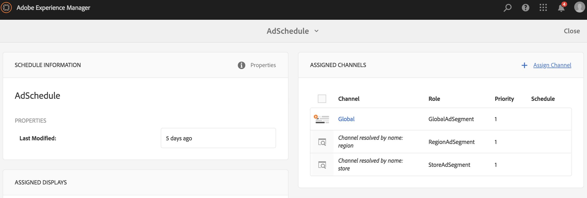

# Uso de uma sequência incorporada dinâmica {#using-dynamic-embedded-sequence}

O uso de sequências incorporadas dinâmicas abrange os seguintes tópicos:

* **Visão geral**
* **Uso da experiência incorporada dinâmica no AEM Screens**
* **Exibição dos resultados**
* **Restrição de usuários e modificação das ACLs**

## Visão geral {#overview}

***As Sequências*** Incorporadas Dinâmicas são criadas para projetos grandes que seguem a hierarquia filho pai, na qual o filho é referenciado dentro de uma pasta de localização e não em uma pasta de canal. It allows the user to embed a sequence inside a channel by ***Channel Role***. Ele permite que o usuário defina espaços reservados específicos de localização para diferentes escritórios usando uma sequência incorporada dentro de um canal principal.

Ao atribuir um canal a uma exibição, você tem a opção de especificar o caminho da exibição ou a função do canal que será resolvida para um canal real por contexto.

Para usar a Sequência Incorporada Dinâmica, atribua um canal por Função ***de*** Canal. A Função do canal define o contexto da exibição. O papel é direcionado por várias ações e é independente do canal real que cumpre o papel. Esta seção descreve um caso de uso que define canais por função e como você pode aproveitar esse conteúdo para um canal global. Você também pode considerar a função como um identificador para a atribuição, ou um alias para o canal no contexto de.

### Benefícios do uso de sequências incorporadas dinâmicas {#benefits-of-using-dynamic-embedded-sequences}

O principal benefício de colocar um canal de sequência dentro de um local em vez da pasta canais é permitir que os autores locais ou regionais editem conteúdo relevante para eles enquanto são restringidos de editar canais mais altos na hierarquia.

Referencing a *Channel By Role*, allows you to create local version of a channel, in order to dynamically resolve location-specific content and also allows you to create a global channel that leverages the content for the location-specific channels.

>[!NOTE]
>
>**Sequências incorporadas versus sequências incorporadas dinâmicas**
>
>Uma Sequência Incorporada Dinâmica é semelhante a uma sequência incorporada, mas permite que o usuário siga uma hierarquia na qual as alterações/atualizações feitas em um canal são propagadas para outro em relação a outro. Ele segue a hierarquia pai-filho e também inclui ativos como imagens ou vídeos.
>
>***Sequências*** incorporadas dinâmicas permitem exibir conteúdo específico do local, enquanto as Sequências ****** incorporadas exibem apenas a apresentação geral de slides do conteúdo. Além disso, ao configurar Sequências incorporadas dinâmicas, é necessário configurar o canal usando a função e o nome do canal. Consulte as etapas abaixo para ver a implementação prática.
>
>Para saber mais sobre como implementar sequências incorporadas, consulte Sequências [incorporadas](embedded-sequences.md) no AEM Screens.

O exemplo a seguir fornece uma solução focando nos seguintes termos principais:

* um canal ***de sequência*** principal para a sequência global
* ***componentes de sequência*** incorporada dinâmica para cada parte localmente personalizável da sequência
* ***canais*** de sequência individuais nos respectivos locais com uma *função* na exibição que corresponde à **função *do componente de sequência incorporado*dinâmico.**

>[!NOTE]
>
>To learn more about channel assignment, see **[Channel Assignment](channel-assignment.md)** under Authoring section in AEM Screens documentation.

## Uso de uma sequência incorporada dinâmica {#using-dynamic-embedded-sequence-2}

A seção a seguir explica a criação de uma sequência incorporada dinâmica em um canal AEM Screens.

### Pré-requisitos {#prerequisites}

Antes de implementar essa funcionalidade no start, verifique se você tem os seguintes pré-requisitos prontos para o start implementando sequências incorporadas dinâmicas:

* Criar um projeto da AEM Screens (neste exemplo, **Demonstração**)

* Criar um canal como **Global** na pasta **Canais**

* Adicionar conteúdo ao seu Canal **Global** (*Verifique **Resources.zip**para obter os ativos* relevantes)

A imagem a seguir mostra o projeto de **demonstração** com o canal **Global** na pasta **Canais** .

### Recursos {#resources}

Você pode baixar os seguintes recursos (imagens e adicioná-los aos ativos) e usá-los ainda mais como conteúdo de canal para fins de demonstração.

[Obter arquivo](assets/resources.zip)

>[!NOTE]
>
>Para obter informações adicionais sobre como criar um projeto e como criar um canal de sequência, consulte os recursos a seguir:
>
>* **[Criação e gerenciamento de projetos](creating-a-screens-project.md)**
>* **[Gerenciar um Canal](managing-channels.md)**

>

A implementação da sequência incorporada dinâmica em um projeto AEM Screens envolve três tarefas principais:

1. **Configuração da taxonomia do projeto incluindo Canais, Locais e Exibições**
1. **Criação de um agendamento**
1. **Atribuindo Programação a cada exibição**

Siga as etapas abaixo para implementar a funcionalidade:

>[!CAUTION]
>
>Ao implementar sequências incorporadas dinâmicas, tenha cuidado com os campos **Nome** e **Título** ao criar canais em cada local. Siga cuidadosamente as instruções de nomenclatura.

1. **Criar duas pastas de locais.**

   Navegue até a pasta **Locais** no seu projeto AEM Screens e crie duas pastas de localização como **Região A** e **Região B**.

   >[!NOTE]
   >
   >Ao criar a pasta de localização **Região A** , certifique-se de inserir o **Título** como **Região A** e pode deixar o campo **Nome** vazio, de modo que o nome **região a** seja selecionado automaticamente.
   >
   >Semelhante, é o caso para a criação da pasta de localização **Região B**, como mostrado abaixo:

   

   >[!NOTE]
   >Para saber como criar um local, consulte **[Criação e gerenciamento de locais](managing-locations.md)**.

1. **Crie dois locais e um Canal em cada pasta de localização.**

   1. Navegue até **Demonstração** —> **Locais** —> **Região A**.
   1. Selecione **Região A** e clique em **+ Criar** na barra de ações.
   1. Selecione **Local** no assistente com **Título** como **Loja 1**. Da mesma forma, crie outro local do assistente intitulado como **Loja 2** com **Título** como **Loja 2**. Você pode deixar o campo **Nome** vazio ao criar a **Loja 1** e a **Loja 2**.
   1. Repita a etapa (b) e, agora, selecione Canal **de** sequência no assistente. Informe o **Título** como **Região A** e **Nome** como **região** para este canal.

   >[!CAUTION]
   >
   >Certifique-se de que ao criar a **Região A** do canal, digite o **Título** como **Região A** e o **Nome** como **região**.

   

   Da mesma forma, crie dois locais na **Região B** intitulados **Loja 3** e **Loja 4**. Além disso, crie um Canal **de** Sequência com **Título** como **Região B** e **Nome** como **região**.

   >[!CAUTION]
   >
   >Certifique-se de que você possa usar o mesmo nome para os canais criados na **Região A** e na **Região B** como **região**.

   

1. **Criar exibição e Canal em cada localização.**

   1. Navegue até **Demonstração** —> **Locais** —> **Região A** —> **Loja 1**.
   1. Selecione **Loja 1** e clique em **+ Criar** na barra de ações.
   1. Selecione **Exibir** no assistente e crie **Store1Display.**
   1. Repita a etapa (b) e, desta vez, selecione Canal **de** sequência no assistente. Informe o **Título** como **Canal** Store1 e o **Nome** como **armazenamento**.

   >[!CAUTION]
   >
   >É importante quando você cria um canal de sequência, o **Título** do canal pode ser o seu requisito, mas o **Nome** deve ser o mesmo em todos os canais locais.
   >Neste exemplo, os canais em **Região A** e **Região B** compartilham o mesmo **Nome** da **região** e canais em **Loja 1************** **** ****, Store 2, Store 3, e na Store 4 compartilham o mesmo Nameasstore.

   

   Da mesma forma, crie uma exibição como **Store2Display** e um canal **Store2Canal** na **Loja 2** (com nome como **loja**).

   >[!NOTE]
   >Certifique-se de usar o mesmo nome para os canais criados na **Loja 1** e na **Loja 2** como **loja**.

   

   Siga as etapas anteriores para criar um canal e exibi-lo na **Loja 3** e na **Loja 4** na **Região B**. Novamente, certifique-se de usar o mesmo **Nome** da **loja** ao criar o Canal **canal** Store3 e o Canal **** Store4, respectivamente.

   A imagem a seguir mostra a exibição e o canal na **Loja 3**.

   

   A imagem a seguir mostra a exibição e o canal na **Loja 4**.

   

1. **Adicione conteúdo aos Canais em seus respectivos locais.**

   Navegue até a **demonstração** -> **Locais** -> **Região A** -> **Região A** e clique em **Editar** na barra de ações. Arraste e solte os ativos que deseja adicionar ao seu canal.

   >[!NOTE]
   >Você pode usar o arquivo ***Resources.zip*** da seção **Resources** , acima, para usar as imagens como ativos para o conteúdo do seu canal.

   

   Da mesma forma, navegue até a **demonstração** -> **Locais** -> **Região B** -> **Região B** e clique em **Editar** na barra de ação para arrastar e soltar os ativos em seu canal, como mostrado abaixo:

   

   Siga as etapas anteriores e os recursos para adicionar conteúdo aos seguintes canais:

   * **Store1Channel**
   * **Store2Channel**
   * **Store3Channel**
   * **Store4Channel**

1. **Criar um agendamento**

   Navegue e selecione a pasta **Programações** no seu projeto AEM Screens e clique em **Criar** na barra de ações para criar um novo agendamento.

   A imagem a seguir mostra o **AdSchedule** criado no projeto de **demonstração** .

   

1. **Atribuir Canais a uma programação**

   1. Navegue até **Demo** —> **Programações** —> **AdSchedule** e clique em **Painel** na barra de ações.
   1. Clique em **+ Atribuir Canal** do painel CANAIS **** ATRIBUÍDOS para abrir a caixa de diálogo Atribuição **de** Canais.
   1. Select **Reference Channel**.. by path.
   1. Selecione Caminho **do** Canal como **Demonstração** —> ***Canais*** —> ***Global***.
   1. Enter the **Channel Role** as **GlobalAdSegment**.
   1. Selecione os Eventos **** suportados como Carregamento **** inicial, Tela **** inativa e Interação **do** usuário.
   1. Clique em **Salvar**.

   **Atribuir Canal por função para a região:**

   1. Clique em **+ Atribuir Canal** do painel CANAIS **** ATRIBUÍDOS para abrir a caixa de diálogo Atribuição **de** Canais.
   1. Selecione Canal **de** referência... por nome.
   1. Insira o Nome **do** Canal como **região***.
   1. Enter the **Channel Role** as **RegionAdSegment**.
   1. Clique em **Salvar**.

   **Atribuir Canal por função para a loja:**

   1. Clique em **+ Atribuir Canal** do painel CANAIS **** ATRIBUÍDOS para abrir a caixa de diálogo Atribuição **de** Canais.
   1. Selecione Canal **de** referência... por nome.
   1. Insira o Nome **do** Canal como **loja**.
   1. Enter the **Channel Role** as **StoreAdSegment**.
   1. Clique em **Salvar**.

   A imagem a seguir mostra os canais atribuídos por caminho e por função.

   

1. **Configuração da sequência incorporada dinâmica para o Canal global.**

   Navegue até o Canal **Global** , que você criou inicialmente no projeto de **demonstração** .

   Click **Edit** from the action to open the editor.

   

   Arraste e solte dois componentes de Sequência **incorporada** dinâmica no editor de canais.

   Abra as propriedades de um dos componentes e insira a Função **de Atribuição do** Canal como **RegionAdSegment**.

   Da mesma forma, selecione o outro componente e abra as propriedades para informar a Função **de Atribuição do** Canal como **StoreAdSegment**.

   

1. **Atribuindo Programação a cada Exibição**

   1. Navegue até cada exibição, como **Demonstração** —> **Locais** —> **Região A** —>**Loja 1** —>**Loja1 Exibição**.
   1. Click **Dashboard** from the action to open the display dashboard.
   1. Clique em **...** no painel CANAIS e agendamentos **** ATRIBUÍDOS e clique em **+Atribuir agendamento**.
   1. Selecione o caminho para Agendamento (por exemplo, aqui, **Demonstração** —> **Agendamentos** —>**AdSchedule**).
   1. Clique em **Salvar**.

## Exibição dos resultados {#viewing-the-results}

Depois que a configuração para canais e a exibição estiver concluída, inicie o AEM Screens player para visualização do conteúdo.

>[!NOTE]
>
>Para saber mais sobre AEM reprodutor de tela, consulte os seguintes recursos:
>
>* [Downloads do AEM Screens player](https://download.macromedia.com/screens/)
>* [Trabalhar com o AEM Screens Player](working-with-screens-player.md)

A saída a seguir confirma o conteúdo do canal no AEM Screens player, dependendo do caminho de exibição.

**Cenário 1**:

Se você atribuir o caminho de exibição como **Demo** —> **Locais** —> **Região A** —> **Loja 1** —> **Loja1Exibição**, o seguinte conteúdo será exibido no seu player AEM Screens.

**Cenário 1**:

Se você atribuir o caminho de exibição como **Demo** —> **Locais** —> **Região B** —> **Loja 3** —> **Loja 3Display**, o seguinte conteúdo será exibido no seu AEM Screens player.

## Restrição de usuários e modificação das ACLs {#restricting-users-and-modifying-the-acls}

Você pode criar autores globais, regionais ou locais para editar o conteúdo relevante para eles, ao mesmo tempo que é restringido de editar canais superiores na hierarquia.

É necessário modificar as ACLs para restringir o acesso dos usuários ao conteúdo com base em sua localização.

### Exemplo de caso de uso {#example-use-case}

O exemplo a seguir permite criar três usuários para o projeto de demonstração acima.

Os privilégios são atribuídos a cada grupo da seguinte forma:

**Grupos**:

* **Autor** global: Consiste de usuários que têm acesso a todos os locais e canais no projeto de **demonstração** e que têm todas as permissões de leitura, gravação e edição.

* **Região-Autor**: Consiste de usuários que têm permissões de leitura, gravação e edição para a **Região A** e a **Região B**.

* **Autor da loja**: Consiste de usuários que têm permissões de leitura, gravação e edição somente para a **Loja 1**, **Loja 2**, **Loja 3** e **Loja 4**.

#### Etapas para criar grupos de usuários, usuários e configurar ACLs {#steps-for-creating-user-groups-users-and-setting-up-acls}

>[!NOTE]
>
>Para saber mais detalhes sobre como separar projetos usando ACLs para que cada indivíduo ou equipe gerencie seu próprio projeto, consulte **Configurando ACLs**.

Siga as etapas abaixo para criar grupos, usuários e modificar as ACLs de acordo com as permissões:

1. **Criar grupos**

   1. Navegue até o **Adobe Experience Manager**.
   1. Click **Tools** --> **Security** --> **Groups**.
   1. Clique em **Criar grupo** e digite **Global-Author** na **ID**.
   1. Clique em **Salvar e fechar**.

   Da mesma forma, crie dois outros grupos, como **Região-Autor** e **Loja-Autor**.

   

1. **Criar usuários e adicionar usuários a grupos**

   1. Navegue até o **Adobe Experience Manager**.
   1. Click **Tools** --> **Security** --> **Users**.
   1. Clique em **Criar usuário** e insira Usuário **** global na **ID**.
   1. Digite a **senha** e confirme a senha para este usuário.
   1. Clique na guia **Grupos** e digite o nome do grupo em **Selecionar grupo**, por exemplo, digite **Global-Author** para adicionar **Global-User** a esse grupo específico.
   1. Clique em **Salvar e fechar**.

   Da mesma forma, crie dois outros usuários, como **Região-Usuário** e **Loja-Usuário** , e adicione-os à **Região-Autor** e **Store-Author** , respectivamente.

   >[!NOTE]
   >É uma prática recomendada adicionar usuários em um grupo e depois atribuir permissões a cada grupo específico de usuários.

   

1. **Adicionar todos os grupos aos contribuidores**

   1. Navegue até o **Adobe Experience Manager**.
   1. Click **Tools** --> **Security** --> **Groups**.
   1. Selecione **Colaboradores** na lista e selecione a guia **Membros** .
   1. Selecione o **Grupo** , como **Global-Author**, **Region-Author,** e **Store-Author** para os contribuidores.
   1. Clique em **Salvar e fechar**.

1. **Acessar permissões para cada grupo**

   1. Navegue até o *Useradmin* e use essa interface para modificar as permissões de grupos diferentes.
   1. Procure **Global-Author** e clique na guia **Permissões** , conforme mostrado na figura abaixo.
   1. Da mesma forma, você pode acessar as permissões para **Região-Autor** e **Store-Author**.

   

1. **Modificando permissões para cada grupo**

   **Para autor global:**

   1. Navigate to the **Permissions** tab
   1. Navegue até ***/content/screens/demo*** e verifique todas as permissões
   1. Navegue até ***/content/screens/demo/localizações*** e verifique todas as permissões
   1. Navegue até ***/content/screens/demo/location/region-a*** e verifique todas as permissões. Da mesma forma, verifique as permissões para **region-b**.

   Consulte a figura abaixo para entender as etapas:
   

   A imagem a seguir mostra que agora o Usuário **** Global tem acesso ao Canal **** Global e à **Região A** e à **Região B** com todas as quatro lojas, a **Loja 1**************, a Loja 2, a Loja 3, e a Loja 4.

   

   **Para Região-Autor:**

   1. Navigate to the **Permissions** tab.
   1. Navegue até ***/content/screens/demo*** e verifique somente as permissões de **Leitura** .
   1. Navegue até ***/content/screens/demo/localizações*** e verifique apenas as permissões de **Leitura** .
   1. Navegue até ***/content/screens/demo/canais*** e desmarque as permissões para o canal **Global** .
   1. Navegue até ***/content/screens/demo/location***/***region-a*** e verifique todas as permissões. Da mesma forma, verifique as permissões para **region-b**.

   Consulte a figura abaixo para entender as etapas:

   

   A imagem a seguir mostra que agora o Usuário da Região tem acesso tanto à **Região A** quanto à **Região B** com todos os quatro lojas, a **Loja 1**, **Loja 2**, **Loja 3****** **** e a CanalStore 4, mas não tem acesso ao  global.

   

   **Para Autor da Loja:**

   1. Navigate to the **Permissions** tab.
   1. Navegue até ***/content/screens/demo*** e verifique somente as permissões de **Leitura** .
   1. Navegue até ***/content/screens/demo/localizações*** e verifique apenas as permissões de **Leitura** .
   1. Navegue até ***/content/screens/demo/canais*** e desmarque as permissões para o canal **Global** .
   1. Navegue até ***/content/screens/demo/location/region-a*** e verifique somente as permissões de **Leitura** . Da mesma forma, verifique apenas as permissões de **Leitura** para **region-b**.
   1. Navegue até ***/content/screens/demo/location***/***region-a /store-1*** e verifique todas as permissões. Da mesma forma, verifique as permissões para **store-2,** store-3 e **store-4**.

   Consulte a figura abaixo para entender as etapas:

   

   A imagem a seguir mostra que agora a **Loja-Usuário** tem acesso apenas aos quatro armazenamentos, a **Loja 1**, **Loja 2**, **Loja 3** e **Loja 4** ******** ****, mas não tem permissões para acessar os canais Global ou Região (Região Ae Região B).

   

>[!NOTE]
>
>Para saber mais detalhes sobre como configurar permissões, consulte [Configurando ACLs](setting-up-acls.md).

