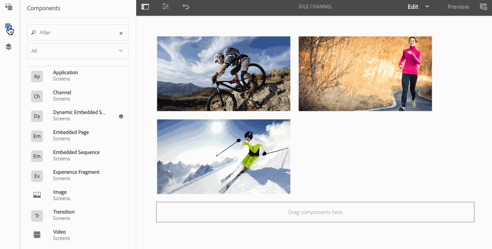

# Sequências incorporadas {#embedded-sequences}

Usar ***Sequências incorporadas***, para canais, permite que o usuário adicione componentes no canal principal e também reutilize o conteúdo de um canal diferente e o incorpore ao canal principal.

## Adicionar sequências incorporadas {#adding-embedded-sequences}

Você tem a opção de adicionar os seguintes componentes ao canal de sequência:

* Sequência incorporada
* Sequência incorporada dinâmica

>[!NOTE]
>
>Para saber mais sobre como usar outros componentes em seu projeto do Screens, consulte [Adicionar componentes a um canal](adding-components-to-a-channel.md).

### Adição de uma sequência incorporada {#adding-an-embedded-sequence}

Você pode adicionar uma sequência incorporada ao canal. Uma sequência incorporada é outro canal que inclui ativos como imagens ou vídeos. A adição de uma sequência incorporada permite que o usuário adicione a sequência a um canal ao ***Caminho do canal***.

>[!NOTE]
>***Caminho do canal*** define uma referência explícita ao canal.
>Para saber mais sobre *Caminho do canal*, consulte [Atribuição de canal](channel-assignment.md) em Criação de telas.

Siga as etapas abaixo para adicionar uma sequência incorporada ao canal:

1. Selecione o canal no qual deseja incorporar uma página. Por exemplo, **`We.Retail`Na loja** > **Canais** > **Canal ocioso**.

1. Selecionar **Editar** na barra de ações.
1. No modo de editor, selecione o ícone componentes na barra lateral esquerda para adicionar a página incorporada. Arraste e solte a **Sequência incorporada** ao editor.
1. Clique duas vezes no ícone **Sequência incorporada** para que possa adicionar o canal ao canal de sequência original.
1. Selecione o **Caminho do canal** do canal.
1. Selecione o **Duração (milissegundos)** para o canal integrado na **Sequência** guia. Por padrão, a duração é definida como **-1**, ou seja, o canal incorporado é totalmente executado. Se o usuário especificar uma duração, a subsequência será interrompida (ou seja, será cortada) no horário especificado.

1. Defina o **Estratégia medida de reprodução** para **normal**.

Por padrão, é definido como **normal**. Definir o valor para **normal** (Reproduzir todos os itens) significa que a subsequência é totalmente executada em cada ciclo da sequência principal. O outro valor possível é **Reproduzir um único item**. Esse valor mostra apenas um item da subsequência em cada execução. Por exemplo, o primeiro item no primeiro loop e o segundo item no segundo loop.

>[!IMPORTANT]
>
>Atribua o canal usado na sequência incorporada à mesma exibição.
>
>Siga as etapas abaixo depois de adicionar uma sequência incorporada ao canal a partir das etapas anteriores:
>
>1. Navegue até a exibição e selecione-a em **Localizações** pasta.
>1. Selecionar **Painel** na barra de ações.
>1. No painel de exibição, selecione **+ Atribuir canais** do **CANAIS ATRIBUÍDOS E PAINÉIS PROGRAMADOS** para que você possa abrir o **Caixa de diálogo Atribuição de canal**.
>
>1. Selecione o caminho do canal no qual você (usado na sequência incorporada) **Caminho do canal**.
>1. Certifique-se de que a variável **Prioridade** é inferior ao canal principal.
>
>1. Não selecionar nenhuma **Eventos suportados**.
>1. Selecionar **Salvar** quando terminar.
>

O exemplo a seguir mostra a adição de uma sequência incorporada (**Canal ocioso - Noite**) para um canal existente (**Canal ocioso**).

### Adicionar uma sequência incorporada dinâmica {#adding-a-dynamic-embedded-sequence}

Você pode adicionar uma sequência incorporada dinâmica ao seu canal. Uma sequência incorporada dinâmica é semelhante a uma sequência incorporada, mas permite que o usuário siga uma hierarquia em que as alterações/atualizações feitas em um canal são propagadas para outro relacionado. Ela segue a hierarquia pai-filho e também inclui ativos como imagens ou vídeos. A adição de uma sequência dinâmica permite que o usuário adicione um canal por função de canal.

>[!NOTE]
>
>***Função do canal*** define a função Canal define o contexto da exibição.
>
>Para saber mais sobre *Função do canal*, consulte [Atribuição de canal](channel-assignment.md) em Criação de telas.

Siga as etapas abaixo para adicionar uma sequência incorporada ao canal:

1. Selecione o canal no qual deseja incorporar uma sequência dinâmica. Por exemplo, **`We.Retail`Na loja** > **Canais** > **Canal ocioso**.

1. Selecionar **Editar** na barra de ações.
1. No modo de editor, selecione o ícone componentes na barra lateral esquerda para adicionar a sequência incorporada dinâmica. Arraste e solte a **Dinâmico** **Sequência incorporada** ao editor.

1. Clique duas vezes no ícone **Dinâmico** **Sequência incorporada** para que possa adicionar a página ao canal de sequência.

1. Insira o **Função da atribuição do canal**.
1. Defina o **Estratégia medida de reprodução** para **normal**. Por padrão, é definido como **normal**. Definir o valor para **normal** (Reproduzir todos os itens) significa que a subsequência é totalmente executada em cada ciclo da sequência principal. O outro valor possível é **Reproduzir um único item**. Esse valor mostra apenas um item da subsequência em cada execução. Por exemplo, o primeiro item no primeiro loop e o segundo item no segundo loop.

1. Selecione o **Duração (milissegundos)** in **Sequência** para o canal incorporado na sequência.

