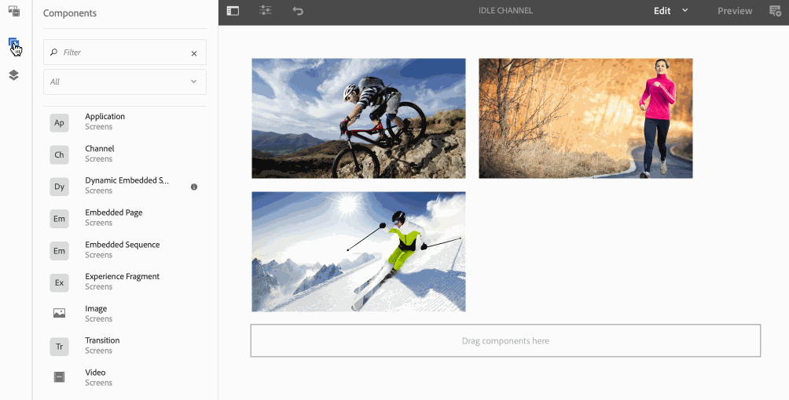
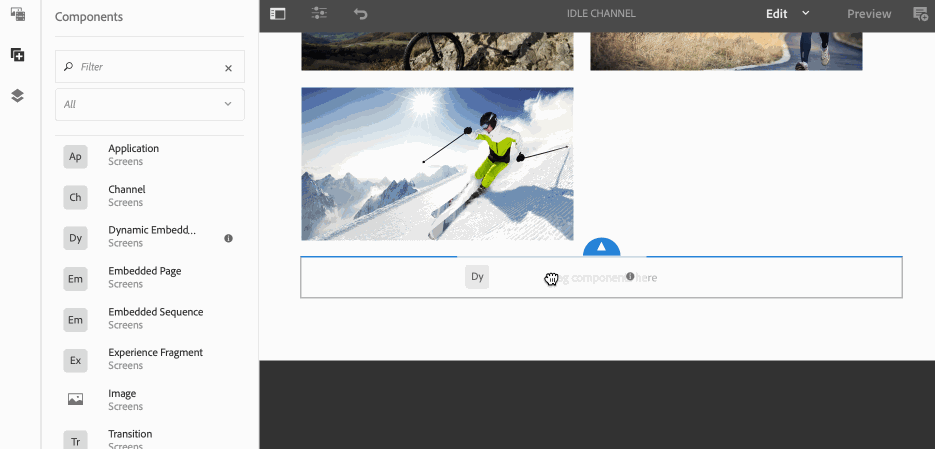

# Sequências incorporadas {#embedded-sequences}

Usar ***Sequências Incorporadas***, para canais, permite que um usuário adicione componentes no canal pai e também para reutilizar o conteúdo de um canal diferente e incorporá-lo ao canal pai.

## Adicionar sequências incorporadas {#adding-embedded-sequences}

Você tem a opção de adicionar os seguintes componentes ao canal de sequência:

* Sequência incorporada
* Sequência incorporada dinâmica

>[!NOTE]
>
>Para saber mais sobre como usar outros componentes no seu projeto do Screens, consulte [Adicionando Componentes a um Canal](adding-components-to-a-channel.md).

### Adição de uma sequência incorporada {#adding-an-embedded-sequence}

Você pode adicionar uma sequência incorporada ao canal. Uma sequência incorporada é outro canal que inclui ativos como imagens ou vídeos. A adição de uma sequência incorporada permite que o usuário adicione a sequência a um canal por ***Caminho de Canal***.

>[!NOTE]
>***Caminho do canal*** define uma referência explícita ao canal.
>Para saber mais sobre o *Caminho do canal*, consulte [Atribuição de canal](channel-assignment.md) em Criação de Screens.

Siga as etapas abaixo para adicionar uma sequência incorporada ao canal:

1. Clique no canal em que deseja incorporar uma página. Por exemplo, **`We.Retail`No Repositório** > **Canais** > **Canal Ocioso**.

1. Clique em **Editar** na barra de ações.
1. No modo de edição, clique no ícone de componentes na barra lateral esquerda para adicionar a página incorporada. Arraste e solte a **Sequência Incorporada** no editor.
1. Clique duas vezes no componente **Sequência Incorporada** para adicionar o canal ao canal de sequência original.
1. Clique no **Caminho do canal** do canal.
1. Clique na **Duração (milissegundos)** do canal inserido na guia **Sequência**. Por padrão, a duração está definida como **-1**, o que significa que o canal inserido é totalmente executado. Se o usuário especificar uma duração, a subsequência será interrompida (ou seja, será cortada) no horário especificado.

1. Defina a **Estratégia de reprodução medida** para **normal**.

Por padrão, está configurado como **normal**. Definir o valor para **normal** (Reproduzir todos os itens) significa que a subsequência é totalmente executada em cada ciclo da sequência pai. O outro valor possível é **Reproduzir um único item**. Esse valor mostra apenas um item da subsequência em cada execução. Por exemplo, o primeiro item no primeiro loop e o segundo item no segundo loop.

>[!IMPORTANT]
>
>Atribua o canal usado na sequência incorporada à mesma exibição.
>
>Siga as etapas abaixo depois de adicionar uma sequência incorporada ao canal a partir das etapas anteriores:
>
>1. Navegue até a exibição e clique na exibição da pasta **Locais**.
>1. Clique em **Painel** na barra de ações.
>1. No painel de exibição, clique em **+ Atribuir Canais** nos **CANAIS ATRIBUÍDOS e PAINÉIS AGENDADOS** para que você possa abrir a **caixa de diálogo Atribuição de canal**.
>
>1. Clique no caminho do canal usado na sequência incorporada, em **Caminho do canal**.
>1. Verifique se a **Prioridade** é inferior ao canal principal.
>
>1. Não clique em nenhum **Evento suportado**.
>1. Clique em **Salvar** ao concluir.
>

O exemplo a seguir mostra a adição de uma sequência incorporada (**Canal Ocioso - Noite**) a um canal existente (**Canal Ocioso**).

### Adicionar uma sequência incorporada dinâmica {#adding-a-dynamic-embedded-sequence}

Você pode adicionar uma sequência incorporada dinâmica ao seu canal. Uma sequência incorporada dinâmica é semelhante a uma sequência incorporada, mas permite que o usuário siga uma hierarquia em que as alterações/atualizações feitas em um canal são propagadas para outro relacionado. Ela segue uma hierarquia pai-filho e também inclui ativos como imagens ou vídeos. A adição de uma sequência dinâmica permite que o usuário adicione um canal por Função de canal.

>[!NOTE]
>
>***Função de Canal*** define o contexto da exibição.
>
>Para saber mais sobre *Função do canal*, consulte [Atribuição de canal](channel-assignment.md) em Criação de Screens.

Siga as etapas abaixo para adicionar uma sequência incorporada ao canal:

1. Clique no canal em que deseja incorporar uma sequência dinâmica. Por exemplo, **`We.Retail`No Repositório** > **Canais** > **Canal Ocioso**.

1. Clique em **Editar** na barra de ações.
1. No modo de edição, clique no ícone de componentes na barra lateral esquerda para adicionar a sequência incorporada dinâmica. Arraste e solte a **Sequência dinâmica** **inserida** no editor.

1. Clique duas vezes no componente de **Sequência dinâmica** **Incorporada** para adicionar a página ao seu canal de sequência.

1. Insira a **Função de atribuição do canal**.
1. Defina a **Estratégia de reprodução medida** para **normal**. Por padrão, está configurado como **normal**. Definir o valor para **normal** (Reproduzir todos os itens) significa que a subsequência é totalmente executada em cada ciclo da sequência pai. O outro valor possível é **Reproduzir um único item**. Esse valor mostra apenas um item da subsequência em cada execução. Por exemplo, o primeiro item no primeiro loop e o segundo item no segundo loop.

1. Clique em **Duração (milissegundos)** na guia **Sequência** do canal inserido na sequência.

