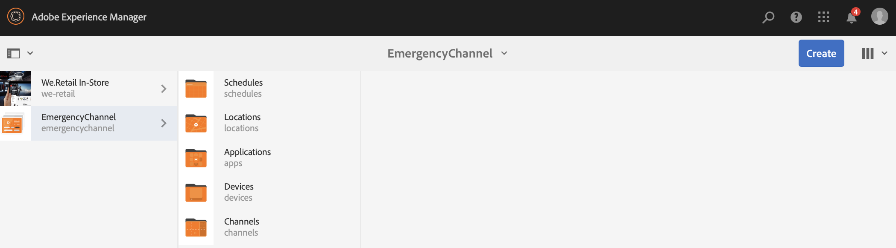

# Canal de emergência {#emergency-channel}

## Descrição do caso de uso {#use-case-description}

Esta seção descreve um exemplo de caso de uso que enfatiza a criação e o gerenciamento de um canal de emergência que o autor do conteúdo pode alternar de um canal de sequência no caso de uma pré-condição.

### Condições prévias {#preconditions}

Antes de iniciar este caso de uso, certifique-se de saber como:

* **[Criar e gerenciar canais](managing-channels.md)**
* **[Criar e gerenciar locais](managing-locations.md)**
* **[Criar e gerenciar programações](managing-schedules.md)**
* **[Registro do dispositivo](device-registration.md)**

### Principais intervenientes {#primary-actors}

Autores de conteúdo

## Fluxo básico: Configuração do projeto {#basic-flow-setting-up-the-project}

Siga as etapas abaixo para configurar um canal de emergência:

1. Crie um projeto do AEM Screens chamado **EmergencyChannel**, conforme mostrado abaixo.

   >[!NOTE]
   >
   >Para saber mais sobre como criar e gerenciar projetos no AEM Screens, consulte Criar um projeto.

   

1. **Criação de um canal de sequência**

   1. Selecione a pasta **Canais** e clique em **Criar** para abrir o assistente para criar um canal.

   1. Selecione **Canal de sequência **no assistente e crie o canal chamado **MainAdChannel**.
   

1. **Adicionar conteúdo ao canal de sequência**

   1. Selecione o canal (**MainAdChannel**).
   1. Clique em **Editar** na barra de ações para abrir o editor. Arraste e solte alguns ativos em seu canal.
   

1. **Criando um canal de emergência**

   1. Selecione a pasta **Canais** .
   1. Clique em **Criar** para abrir o assistente para criar um canal.
   1. Selecione **Canal de sequência **no assistente e crie o canal chamado **EmergencyChannel**.
   >[!NOTE]
   >
   >Normalmente, seu canal de emergência é adicionado ao projeto de produção pré-existente.

   

1. **Adicionar conteúdo ao canal de emergência**

   1. Selecione o canal (Canal **de emergência)**.
   1. Clique em **Editar** na barra de ações para abrir o editor. Arraste e solte o ativo que deseja executar durante uma emergência para o seu canal.
   

1. **Criação de uma localização**

   1. Navegue até a pasta **Locais** .
   1. Clique em **Criar** na barra de ações e crie um local chamado **Loja** do assistente.
   

1. **Criação de exibições em seu local**

   Navegue até seu local (**Loja**) e clique em **Criar** na barra de ações. Siga o assistente para criar dois **vídeos** intitulados como **StoreFront** e **StoreRear**.

   

1. **Criação de um agendamento**

   1. Navegue até a pasta **Programações** .
   1. Clique em **Criar** na barra de ações. Siga o assistente para criar um agendamento chamado **StoreSchedule**.
   

1. Atribua as duas exibições à sua programação e defina as prioridades

   1. Selecione o agendamento** (StoreSchedule)** e clique em **Dashboard** na barra de ações.

   1. Clique em **+ Atribuir canal** no painel **CANAIS ATRIBUÍDOS **CANAIS.

   1. Na caixa de diálogo Atribuição **de** canal:

      1. Selecione o caminho para **MainAdChannel**
      1. Defina a **prioridade** como 2
      1. Set the Supported Events as **Initial Load** and **Idle Screen**.
      1. Clique em **Salvar**
      Da mesma forma, você terá que seguir as mesmas etapas novamente para atribuir o **EmergencyChannel** e definir sua **Prioridade**.
   >[!NOTE]
   >
   >A prioridade é usada para ordenar as atribuições, no caso de várias delas corresponderem aos critérios de reprodução. A atribuição com o valor mais alto sempre terá precedência sobre aquelas com valores mais baixos.

   

1. Clique em **+ Atribuir canal** no painel **CANAIS ATRIBUÍDOS **CANAIS.

1. Na caixa de diálogo Atribuição **de** canal:

   1. Selecione o caminho para **EmergencyChannel**
   1. Defina a **prioridade** como 1

   1. Defina os eventos suportados como carga **** inicial, tela **** inativa e interação **do usuário**

   1. Clique em **Salvar**
   

   Você pode exibir os canais atribuídos no painel **StoreSchedule** .

   

1. **Atribuindo Programação a cada Exibição**

   1. Navegue até cada exibição, como **EmergencyChannel** —&gt; **Locais** —&gt; **Loja **—&gt;**LojaFront**.

   1. Click **Dashboard** from the action to open the display dashboard.
   1. **Clique em**... no painel CANAIS E PROGRAMAS **ATRIBUÍDOS** e clique em **+Atribuir agendamento**.

   1. Selecione o caminho para a Programação (por exemplo, aqui, **EmergencyChannel** —&gt; **Programações** —&gt;**StoreSchedule**).

   1. Clique em **Salvar**.
   Você pode exibir o agendamento atribuído à exibição no painel **StoreSchedule** .
   

1. **Registro do dispositivo**

   Conclua o processo de registro do dispositivo e, uma vez registrado, você visualizará a seguinte saída no player do AEM Screens.

   

## Mudança para Canal de emergência {#switching-to-emergency-channel}

Em caso de emergência, execute as seguintes etapas:

1. Navegue até **EmergencyChannel** —&gt; **Programações** —&gt; **StoreSchedule** e selecione **Dashboard** na barra de ações.

   

1. Selecione **EmergencyChannel** no painel **StoreSchedule** e clique em **Editar atribuição**.

   

1. Atualize a **Prioridade** do **EmergencyChannel** para **3** na caixa de diálogo Atribuição **de** canal e clique em **Salvar**.

   

1. Assim que a prioridade do canal for atualizada, todo o player do AEM Screens exibirá o conteúdo **EmergencyChannel** , como mostrado abaixo.

   

### Conclusão {#conclusion}

O **EmergencyChannel** continuará a exibir seu conteúdo até que o autor do conteúdo redefina o Valor de prioridade para 1.

Assim que o autor do conteúdo receber as instruções de que a emergência foi apagada, ele/ela deverá atualizar a prioridade do **MainAdChannel** que fará com que a reprodução normal seja retomada.
