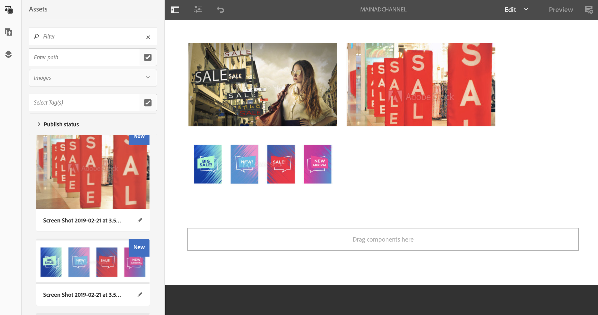

# Canal de emergência {#emergency-channel}

## Descrição do caso de uso {#use-case-description}

Esta seção descreve um exemplo de caso de uso que enfatiza a criação e o gerenciamento de um canal de emergência que o autor de conteúdo pode alternar de um canal de sequência se houver uma pré-condição.

### Pré-condições {#preconditions}

Antes de iniciar este caso de uso, verifique se você sabe como:

* **[Criar e gerenciar canais](managing-channels.md)**
* **[Criar e Gerenciar Locais](managing-locations.md)**
* **[Criar e gerenciar cronogramas](managing-schedules.md)**
* **[Registro do dispositivo](device-registration.md)**

### Atores principais {#primary-actors}

Autores de conteúdo

## Fluxo básico: configuração do projeto {#basic-flow-setting-up-the-project}

Siga as etapas abaixo para configurar um canal de emergência:

1. Crie um projeto do AEM Screens chamado como **EmergencyChannel**, conforme mostrado abaixo.

   >[!NOTE]
   >Para saber mais sobre como criar e gerenciar projetos no AEM Screens, consulte Criação de um projeto.

   

1. **Criação de um canal de sequência**

   1. Clique em **Canais** e clique em **Criar**.

   1. Clique em **Canal de sequência** do assistente e crie o canal chamado de **MainAdChannel**.

   

1. **Adicionar conteúdo ao canal de sequência**

   1. Clique no canal (**MainAdChannel**).
   1. Clique em **Editar** na barra de ações.
   1. Arraste e solte alguns ativos no canal.

   

1. **Criação de um canal de emergência**

   1. Clique em **Canais** pasta.
   1. Clique em **Criar**.
   1. Clique em **Canal de sequência** do assistente e crie o canal chamado de **EmergencyChannel**.

   >[!NOTE]
   >
   >Normalmente, seu canal de emergência é adicionado ao projeto de produção pré-existente.

   

1. **Adicionar conteúdo ao canal de emergência**

   1. Clique no canal (**Canal de emergência)**.
   1. Clique em **Editar** na barra de ações.
   1. Arraste e solte o ativo que deseja executar durante uma emergência no seu canal.

   

1. **Criação de um local**

   1. Navegue até **Localizações** pasta.
   1. Clique em **Criar** na barra de ações e crie um local chamado **Loja** do assistente.

   

1. **Criação de exibições em seu local**

   Navegue até sua localização (**Loja**) e clique em **Criar** na barra de ações. Após o assistente, crie dois **Exibições** intitulado como **StoreFront** e **StoreRear**.

   

1. **Criação de uma programação**

   1. Navegue até o **Agendamentos** pasta.
   1. Clique em **Criar** na barra de ações.
   1. Após o assistente, crie um agendamento chamado **StoreSchedule**.

   

1. Atribua as exibições ao seu cronograma e defina as prioridades

   1. Clique na programação **(StoreSchedule)** e clique em **Painel** na barra de ações.

   1. Clique em **+ Atribuir canal** do **CANAIS ATRIBUÍDOS** painel.

   1. No **Atribuição de canal** caixa de diálogo:

      1. Clique no caminho para a **MainAdChannel**
      1. Defina o **Prioridade** as 2
      1. Defina os Eventos compatíveis como **Carga inicial** e **Tela inativa**.
      1. Clique em **Salvar**

      Da mesma forma, siga as mesmas etapas novamente para atribuir a **EmergencyChannel** e defina seus **Prioridade**.

   >[!NOTE]
   >
   >A prioridade é usada para ordenar as atribuições caso várias correspondam aos critérios de reprodução. Aquele com o valor mais alto sempre tem prioridade sobre valores mais baixos.

   

1. Clique em **+ Atribuir canal** do **CANAIS ATRIBUÍDOS** painel.

1. No **Atribuição de canal** caixa de diálogo:

   1. Clique no caminho para a **EmergencyChannel**
   1. Defina o **Prioridade** as 1

   1. Defina os Eventos compatíveis como **Carga inicial**, **Tela inativa**, e **Interação do usuário**

   1. Clique em **Salvar**

   

   É possível visualizar os canais atribuídos na **StoreSchedule** painel.

   

1. **Atribuindo programação a cada exibição**

   1. Navegue até cada exibição, como **EmergencyChannel** > **Localizações** > **Loja** >**StoreFront**.

   1. Clique em **Painel** na barra de ações.
   1. Clique em **..** do **CANAIS ATRIBUÍDOS E AGENDAMENTOS** e clique em **+Atribuir Calendário**.

   1. Clique no caminho para o Cronograma (por exemplo, aqui, **EmergencyChannel** > **Agendamentos** >**StoreSchedule**).

   1. Clique em **Salvar**.

   Você pode exibir a programação atribuída à exibição na **StoreSchedule** painel.
   

1. **Registro do dispositivo**

   Conclua o processo de registro do dispositivo. Depois de se registrar, é possível exibir a seguinte saída no AEM Screens player.

   

## Alternar para o canal de emergência {#switching-to-emergency-channel}

Se houver uma emergência, execute as seguintes etapas:

1. Navegue até **EmergencyChannel** > **Agendamentos** > **StoreSchedule** e clique em **Painel** na barra de ações.

   

1. Clique em **EmergencyChannel** do **StoreSchedule** e clique em **Editar atribuição**.

   

1. Atualize o **Prioridade** do **EmergencyChannel** para **3** do **Atribuição de canal** e clique em **Salvar**.

   

1. Quando a prioridade do canal é atualizada, todo o reprodutor do AEM Screens exibe o **EmergencyChannel** conteúdo.

   

### Conclusão {#conclusion}

A variável **EmergencyChannel** O continua a exibir seu conteúdo até que o autor de conteúdo redefina o Valor de prioridade como 1.

Quando o autor do conteúdo receber as instruções de que a emergência foi resolvida, ele deverá atualizar a prioridade do **MainAdChannel** o que faz com que a reprodução normal seja retomada.
