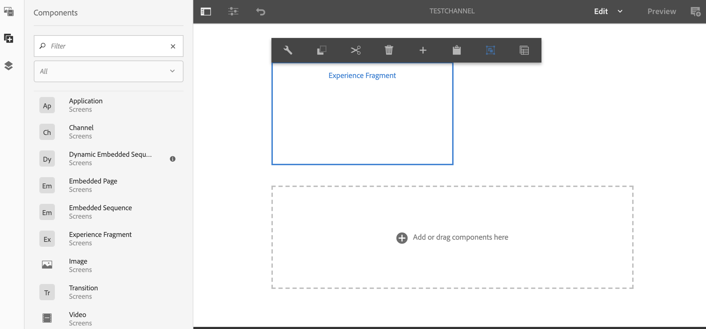

# Uso de Fragmentos de experiência {#using-experience-fragments}

Esta página aborda os seguintes tópicos:

* **Visão geral**
* **Usando Fragmentos de experiência no AEM Screens**
* **Propagar alterações na página**

## Visão geral {#overview}

Um ***Fragmento de experiência*** é um grupo de um ou mais componentes, incluindo o conteúdo e o layout que podem ser referenciados nas páginas. Fragmentos de experiência podem conter qualquer componente, como um ou vários componentes que podem conter qualquer elemento dentro de um sistema de parágrafos, que será referenciado na experiência completa ou solicitado por um terceiro terminal.

## Usando Fragmentos de experiência no AEM Screens {#using-experience-fragments-in-aem-screens}

>[!NOTE]
>O exemplo a seguir usa **We.Retail** como um projeto de demonstração de onde o Fragmento de experiência é aproveitado de uma página **Sites** para um projeto do AEM Screens.

Como exemplo, o fluxo de trabalho a seguir demonstra o uso de fragmentos de experiência do We.Retail em Sites. Você pode escolher uma página da Web e aproveitar esse conteúdo no seu canal AEM Screens em um de seus projetos.

### Pré-requisitos {#pre-requisites}

**Criação de um projeto de demonstração com um canal**

***Criação de um projeto***

1. Clique em **Criar projeto do Screens** para criar um novo projeto.
1. Insira o Título como **DemoProject**.
1. Clique em **Salvar**.

Um **DemoProject** será adicionado ao seu AEM Screens.

***Criação de um canal***

1. Navegue até **DemoProject** criado e selecione a pasta **Canais**.

1. Clique em **Criar** na barra de ações para abrir o assistente.
1. Escolha o modelo **Canal de sequência** no assistente e clique em **Próximo**.

1. Insira o **Title** como **TestChannel** e clique em **Create**.

Um **TestChannel** será adicionado ao **DemoProject**.\

### Criação de um fragmento de experiência {#creating-an-experience-fragment}

Siga as etapas abaixo para aproveitar o conteúdo de **We.Retail** para seu **TestChannel** em **DemoProject**.

1. **Navegue até uma página Sites no We.Retail**

   1. Navegue até Sites e selecione **We.Retail** -> **Estados Unidos** -> **English** -> **Equipment** e selecione esta página para usá-la como um fragmento de experiência para seu canal do Screens.

   1. Clique em **Editar** na barra de ações para abrir a página que deseja usar como um fragmento de experiência para o canal do Screens.

1. **Reutilizar o conteúdo**

   1. Selecione o fragmento que deseja incluir no canal.
   1. Clique no último ícone à direita para abrir a caixa de diálogo **Converter em fragmento de experiência**.

   

1. **Criação de fragmentos de experiência**

   1. Escolha **Action** como **Create a new Experience Fragment**.

   1. Selecione o **Caminho pai**.
   1. Selecione o **Modelo**. Escolha o modelo **Fragmento de experiência - Variação de telas** aqui (valor no campo `/libs/settings/screens/experience-fragments/templates/experience-fragment-template-screens`).

   1. Insira o **Título do fragmento** como **ScreensFragment**.

   1. Clique na marca de seleção para concluir a criação de um novo fragmento de experiência.

   

   Observação: Para selecionar uma opção mais fácil, clique na marca de seleção à direita dos campos para abrir a caixa de diálogo de seleção.

1. **Criação de uma Live Copy do Fragmento de experiência**

   1. Navegue até a página inicial do AEM.
   1. Selecione **Fragmentos de experiência** e destaque o **ScreensFragment** e clique em **Variação como live-copy**, conforme mostrado na figura abaixo:

   

   c. Selecione o **Fragmento do Screens** no assistente Criar Live Copy **e clique em** Próximo **.**

   d. Insira o **Title** e **Name** como **Screens**.

   e. Clique em **Criar** para criar a Live Copy.

   f. Clique em **Concluído** para voltar à página **ScreensFragment**.

   

   >[!NOTE]
   >
   >Depois de criar o fragmento do Screens, você pode editar as propriedades do fragmento. Selecione o fragmento e clique em **Propriedades** na barra de ações.

   **Editar as propriedades de um fragmento do Screens**

   1. Navegue até **ScreensFragment** (você criou nas etapas anteriores) e clique em **Propriedades** na barra de ações.

   1. Selecione a guia **Config offline** , conforme mostrado na figura abaixo.

   Você pode adicionar as **Bibliotecas do lado do cliente** (java e css) e **Arquivos estáticos** ao seu fragmento de experiência.

   O exemplo a seguir mostra a adição das bibliotecas do lado do cliente e das fontes como parte dos arquivos estáticos ao seu fragmento de experiência.  

1. **Uso do fragmento de experiência como um componente no canal do Screens**

   1. Navegue até o canal do Screens, onde deseja usar o fragmento **Screens**.
   1. Selecione o **TestChannel** e clique em **Editar** na barra de ações.

   1. Clique no ícone Componentes na guia lateral .
   1. Arraste e solte o **Fragmento de experiência** no seu canal.

   

   e. Selecione o componente **Fragmento de experiência** e selecione o ícone superior esquerdo (chave) para abrir a caixa de diálogo **Fragmento de experiência**.

   f. Selecione a live copy **Screens** do fragmento que você criou em *Etapa 3* em **Path**.

   

   f. Selecione a live copy **Screens** do fragmento que você criou em *Etapa 3* no **Fragmento de experiência**.

   

   h. Insira os milissegundos em **Duration**.

   i. Selecione a **Configuração offline** na caixa de diálogo **Fragmentos de experiência** para definir as bibliotecas do lado do cliente e os arquivos estáticos.

   >[!NOTE]
   >
   >Se quiser adicionar bibliotecas do lado do cliente ou os arquivos estáticos, além do que você configurou na etapa 4, é possível adicionar a partir da guia **Configuração offline** na caixa de diálogo **Fragmento de experiência**.

   

   j. Clique na marca de seleção para concluir o processo.

### Validando o Resultado {#validating-the-result}

Após concluir as etapas anteriores, você pode validar seu fragmento de experiência em **ChannelOne** ao:

1. Navegando até **TestChannel**.
1. Selecionar o **Visualizar** na barra de ações.

Você visualizará o conteúdo da página **Sites** (live copy do fragmento de experiência) no seu canal, conforme mostrado na figura abaixo:\

## Propagar alterações na página {#propagating-changes-from-the-master-page}

***A Live*** Copy se refere à cópia (da origem), mantida pelas ações de sincronização, conforme definido pelas configurações de implementação.

Desde o Fragmento de experiência, criamos uma live copy das páginas **Sites**, portanto, se você fizer alterações nesse fragmento específico da página principal, exibirá as alterações no seu canal ou no destino onde você usou o Fragmento de experiência.

>[!NOTE]
>
>Para obter mais informações sobre a Live Copy, consulte Reutilizar conteúdo: Gerenciador de vários sites e Live Copy.

Siga as etapas abaixo para propagar as alterações do canal principal para o canal de destino:

1. Selecione o Fragmento de experiência na página **Sites** (principal) e clique no ícone de lápis para editar os itens no Fragmento de experiência.

   

1. Selecione o Fragmento de experiência e clique na chave inglesa para abrir a caixa de diálogo para editar as imagens.

   

1. A caixa de diálogo **Grade de Produto** é aberta.

   

1. Você pode editar qualquer uma das imagens. Por exemplo, aqui a primeira imagem é substituída neste fragmento.

   

1. Selecione o Fragmento de experiência e clique no ícone Implantação para propagar as alterações no fragmento usado em seu canal.

   

1. Clique em Implantação para confirmar as alterações.

   Você verá que as alterações são implementadas.

   

### Validando as alterações {#validating-the-changes}

Siga as etapas abaixo para confirmar as alterações no seu canal:

1. Navegue até **Screens** -> **Canais** -> **TestChannel**.

1. Clique em **Preview** na barra de ações para confirmar as alterações.

A imagem a seguir ilustra as alterações em seu **TestChannel**:\

