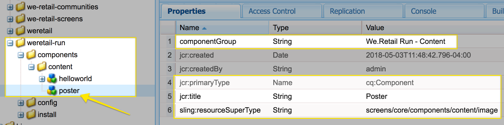
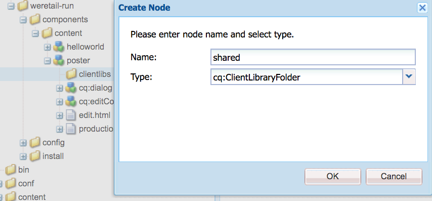

# Extensão de um componente do AEM Screens

O tutorial a seguir aborda as etapas e práticas recomendadas para estender componentes AEM Screens prontos para uso. O componente de Imagem é estendido para adicionar uma sobreposição de texto autorável.

## Visão geral {#overview}

Este tutorial destina-se a desenvolvedores novos no AEM Screens. Neste tutorial, o componente de Imagem do Screens é estendido para criar um componente de Pôster. Um título, descrição e logotipo são sobrepostos sobre uma imagem para criar uma experiência atraente em um canal de sequência.

>[!NOTE]
>
>Antes de iniciar este tutorial, é recomendável concluir o tutorial: [Desenvolvendo um componente personalizado para o AEM Screens](developing-custom-component-tutorial-develop.md).


Um componente `Custom Poster` é criado estendendo-se o componente Imagem.

## Pré-requisitos {#prerequisites}

Para concluir este tutorial, você precisa do seguinte:

1. AEM 6.5 + Pacote de recursos mais recente do Screens
1. [Player do AEM Screens](/help/user-guide/aem-screens-introduction.md)
1. Ambiente de desenvolvimento local

As etapas e capturas de tela do tutorial são executadas usando o CRXDE-Lite. Os IDEs [Eclipse](https://experienceleague.adobe.com/pt-br/docs/experience-manager-65/content/implementing/developing/devtools/aem-eclipse) ou [IntelliJ](https://experienceleague.adobe.com/pt-br/docs/experience-manager-65/content/implementing/developing/devtools/ht-intellij) também podem ser usados para concluir o tutorial. Mais informações sobre como usar um IDE para [desenvolver com o AEM podem ser encontradas aqui](https://experienceleague.adobe.com/pt-br/docs/experience-manager-learn/getting-started-wknd-tutorial-develop/project-archetype/project-setup).

## Configuração do projeto {#project-setup}

O código-fonte de um projeto Screens geralmente é gerenciado como um projeto Maven de vários módulos. Para acelerar o tutorial, um projeto foi pré-gerado usando o [Arquétipo de Projetos AEM 13](https://github.com/adobe/aem-project-archetype). Mais detalhes sobre [a criação de um projeto com o Maven AEM Project Archetype podem ser encontrados aqui](https://experienceleague.adobe.com/pt-br/docs/experience-manager-learn/getting-started-wknd-tutorial-develop/project-archetype/project-setup).

1. Baixe e instale os seguintes pacotes usando o **gerenciamento de pacotes do CRX** `http://localhost:4502/crx/packmgr/index.jsp)r:`

[Obter arquivo](assets/start-poster-screens-weretail-runuiapps-001-snapshot.zip)

   [Obter arquivo](assets/start-poster-screens-weretail-runuicontent-001-snapshot.zip)
   **Opcionalmente,** se estiver trabalhando com o Eclipse ou outro IDE, baixe o pacote de origem abaixo. Implante o projeto em uma instância local do AEM usando o comando Maven:

   **`mvn -PautoInstallPackage clean install`**

   SRC Iniciar Screens `We.Retail` Executar Projeto

[Obter arquivo](assets/start-poster-screens-weretail-run.zip)

1. No **Gerenciador de Pacotes do CRX** `http://localhost:4502/crx/packmgr/index.jsp`, os dois pacotes a seguir estão instalados:

   1. **`screens-weretail-run.ui.content-0.0.1-SNAPSHOT.zip`**
   1. **`screens-weretail-run.ui.apps-0.0.1-SNAPSHOT.zip`**

   

   Pacotes do AEM Screens `We.Retail Run Ui.Apps` e `Ui.Content` instalados por meio do Gerenciador de Pacotes do CRX

## Criar o componente de cartaz {#poster-cmp}

O componente de Pôster estende o componente de imagem pronto para uso do AEM Screens. Um mecanismo de Sling, `sling:resourceSuperType`, é usado para herdar a funcionalidade principal do componente de Imagem sem precisar copiar e colar. Mais informações sobre as noções básicas do [Processamento de Solicitação do Sling podem ser encontradas aqui.](https://experienceleague.adobe.com/pt-br/docs/experience-manager-65/content/implementing/developing/introduction/the-basics)

O componente de Pôster é renderizado em tela cheia no modo de visualização/produção. No modo de edição, é importante renderizar o componente de forma diferente para facilitar a criação do canal de sequência.

1. No **CRXDE-Lite** `http://localhost:4502/crx/de/index.jsp` (ou IDE de escolha) abaixo de `/apps/weretail-run/components/content`crie um `cq:Component` chamado `poster`.

   Adicionar as seguintes propriedades ao componente `poster`:

   ```xml
   <?xml version="1.0" encoding="UTF-8"?>
   <jcr:root xmlns:sling="https://sling.apache.org/jcr/sling/1.0" xmlns:cq="https://www.day.com/jcr/cq/1.0" xmlns:jcr="https://www.jcp.org/jcr/1.0"
       jcr:primaryType="cq:Component"
       jcr:title="Poster"
       sling:resourceSuperType="screens/core/components/content/image"
       componentGroup="We.Retail Run - Content"/>
   ```

   

   Propriedades de /apps/weretail-run/components/content/poster

   Ao definir a propriedade `sling:resourceSuperType` como `screens/core/components/content/image`, o componente Pôster herda efetivamente toda a funcionalidade do componente de Imagem. Nós e arquivos equivalentes encontrados abaixo de `screens/core/components/content/image` podem ser adicionados abaixo do componente `poster` para substituir e estender a funcionalidade.

1. Copie o nó `cq:editConfig` abaixo de `/libs/screens/core/components/content/image`. Cole o `cq:editConfig` abaixo do componente `/apps/weretail-run/components/content/poster`.

   No nó `cq:editConfig/cq:dropTargets/image/parameters`, atualize a propriedade `sling:resourceType` para ser igual a `weretail-run/components/content/poster`.

   

   Representação XML do `cq:editConfig` representado abaixo:

   ```xml
   <?xml version="1.0" encoding="UTF-8"?>
   <jcr:root xmlns:sling="https://sling.apache.org/jcr/sling/1.0" xmlns:cq="https://www.day.com/jcr/cq/1.0" xmlns:jcr="https://www.jcp.org/jcr/1.0" xmlns:nt="https://www.jcp.org/jcr/nt/1.0"
       jcr:primaryType="cq:EditConfig">
       <cq:dropTargets jcr:primaryType="nt:unstructured">
           <image
               jcr:primaryType="cq:DropTargetConfig"
               accept="[image/.*]"
               groups="[media]"
               propertyName="./fileReference">
               <parameters
                   jcr:primaryType="nt:unstructured"
                   sling:resourceType="weretail-run/components/content/poster"
                   imageCrop=""
                   imageMap=""
                   imageRotate=""/>
           </image>
       </cq:dropTargets>
   </jcr:root>
   ```

1. A caixa de diálogo `image` do WCM Foundation a ser usada para o componente `poster`.

   É mais fácil começar com uma caixa de diálogo existente e, em seguida, fazer modificações.

   1. Copiar a caixa de diálogo de: `/libs/wcm/foundation/components/image/cq:dialog`
   1. Colar a caixa de diálogo abaixo de `/apps/weretail-run/components/content/poster`

   

   Caixa de diálogo copiada de `/libs/wcm/foundation/components/image/cq:dialog` para `/apps/weretail-run/components/content/poster`

   O componente `image` do AEM Screens é supertipado para o componente `image` do WCM Foundation. Portanto, o componente `poster` herda a funcionalidade de ambos. A caixa de diálogo do componente de pôster é composta por uma combinação das caixas de diálogo do Screens e do Foundation. Os recursos do **`Sling Resource Merger`** são usados para ocultar campos de caixas de diálogo e guias irrelevantes herdados dos componentes de supertipo.

1. Atualize o `cq:dialog` abaixo de `/apps/weretail-run/components/content/poster` com as seguintes alterações representadas em XML:

   ```xml
   <?xml version="1.0" encoding="UTF-8"?>
   <jcr:root xmlns:sling="https://sling.apache.org/jcr/sling/1.0" xmlns:cq="https://www.day.com/jcr/cq/1.0" xmlns:jcr="https://www.jcp.org/jcr/1.0" xmlns:nt="https://www.jcp.org/jcr/nt/1.0"
       jcr:primaryType="nt:unstructured"
       jcr:title="Poster"
       sling:resourceType="cq/gui/components/authoring/dialog">
       <content
           jcr:primaryType="nt:unstructured"
           sling:resourceType="granite/ui/components/foundation/container">
           <layout
               jcr:primaryType="nt:unstructured"
               sling:resourceType="granite/ui/components/foundation/layouts/tabs"
               type="nav"/>
           <items jcr:primaryType="nt:unstructured">
               <image
                   jcr:primaryType="nt:unstructured"
                   jcr:title="Elements"
                   sling:resourceType="granite/ui/components/foundation/section">
                   <layout
                       jcr:primaryType="nt:unstructured"
                       sling:resourceType="granite/ui/components/foundation/layouts/fixedcolumns"
                       margin="{Boolean}false"/>
                   <items jcr:primaryType="nt:unstructured">
                       <column
                           jcr:primaryType="nt:unstructured"
                           sling:resourceType="granite/ui/components/foundation/container">
                           <items
                               jcr:primaryType="nt:unstructured"
                               sling:hideChildren="[linkURL,size]">
                               <file
                                   jcr:primaryType="nt:unstructured"
                                   sling:resourceType="cq/gui/components/authoring/dialog/fileupload"
                                   autoStart="{Boolean}false"
                                   class="cq-droptarget"
                                   fieldLabel="Image asset"
                                   fileNameParameter="./fileName"
                                   fileReferenceParameter="./fileReference"
                                   mimeTypes="[image]"
                                   multiple="{Boolean}false"
                                   name="./file"
                                   title="Upload Image Asset"
                                   uploadUrl="${suffix.path}"
                                   useHTML5="{Boolean}true"/>
                               <title
                                   jcr:primaryType="nt:unstructured"
                                   sling:resourceType="granite/ui/components/foundation/form/textfield"
                                   fieldLabel="Title"
                                   name="./jcr:title"/>
                               <description
                                   jcr:primaryType="nt:unstructured"
                                   sling:resourceType="granite/ui/components/foundation/form/textarea"
                                   fieldLabel="Description"
                                   name="./jcr:description"/>
                               <position
                                   jcr:primaryType="nt:unstructured"
                                   sling:resourceType="granite/ui/components/coral/foundation/form/click"
                                   fieldLabel="Text Position"
                                   name="./textPosition">
                                   <items jcr:primaryType="nt:unstructured">
                                       <left
                                           jcr:primaryType="nt:unstructured"
                                           text="Left"
                                           value="left"/>
                                       <center
                                           jcr:primaryType="nt:unstructured"
                                           text="Center"
                                           value="center"/>
                                       <right
                                           jcr:primaryType="nt:unstructured"
                                           text="Right"
                                           value="right"/>
                                   </items>
                               </position>
                               <color
                                   jcr:primaryType="nt:unstructured"
                                   sling:resourceType="granite/ui/components/coral/foundation/form/click"
                                   fieldLabel="Text Color"
                                   name="./textColor">
                                   <items jcr:primaryType="nt:unstructured">
                                       <light
                                           jcr:primaryType="nt:unstructured"
                                           text="Light"
                                           value="light"/>
                                       <dark
                                           jcr:primaryType="nt:unstructured"
                                           text="Dark"
                                           value="dark"/>
                                   </items>
                               </color>
                           </items>
                       </column>
                   </items>
               </image>
               <accessibility
                   jcr:primaryType="nt:unstructured"
                   sling:hideResource="{Boolean}true"/>
           </items>
       </content>
   </jcr:root>
   ```

   A propriedade `sling:hideChildren`= `"[linkURL,size]`&quot; é usada no nó `items` para garantir que os campos **linkURL** e **size** estejam ocultos na caixa de diálogo. Não basta remover estes nós da caixa de diálogo do pôster. A propriedade `sling:hideResource="{Boolean}true"` na guia acessibilidade é usada para ocultar a guia inteira.

   Campos de dois cliques são adicionados à caixa de diálogo Posição do texto e Cor do texto para dar aos autores controle sobre a posição do texto e a cor do Título e Descrição.

   

   Pôster - Estrutura final da caixa de diálogo

   Neste ponto, uma instância do componente `poster` pode ser adicionada à página **Canal Ocioso** no `We.Retail` Executar projeto: `http://localhost:4502/editor.html/content/screens/we-retail-run/channels/idle-channel.edit.html`.

   

   Campos da caixa de diálogo do cartaz

1. Criar um arquivo abaixo de `/apps/weretail-run/components/content/poster` chamado `production.html.`

   Preencha o arquivo com o seguinte:

   ```xml
   <!--/*
   
       /apps/weretail-run/components/content/poster/production.html
   
   */-->
   <div data-sly-use.image="image.js"
        data-duration="${properties.duration}"
        class="cmp-poster"
        style="background-image: url(${request.contextPath @ context='uri'}${image.src @ context='uri'});">
       <div class="cmp-poster__text
                   cmp-poster__text--${properties.textPosition @ context='attribute'}
                   cmp-poster__text--${properties.textColor @ context='attribute'}">
           <h1 class="cmp-poster__title">${properties.jcr:title}</h1>
            <h2 class="cmp-poster__description">${properties.jcr:description}</h2>
       </div>
    
   </div>
   ```

   A marcação de produção do componente de Pôster é vista diretamente acima. O script HTL substitui `screens/core/components/content/image/production.html`. O `image.js` é um script do lado do servidor que cria um objeto de imagem do tipo POJO. O objeto Image pode ser chamado para renderizar o `src` como uma imagem de fundo de estilo embutido.

   As marcas `The h1` e h2 são adicionadas para exibir o Título e a Descrição com base nas propriedades do componente: `${properties.jcr:title}` e `${properties.jcr:description}`.

   Ao redor das marcas `h1` e `h2` há um wrapper div com três classes CSS com variações de &quot;`cmp-poster__text`.&quot; O valor das propriedades `textPosition` e `textColor` é usado para alterar a classe CSS renderizada com base na seleção da caixa de diálogo do autor. Na próxima seção, o CSS das bibliotecas de clientes é escrito para ativar essas alterações na exibição.

   Um logotipo também é incluído como uma sobreposição no componente. Neste exemplo, o caminho para o logotipo ` We.Retail` está codificado no DAM. Dependendo do caso de uso, pode fazer mais sentido criar um campo de diálogo para tornar o caminho do logotipo um valor preenchido dinamicamente.

   Observe também que a notação BEM (Block Element Modifier) é usada com o componente. BEM é uma convenção de codificação CSS que facilita a criação de componentes reutilizáveis. BEM é a notação usada pelos [Componentes principais do AEM](https://github.com/adobe/aem-core-wcm-components/wiki/CSS-coding-conventions). <!-- DEAD LINK More info can be found at: [https://getbem.com/](https://getbem.com/) -->

1. Criar um arquivo abaixo de `/apps/weretail-run/components/content/poster` chamado `edit.html.`

   Preencha o arquivo com o seguinte:

   ```xml
   <!--/*
   
       /apps/weretail-run/components/content/poster/edit.html
   
   */-->
   
   <div class="aem-Screens-editWrapper ${image.cssClass} cmp-poster" data-sly-use.image="image.js" data-emptytext="${'Poster' @ i18n, locale=request.locale}">
       
       <div class="cmp-poster__text
              cmp-poster__text--${properties.textPosition @ context='attribute'}
          cmp-poster__text--${properties.textColor @ context='attribute'}">
         <p class="cmp-poster__title">${properties.jcr:title}</p>
         <p class="cmp-poster__description">${properties.jcr:description}</p>
       </div>
   </div>
   ```

   A marcação **editada** para o componente Pôster é vista diretamente acima. O script HTL substitui `/libs/screens/core/components/content/image/edit.html`. A marcação é semelhante à marcação `production.html` e exibe o título e a descrição na parte superior da imagem.

   O `aem-Screens-editWrapper` é adicionado para que o componente não seja renderizado em tela inteira no editor. O atributo `data-emptytext` garante que um espaço reservado seja exibido quando nenhuma imagem ou conteúdo for preenchido.

## Criar bibliotecas do lado do cliente {#clientlibs}

As bibliotecas do lado do cliente fornecem um mecanismo para organizar e gerenciar arquivos CSS e JavaScript necessários para uma implementação do AEM. Mais informações sobre o uso de [Bibliotecas do Lado do Cliente podem ser encontradas aqui.](https://experienceleague.adobe.com/pt-br/docs/experience-manager-65/content/implementing/developing/introduction/clientlibs)

Os componentes do AEM Screens são renderizados de forma diferente no modo Editar versus no modo Pré-visualização/Produção. Dois conjuntos de bibliotecas de clientes são criados, um para o modo Editar e um segundo para Pré-visualização/Produção.

1. Crie uma pasta para bibliotecas do lado do cliente para o componente Pôster.

   Abaixo de `/apps/weretail-run/components/content/poster`, crie uma pasta chamada `clientlibs`.

   

1. Abaixo da pasta `clientlibs`, crie um nó chamado `shared` do tipo `cq:ClientLibraryFolder.`

   

1. Adicione as seguintes propriedades à biblioteca de cliente compartilhada:

   * `allowProxy` | Booleano | `true`
   * `categories` | Cadeia de caracteres[] | `cq.screens.components`

   

   Propriedades de /apps/weretail-run/components/content/poster/clientlibs/shared

   A propriedade `categories` é uma cadeia de caracteres que identifica a biblioteca do cliente. A categoria `cq.screens.components` é usada nos modos Editar e Visualizar/Produção. Portanto, qualquer CSS/JS definido no clientlib `shared` é carregado em todos os modos.

   Como prática recomendada, nunca exponha nenhum caminho diretamente a `/apps` em um ambiente de produção. A propriedade `allowProxy` garante que o CSS e o JS da biblioteca do cliente sejam referenciados por meio de um prefixo `/etc.clientlibs`. Mais informações sobre a propriedade [allowProxy podem ser encontradas aqui.](https://experienceleague.adobe.com/pt-br/docs/experience-manager-65/content/implementing/developing/introduction/clientlibs)

1. Crie o arquivo chamado `css.txt` abaixo da pasta compartilhada.

   Preencha o arquivo com o seguinte:

   ```
   #base=css
   
   styles.less
   ```

1. Crie uma pasta chamada `css` abaixo da pasta `shared`. Adicione um arquivo chamado `style.less` abaixo da pasta `css`. A estrutura das bibliotecas de clientes agora deve ficar assim:

   

   Em vez de escrever CSS diretamente, este tutorial usa MENOS. [LESS](https://lesscss.org/) é um pré-compilador de CSS popular que oferece suporte a variáveis, mixins e funções de CSS. As bibliotecas de clientes do AEM oferecem suporte nativo à compilação LESS. Você pode usar o Sass ou outros pré-compiladores, mas deve compilá-los fora do AEM.

1. Popular `/apps/weretail-run/components/content/poster/clientlibs/shared/css/styles.less` com o seguinte:

   ```css
   /*
    /apps/weretail-run/components/content/poster/clientlibs/shared/css/styles.less
    Poster component - Shared Style
   */
   
   @import url('https://fonts.googleapis.com/css?family=Fjalla+One|Open+Sans:400i');
   
   @text-light-color: #fff;
   @text-dark-color: #000;
   @title-font-family: 'Fjalla One', sans-serif;
   @description-font-family: 'Open Sans', sans-serif;
   
   .cmp-poster {
   
         &__text {
         position: absolute;
         color: @text-light-color;
         top: 0;
         text-align:center;
         width: 100%;
   
         &--left {
          text-align: left;
                margin-left: 1em;
         }
   
         &--right {
          text-align: right;
                margin-right: 1em;
         }
   
         &--dark {
          color: @text-dark-color;
         }
       }
   
       &__title {
         font-weight: bold;
            font-family: @title-font-family;
            font-size: 1.2em;
       }
   
       &__description {
     font-style: italic;
           font-family: @description-font-family;
    }
   
   }
   ```

   >[!NOTE]
   >
   >Google Web Fonts são usados para as famílias de fontes. O Web Fonts exige conectividade com a Internet e nem todas as implementações do AEM Screens têm uma conexão confiável. O planejamento para o modo offline é uma consideração importante para implantações do AEM Screens.

1. Copie a pasta da biblioteca do cliente `shared`. Cole-o como irmão e renomeie-o como `production`.

   

1. Atualize a propriedade `categories` da biblioteca de cliente de produção para `cq.screens.components.production.`

   A categoria `cq.screens.components.production` garante que os estilos só sejam carregados quando estiverem no modo de Pré-visualização/Produção.

   

   Propriedades de /apps/weretail-run/components/content/poster/clientlibs/production

1. Popular `/apps/weretail-run/components/content/poster/clientlibs/production/css/styles.less` com o seguinte:

   ```css
   /*
    /apps/weretail-run/components/content/poster/clientlibs/production/css/styles.less
    Poster component - Production Style
   */
   
   .cmp-poster {
   
       background-size: cover;
    height: 100%;
    width: 100%;
    position:absolute;
   
        &__text {
   
           top: 2em;
   
           &--left {
               width: 40%;
               top: 5em;
           }
   
           &--right {
               width: 40%;
               right: 1em;
           }
       }
   
       &__title {
     font-size: 5rem;
     font-weight: 900;
     margin: 0.1rem;
    }
   
    &__description {
     font-size: 2rem;
     margin: 0.1rem;
     font-weight: 400;
   
    }
   
       &__logo {
     position: absolute;
     max-width: 200px;
     top: 1em;
     left: 0;
    }
   
   }
   ```

   Os estilos acima exibem o Título e a Descrição em uma posição absoluta na tela. O título é exibido maior que a descrição. A notação BEM do componente facilita o escopo cuidadoso dos estilos dentro da classe cmp-poster.

Uma terceira categoria de biblioteca cliente: `cq.screens.components.edit` pode ser usada para adicionar somente Editar estilos específicos ao componente.

| Categoria do Clientlib | Uso |
|---|---|
| `cq.screens.components` | Estilos e scripts compartilhados entre os modos de edição e de produção |
| `cq.screens.components.edit` | Estilos e scripts que são usados somente no modo de edição |
| `cq.screens.components.production` | Estilos e scripts que são usados somente no modo de produção |

## Adicionar componente de Pôster a um canal de sequência {#add-sequence-channel}

O componente de Pôster é usado em um canal de sequência. O pacote inicial deste tutorial incluía um canal ocioso. O canal Ocioso é pré-configurado para permitir componentes do grupo **`We.Retail Run - Content`**. O grupo do componente Pôster está definido como `We.Retail Run - Content` e está disponível para ser adicionado ao canal.

1. Abra o canal Ocioso no `We.Retail` Executar projeto: **`http://localhost:4502/editor.html/content/screens/we-retail-run/channels/idle-channel.edit.html`**
1. Arraste e solte uma nova instância do componente **Pôster** da barra lateral na página.

   

1. Edite a caixa de diálogo do componente Pôster para poder adicionar uma Imagem, Título, Descrição. Use as opções Posição do texto e Cor do texto para garantir que o Título/Descrição seja legível sobre a Imagem.

   

1. Para adicionar alguns componentes de Pôster, repita as etapas acima. Adicione transições entre os componentes.

   

## Tudo junto na prática {#putting-it-all-together}

O vídeo abaixo mostra o componente concluído e como ele pode ser adicionado a um canal de sequência. O canal é então adicionado a uma exibição de Localização e, por fim, atribuído a um reprodutor do Screens.

>[!VIDEO](https://video.tv.adobe.com/v/22414?quaity=9)

## Código concluído {#finished-code}

Abaixo está o código concluído do tutorial. Os **screens-weretail-run.ui.apps-0.0.1-SNAPSHOT.zip** e **screens-weretail-run.ui.content-0.0.1-SNAPSHOT.zip** são os pacotes compilados do AEM. O **SRC-screens-weretail-run-0.0.1.zip** é o código-fonte não compilado que pode ser implantado usando Maven.

[Obter arquivo](assets/final-poster-screens-weretail-runuiapps-001-snapshot.zip)

[Obter arquivo](assets/final-poster-screens-weretail-runuicontent-001-snapshot.zip)

Projeto de Execução SRC AEM Screens Final `We.Retail`

[Obter arquivo](assets/src-screens-weretail-run-001.zip)
