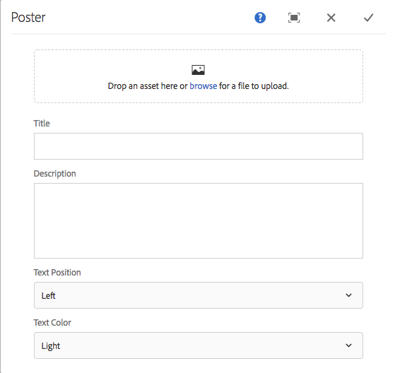

# Extensão de um componente do AEM Screens {#extending-an-aem-screens-component}

O tutorial a seguir apresenta as etapas e práticas recomendadas para a extensão dos componentes prontos para uso do AEM Screens. O componente Imagem é estendido para adicionar uma sobreposição de texto autorável.

## Visão geral {#overview}

Este tutorial é destinado a desenvolvedores novos no AEM Screens. Neste tutorial, o componente Imagem do Screens é estendido para criar um componente de Pôster. Um título, descrição e logotipo são sobrepostos sobre uma imagem para criar uma experiência atraente em um Canal de sequência.

>[!NOTE]
>
>Antes de iniciar este tutorial, é recomendável concluir o tutorial: [Desenvolvimento de um componente personalizado para AEM Screens](developing-custom-component-tutorial-develop.md).


O componente Pôster personalizado é criado estendendo o componente Imagem .

## Pré-requisitos {#prerequisites}

Para concluir este tutorial, é necessário o seguinte:

1. [AEM 6.4](https://docs.adobe.com/content/help/br/experience-manager-64/release-notes/release-notes.html) ou  [AEM 6.3](https://helpx.adobe.com/experience-manager/6-3/release-notes.html) + Pacote de recursos do Screens mais recente
1. [Player do AEM Screens](/help/user-guide/aem-screens-introduction.md)
1. Ambiente de desenvolvimento local

As etapas tutoriais e capturas de tela são executadas usando o CRXDE-Lite. [](https://docs.adobe.com/content/help/en/experience-manager-64/developing/devtools/aem-eclipse.html) O Eclipseor  [](https://docs.adobe.com/content/help/en/experience-manager-64/developing/devtools/ht-intellij.html) IntelliJIDEs também pode ser usado para concluir o tutorial. Mais informações sobre como usar um IDE para [desenvolver com AEM podem ser encontradas aqui](https://docs.adobe.com/content/help/en/experience-manager-learn/getting-started-wknd-tutorial-develop/project-setup.html#eclipse-ide).

## Configuração do projeto {#project-setup}

O código-fonte de um projeto do Screens geralmente é gerenciado como um projeto Maven de vários módulos. Para acelerar o tutorial, um projeto foi pré-gerado usando o [AEM Arquétipo de projeto 13](https://github.com/adobe/aem-project-archetype). Mais detalhes sobre a [criação de um projeto com o Maven AEM Project Archetype podem ser encontrados aqui](https://docs.adobe.com/content/help/en/experience-manager-learn/getting-started-wknd-tutorial-develop/project-setup.html#maven-multimodule).

1. Baixe e instale os seguintes pacotes usando **o pacote CRX manage** `http://localhost:4502/crx/packmgr/index.jsp)r:`

[Obter arquivo](assets/start-poster-screens-weretail-runuiapps-001-snapshot.zip)

   [Obter arquivo](assets/start-poster-screens-weretail-runuicontent-001-snapshot.zip)
   **Como opção,** se estiver trabalhando com o Eclipse ou outro IDE, baixe o pacote de origem abaixo. Implante o projeto em uma instância de AEM local usando o comando Maven:

   **`mvn -PautoInstallPackage clean install`**

   Projeto de execução We.Retail do SRC Start Screens

[Obter arquivo](assets/start-poster-screens-weretail-run.zip)

1. Em **Gerenciador de Pacotes CRX** `http://localhost:4502/crx/packmgr/index.jsp` os dois pacotes a seguir estão instalados:

   1. **screens-weretail-run.ui.content-0.0.1-SNAPSHOT.zip**
   1. **screens-weretail-run.ui.apps-0.0.1-SNAPSHOT.zip**

   

   O Screens Executará os pacotes Ui.Apps e Ui.Content instalados pelo Gerenciador de Pacotes do CRX

## Crie o componente cartaz {#poster-cmp}

O componente Pôster estende o componente Imagem das telas prontas para uso. Um mecanismo do Sling, `sling:resourceSuperType`, é usado para herdar a funcionalidade principal do componente de Imagem sem precisar copiar e colar. Mais informações sobre as noções básicas de [Processamento de Solicitação do Sling podem ser encontradas aqui.](https://helpx.adobe.com/experience-manager/6-5/sites/developing/using/the-basics.html#SlingRequestProcessing)

O componente Poster é renderizado em tela cheia no modo de visualização/produção. No modo de edição, é importante renderizar o componente de forma diferente para facilitar a criação do canal de sequência.

1. Em **CRXDE-Lite** `http://localhost:4502/crx/de/index.jsp` (ou IDE de escolha) abaixo de `/apps/weretail-run/components/content`crie um novo `cq:Component` chamado `poster`.

   Adicione as seguintes propriedades ao componente `poster`:

   ```xml
   <?xml version="1.0" encoding="UTF-8"?>
   <jcr:root xmlns:sling="https://sling.apache.org/jcr/sling/1.0" xmlns:cq="https://www.day.com/jcr/cq/1.0" xmlns:jcr="https://www.jcp.org/jcr/1.0"
       jcr:primaryType="cq:Component"
       jcr:title="Poster"
       sling:resourceSuperType="screens/core/components/content/image"
       componentGroup="We.Retail Run - Content"/>
   ```

   

   Propriedades para /apps/weretail-run/components/content/poster

   Ao definir a propriedade `sling:resourceSuperType`igual a `screens/core/components/content/image`, o componente Pôster herda efetivamente toda a funcionalidade do componente Imagem. Nós e arquivos equivalentes encontrados abaixo de `screens/core/components/content/image` podem ser adicionados abaixo do componente `poster` para substituir e estender a funcionalidade.

1. Copie o nó `cq:editConfig` abaixo de `/libs/screens/core/components/content/image.`Cole o `cq:editConfig` abaixo do componente `/apps/weretail-run/components/content/poster`.

   No nó `cq:editConfig/cq:dropTargets/image/parameters`, atualize a propriedade `sling:resourceType` para igual a `weretail-run/components/content/poster`.

   

   Representação XML da cq:editConfig representada abaixo:

   ```xml
   <?xml version="1.0" encoding="UTF-8"?>
   <jcr:root xmlns:sling="https://sling.apache.org/jcr/sling/1.0" xmlns:cq="https://www.day.com/jcr/cq/1.0" xmlns:jcr="https://www.jcp.org/jcr/1.0" xmlns:nt="https://www.jcp.org/jcr/nt/1.0"
       jcr:primaryType="cq:EditConfig">
       <cq:dropTargets jcr:primaryType="nt:unstructured">
           <image
               jcr:primaryType="cq:DropTargetConfig"
               accept="[image/.*]"
               groups="[media]"
               propertyName="./fileReference">
               <parameters
                   jcr:primaryType="nt:unstructured"
                   sling:resourceType="weretail-run/components/content/poster"
                   imageCrop=""
                   imageMap=""
                   imageRotate=""/>
           </image>
       </cq:dropTargets>
   </jcr:root>
   ```

1. Copie a caixa de diálogo `image` do WCM Foundation a ser usada para o componente `poster`.

   É mais fácil começar com uma caixa de diálogo existente e depois fazer modificações.

   1. Copie a caixa de diálogo de: `/libs/wcm/foundation/components/image/cq:dialog`
   1. Cole a caixa de diálogo abaixo de `/apps/weretail-run/components/content/poster`

   

   Caixa de diálogo copiada de /libs/wcm/foundation/components/image/cq:dialog para /apps/weretail-run/components/content/poster

   O componente `image` do Screens é sobreposto ao componente Base do WCM `image`. Portanto, o componente `poster` herda a funcionalidade de ambos. A caixa de diálogo do componente de pôster é composta por uma combinação das caixas de diálogo Screens e Foundation. Os recursos do **Sling Resource Merger** são usados para ocultar campos de diálogo irrelevantes e guias herdadas dos componentes superdigitados.

1. Atualize a caixa de diálogo cq:debaixo de `/apps/weretail-run/components/content/poster` com as seguintes alterações representadas em XML:

   ```xml
   <?xml version="1.0" encoding="UTF-8"?>
   <jcr:root xmlns:sling="https://sling.apache.org/jcr/sling/1.0" xmlns:cq="https://www.day.com/jcr/cq/1.0" xmlns:jcr="https://www.jcp.org/jcr/1.0" xmlns:nt="https://www.jcp.org/jcr/nt/1.0"
       jcr:primaryType="nt:unstructured"
       jcr:title="Poster"
       sling:resourceType="cq/gui/components/authoring/dialog">
       <content
           jcr:primaryType="nt:unstructured"
           sling:resourceType="granite/ui/components/foundation/container">
           <layout
               jcr:primaryType="nt:unstructured"
               sling:resourceType="granite/ui/components/foundation/layouts/tabs"
               type="nav"/>
           <items jcr:primaryType="nt:unstructured">
               <image
                   jcr:primaryType="nt:unstructured"
                   jcr:title="Elements"
                   sling:resourceType="granite/ui/components/foundation/section">
                   <layout
                       jcr:primaryType="nt:unstructured"
                       sling:resourceType="granite/ui/components/foundation/layouts/fixedcolumns"
                       margin="{Boolean}false"/>
                   <items jcr:primaryType="nt:unstructured">
                       <column
                           jcr:primaryType="nt:unstructured"
                           sling:resourceType="granite/ui/components/foundation/container">
                           <items
                               jcr:primaryType="nt:unstructured"
                               sling:hideChildren="[linkURL,size]">
                               <file
                                   jcr:primaryType="nt:unstructured"
                                   sling:resourceType="cq/gui/components/authoring/dialog/fileupload"
                                   autoStart="{Boolean}false"
                                   class="cq-droptarget"
                                   fieldLabel="Image asset"
                                   fileNameParameter="./fileName"
                                   fileReferenceParameter="./fileReference"
                                   mimeTypes="[image]"
                                   multiple="{Boolean}false"
                                   name="./file"
                                   title="Upload Image Asset"
                                   uploadUrl="${suffix.path}"
                                   useHTML5="{Boolean}true"/>
                               <title
                                   jcr:primaryType="nt:unstructured"
                                   sling:resourceType="granite/ui/components/foundation/form/textfield"
                                   fieldLabel="Title"
                                   name="./jcr:title"/>
                               <description
                                   jcr:primaryType="nt:unstructured"
                                   sling:resourceType="granite/ui/components/foundation/form/textarea"
                                   fieldLabel="Description"
                                   name="./jcr:description"/>
                               <position
                                   jcr:primaryType="nt:unstructured"
                                   sling:resourceType="granite/ui/components/coral/foundation/form/select"
                                   fieldLabel="Text Position"
                                   name="./textPosition">
                                   <items jcr:primaryType="nt:unstructured">
                                       <left
                                           jcr:primaryType="nt:unstructured"
                                           text="Left"
                                           value="left"/>
                                       <center
                                           jcr:primaryType="nt:unstructured"
                                           text="Center"
                                           value="center"/>
                                       <right
                                           jcr:primaryType="nt:unstructured"
                                           text="Right"
                                           value="right"/>
                                   </items>
                               </position>
                               <color
                                   jcr:primaryType="nt:unstructured"
                                   sling:resourceType="granite/ui/components/coral/foundation/form/select"
                                   fieldLabel="Text Color"
                                   name="./textColor">
                                   <items jcr:primaryType="nt:unstructured">
                                       <light
                                           jcr:primaryType="nt:unstructured"
                                           text="Light"
                                           value="light"/>
                                       <dark
                                           jcr:primaryType="nt:unstructured"
                                           text="Dark"
                                           value="dark"/>
                                   </items>
                               </color>
                           </items>
                       </column>
                   </items>
               </image>
               <accessibility
                   jcr:primaryType="nt:unstructured"
                   sling:hideResource="{Boolean}true"/>
           </items>
       </content>
   </jcr:root>
   ```

   A propriedade `sling:hideChildren`= `"[linkURL,size]`&quot; é usada no nó `items` para garantir que os campos **linkURL** e **size** fiquem ocultos na caixa de diálogo. Remover esses nós da caixa de diálogo do pôster não é suficiente. A propriedade `sling:hideResource="{Boolean}true"` na guia acessibilidade é usada para ocultar a guia inteira.

   Dois campos selecionados são adicionados à caixa de diálogo para fornecer aos autores controle sobre a posição do texto e a cor do Título e da Descrição.

   

   Cartaz - Estrutura de Diálogo Final

   Neste ponto, uma instância do componente `poster` pode ser adicionada à página **Canal ocioso** no projeto Execução We.Retail: `http://localhost:4502/editor.html/content/screens/we-retail-run/channels/idle-channel.edit.html`.

   

   Campos da caixa de diálogo de pôster

1. Crie um arquivo sob `/apps/weretail-run/components/content/poster` chamado `production.html.`

   Preencha o arquivo com o seguinte:

   ```xml
   <!--/*
   
       /apps/weretail-run/components/content/poster/production.html
   
   */-->
   <div data-sly-use.image="image.js"
        data-duration="${properties.duration}"
        class="cmp-poster"
        style="background-image: url(${request.contextPath @ context='uri'}${image.src @ context='uri'});">
       <div class="cmp-poster__text
                   cmp-poster__text--${properties.textPosition @ context='attribute'}
                   cmp-poster__text--${properties.textColor @ context='attribute'}">
           <h1 class="cmp-poster__title">${properties.jcr:title}</h1>
            <h2 class="cmp-poster__description">${properties.jcr:description}</h2>
       </div>
    
   </div>
   ```

   Acima está a marcação de produção do Componente de cartaz. O script HTL substitui `screens/core/components/content/image/production.html`. O `image.js` é um script do lado do servidor que cria um objeto de imagem semelhante a POJO. O objeto Image pode ser chamado para renderizar o `src` como uma imagem de fundo de estilo embutido.

   `The h1` As tags h2 e exibem o Título e a Descrição com base nas propriedades do componente:  `${properties.jcr:title}` e  `${properties.jcr:description}`.

   Ao redor das tags `h1` e `h2` há um invólucro div com três classes CSS com variações de &quot; `cmp-poster__text`&quot;. O valor das propriedades `textPosition` e `textColor` é usado para alterar a classe CSS renderizada com base na seleção da caixa de diálogo do autor. Na próxima seção, o CSS das bibliotecas de clientes é gravado para ativar essas alterações na exibição.

   Um logotipo também é incluído como uma sobreposição no componente. Neste exemplo, o caminho para o logotipo We.Retail é codificado no DAM. Dependendo do caso de uso, pode fazer mais sentido criar um novo campo de diálogo para tornar o caminho do logotipo um valor preenchido dinamicamente.

   Observe também que a notação BEM (Bloquear modificador de elemento) é usada com o componente. O BEM é uma convenção de codificação de CSS que facilita a criação de componentes reutilizáveis. BEM é a notação usada por [AEM Componentes principais](https://github.com/Adobe-Marketing-Cloud/aem-core-wcm-components/wiki/CSS-coding-conventions). Mais informações podem ser encontradas em: [https://getbem.com/](https://getbem.com/)

1. Crie um arquivo sob `/apps/weretail-run/components/content/poster` chamado `edit.html.`

   Preencha o arquivo com o seguinte:

   ```xml
   <!--/*
   
       /apps/weretail-run/components/content/poster/edit.html
   
   */-->
   
   <div class="aem-Screens-editWrapper ${image.cssClass} cmp-poster" data-sly-use.image="image.js" data-emptytext="${'Poster' @ i18n, locale=request.locale}">
       
       <div class="cmp-poster__text
              cmp-poster__text--${properties.textPosition @ context='attribute'}
          cmp-poster__text--${properties.textColor @ context='attribute'}">
         <p class="cmp-poster__title">${properties.jcr:title}</p>
         <p class="cmp-poster__description">${properties.jcr:description}</p>
       </div>
   </div>
   ```

   Acima está a marcação **edit** para o Componente de Pôster. O script HTL substitui `/libs/screens/core/components/content/image/edit.html`. A marcação é semelhante à marcação `production.html` e exibirá o título e a descrição na parte superior da imagem.

   O `aem-Screens-editWrapper`é adicionado para que o componente não renderize a tela cheia no editor. O atributo `data-emptytext` garante que o espaço reservado seja exibido quando nenhuma imagem ou conteúdo for preenchido.

## Criar bibliotecas do lado do cliente {#clientlibs}

As bibliotecas do lado do cliente fornecem um mecanismo para organizar e gerenciar arquivos CSS e JavaScript necessários para uma implementação de AEM. Mais informações sobre o uso de [Bibliotecas do lado do cliente podem ser encontradas aqui.](https://helpx.adobe.com/experience-manager/6-5/sites/developing/using/clientlibs.html)

Os componentes do AEM Screens são renderizados de forma diferente no modo de Edição e no modo de Visualização/Produção. Dois conjuntos de bibliotecas de clientes são criados, um para o modo de Edição e um segundo para Visualização/Produção.

1. Crie uma pasta para bibliotecas do lado do cliente para o componente Pôster.

   Abaixo de `/apps/weretail-run/components/content/poster,`crie uma nova pasta chamada `clientlibs`.

   

1. Abaixo da pasta `clientlibs` crie um novo nó chamado `shared` do tipo `cq:ClientLibraryFolder.`

   

1. Adicione as seguintes propriedades à biblioteca do cliente compartilhada:

   * `allowProxy` | Booleano | `true`
   * `categories` | String[] |  `cq.screens.components`

   

   Propriedades para /apps/weretail-run/components/content/poster/clientlibs/shared

   A propriedade `categories` é uma string que identifica a biblioteca do cliente. A categoria `cq.screens.components` é usada no modo Editar e Visualizar/Produção. Portanto, qualquer CSS/JS definido na clientlib `shared` é carregado em todos os modos.

   É uma prática recomendada nunca expor nenhum caminho diretamente para /apps em um ambiente de produção. A propriedade `allowProxy` garante que o CSS e o JS da biblioteca do cliente sejam referenciados por meio de um prefixo `/etc.clientlibs`. Mais informações sobre a propriedade [allowProxy podem ser encontradas aqui.](https://helpx.adobe.com/experience-manager/6-5/sites/developing/using/clientlibs.html#main-pars_title_8ced)

1. Crie o arquivo com o nome `css.txt` abaixo da pasta compartilhada.

   Preencha o arquivo com o seguinte:

   ```
   #base=css
   
   styles.less
   ```

1. Crie uma pasta chamada `css` abaixo da pasta `shared`. Adicione um arquivo com o nome `style.less` abaixo da pasta `css`. A estrutura das bibliotecas de clientes agora deve ser semelhante a esta:

   

   Em vez de escrever CSS diretamente, este tutorial usa MENOS. [](https://lesscss.org/) O LESS é um popular pré-compilador de CSS compatível com variáveis, mixins e funções de CSS. AEM bibliotecas de clientes oferecem suporte nativo a menos compilação. É possível utilizar software ou outros pré-compiladores, mas é necessário compilá-los fora do AEM.

1. Preencha `/apps/weretail-run/components/content/poster/clientlibs/shared/css/styles.less` com o seguinte:

   ```css
   /*
    /apps/weretail-run/components/content/poster/clientlibs/shared/css/styles.less
    Poster Component - Shared Style
   */
   
   @import url('https://fonts.googleapis.com/css?family=Fjalla+One|Open+Sans:400i');
   
   @text-light-color: #fff;
   @text-dark-color: #000;
   @title-font-family: 'Fjalla One', sans-serif;
   @description-font-family: 'Open Sans', sans-serif;
   
   .cmp-poster {
   
         &__text {
         position: absolute;
         color: @text-light-color;
         top: 0;
         text-align:center;
         width: 100%;
   
         &--left {
          text-align: left;
                margin-left: 1em;
         }
   
         &--right {
          text-align: right;
                margin-right: 1em;
         }
   
         &--dark {
          color: @text-dark-color;
         }
       }
   
       &__title {
         font-weight: bold;
            font-family: @title-font-family;
            font-size: 1.2em;
       }
   
       &__description {
     font-style: italic;
           font-family: @description-font-family;
    }
   
   }
   ```

   >[!NOTE]
   >
   >As fontes da Web do Google são usadas para as famílias de fontes. As fontes da Web exigem conectividade com a Internet e nem todas as implementações de telas terão uma conexão confiável. O planejamento para o modo offline é uma consideração importante para as implantações do Screens.

1. Copie a pasta `shared` da biblioteca do cliente. Cole-o como um irmão e renomeie-o para `production`.

   

1. Atualize a propriedade `categories` da biblioteca de clientes de produção para ser `cq.screens.components.production.`

   A categoria `cq.screens.components.production` garante que os estilos só sejam carregados no modo Visualização/Produção.

   

   Propriedades para /apps/weretail-run/components/content/poster/clientlibs/production

1. Preencha `/apps/weretail-run/components/content/poster/clientlibs/production/css/styles.less` com o seguinte:

   ```css
   /*
    /apps/weretail-run/components/content/poster/clientlibs/production/css/styles.less
    Poster Component - Production Style
   */
   
   .cmp-poster {
   
       background-size: cover;
    height: 100%;
    width: 100%;
    position:absolute;
   
        &__text {
   
           top: 2em;
   
           &--left {
               width: 40%;
               top: 5em;
           }
   
           &--right {
               width: 40%;
               right: 1em;
           }
       }
   
       &__title {
     font-size: 5rem;
     font-weight: 900;
     margin: 0.1rem;
    }
   
    &__description {
     font-size: 2rem;
     margin: 0.1rem;
     font-weight: 400;
   
    }
   
       &__logo {
     position: absolute;
     max-width: 200px;
     top: 1em;
     left: 0;
    }
   
   }
   ```

   Os estilos acima exibem o Título e a Descrição em uma posição absoluta na tela. O título será exibido significativamente maior que a descrição. A notação BEM do componente facilita o escopo cuidadoso dos estilos dentro da classe cmp-poster.

Uma terceira categoria de biblioteca de clientes: `cq.screens.components.edit` pode ser usado para adicionar Editar somente estilos específicos ao componente.

| Categoria Clientlib | Uso |
|---|---|
| `cq.screens.components` | Estilos e scripts compartilhados entre os modos de edição e produção |
| `cq.screens.components.edit` | Estilos e scripts que são usados apenas no modo de edição |
| `cq.screens.components.production` | Estilos e scripts que são usados apenas no modo de produção |

## Adicionar componente de cartaz a um canal de sequência {#add-sequence-channel}

O componente Pôster deve ser usado em um Canal de sequência. O pacote inicial deste tutorial incluía um Canal ocioso. O Canal ocioso é pré-configurado para permitir componentes do grupo **Execução We.Retail - Content**. O grupo do componente Pôster é definido como `We.Retail Run - Content` e está disponível para ser adicionado ao canal.

1. Abra o Canal ocioso do projeto We.Retail Run : **`http://localhost:4502/editor.html/content/screens/we-retail-run/channels/idle-channel.edit.html`**
1. Arraste e solte uma nova instância do componente **Pôster** da barra lateral na página.

   

1. Edite a caixa de diálogo do componente Pôster para adicionar uma Imagem, Título, Descrição. Use as opções Posição do texto e Cor do texto para garantir que o Título/Descrição possa ser lido sobre a Imagem.

   

1. Repita as etapas acima para adicionar alguns componentes Pôster. Adicione transições entre os componentes.

   

## Colocando tudo junto {#putting-it-all-together}

O vídeo abaixo mostra o componente finalizado e como ele pode ser adicionado a um canal de Sequência. O Canal é adicionado a uma exibição Local e, em última análise, atribuído a um player do Screens.

>[!VIDEO](https://video.tv.adobe.com/v/22414?quaity=9)

## Código finalizado {#finished-code}

Abaixo está o código concluído do tutorial. Os **screens-weretail-run.ui.apps-0.0.1-SNAPSHOT.zip** e **screens-weretail-run.ui.content-0.0.1-SNAPSHOT.zip** são os pacotes AEM compilados. O **SRC-screens-weretail-run-0.0.1.zip **é o código-fonte não compilado que pode ser implantado usando o Maven.

[Obter arquivo](assets/final-poster-screens-weretail-runuiapps-001-snapshot.zip)

[Obter arquivo](assets/final-poster-screens-weretail-runuicontent-001-snapshot.zip)

Projeto de execução We.Retail do SRC Final Screens

[Obter arquivo](assets/src-screens-weretail-run-001.zip)
