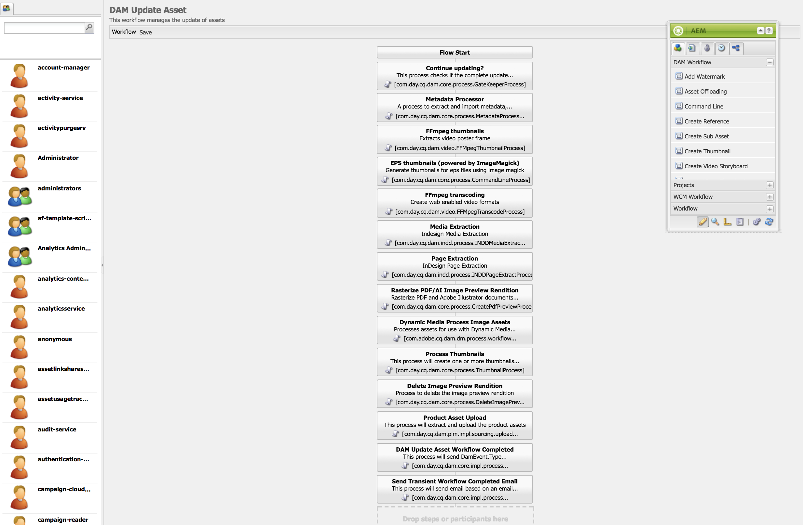
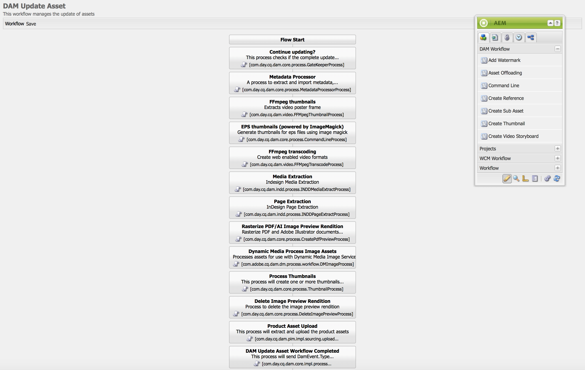
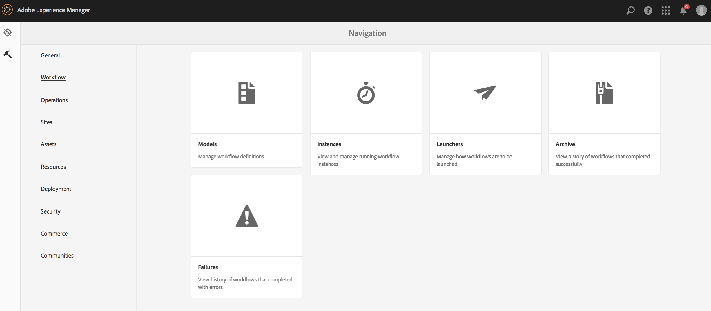

# Representações de vídeo {#video-renditions}

>[!IMPORTANT]
>Esse conteúdo é válido para o AEM no local/AMS (AEM 6.5LTS e AEM 6.5). Para ver o conteúdo do AEM as a Cloud Service Screens, consulte o [guia do AEM as a Cloud Service](https://experienceleague.adobe.com/en/docs/experience-manager-cloud-service/content/screens-as-cloud-service/overview/introduction).

Você pode gerar representações manuais e automáticas em alta definição total. A seção a seguir descreve o fluxo de trabalho para adicionar representações aos seus ativos.

## Gerando representações de alta definição total automaticamente {#automatically-generating-full-hd-renditions}

>[!NOTE]
>
>Se as representações de vídeo do AEM Screens não forem executadas de forma ideal no dispositivo, entre em contato com o fornecedor do hardware para obter as especificações do vídeo. Isso o ajuda a obter o melhor desempenho do dispositivo. Ele ajuda a criar seu próprio perfil de vídeo personalizado, onde você fornece os parâmetros apropriados para que o FFMPEG gere sua representação. Em seguida, siga as etapas abaixo para adicionar seu perfil de vídeo personalizado à lista de perfis.
>
>Além disso, consulte [Vídeos de solução de problemas](troubleshoot-videos.md) para depurar e solucionar problemas de reprodução de vídeo no seu canal.

Siga as etapas abaixo para gerar representações de alta definição total automaticamente:

1. Clique no link Adobe Experience Manager (canto superior esquerdo) e clique no ícone de martelo para que você possa clicar em **Fluxo de trabalho**.

   Clique em **Modelos**.

   

1. No gerenciamento do modelo de fluxo de trabalho, clique no **Ativo de atualização do DAM** modelo e clique em **Editar** na barra de ações.

   

1. Na janela **Ativo de atualização do DAM**, clique duas vezes na etapa **FFmpeg transcoding**.

   

1. Clique na guia **Processo**.
1. Insira os perfis de alta definição total na lista em **Argumentos** da seguinte maneira:
   ***`,profile:fullhd-bp,profile:fullhd-hp`***
1. Clique em **OK**.

   

1. Clique em **Salvar** na parte superior esquerda da tela **Atualizar ativo do DAM**.

   

1. Navegue até **Assets** e carrega um novo vídeo. Clique no vídeo e abra o painel lateral Representações. Observe os dois vídeos em alta definição total.

   

1. Abra **Representações** no painel lateral.

   

1. Observe duas novas execuções de alta definição total.

   

## Gerando manualmente representações de alta definição total {#manually-generating-full-hd-renditions}

Siga as etapas abaixo para gerar representações de alta definição total manualmente:

1. Clique no link Adobe Experience Manager (canto superior esquerdo) e no ícone de martelo para que você possa clicar em ferramentas e em **Fluxo de trabalho**.

   Clique em **Modelos**.

   

1. No gerenciamento do modelo de fluxo de trabalho, clique no modelo **Ativo de atualização do Screens** e clique em **Iniciar fluxo de trabalho** para abrir a caixa de diálogo **Executar fluxo de trabalho**.

   

1. Clique no vídeo desejado na **Carga** e clique em **Executar**.

   

1. Navegue até **Assets**, faça drill-down para o seu ativo e clique nele.

   

1. Abra o painel lateral **Representações**. Observe as novas execuções de alta definição total.

   

