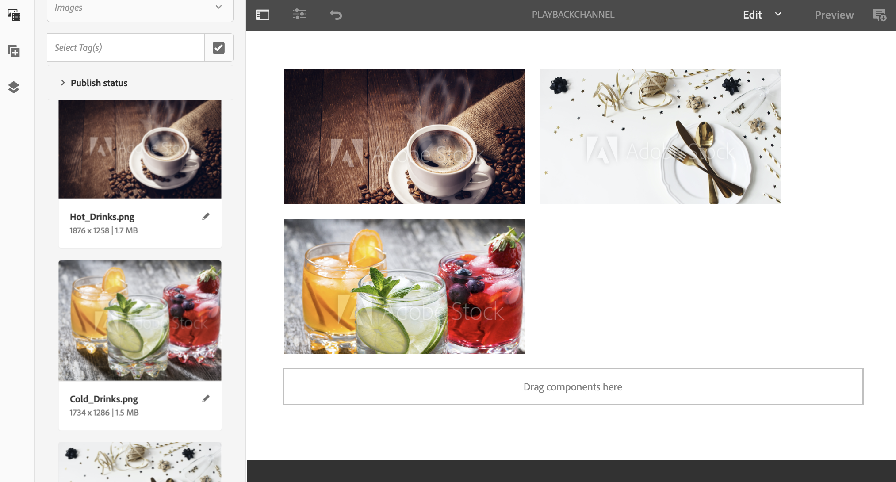
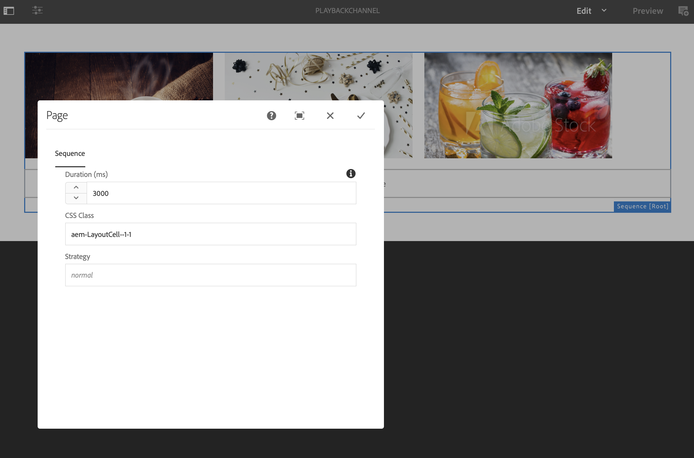

# Duração da reprodução da imagem {#image-playback-duration}

## Visão geral {#overview}

Após criar um canal de sequência e adicionar imagens a ele, por padrão, todas as imagens assumem a duração da reprodução definida na configuração Nível de canal. Qualquer imagem individual ainda pode substituir o padrão e ter uma duração de reprodução diferente. Essa capacidade é alcançada ao editar a duração de reprodução do componente de imagem específico.

### Pré-requisitos {#prerequisites}

Antes de implementar essa funcionalidade, configure um projeto como pré-requisito para começar a implementá-la. Por exemplo,

1. Crie um projeto do AEM Screens (neste exemplo, **ChannelLevelPlayback**)
1. Criar um canal de sequência como **PlaybackChannel** na pasta **Channels**
1. Adicionar conteúdo a **PlaybackChannel**

## Edição de atribuição da duração da reprodução da imagem no nível do canal {#editing-channel-level-image-playback-duration-assignment}

A seção abaixo explica como editar a duração da reprodução do conteúdo em um canal AEM Screens.

### Atualização da duração da reprodução de imagens em um canal {#updating-the-playback-duration-for-images-in-a-channel}

Siga as etapas abaixo para saber como atualizar a Atribuição de duração da reprodução da imagem no nível do canal:

1. Navegue até o canal de sequência **PlaybackChannel**.

   

1. Clique em **Editar** na barra de ações.

   

1. Adicione duas ou mais imagens no editor de canal, como mostrado na figura abaixo.

   

1. Clique em todas as imagens no canal e clique na chave inglesa no canto superior esquerdo (como mostrado na figura abaixo). A caixa de diálogo Configurar nível de canal é aberta.

   

1. A caixa de diálogo **Página** é aberta.

   >[!NOTE]
   >
   >Por padrão, as imagens em um canal são definidas com uma duração de reprodução de 8 segundos.

   

   Edite a **Duração** de 8000 (milissegundos) para 3000 (milissegundos), ou seja, 3 segundos. Clique na marca de seleção no canto superior direito da caixa de diálogo **Página** para salvar suas alterações.

   

### Exibir o resultado {#viewing-the-result}

Ao atualizar a duração da reprodução do canal (neste exemplo, todas as três imagens), observe que as imagens agora são reproduzidas por 3 segundos em vez de 8 segundos (o valor padrão).

