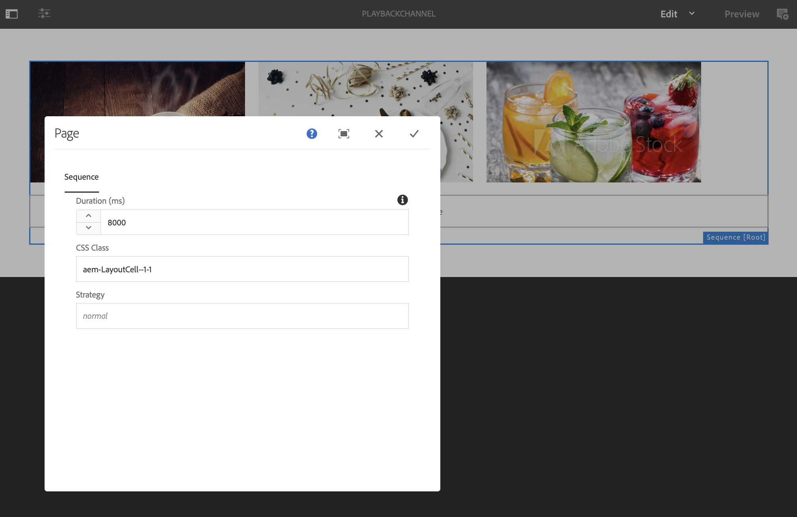

# Duração da reprodução da imagem {#image-playback-duration}

## Visão geral {#overview}

Assim que você criar um canal de sequência e adicionar imagens a ele, por padrão, todas as imagens assumirão a duração da reprodução definida na configuração de nível de Canal. Qualquer imagem individual ainda pode substituir o padrão e ter uma duração de reprodução diferente, isso é feito editando a duração de reprodução do componente de imagem específico.

### Pré-requisitos {#prerequisites}

Antes de começar a implementar essa funcionalidade, certifique-se de configurar um projeto como pré-requisito para iniciar a implementação dessa funcionalidade. Por exemplo,

1. Criar um projeto do AEM Screens (neste exemplo, **ChannelLevelPlayback**)

1. Criar um canal de sequência como **PlaybackChannel** na pasta **Canais**

1. Adicionar conteúdo ao **PlaybackChannel**

## Edição da Atribuição de Duração de Reprodução de Imagem de Nível de Canal {#editing-channel-level-image-playback-duration-assignment}

A seção abaixo explica como editar a duração da reprodução do conteúdo em um canal do AEM Screens.

### Atualização da duração da reprodução de imagens em um canal {#updating-the-playback-duration-for-images-in-a-channel}

Siga as etapas abaixo para saber como atualizar a Atribuição de duração de reprodução de imagem no nível do canal:

1. Navegue até o canal de sequência **PlaybackChannel**.

   

1. Clique em **Editar** na barra de ações para abrir o editor.

   

1. Adicione duas ou mais imagens no editor de canal, conforme mostrado na figura abaixo.

   

1. Selecione todas as imagens no canal e clique no ícone de chave inglesa no canto superior esquerdo (como mostrado na figura abaixo) para abrir a caixa de diálogo Configurar no nível do canal.

   

1. **A caixa de diálogo Página** é aberta.

   >[!NOTE]
   >
   >Por padrão, as imagens em um canal são definidas com uma duração de reprodução de 8 segundos.

   

   Edite a **Duração** de 8000 (ms) a 3000 (ms), ou seja, 3 segundos. Clique na marca de seleção na parte superior direita da caixa de diálogo **Página** para salvar as alterações.

   

### Como visualizar o resultado {#viewing-the-result}

Depois de atualizar a duração da reprodução do canal (neste exemplo, todas as três imagens), você observará que as imagens serão reproduzidas por 3 segundos em vez de 8 segundos (valor padrão).

