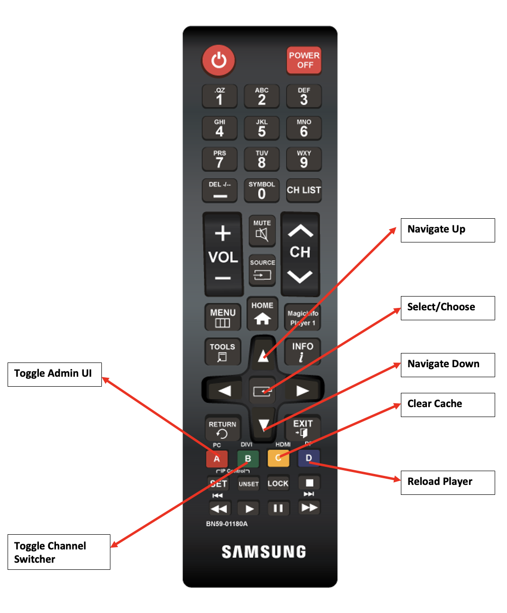

# Usar o controle remoto do Screens {#implementing-remote-control}

>[!IMPORTANT]
>Esse conteúdo é válido para o AEM no local/AMS (AEM 6.5LTS e AEM 6.5). Para ver o conteúdo do AEM as a Cloud Service Screens, consulte o [guia do AEM as a Cloud Service](https://experienceleague.adobe.com/en/docs/experience-manager-cloud-service/content/screens-as-cloud-service/overview/introduction).

O recurso de controle remoto facilita o acesso à interface do Administrador, ao alternador de canal ou a recursos como Limpar cache e recarregar. Além disso, fornece um método para ver a versão do firmware local e as informações do sistema no reprodutor. Essa capacidade é especialmente útil porque pode ser difícil conectar um mouse. Ou opere em dispositivos de produção que estão fora de alcance e ainda mais se o reprodutor tiver perdido a conexão com o AEM. Também é útil ao usar o Samsung RMS, pois a diferença de resolução pode dificultar a localização e a abertura da interface do usuário do Administrador usando um mouse.

## Combinações de teclas comuns do controle remoto {#using-common-remote-control}

Em todos os reprodutores, você pode usar as seguintes combinações de teclas no Controle remoto Screens:

1. Alternar interface do administrador - CTRL + 1
1. Alternar alternador de canal - CTRL + 2
1. Limpar cache - CTRL + ALT + 3
1. Recarregar player - CTRL + 4

## Combinações de teclas específicas do controle remoto {#using-tizen-remote-control}

Específico para o reprodutor Tizen, você pode usar o remoto de hardware ou o remoto de software disponível no Samsung RMS para acessar esses recursos:

1. A - Alternar a interface do administrador
1. B - Alternar alternador de canal
1. C - Limpar cache
1. D - Recarregar player

## Mais notas de uso {#using-additional-remote-control}

1. Com a interface do usuário do Administrador aberta, é possível usar as setas para cima e para baixo para navegar pelas guias e exibir informações nas guias.
1. Com o alternador de canais aberto, você pode usar as teclas de seta para cima e para baixo para navegar pelos canais. Você também pode pressionar a tecla `Enter` (ou o botão no centro das setas no controle remoto) para alternar canais.

O diagrama a seguir ilustra o uso de chaves em um remoto Samsung:


>[!NOTE]
>Se você definir os valores de configuração de dispositivo de enableAdminUI e/ou enableOSD como false, o remoto não alterna a interface do usuário do administrador e o alternador de canal. Não é possível usar as teclas de seta para navegar pela interface do usuário ou pelos canais do Administrador. No entanto, ainda é possível limpar o cache e recarregar o reprodutor. Você pode desativar o recurso de controle remoto se qualquer uma das combinações de teclado entrar em conflito com seu conteúdo interativo usando este código:

```
require(['util/ScreensDisplay'], function() {window.ScreensDisplay.ignoreRemoteControl = true;}); 
```
