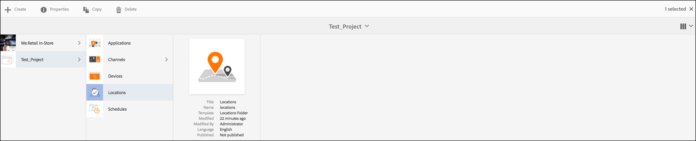
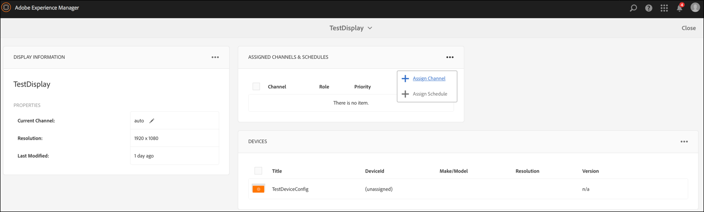

# Guia de Início Rápido {#kickstart-guide}

Esta seção é um kickstart para a AEM Screens e demonstra como configurar e executar um projeto da AEM Screens. Ele o orienta a configurar uma experiência básica de sinalização digital e adicionar conteúdo, como ativos e/ou vídeos, a cada canal e a publicar o conteúdo em um AEM Screens player.

>[!NOTE]
>Antes de start para trabalhar nos detalhes do projeto, certifique-se de ter instalado o Feature Pack mais recente. Você pode baixar o pacote de recursos mais recente para a versão AEM Screens 6.5.5 do Portal [de distribuição de](https://experience.adobe.com/#/downloads/content/software-distribution/en/aem.html) software usando seu Adobe ID.

## Criação de uma experiência com cartazes digitais em 5 minutos {#creating-a-digital-signage-experience-in-minutes}

Siga as etapas abaixo para criar um projeto de amostra para o AEM Screens e publicar ainda mais o conteúdo no Screens player.

>[!NOTE]
>O tutorial a seguir mostra o conteúdo do seu canal no Chrome OS player.

>[!IMPORTANT]
>**Configurações do OSGi**
>É necessário ativar a quem indicou vazia para permitir que o dispositivo publique dados no servidor. Por exemplo, se a propriedade quem indicou vazia estiver desativada, o dispositivo não poderá postar uma captura de tela novamente. Atualmente, alguns desses recursos estão disponíveis somente se o Filtro de Quem indicou Apache Sling Permitir vazio estiver ativado na Configuração do OSGi. O painel pode exibir um aviso de que as configurações de segurança podem impedir que alguns desses recursos funcionem.
>Siga as etapas abaixo para ativar o Filtro de Quem indicou Sling ***Apache Permitir vazio***:

## Permitir solicitações de Quem indicou vazias {#allow-empty-referrer-requests}

1. Navegue até Configuração **do console da Web do** Adobe Experience Manager por AEM instância —> ícone de martelo —> **Operações** —> Console **da** Web.

   

1. **A Configuração** do Adobe Experience Manager Web Console é aberta. Procure por quem indicou de sling.

   Para pesquisar a propriedade sling quem indicou, pressione **Command+F** para **Mac** e **Control+F** para **Windows**.

1. Marque a opção **Permitir vazio** , conforme mostrado na figura abaixo.

   

1. Clique em **Salvar** para ativar o Filtro de Quem indicou Apache Sling Permitir vazio.

## Tutorial {#tutorial}

### Creating a new AEM Screens Project {#creating-project}

A primeira etapa é criar um novo projeto AEM Screens.

1. Navegue até a instância do Adobe Experience Manager (AEM) e clique em **Telas**. Como alternativa, você pode navegar diretamente de `https://localhost:4502/screens.html/content/screens](https://localhost:4502/screens.html/content/screens`.

1. Click **Create Screens Project** to create a new Screens project. Enter the title as **DemoScreens** and click **Save**.

   

   >[!NOTE]
   >Depois que você cria o projeto, ele o traz de volta ao home page do Screens Project. Agora, você pode selecionar seu projeto. Em um projeto, há cinco pastas diferentes intituladas **Aplicativos**, **Canais**, **Dispositivos**, **Locais** e **Agendamentos**.

### Criação de um novo canal {#creating-channel}

Depois que o projeto estiver em andamento, será necessário criar um novo canal no qual você gerenciará o conteúdo.

Siga as etapas abaixo para criar um novo canal para seu projeto:

1. Depois de criar um projeto, selecione o projeto **DemoScreens** e selecione a pasta **** Canais, como mostrado na figura abaixo. Click **+ Create** from the action bar.

   

1. Escolha o Canal **de** sequência no assistente e clique em **Avançar**.
   

1. Enter the **Title** as *TestChannel* and click **Create**.

   

O *TestChannel* é criado e adicionado à pasta canais, como mostrado na figura abaixo.

### Adding Content to a Channel {#adding-content}

Depois que o canal estiver no lugar, você precisará adicionar conteúdo ao canal que o Reprodutor do Screens exibirá.

Siga as etapas abaixo para adicionar conteúdo ao canal (*TestChannel*) em seu projeto:

1. Navigate to the *Test_Project* you created and select the **Channels** folder.

1. Click **Edit** from the action bar (see the figure below). The editor for the *TestChannel* opens.

1. Clique no ícone que alterna o painel lateral no lado esquerdo da barra de ações para abrir os ativos e componentes.

1. Arraste e solte os componentes que você deseja adicionar ao seu canal.

   

Neste exemplo, o editor mostra uma imagem adicionada ao canal.

### Criação de uma nova localização {#creating-location}

Depois que o canal estiver no lugar, é necessário criar o local.

***Os locais*** compartimentalizam suas várias experiências de sinalização digital e contêm as configurações dos monitores de acordo com onde estão as várias telas.

Siga as etapas abaixo para criar um novo local para seu projeto:

1. Navigate to the *Test_Project* you created and select the **Locations** folder.

1. Clique em **Criar** ao lado do ícone de adição na barra de ação (consulte a figura abaixo). Um assistente será aberto.
1. Select **Location** from the wizard and click **Next**.

1. Enter the **Name** and **Title** for your location (enter the title as *TestLocation*) and click **Create**.

   

O *TestLocation* é criado e adicionado à pasta **Locais** .

### Criação de uma nova exibição para TestLocation {#creating-display}

Depois de criar um local, é necessário criar uma nova exibição para o seu local.

***As telas*** representam a experiência digital executada em uma ou várias telas.

1. Navegue até o local onde deseja criar sua exibição (*Test_* Project —> **Locais** —> *TestLocation)* , conforme mostrado na figura acima, e selecione *TestLocation*.

1. Clique em **Criar** na barra de ações.
1. Select **Display** from the **Create** wizard and click **Next**.

1. Insira **Nome** e **Título** para o local de exibição (insira o título como *TestDisplay*).

1. Under the **Display** tab, choose the details of the Layout.

   1. Choose the **Resolution** as **Full HD**.

   1. Choose the **Number of Devices Horizontally** as 1.

   1. Choose the **Number of Devices Vertically** as 1.

   1. Clique em **Criar**.

Uma nova tela (*TestDisplay*) é adicionada à sua localização *TestLocation)*, como mostrado na figura abaixo.

### Atribuição de um canal {#assigning-channel}

1. Navigate to the display from *Test_Project* --> **Locations** --> *TestLocation* --> *TestDisplay*.

1. Select *TestDisplay* and tap/click **Assign Channel **from the action bar, *Or*,

1. Click **Dashboard** and select **+Assign Channel** at the top right from **ASSIGNED CHANNELS &amp; SCHEDULES** panel, as shown in the figure below. **A caixa de diálogo Atribuição** do canal é aberta.

1. Select **Reference Channel** by **path**

1. Enter the **Channel Role** as *LiveStream*.

1. Selecione o Caminho **do** Canal (*Test_Project* —> *Canais* —> *TestChannel* ) no **Canal**.

1. Select the **Priority** for this channel as *1*.

1. Choose the **Supported Events** as **Initial Load** and **Idle Screen**.

1. Informe **Agendamento** e selecione as datas em **ativo** e **ativo até**.

1. Clique em **Salvar**.

O canal é criado e adicionado ao painel.

### Registrando um dispositivo {#registering-device}

Você precisa registrar seu dispositivo usando o painel AEM.

>[!NOTE]
>Você pode abrir o Screens player usando o aplicativo AEM Screens que você baixou ou usando o navegador da Web.

### Viewing the content in AEM Screens Player {#viewing-the-content-in-screens-player}

Depois que você tiver adicionado as configurações acima, o player deverá mostrar automaticamente o canal padrão para a exibição em seu dispositivo.

Consulte [AEM Screens Player](working-with-screens-player.md) para obter informações mais detalhadas sobre o AEM Screens player.
