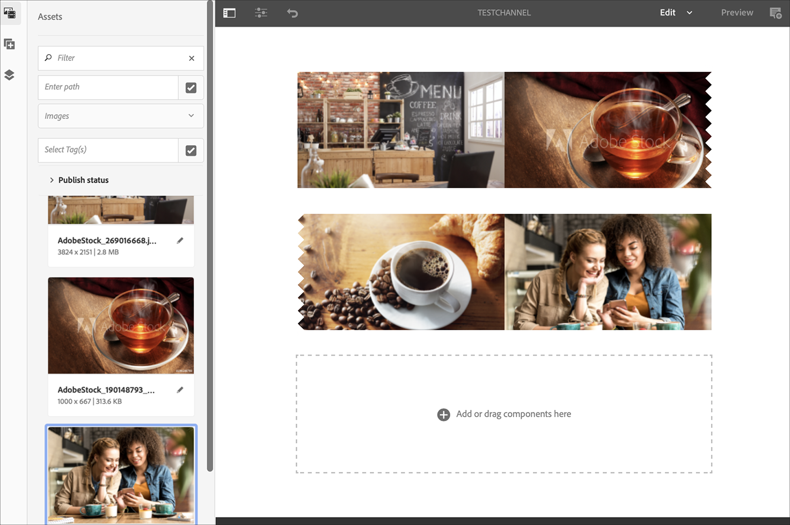
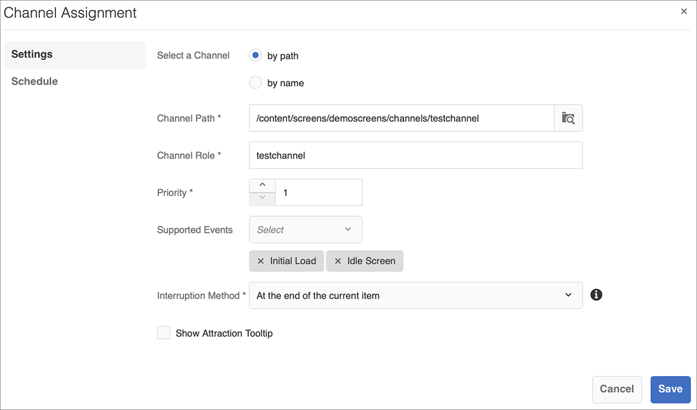

# Guia de início rápido {#kickstart-guide}

O início rápido do AEM Screens demonstra como configurar e executar um projeto do AEM Screens. Ele orienta você na configuração de uma experiência básica de sinalização digital e na adição de conteúdo, como ativos e/ou vídeos, a cada canal e na publicação adicional do conteúdo em um reprodutor do AEM Screens.

>[!NOTE]
>Antes de trabalhar nos detalhes do projeto, verifique se você instalou o Pacote de recursos mais recente do AEM Screens. Você pode baixar o pacote de recursos mais recente da [Portal de distribuição de software](https://experience.adobe.com/#/downloads/content/software-distribution/br/aem.html) usando sua Adobe ID.

## Pré-requisitos {#prerequisites}

Siga as etapas abaixo para criar um projeto de amostra para o AEM Screens e publicar mais conteúdo no reprodutor do Screens.

>[!NOTE]
>O tutorial a seguir mostra como reproduzir o conteúdo do seu canal no Chrome OS player.

>[!IMPORTANT]
>**Configurações do OSGi**
>Você deve ativar o referenciador vazio para permitir que o dispositivo publique dados no servidor. Por exemplo, se a propriedade referenciador vazia estiver desativada, o dispositivo não poderá postar uma captura de tela. Atualmente, alguns desses recursos só estarão disponíveis se a opção Permitir vazio de filtro do referenciador do Apache Sling estiver ativada na configuração do OSGi. O painel pode exibir um aviso de que as configurações de segurança podem impedir que alguns desses recursos funcionem.
>Siga as etapas abaixo para ativar o ***Permitir filtro de referenciador do Apache Sling vazio***:

## Permitir Solicitações de Referenciador Vazias {#allow-empty-referrer-requests}

1. Navegue até **Configuração do console da Web do Adobe Experience Manager** via instância AEM > ícone de martelo > **Operações** > **Console da Web**.

   

1. **Configuração do console da Web do Adobe Experience Manager** é aberto. Pesquisar referenciador do sling.

   Para pesquisar a propriedade do referenciador do sling, pressione **Command+F** para **Mac** e **Ctrl+F** para **Windows**.

1. Verifique a **Permitir vazio** como mostrado na figura abaixo.

   

1. Clique em **Salvar** para ativar o Apache Sling Referrer Filter Allow Empty.

## Criação de uma experiência de sinalização digital em 5 minutos {#creating-a-digital-signage-experience-in-minutes}

### Criação de um projeto do AEM Screens {#creating-project}

A primeira etapa é criar um projeto do AEM Screens.

1. Navegue até a instância do Adobe Experience Manager (AEM) e clique em **Screens**. Como alternativa, você pode navegar diretamente de `https://localhost:4502/screens.html/content/screens](https://localhost:4502/screens.html/content/screens`.

1. Clique em **Criar projeto do Screens** para que você possa criar um projeto do Screens.
1. Insira o título como **DemoScreens** e, em seguida, clique em **Salvar**.

   

   >[!NOTE]
   >Depois de criar o projeto, ele o traz de volta para a página inicial do Projeto do Screens. Agora você pode selecionar seu projeto. Em um projeto, há cinco pastas diferentes chamadas **Aplicativos**, **Canais**, **Dispositivos**, **Localizações**, e **Agendamentos**.

### Criação de um canal {#creating-channel}

Depois de criar o projeto do AEM Screens, é necessário criar um canal onde você gerencia o conteúdo.

Siga as etapas abaixo para criar um canal para seu projeto:

1. Depois de criar um projeto, selecione a variável **DemoScreens** e selecione o **Canais** conforme mostrado na figura abaixo. Clique em **+ Criar** na barra de ações.

   

1. Escolha o **Canal de sequência** no assistente e clique em **Próxima**.
   

1. Insira o **Título** as **TestChannel** e clique em **Criar**.

   

   A variável **TestChannel** agora é adicionado à pasta de canais, como mostrado na figura abaixo.

   

### Adicionar conteúdo a um canal {#adding-content}

Quando tiver seu canal em vigor, adicione ao seu canal o conteúdo que o AEM Screens player pode exibir.

Siga as etapas abaixo para adicionar conteúdo ao canal (**TestChannel**) no seu projeto:

1. Navegue até a **DemoProject** você criou e selecione a variável **TestChannel** do **Canais** pasta.

1. Clique em **Editar** na barra de ações (consulte a figura abaixo). O editor do **TestChannel** é aberto.

   

1. Clique no ícone que alterna o painel lateral no lado esquerdo da barra de ações para abrir os ativos e componentes.

1. Arraste e solte os componentes que deseja adicionar ao canal.

   

### Criação de um local {#creating-location}

Quando tiver seu canal em vigor, crie um local.

>[!NOTE]
>***Localizações*** compartimente suas várias experiências de sinalização digital e contenha as configurações das exibições de acordo com onde as várias telas estão.

Siga as etapas abaixo para criar uma localização para seu projeto:

1. Navegue até a **DemoProject** você criou e selecione a variável **Localizações** pasta.
1. Clique em **+ Criar** na barra de ações.
1. Selecionar **Localização** no assistente e clique em **Próxima**.
1. Insira o **Nome** para sua localização (insira o título como **TestLocation**) e clique em **Criar**.

A variável **TestLocation** é criado e adicionado ao seu **Localizações** pasta.

### Criação de uma Exibição para Local {#creating-display}

Depois de criar um local, crie uma exibição para o seu local.

>[!NOTE]
>***Exibir*** representa a experiência digital executada em uma ou várias telas.

1. Navegue até a **TestLocation** e selecione-o.
1. Clique em **Criar** na barra de ações.

   

1. Selecionar **Exibir** do **Criar** e clique em **Próxima**.

   

1. Insira o **Título** as **ExibiçãoLobby** e clique em **Criar**.

   

   Uma nova exibição intitulada como **TestDisplay** foi adicionado à sua localização **TestLocation**, conforme mostrado na figura abaixo.

   

### Atribuição de um canal {#assigning-channel}

Quando a configuração do projeto for concluída, você deverá atribuir o canal a uma exibição para visualizar o conteúdo.

1. Navegue até a exibição necessária em **DemoScreens** > **Localizações** > **TestLocation** > **ExibiçãoLobby**.

1. Toque/clique **Atribuir canal** na barra de ações.

   

   Ou,

   Toque/clique **Painel** na barra de ações e clique em **+Atribuir canal** do **CANAIS ATRIBUÍDOS E AGENDAMENTOS** painel.

   

1. A variável **Atribuição de canal** é aberta.

1. No **Configurações** escolha o canal **por caminho**  e **Eventos suportados** as **Carga inicial** e **Tela inativa**.

   >[!NOTE]
   >
   >A variável **Função do canal**, **Prioridade**, e **Métodos de interrupção** são preenchidos por padrão. Consulte [Propriedades do canal](/help/user-guide/channel-assignment-latest-fp.md#channel-properties) para obter mais informações sobre as propriedades de atribuição do canal.

   

   Além disso, é possível selecionar a variável **Janela de ativação** e **Agendamento recorrente**.

   >[!NOTE]
   >A variável *Agendamento recorrente* permite definir uma programação recorrente para seu canal. Você configura vários agendamentos de recorrência para um canal.
   >Consulte [Agendamento recorrente](/help/user-guide/channel-assignment-latest-fp.md#recurrence-schedule) para obter mais detalhes.

1. Clique em **Salvar** após configurar suas preferências.

### Registrando um dispositivo e atribuindo um dispositivo a uma exibição {#registering-device}

Registre seu dispositivo usando o painel AEM.

>[!IMPORTANT]
>O Chrome OS player pode ser instalado como plug-in do navegador Chrome no modo de desenvolvedor, sem precisar de um dispositivo Chrome player real. Para instalação, siga as etapas abaixo:
>
>1. Clique em [aqui](https://download.macromedia.com/screens/) para baixar o Chrome Player mais recente.
>1. Descompacte-o e salve-o no disco.
>1. Abra o navegador Chrome e selecione **Extensões** no menu ou navegue diretamente para ***chrome://extensions***.
>1. Ligue o **Modo de desenvolvedor** do canto superior direito.
>1. Clique em **Carregar desempacotado** no canto superior esquerdo e carregar o Chrome Player descompactado.
>1. Marcar **AEM Screens Chrome Player** se estiver disponível na lista de extensões.
>1. Abra uma nova guia e clique no link **Aplicativos** no canto superior esquerdo ou navegue diretamente para ***chrome://apps***.
>1. Clique em **AEM Screens** Plug-in para que você possa iniciar o Chrome Player. Por padrão, o reprodutor é iniciado no modo de tela cheia. Pressione **Esc** para sair do modo de tela cheia.

Assim que o reprodutor do sistema operacional Chrome estiver ativado, siga as etapas abaixo para registrar um dispositivo Chrome.

1. Navegue até a **Dispositivos** pasta do seu projeto da sua instância AEM.

1. Toque/clique no **Gerenciador de dispositivos** na barra de ações.

   

1. Toque/clique no **Registro do dispositivo** do canto superior direito.

1. Selecione o dispositivo desejado e toque/clique **Registrar dispositivo**.

   

1. Aguarde o dispositivo enviar o código de registro e verifique simultaneamente a **Código de registro** do dispositivo Chrome.
   

1. Se a variável **Código de registro** é o mesmo em ambos os computadores, toque/clique **Validar** no AEM.

1. Defina o nome desejado como **ChromeDeviceforDemo** para o dispositivo e clique em **Registrar**.

   

1. Clique em **Atribuir exibição** do **Registro do dispositivo bem-sucedido** caixa de diálogo.

   

1. Selecione o caminho para a exibição como **DemoScreens** > **Localizações** > **TestLocation** > **ExibiçãoLobby** e clique em **Atribuir**.

   

1. Quando o dispositivo for atribuído com êxito, você verá a seguinte confirmação.

   

1. Selecionar **Concluir** para concluir o processo de registro. Agora você pode exibir seu dispositivo registrado no painel de exibição.

   

### Exibição de conteúdo no Chrome Player {#viewing-content-output}

Todos os ativos em seu canal agora estão sendo reproduzidos no reprodutor do sistema operacional Chrome.

Parabéns! Agora você está reproduzindo conteúdo em um canal do AEM Screens.

