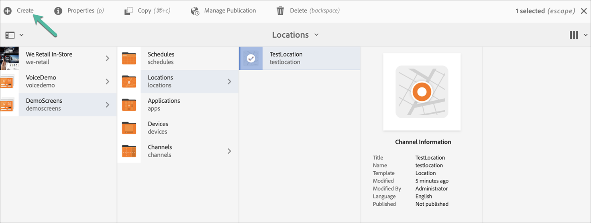

# Guia do Kickstart {#kickstart-guide}

O kickstart para o AEM Screens demonstra como configurar e executar um projeto do AEM Screens. Ele orienta você na configuração de uma experiência básica de assinatura digital e na adição de conteúdo, como ativos e/ou vídeos, a cada canal, além de publicar ainda mais o conteúdo em um player do AEM Screens.

>[!NOTE]
>Antes de começar a trabalhar nos detalhes do projeto, verifique se você instalou o Feature Pack mais recente para o AEM Screens. Você pode baixar o pacote de recursos mais recente do [Portal de distribuição de software](https://experience.adobe.com/#/downloads/content/software-distribution/en/aem.html) usando sua Adobe ID.

## Pré-requisitos {#prerequisites}

Siga as etapas abaixo para criar um projeto de amostra para o AEM Screens e publicar mais conteúdo no player do Screens.

>[!NOTE]
>O tutorial a seguir mostra o conteúdo do seu canal no player do Chrome OS.

>[!IMPORTANT]
>**Configurações do OSGi**
>Você deve ativar o referenciador vazio para permitir que o dispositivo publique dados no servidor. Por exemplo, se a propriedade de referenciador vazia estiver desativada, o dispositivo não poderá postar uma captura de tela de volta. Atualmente, alguns desses recursos só estão disponíveis se o Apache Sling Referrer Filter Allow Empty estiver ativado na Configuração OSGi. O painel pode exibir um aviso de que as configurações de segurança podem impedir que alguns desses recursos funcionem.
>Siga as etapas abaixo para habilitar o ***Filtro de referenciador do Apache Sling Permitir vazio***:

## Permitir solicitações de referenciador vazias {#allow-empty-referrer-requests}

1. Navegue até **Configuração do Adobe Experience Manager Web Console** por meio de AEM instância —> ícone de martelo —> **Operações** —> **Web Console**.

   

1. **A** Configuração do Console da Web do Adobe Experience Manager é aberta. Procure por referenciador do sling.

   Para pesquisar a propriedade do referenciador do sling, pressione **Command+F** para **Mac** e **Control+F** para **Windows**.

1. Marque a opção **Permitir vazio**, conforme mostrado na figura abaixo.

   

1. Clique em **Save** para ativar o Apache Sling Referrer Filter Allow Empty (Filtro de referência do Apache Sling Permitir vazio).

## Criação de uma experiência de sinalização digital em 5 minutos {#creating-a-digital-signage-experience-in-minutes}

### Criação de um projeto do AEM Screens {#creating-project}

A primeira etapa é criar um projeto do AEM Screens.

1. Navegue até a instância do Adobe Experience Manager (AEM) e clique em **Screens**. Como alternativa, você pode navegar diretamente de `https://localhost:4502/screens.html/content/screens](https://localhost:4502/screens.html/content/screens`.

1. Clique em **Criar projeto do Screens** para criar um novo projeto do Screens. Insira o título como **DemoScreens** e clique em **Salvar**.

   

   >[!NOTE]
   >Depois de criar o projeto, ele o retorna à página inicial do Projeto do Screens. Agora, você pode selecionar seu projeto. Em um projeto, há cinco pastas diferentes chamadas **Applications**, **Channels**, **Devices**, **Locations** e **Schedule**.

### Criação de um canal {#creating-channel}

Depois de criar o projeto do AEM Screens, é necessário criar um novo canal no qual você gerencia o conteúdo.

Siga as etapas abaixo para criar um novo canal para o seu projeto:

1. Depois de criar um projeto, selecione o projeto **DemoScreens** e selecione a pasta **Channels**, conforme mostrado na figura abaixo. Clique em **+ Criar** na barra de ações.

   

1. Escolha o **Canal de sequência** no assistente e clique em **Próximo**.
   

1. Insira o **Title** como **TestChannel** e clique em **Create**.

   

   O **TestChannel** agora é adicionado à pasta de canais, como mostrado na figura abaixo.

   

### Adicionar conteúdo a um canal {#adding-content}

Depois de colocar o canal no lugar, é necessário adicionar conteúdo ao canal que o AEM Screens player exibirá.

Siga as etapas abaixo para adicionar conteúdo ao canal (**TestChannel**) no seu projeto:

1. Navegue até **DemoProject** criado e selecione o **TestChannel** na pasta **Channels**.

1. Clique em **Editar** na barra de ações (veja a figura abaixo). O editor para o **TestChannel** é aberto.

   

1. Clique no ícone que alterna o painel lateral no lado esquerdo da barra de ações para abrir os ativos e componentes.

1. Arraste e solte os componentes que você deseja adicionar ao seu canal.

   

### Criação de uma localização {#creating-location}

Depois de colocar seu canal no lugar, é necessário criar um local.

>[!NOTE]
>***As localizações*** compartimentalizam suas várias experiências de sinalização digital e contêm as configurações das exibições de acordo com onde as várias telas estão.

Siga as etapas abaixo para criar um novo local para o seu projeto:

1. Navegue até **DemoProject** que você criou e selecione a pasta **Localizações**.

1. Clique em **+ Criar** na barra de ações.

1. Selecione **Local** no assistente e clique em **Próximo**.

1. Insira o **Name** para a sua localização (insira o título como **TestLocation**) e clique em **Create**.

O **TestLocation** é criado e adicionado à sua pasta **Locations**.

### Criando uma Exibição para Localização {#creating-display}

Depois de criar uma localização, você precisa criar uma nova exibição para ela.

>[!NOTE]
>***Display*** representa a experiência digital que é executada em uma ou várias telas.

1. Navegue até **TestLocation** e selecione-o.

1. Clique em **Criar** na barra de ações.

   

1. Selecione **Exibir** no assistente **Criar** e clique em **Próximo**.

   

1. Insira o **Título** como **LobbyDisplay** e clique em **Criar**.

   

   Uma nova exibição chamada **TestDisplay** agora é adicionada à sua localização **TestLocation**, conforme mostrado na figura abaixo.

   

### Atribuindo um Canal {#assigning-channel}

Quando a configuração do projeto for concluída, você deverá atribuir o canal a uma exibição para visualizar o conteúdo.

1. Navegue até a exibição necessária de **DemoScreens** —> **Localizações** —> **TestLocation** —> **LobbyDisplay**.

1. Toque/clique em **Atribuir canal** na barra de ações.

   

   Ou,

   Toque/clique em **Painel** na barra de ações e clique em **+Atribuir canal** no painel **CANAIS ATRIBUÍDOS E AGENDAMENTOS**.

   

1. A caixa de diálogo **Atribuição de canal** é aberta.

1. Na opção **Settings**, escolha o canal **by path** e **Eventos Suportados** como **Carga Inicial** e **Ecrã Inativo**.

   >[!NOTE]
   >
   >As **Função do canal**, **Prioridade** e **Métodos de interrupção** são preenchidas por padrão. Consulte a seção [Propriedades do canal](/help/user-guide/channel-assignment-latest-fp.md#channel-properties) para saber mais sobre as propriedades de atribuição de canal.

   

   Além disso, também é possível selecionar a **Janela de Ativação** e **Programação de Recorrência**.

   >[!NOTE]
   >O *Agendamento de recorrência* permite que você defina um agendamento recorrente para seu canal. Você configura várias programações de recorrência para um canal.
   >Consulte [Agendamento de recorrência](/help/user-guide/channel-assignment-latest-fp.md#recurrence-schedule) para obter mais detalhes.

1. Clique em **Salvar** após configurar suas preferências.

### Registrando um dispositivo e atribuindo um dispositivo a um monitor {#registering-device}

Você precisa registrar seu dispositivo usando o painel de AEM.

>[!IMPORTANT]
>O player do Chrome OS pode ser instalado como plug-in do Chrome Browser no modo de desenvolvedor sem precisar do dispositivo do player do Chrome. Para instalação, siga as etapas abaixo:
>
>1. Clique [aqui](https://download.macromedia.com/screens/) para baixar o Player mais recente do Chrome.
>1. Descompacte-o e salve-o no disco.
>1. Abra o navegador Chrome e selecione **Extensões** no menu ou navegue diretamente para ***chrome://extensions***.
>1. Ative o **Modo de desenvolvedor** a partir do canto superior direito.
>1. Clique em **Carregar descompactado** do canto superior esquerdo e carregue o Chrome Player descompactado.
>1. Verifique o plug-in **AEM Screens Chrome Player** se estiver disponível na lista de extensões.
>1. Abra uma nova guia e clique no ícone **Apps** no canto superior esquerdo ou navegue diretamente para ***chrome://apps***.
>1. Clique no plug-in **AEM Screens** para iniciar o Chrome Player. Por padrão, o reprodutor é iniciado no modo de tela cheia. Pressione **esc** para sair do modo de tela cheia.

Quando o player do Chrome OS estiver ativado, siga as etapas abaixo para registrar um dispositivo Chrome.

1. Navegue até a pasta **Devices** do seu projeto a partir da sua instância de AEM.

1. Toque/clique no **Gerenciador de dispositivos** na barra de ações.

   

1. Toque/clique em **Registro do dispositivo** no canto superior direito.

1. Selecione o dispositivo necessário e toque/clique em **Registrar dispositivo**.

   

1. Aguarde o dispositivo enviar seu código de registro e verifique simultaneamente o **Código de registro** do dispositivo Chrome.
   

1. Se o **Código de Registro** for o mesmo em ambas as máquinas, toque/clique em **Validar** no AEM.

1. Defina o nome desejado como **ChromeDeviceforDemo** para o dispositivo e clique em **Register**.

   

1. Clique em **Atribuir exibição** na caixa de diálogo **Registro de dispositivo bem-sucedido**.

   

1. Selecione o caminho para sua exibição como **DemoScreens** —> **Localizações** —> **TestLocation** —> **LobbyDisplay** e clique em **Atribuir**.

   

1. Depois que o dispositivo for atribuído com sucesso, você verá a seguinte confirmação.

   

1. Toque/clique em **Finish** para concluir o processo de registro. Você deve conseguir visualizar seu dispositivo registrado no painel de exibição.

   

### Visualização do conteúdo no Chrome Player {#viewing-content-output}

Todos os ativos em seu canal agora estão sendo reproduzidos no player do Chrome OS.

Parabéns por você estar reproduzindo conteúdo em um canal de AEM Screens!

