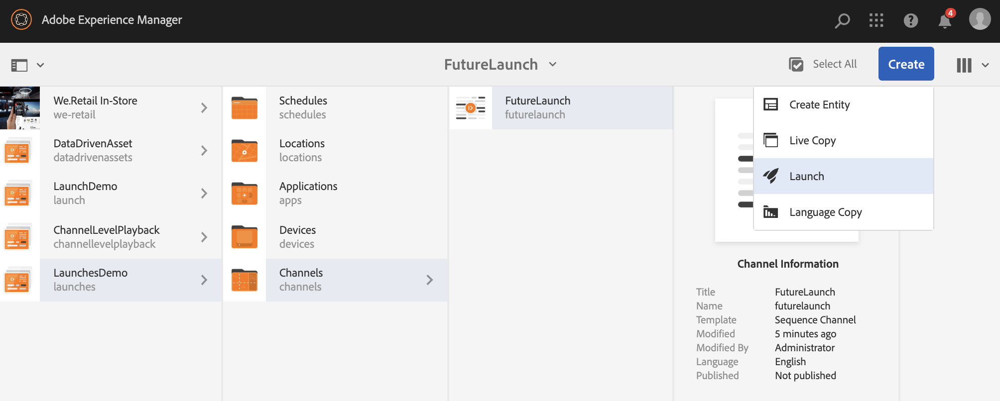

# Lançamentos {#launches}

Os autores de conteúdo podem criar uma versão futura do(s) canal(s), conhecido como **Iniciar** e definir a data de ativação para esta inicialização permite que o conteúdo seja exibido em dispositivos ou players.

Com a ajuda de inicializações, os autores podem visualizar cada canal na inicialização e devem poder iniciar uma solicitação de revisão. O grupo de aprovadores receberá uma notificação e poderá aprovar ou rejeitar a solicitação. Quando a data ao vivo é atingida, o conteúdo é reproduzido nos dispositivos.

Por exemplo, se o autor quiser criar versões futuras de c1, c2 (canais), uma inicialização será criada e uma data ativa será definida (por exemplo, 10 de novembro de 8:00 AM). Quaisquer atualizações adicionais no conteúdo são enviadas para revisão. Uma vez aprovada e na data de ativação (10 de novembro, 8:00 AM), essa inicialização reproduz o conteúdo nos dispositivos ou players.

## Requisitos {#requirements}

Antes de iniciar a implementação de Inicializações em um projeto do AEM Screens, certifique-se de entender o conceito de Período de carência e sua relevância.

A seção a seguir explica o Período de carência e como configurá-lo de forma imediata. Você também pode baixar uma configuração de teste de amostra para entender seu uso.

### Compreensão do período de carência {#understanding-grace-period}

A configuração a seguir permite que o administrador configure o Período ***de*** carência, necessário em Inicializações.

**Período** de carência, inclui:

* promoção do lançamento
* publicação dos recursos para publicar instâncias
* tempo gasto pelos dispositivos para baixar o conteúdo da instância de publicação e de qualquer diferença de tempo entre o servidor e o player

Por exemplo, digamos que o servidor esteja no PST e os dispositivos estejam no EST, a diferença de tempo máximo é de 3 horas nesse caso e suponha que a promoção levará 1 minuto e a publicação do autor para publicar leva 10 minutos e o player pode baixar os recursos normalmente em 10 a 15 minutos. Em seguida, período de carência = diferença de tempo (3 horas) + tempo para promover a inicialização (1 min) + tempo para publicar a inicialização (10 min) + tempo para baixar no player (10 a 15 min) + buffer (para ser seguro, digamos 30 min) = 3 horas 56 min = 14160 segundos. Então, quando agendarmos qualquer lançamento ao vivo, a promoção começará cedo por este deslocamento. Na equação acima, a maioria dos itens não leva muito tempo, podemos usar uma suposição decente para esse deslocamento assim que soubermos a diferença de tempo máxima por segundo no servidor e em qualquer player.

### Configurando o período de carência predefinido {#configuring-out-of-the-box-grace-period}

O período de carência para um lançamento é definido como 24 horas, o que significa que quando definimos a data de ativação para qualquer lançamento dos recursos em */content/screens*, a promoção começará com esse deslocamento. Por exemplo, se liveDate for definido como 24 de novembro, 9:00 AM e o período de carência for de 24 horas, o trabalho promocional começará em 23 de novembro, 09:00 AM.

### Download de configurações {#downloading-configurations}

Baixe as seguintes configurações de teste:

[Obter arquivo](assets/launches_event_handlerconfig-10.zip)

>[!NOTE]
>
>A configuração mencionada acima tem 600 segundos como o Período de carência nesta configuração de teste.

#### Atualização das configurações {#updating-the-configurations}

Se quiser alterar a configuração acima, siga as instruções abaixo:

* crie o arquivo ***sling:OsgiConfig/ nt:file em /apps/system/config*** com o nome **com.adobe.cq.wcm.launch.impl.LaunchesEventHandler.config** e conteúdo

   *launch.eventhandler.updatelastmodify=B"false"launch.eventhandler.launch.growth.grafperiod=["/content/screens(/.*):600"]launch.eventhandler.threadpool.maxsize=I"5"launch.eventhandler.threadpool.priority="MIN"*

* `launches.eventhandler.launch.promotion.graceperiod=["/content/screens(/.&#42;):600"`, permite definir um período de carência de 600 segundos no caminho */conteúdo/telas*.

Isso significa que quando você definir uma data ao vivo para qualquer inicialização dos recursos em */content/screens*, a promoção começará com esse deslocamento. Por exemplo, se a data de ativação for definida como 24 de novembro, 9:00 da manhã e o período de carência for de 600 segundos, o trabalho promocional começará em 24 de novembro, 8:50 da manhã.

## Uso de inicializações {#using-launches}

Siga a seção abaixo para implementar Inicializações no projeto do AEM Screens. Esta seção aborda estes tópicos:

1. **Criação de um lançamento**
1. **Edição de uma inicialização para definir data e escopo ao vivo**

### Criação de um lançamento {#creating-a-launch}

Siga as etapas abaixo para implementar a funcionalidade de publicação futura em seu projeto do AEM Screens:

1. Navegue até o canal no projeto do AEM Screens, por exemplo, **LaunchesDemo** —&gt; **Channels** —&gt; **FutureLaunch**, como mostrado abaixo.

   >[!CAUTION]
   >
   >Você deve criar uma inicialização a partir de um canal pré-existente no projeto do AEM Screens.

   

1. Selecione o canal **FutureLaunch** e clique em **Criar**. Selecione **Iniciar** no menu suspenso.

   

1. O assistente **Criar lançamento** é aberto. Clique em **+ Adicionar páginas** para selecionar os canais do AEM Screens para os quais deseja criar a inicialização.

   

1. Navegue até o canal e clique em **Selecionar**.

   

1. Depois de selecionar a página, clique em **Avançar** para mover uma etapa além no assistente **Criar inicialização** .

   

1. Insira o Título **da** Inicialização como **SummerPromotions** e não é necessário definir a Data **de** Inicialização, conforme mostrado na figura abaixo. Clique em **Criar**.

   >[!NOTE]
   >
   >*Habilitar ou marcar* a opção **Herdar dados** ao vivo da página de origem permite que os canais sejam criados como cópias ao vivo na inicialização. Se qualquer alteração for feita no canal original, essas alterações serão automaticamente aplicadas aos canais de inicialização.
   >
   >
   >*Desativar ou desmarcar* a opção **Herdar dados** ao vivo da página de origem permite que os canais sejam copiados sem nenhuma relação ao vivo na inicialização. Portanto, se forem feitas alterações no canal original, essas alterações não serão aplicadas aos canais de lançamento.

   

   >[!NOTE]
   >
   >É possível definir a data de ativação em tempo real nesta etapa ou configurá-la posteriormente ao editar as propriedades da inicialização depois que ela já tiver sido criada.

1. Você verá que sua inicialização foi criada. Você pode clicar em **Abrir** para exibir as páginas no editor ou clicar em **Concluído** para navegar de volta ao seu projeto.

   

   Clicar em **Concluído** permite que você navegue de volta para o projeto **LaunchesDemo** .

   

### Editar as propriedades de inicialização para definir a data e o escopo ativos {#editing-the-launch-properties-to-set-the-live-date-and-scope}

Depois de criar a inicialização, é necessário editar as propriedades de inicialização para definir a data ativa do escopo da inicialização.

Siga as etapas abaixo para editar as propriedades de inicialização:

1. Navegue até o canal (**FutureLaunch**) e selecione o canal, como mostrado na figura abaixo. Abra o painel **Referências** no painel lateral esquerdo.

   >[!NOTE]
   >
   >Selecione a opção **Árvore** de conteúdo no painel esquerdo para abrir a inicialização criada.

   

1. Navegue até **Inicializações** e selecione a inicialização (**SummerPromotions**) que você criou. Clique em **Editar propriedades**.

   

1. A caixa de diálogo **SummerPromotions** é aberta. Preencha os seguintes campos:

   * Selecionar a data de **lançamento**
   * Verificar **produção pronta**
   * Selecione **Promover páginas** aprovadas do **Escopo**
   >[!NOTE]
   >
   >Compreensão das entradas Inicializações em Promoção **automática**:

   >* **Data** de lançamento: refere-se à data ativa, ou seja, a data/hora em que o conteúdo será reproduzido no player do Screens, de acordo com o fuso horário do player.
   >
   >
   >    * **Produção pronta**, permite a promoção dos canais e significa que o lançamento está pronto para ser utilizado.

   * **Escopo**, refere-se aos canais que podem ser promovidos durante um lançamento.

   As três opções a seguir estão disponíveis para configurar o escopo:
   1. **Promover o lançamento** completo: Todos os canais do lançamento são promovidos na data de ativação definida.
   1. **Promover páginas** modificadas: Somente recursos de lançamento editados serão promovidos. É recomendável usar essa opção quando a revisão de inicialização não for necessária. Permite promover as modificações nos canais de lançamento.
   1. **Promover páginas** aprovadas: Somente as páginas aprovadas são promovidas na data de ativação definida.
   

   >[!CAUTION]
   A promoção de inicialização respeita o fuso horário do player/dispositivo em vez do do servidor.

1. Clique em **Salvar e fechar** para navegar de volta para o canal **FutureLaunch** .

   

