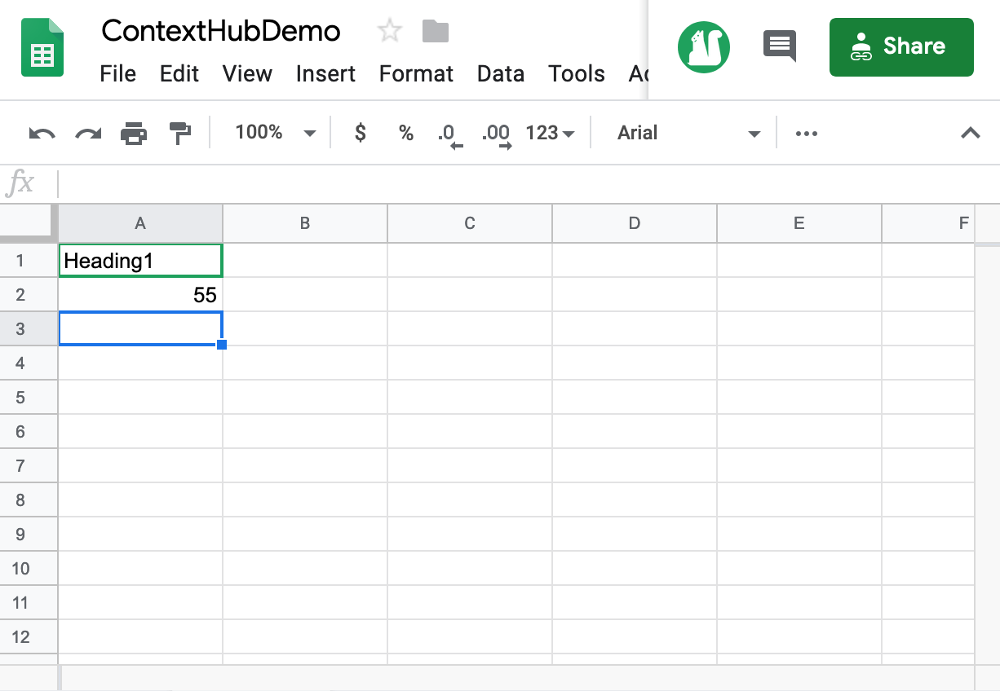

# Ativação da temperatura do centro de viagens {#travel-center-temperature-activation}

O caso de uso a seguir demonstra o uso da ativação da temperatura local do centro de viagem com base nos valores preenchidos nas Planilhas Google.

## Descrição {#description}

Para esse caso de uso, se suas planilhas Google tiverem um valor menor que 50, uma imagem com bebidas quentes será exibida e se o valor for maior ou igual a 50, a imagem com bebidas frias será exibida. No caso de algum outro valor ou nenhum valor, o reprodutor exibirá uma imagem padrão.

## Pré-condições {#preconditions}

Antes de começar a implementar a ativação da temperatura local do centro de viagens, você deve aprender a configurar ***Armazenamento de dados***, ***Segmentação de público*** e ***Ativar o direcionamento para canais*** em um projeto do AEM Screens.

Consulte [Configuração do ContextHub no AEM Screens](configuring-context-hub.md) para obter informações detalhadas.

## Fluxo básico {#basic-flow}

Siga as etapas abaixo para implementar o caso de uso de Ativação de temperatura local do centro de viagem:

1. **Preencher as planilhas do Google**

   1. Navegue até a Folha de Google ContextHubDemo.
   1. Adicionar uma coluna com **Cabeçalho1** com o valor correspondente de temperatura.

   

1. **Configuração dos segmentos em Públicos-alvo de acordo com os requisitos**

   1. Navegue até os segmentos no seu público-alvo (Consulte ***Etapa 2: Configuração da segmentação de público*** in **[Configuração do ContextHub no AEM Screens](configuring-context-hub.md)** para obter mais detalhes).

   1. Selecione o **Folhas A1 1** e clique em **Editar**.

   1. Selecione a propriedade de comparação e clique no ícone de configuração para editar as propriedades.
   1. Selecionar **googlesheets/value/1/0** no menu suspenso em **Nome da propriedade**

   1. Selecione o **Operador** as **maior que ou igual** no menu suspenso

   1. Insira o **Valor** as **50**

   1. Da mesma forma, selecione o **Folhas A1 2** e clique em **Editar**.

   1. Selecione o **Propriedade de comparação - Valor** e clique no ícone configurar para editar as propriedades.
   1. Selecionar **googlesheets/value/1/0** no menu suspenso em **Nome da propriedade**

   1. Selecione o **Operador** as **menor que** no menu suspenso

   1. Insira o **Valor** as **50**

1. Navegue e selecione seu canal () e clique em **Editar** na barra de ações. No exemplo a seguir, **DataDrivenWeather**, um canal sequencial é usado para mostrar a funcionalidade.

   >[!NOTE]
   >
   >Seu canal já deve ter uma imagem padrão e os Públicos-alvo devem ser pré-configurados conforme descrito em [Configuração do ContextHub no AEM Screens](configuring-context-hub.md).

   

   >[!CAUTION]
   >
   >Você deveria ter configurado seu **ContextHub** **Configurações** uso do canal **Propriedades** —> **Personalização** guia.

   

1. Selecionar **Direcionamento** no editor e selecione **Marca** e a variável **Atividade** no menu suspenso e clique em **Iniciar o direcionamento**.

   

1. **Verificação da visualização**

   1. Clique em **Visualizar.** Além disso, abra a Planilha do Google e atualize o valor.
   1. Altere o valor para menos de 50, você deverá ser capaz de visualizar uma imagem das bebidas de verão. Se o valor na Planilha do Google for 50 ou maior do que o deveria ser capaz de visualizar uma imagem de bebida quente.
   
