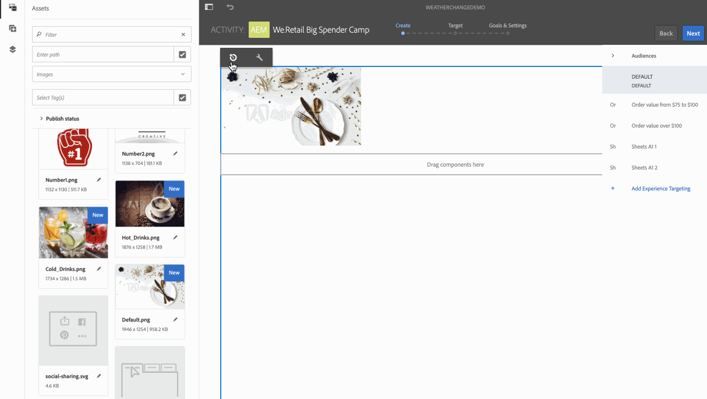

# Ativação da temperatura do centro de viagem {#travel-center-temperature-activation}

O caso de uso a seguir demonstra o uso da ativação de temperatura local da central de viagens com base nos valores preenchidos nas planilhas do Google.

## Descrição {#description}

Nesse caso de uso, se a sua Google Sheets tiver o Valor menor que 50, uma imagem com hot fixes será exibida e se o valor for maior ou igual a 50, então a imagem com refrigerantes será exibida. No caso de algum outro valor ou nenhum valor, o reprodutor exibirá uma imagem padrão.

## Pré-condições {#preconditions}

Antes de começar a implementar a ativação de temperatura local do centro de viagens, você deve aprender a configurar ***Data Store***, ***Segmentação de público-alvo*** e ***Ativar a segmentação para canais*** em um projeto do AEM Screens.

Consulte [Configuração do ContextHub no AEM Screens](configuring-context-hub.md) para obter informações detalhadas.

## Fluxo básico {#basic-flow}

Siga as etapas abaixo para implementar o caso de uso de Ativação de temperatura local do Centro de viagens:

1. **Preencher as planilhas do Google**

   1. Navegue até o ContextHubDemo Google Sheet.
   1. Adicione uma coluna com **Cabeçalho1** com o valor correspondente para temperatura.

   

1. **Configuração dos segmentos em Públicos-alvo de acordo com os requisitos**

   1. Navegue até os segmentos em seu público-alvo (Consulte ***Etapa 2: Configuração da segmentação de público-alvo*** em **[Configuração do ContextHub na página AEM Screens](configuring-context-hub.md)** para obter mais detalhes).

   1. Selecione as **Planilhas A1 1** e clique em **Editar**.

   1. Selecione a propriedade de comparação e clique no ícone configurar para editar as propriedades.
   1. Selecione **googlesheets/value/1/0** no menu suspenso em **Nome da propriedade**

   1. Selecione o **Operador** como **maior ou igual a** no menu suspenso

   1. Insira o **Value** como **50**

   1. Da mesma forma, selecione as **Sheets A1 2** e clique em **Edit**.

   1. Selecione a **Propriedade de Comparação - Valor** e clique no ícone de configuração para editar as propriedades.
   1. Selecione **googlesheets/value/1/0** no menu suspenso em **Nome da propriedade**

   1. Selecione o **Operator** como **less-than** no menu suspenso

   1. Insira o **Value** como **50**

1. Navegue e selecione seu canal () e clique em **Editar** na barra de ações. No exemplo a seguir, **DataDrivenWeather**, um canal sequencial é usado para mostrar a funcionalidade.

   >[!NOTE]
   >
   >Seu canal já deve ter uma imagem padrão e os Públicos-alvo devem ser pré-configurados conforme descrito em [Configuração do ContextHub no AEM Screens](configuring-context-hub.md).

   

   >[!CAUTION]
   >
   >Você deve ter configurado seu **ContextHub** **Configurações** usando a guia **Propriedades** —> **Personalização** do canal.

   

1. Selecione **Direcionamento** no editor e selecione **Marca** e **Atividade** no menu suspenso e clique em **Iniciar Direcionamento**.

   

1. **Verificar a visualização**

   1. Clique em **Visualizar.** Além disso, abra o Google Sheet e atualize seu valor.
   1. Altere o valor para menos de 50, você poderá visualizar a imagem das bebidas de verão. Se o valor na Folha do Google for 50 ou maior do que deveria ser capaz de visualizar a imagem de uma bebida quente.

   

