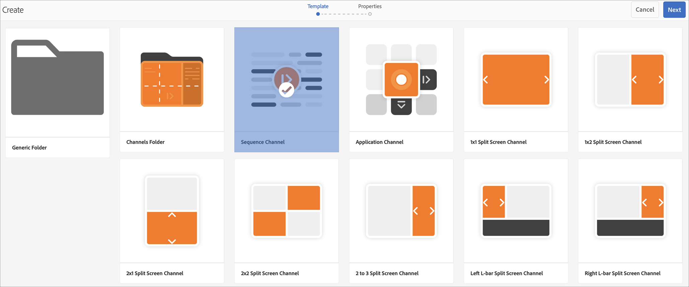
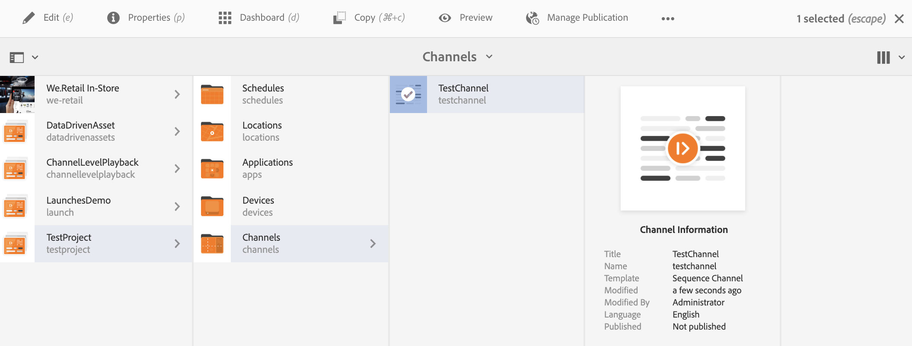

# Criação e gerenciamento de canais {#creating-and-managing-channels}

Um Canal exibe uma sequência de conteúdo (imagens e vídeos) e também exibe um site ou um aplicativo de página única.

Esta página mostra como criar e gerenciar canais para o AEM Screens.

**Pré-requisitos**:

* [Configuração e implantação do Screens](configuring-screens-introduction.md)
* [Criar e gerenciar projeto do Screens](creating-a-screens-project.md)

## Criação de um novo canal {#creating-a-new-channel}

Depois de criar seu projeto para o AEM Screens, siga as etapas abaixo para criar um Canal para seu projeto:

1. Clique no link Adobe Experience Manager (parte superior esquerda) e, em seguida, em Screens. Como alternativa, você pode navegar diretamente para `https://localhost:4502/screens.html/content/screens`.

1. Navegue até o projeto do Screens e clique no **Canais** pasta.

1. Clique em **Criar** na barra de ações.

   

1. Clique em **Canal de sequência** modelo do **Criar** e clique em **Próxima**.

   

1. Insira o Título como **ScreensChannel** e clique em **Criar**.

   

1. Um canal de sequência agora é adicionado ao **Canais** pasta.

### Tipos de canal {#channel-types}

As seguintes opções de modelo estão disponíveis ao usar o assistente, como:

| **Opção de modelo** | **Descrição** |
|---|---|
| Pasta de canais | Crie uma pasta para armazenar uma coleção de canais. |
| Canal de sequência | Crie um canal que reproduza os componentes sequencialmente (um por um em uma apresentação de slides). |
| Canal do aplicativo | Mostre seu aplicativo web personalizado no reprodutor do Screens. |
| Canal de tela dividida 1x1 | Visualização de um componente em uma única região. |
| Canal de tela dividida 1x2 | Visualize os ativos em duas zonas (divididas horizontalmente). |
| Canal De Tela Dividida 2X1 | Visualize os ativos em duas zonas (divididas verticalmente). |
| Canal de tela dividida 2x2 | Visualizar os ativos em quatro zonas (divididas horizontal e verticalmente em uma matriz). |
| Canal de 2 a 3 telas divididas | Visualize os ativos em duas zonas (divididas horizontalmente) com uma das zonas sendo maior que a outra. |
| Canal de tela dividida em L à esquerda ou à direita | Os autores de conteúdo podem visualizar diferentes tipos de ativos em zonas de tamanho adequado. |

>[!NOTE]
>
>Os canais de tela dividida dividem a exibição em várias zonas para que você possa reproduzir várias experiências ao mesmo tempo, lado a lado. As experiências podem ser ativos/texto estáticos ou sequências incorporadas.

>[!IMPORTANT]
>
>Depois de criar e adicionar conteúdo ao canal, a próxima etapa é criar um local seguido pela criação de uma exibição. Além disso, atribua esse canal a uma exibição. Consulte os recursos abaixo no final da seção.

## Trabalhar com canais {#working-with-channels}

É possível editar, exibir propriedades e painel, copiar, visualizar e excluir um canal.

### Adicionar/Editar conteúdo a um canal {#adding-editing-content-to-a-channel}

Para adicionar ou editar conteúdo em um canal, siga as etapas abaixo:

1. Clique no canal que deseja editar (como mostrado na figura acima).
1. Clique em **Editar** no canto superior esquerdo da barra de ação para que você possa editar as propriedades do canal. O editor é aberto e permite adicionar ativos/componentes ao canal que você deseja publicar.

>[!NOTE]
>Você pode adicionar componentes ao seu canal. Consulte **[Adicionar componentes a um canal](adding-components-to-a-channel.md)** para obter mais detalhes.

**Carregamento de vídeos para o canal**

Siga as etapas abaixo para fazer upload de vídeos para seu canal:

1. Clique no canal no qual deseja fazer upload do vídeo.
1. Clique em **Editar** na barra de ações.
1. No editor, clique em **Vídeos** em Ativos e arraste e solte os vídeos necessários.

>[!NOTE]
>Se tiver problemas ao carregar vídeos no seu canal, consulte [Vídeos de solução de problemas](troubleshoot-videos.md).

### Visualização ou edição das propriedades de um canal {#viewing-properties}

1. Clique no Canal que deseja editar.
1. Clique em **Propriedades** na barra de ações, para exibir/editar as propriedades do canal. A guia a seguir permite alterar as opções.

### Visualizando painel {#viewing-dashboard}

1. Clique no canal que deseja editar.
1. Clique em **Painel** na barra de ações.

### Informações do canal {#channel-information}

O painel Informações do canal descreve as propriedades do canal, juntamente com a pré-visualização do canal. Além disso, fornece informações sobre se o canal está offline ou online.

Clique no botão **..**) do **INFORMAÇÕES DO CANAL** barra de ações para exibir propriedades, editar o conteúdo ou atualizar o cache (conteúdo offline) do canal.

#### Exibição do manifesto {#view-manifest}

É possível exibir o manifesto no painel do canal.

>[!IMPORTANT]
>Essa opção só está disponível com o Feature Pack 8 para AEM 6.4 ou AEM 6.5 Feature Pack 4.

Siga estas etapas para habilitar essa opção no painel de canal:

1. **Definir o canal como offline**
   1. Clique no canal e em **Propriedades** na barra de ações
   1. Navegue até a **Canal** e certifique-se de desmarcar **Modo de desenvolvedor (forçar canal a ficar online)** opção
   1. Clique em **Salvar e fechar**
1. **Atualizar conteúdo offline**
   1. Clique no canal e em **Painel** na barra de ações
   1. Navegue até a **INFORMAÇÕES DO CANAL** e clique em *..*
   1. Clique em **Atualizar conteúdo offline**

Você deve ver o **Exibir manifesto** opção no **INFORMAÇÕES DO CANAL** no painel Canal.

### Canais online e offline {#online-and-offline-channels}

>[!NOTE]
>Por padrão, quando você cria um canal, ele fica Offline.

Ao criar um canal, ele pode ser definido como online ou offline.

Um ***Canal online*** mostra o conteúdo atualizado no ambiente em tempo real, enquanto uma ***Canal offline*** mostra o conteúdo em cache.

Siga as etapas abaixo para tornar o canal online:

1. Navegue até o canal como **TestProject** > **Canais** > **TestChannel**.

   Clique no canal.

   

   Clique em **Painel** na barra de ações, para que seja possível visualizar o status do reprodutor. A variável **INFORMAÇÕES DO CANAL** O painel fornece informações sobre se o canal está online ou offline.

   

1. Clique em **Propriedades** na barra de ações e navegue até a guia **Canal** conforme mostrado abaixo:

   

1. Verifique a **Desenvolvedor** **(forçar o canal a ficar online)** para tornar o canal online.

   Clique em **Salvar e fechar** para salvar sua opção.

   

   Volte para o painel do canal e agora o **INFORMAÇÕES DO CANAL** mostra o status online do reprodutor.

   

>[!NOTE]
>Para configurar seu canal novamente como offline, desmarque a opção Developer mode na **Propriedades** (conforme mostrado na etapa 3). Em seguida, do **INFORMAÇÕES DO CANAL** clique no painel **Atualizar conteúdo offline**, conforme mostrado na figura abaixo.

#### Atualizações automáticas e manuais no painel de dispositivos {#automatic-versus-manual-updates-from-the-device-dashboard}

A tabela a seguir resume os eventos associados às atualizações automáticas e manuais no painel de dispositivos.

<table>
 <tbody>
  <tr>
   <td><strong>Evento</strong></td>
   <td><strong>Atualização Automática de Dispositivo</strong></td>
   <td><strong>Atualização manual do dispositivo</strong></td>
  </tr>
  <tr>
   <td>Alteração no canal online</td>
   <td>O conteúdo é atualizado automaticamente</td>
   <td>
Conteúdo atualizado em "Dispositivo: configuração por push"
 
Ou,
 
Conteúdo atualizado em <strong><i>Device: Restart</i></strong>
 </td>
  </tr>
  <tr>
   <td>Alteração no canal offline, mas o canal "Conteúdo push" NÃO é acionado (nenhuma recriação de pacote offline)</td>
   <td>Nenhuma atualização de conteúdo</td>
   <td>Nenhuma atualização de conteúdo</td>
  </tr>
  <tr>
   <td>A alteração no canal offline e no canal "Conteúdo push" é acionada (novo pacote offline)</td>
   <td>O conteúdo é atualizado automaticamente</td>
   <td>
Conteúdo atualizado em <strong><i>Device: configuração de push</i></strong>
 
Ou,
 
Conteúdo atualizado em <strong><i>Device: Restart</i></strong>
 </td>
  </tr>
  <tr>
   <td>
Alteração na configuração

    <ul>
     <li>Exibição (canal forçado)</li>
     <li>Device</li>
     <li>Atribuições de canal (novo canal, canal removido)</li>
     <li>Atribuição de canal (função, evento, agendamento)</li>
    </ul> </td>
   <td>A configuração é atualizada automaticamente</td>
   <td>
A configuração é atualizada em <strong><i>Device: configuração de push</i></strong>
 
Ou,
 
Configuração atualizada em <strong><i>Device: Restart</i></strong>
 </td>
  </tr>
 </tbody>
</table>

### Exibições atribuídas {#assigned-displays}

A variável **Exibições atribuídas** mostra a exibição associada ao canal. Ele fornece um instantâneo da exibição atribuída junto com a resolução.

As exibições associadas estão listadas no **Exibições atribuídas** como mostrado abaixo:

>[!NOTE]
>Para saber mais sobre como criar uma exibição em um local, consulte:
>
>* [Criar e Gerenciar Locais](managing-locations.md)
>* [Criar e gerenciar exibições](managing-displays.md)
>

Além disso, clique na exibição no **EXIBIÇÕES ATRIBUÍDAS** para exibir as informações de exibição, conforme mostrado abaixo:

### Próximas etapas {#the-next-steps}

A próxima etapa após criar um canal e adicionar/editar conteúdo no canal é aprender a criar um local e uma exibição. Além disso, atribua um canal a essa exibição.

Consulte os seguintes recursos para as próximas etapas:

* [Criar e gerenciar canais](managing-channels.md)
* [Criar e Gerenciar Locais](managing-locations.md)
* [Criar e gerenciar exibições](managing-displays.md)
