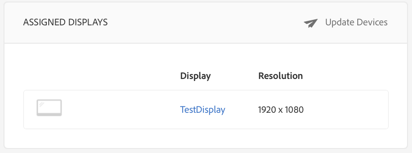

# Criação e gerenciamento de canais {#creating-and-managing-channels}

Um Canal exibe uma sequência de conteúdo (imagens e vídeos) e também exibe um site ou um aplicativo de página única.

Esta página mostra como criar e gerenciar canais para o AEM Screens.

**Pré-requisitos**:

* [Configuração e implantação do Screens](configuring-screens-introduction.md)
* [Criar e gerenciar o projeto do Screens](creating-a-screens-project.md)

## Criação de um novo canal {#creating-a-new-channel}

Depois de criar seu projeto para o AEM Screens, siga as etapas abaixo para criar um novo Canal para o seu projeto:

1. Selecione o link do Adobe Experience Manager (canto superior esquerdo) e, em seguida, o Screens. Como alternativa, você pode navegar diretamente para `https://localhost:4502/screens.html/content/screens`.

1. Navegue até o projeto do Screens e selecione a pasta **Canais**.

1. Clique em **Criar** na barra de ações.

   

1. Selecione o modelo **Canal de sequência** do assistente **Criar** e clique em **Próximo**.

   

1. Insira o Título como **ScreensChannel** e clique em **Criar**.

   

1. Um Canal de sequência agora é adicionado à pasta **Channels**.

### Tipos de canais {#channel-types}

As seguintes opções de modelo estão disponíveis ao usar o assistente, entre elas:

| **Opção de modelo** | **Descrição** |
|---|---|
| Pasta de canais | Permite criar uma pasta para armazenar uma coleção de canais. |
| Canal de sequência | Permite criar um canal que reproduz os componentes sequencialmente (um por um em uma apresentação de slides). |
| Canal do aplicativo | Permite mostrar seu aplicativo web personalizado no player do Screens. |
| Canal de tela dividida 1x1 | Permite visualizar o componente em uma única zona. |
| Canal de tela dividida 1x2 | Permite visualizar os ativos em duas zonas (divididas horizontalmente). |
| Canal de tela dividida 2X1 | Permite exibir os ativos em duas zonas (divididas verticalmente). |
| Canal de tela dividida 2x2 | Permite visualizar os ativos em quatro zonas (divididas horizontal e verticalmente em uma matriz). |
| Canal de 2 a 3 telas divididas | Permite visualizar os ativos em duas zonas (divididas horizontalmente), com uma das zonas maior que a outra. |
| Canal de tela dividida da barra L esquerda ou direita | Permite que os autores de conteúdo visualizem diferentes tipos de ativos em zonas de tamanho apropriado. |

>[!NOTE]
>
>Os canais de Tela dividida dividem a exibição em várias zonas para que você possa reproduzir várias experiências ao mesmo tempo, lado a lado. As experiências podem ser ativos/texto estáticos ou sequências incorporadas.

>[!IMPORTANT]
>
> Depois de criar e adicionar conteúdo ao seu canal, o próximo passo é criar uma localização seguida pela criação de uma exibição. Além disso, você precisa atribuir esse canal a uma exibição. Consulte os recursos abaixo no final da seção para saber mais.

## Trabalhar com canais {#working-with-channels}

Você pode editar, exibir propriedades e o painel, copiar, visualizar e excluir um canal.

### Adição/edição de conteúdo em um canal {#adding-editing-content-to-a-channel}

Para adicionar ou editar conteúdo em um canal, siga as etapas abaixo:

1. Selecione o canal que deseja editar (como mostrado na figura acima).
1. Clique em **Editar** no canto superior esquerdo da barra de ações para editar as propriedades do canal. O editor é aberto e permite adicionar ativos/componentes ao canal que você deseja publicar.

>[!NOTE]
>Você pode adicionar componentes ao seu canal. Consulte **[Adicionar componentes a um canal](adding-components-to-a-channel.md)** para obter mais detalhes.

**Upload de vídeos no canal**

Siga as etapas abaixo para fazer upload de vídeos no seu canal:

1. Selecione o canal onde você deseja fazer upload do vídeo.
1. Clique em **Editar** na barra de ações para abrir o editor.
1. Selecione **Vídeos** em Ativos e arraste e solte os vídeos necessários.

>[!NOTE]
>Se encontrar problemas ao fazer upload de vídeos no seu canal, consulte [Resolução de problemas de vídeos](troubleshoot-videos.md).

### Exibição de propriedades {#viewing-properties}

Para exibir ou editar as propriedades de um canal, siga as etapas abaixo:

1. Clique no Canal que deseja editar.
1. Clique em **Properties** na barra de ações para exibir/editar as propriedades do canal. As guias a seguir permitem que você altere as opções.

### Visualização do painel {#viewing-dashboard}

Para visualizar o painel de um canal, siga as etapas abaixo:

1. Selecione o canal que deseja editar.
1. Clique em **Dashboard** na barra de ações para visualizar o painel. O painel **INFORMAÇÕES DO CANAL**,**EXIBIÇÕES ATRIBUÍDAS** e **INICIALIZAÇÕES PENDENTES** é aberto, conforme mostrado na figura abaixo:

### Informações do canal {#channel-information}

O painel Informações do canal descreve as propriedades do Canal, juntamente com a visualização do canal. Além disso, informa se o canal está offline ou online.

Clique em (**...**) na barra de ações **INFORMAÇÕES DO CANAL** para exibir propriedades, editar o conteúdo ou atualizar o cache (conteúdo offline) do canal.

#### Exibindo o Manifesto {#view-manifest}

Você pode exibir o manifesto no painel do canal.

>[!IMPORTANT]
>Essa opção só está disponível com o AEM 6.4 Feature Pack 8 ou AEM 6.5 Feature Pack 4.

Siga estas etapas para ativar essa opção no painel de canais:

1. **Definir o canal como offline**
   1. Selecione o canal e selecione **Propriedades** na barra de ações
   1. Navegue até a guia **Channel** e certifique-se de desmarcar **Developer Mode (forçar o canal a ficar online)** a opção
   1. Clique em **Salvar e fechar**
1. **Atualizar conteúdo offline**
   1. Selecione o canal e selecione **Dashboard** na barra de ações
   1. Navegue até o painel **INFORMAÇÕES DO CANAL** e clique em *...*
   1. Clique em **Atualizar Conteúdo Offline**

Você deve ver a opção **Exibir Manifesto** no painel **INFORMAÇÕES DO CANAL** no painel Canal.

### Canais online e offline {#online-and-offline-channels}

>[!NOTE]
>Por padrão, ao criar um canal, ele fica offline.

Quando você cria um canal, ele pode ser definido como online ou offline.

Um ***Canal online*** mostrará o conteúdo atualizado no ambiente em tempo real, enquanto um ***Canal offline*** mostrará o conteúdo em cache.

Siga as etapas abaixo para tornar o canal online:

1. Navegue até o canal como **TestProject** --> **Canais** --> **TestChannel**.

   Selecione o canal.

   

   Clique em **Dashboard** na barra de ações para visualizar o status do player. O painel **INFORMAÇÕES DO CANAL** informa se o canal está online ou offline.

   

1. Clique em **Propriedades** na barra de ações e navegue até a guia **Canal**, conforme mostrado abaixo:

   

1. Marque o modo **Developer** **(forçar o canal a ficar online)** para tornar o canal online.

   Clique em **Salvar e fechar** para salvar sua opção.

   

   Navegue de volta ao painel do canal e agora o painel **INFORMAÇÕES DO CANAL** mostra o status online do player.

   

>[!NOTE]
>Se quiser configurar seu canal novamente como offline, desmarque a opção Developer mode na guia **Properties** (conforme mostrado na etapa (3)) e, no painel **CHANNEL INFORMATION**, clique em **Update Offline Content**, conforme mostrado na figura abaixo.

#### Atualizações automáticas versus atualizações manuais no painel Dispositivos {#automatic-versus-manual-updates-from-the-device-dashboard}

A tabela a seguir resume os eventos associados às atualizações automáticas e manuais do painel Dispositivos.

<table>
 <tbody>
  <tr>
   <td><strong>Evento</strong></td>
   <td><strong>Atualização automática do dispositivo</strong></td>
   <td><strong>Atualização manual do dispositivo</strong></td>
  </tr>
  <tr>
   <td>Alteração no canal online</td>
   <td>Conteúdo atualizado automaticamente</td>
   <td>
Conteúdo atualizado em "Dispositivo: Push Config"
 
Ou,
 
Conteúdo atualizado em <strong><i>Dispositivo: Reiniciar</i></strong>
 </td>
  </tr>
  <tr>
   <td>Alteração no canal offline, mas o canal "Enviar conteúdo" NÃO é acionado (nenhuma recriação de pacote offline)</td>
   <td>Sem atualização de conteúdo</td>
   <td>Sem atualização de conteúdo</td>
  </tr>
  <tr>
   <td>A alteração no Canal offline e no Canal "Conteúdo de push" é acionada (novo pacote offline)</td>
   <td>Conteúdo atualizado automaticamente</td>
   <td>
Conteúdo atualizado em <strong><i>Dispositivo: Push Config</i></strong>
 
Ou,
 
Conteúdo atualizado em <strong><i>Dispositivo: Reiniciar</i></strong>
 </td>
  </tr>
  <tr>
   <td>
Alteração na configuração

    <ul>
     <li>Exibir (canal forçado)</li>
     <li>Device</li>
     <li>Atribuições de canal (novo canal, canal removido)</li>
     <li>Atribuição de canal (função, evento, agendamento)</li>
    </ul> </td>
   <td>Configuração atualizada automaticamente</td>
   <td>
Configuração atualizada no <strong><i>Dispositivo: Push Config</i></strong>
 
Ou,
 
Configuração atualizada no <strong><i>Dispositivo: Reiniciar</i></strong>
 </td>
  </tr>
 </tbody>
</table>

### Exibições atribuídas {#assigned-displays}

O painel Exibições atribuídas mostra a exibição associada ao canal. Ele fornece um instantâneo da exibição atribuída junto com a resolução.

As exibições associadas serão listadas no painel **Exibições atribuídas**, conforme mostrado abaixo:

>[!NOTE]
>Para saber mais sobre como criar uma exibição em uma localização, consulte:
>
>* [Criar e gerenciar locais](managing-locations.md)
>* [Criar e gerenciar exibições](managing-displays.md)

>

Além disso, clique na exibição do painel **EXIBIÇÕES ATRIBUÍDAS** para visualizar as informações de exibição, conforme mostrado abaixo:

### Próximas etapas {#the-next-steps}

O próximo passo depois de criar um canal e adicionar/editar conteúdo nele é aprender a criar uma localização e uma exibição. Além disso, atribua um canal a essa exibição.

Veja os seguintes recursos para conhecer as próximas etapas:

* [Criar e gerenciar canais](managing-channels.md)
* [Criar e gerenciar locais](managing-locations.md)
* [Criar e gerenciar exibições](managing-displays.md)

