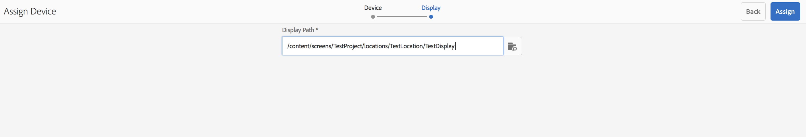

# Gerenciamento de dispositivos {#managing-devices}

Esta página descreve a atribuição de dispositivo.

O console Dispositivos permite acessar o gerenciador de dispositivos para atribuir seu dispositivo a um monitor.

>[!CAUTION]
>
>Antes de atribuir seu dispositivo, é necessário registrá-lo. Para obter mais informações, consulte [Registro de dispositivo](device-registration.md).

## Atribuição de dispositivo {#device-assignment}

Siga as etapas abaixo para atribuir um dispositivo a um monitor:

1. Navegue até a pasta Dispositivos do seu projeto, por exemplo

   `http://localhost:4502/screens.html/content/screens/TestProject`

   

1. Select your **Devices** folder and tap/click **Device Manager** in the action bar. Os dispositivos atribuídos e não atribuídos serão exibidos.

   

1. Select an unassigned device from the list, and tap/click the **Assign Device** in the action bar.

   

1. Select the display you want to assign the device to from the list, and tap/click the **Assign**.

   

1. Tap/click the **Finish** to complete the assignment process.

   

   O painel de monitores apresenta o dispositivo atribuído no painel **DISPOSITIVOS**.

   

   Clique em (**...**) no canto superior direito do painel **DISPOSITIVOS** para adicionar uma configuração de dispositivo ou para atualizar os dispositivos.

   

>[!NOTE]
>
>Cada vez que o primeiro dispositivo é adicionado a um novo projeto do Screens, um grupo de usuários é criado.
>For instance, if the project node name is *we-retail*, then the user group name is *screens-we-retail-devices*.
>Esse grupo será adicionado como um membro do grupo **Contribuidores**, como mostrado na figura abaixo:

### Próximas etapas {#the-next-steps}

Uma vez familiarizado com a atribuição de canal a um monitor, consulte os seguintes recursos:

* [Monitor e solução de problemas](monitoring-screens.md) 

