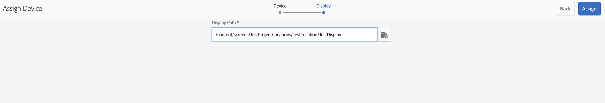
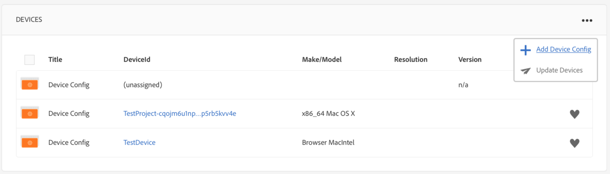

# Gerenciar dispositivos {#managing-devices}

>[!IMPORTANT]
>Esse conteúdo é válido para o AEM no local/AMS (AEM 6.5LTS e AEM 6.5). Para ver o conteúdo do AEM as a Cloud Service Screens, consulte o [guia do AEM as a Cloud Service](https://experienceleague.adobe.com/en/docs/experience-manager-cloud-service/content/screens-as-cloud-service/overview/introduction).

Esta página descreve a atribuição do dispositivo.

O console Dispositivos permite acessar o gerenciador de dispositivos para atribuir seu dispositivo a uma exibição.

>[!CAUTION]
>
>Antes de atribuir seu dispositivo, registre-o. Consulte [Registro de Dispositivo](device-registration.md).

## Atribuição de dispositivo {#device-assignment}

Siga as etapas abaixo para atribuir um dispositivo a uma exibição:

1. Navegue até a pasta Dispositivos do projeto, por exemplo

   `http://localhost:4502/screens.html/content/screens/TestProject`

   

1. Clique na pasta **Dispositivos** e clique em **Gerenciador de Dispositivos** na barra de ações. Os dispositivos atribuídos e não atribuídos são exibidos.

   

1. Clique em um dispositivo não atribuído na lista e, na barra de ações, clique em **Atribuir dispositivo**.

   

1. Clique na exibição à qual você deseja atribuir o dispositivo na lista e clique em **Atribuir**.

   

1. Clique em **Concluir** para concluir o processo de atribuição.

   O painel de exibição exibe o dispositivo atribuído no painel **DISPOSITIVOS**.

   

   Clique em (**...**) no canto superior direito do painel **DISPOSITIVOS** para adicionar a configuração do dispositivo ou atualizar os dispositivos.

   

>[!NOTE]
>
>Toda vez que o primeiro dispositivo é adicionado a um novo projeto do Screens, um grupo de usuários é criado.Por exemplo, se o nome do nó do projeto for *we-retail*, o nome do grupo de usuários será *screens-we-retail-devices*.Este grupo é adicionado como membro do grupo **Contribuidores**, conforme mostrado na figura abaixo:

### Próximas etapas {#the-next-steps}

Depois de conhecer a atribuição de canal a uma exibição, consulte t[Monitorar e solucionar problemas](monitoring-screens.md).

