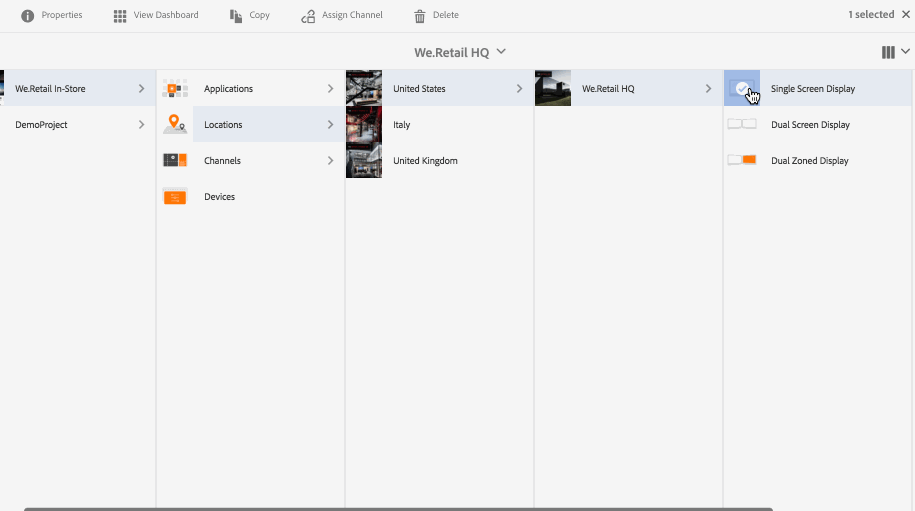

# Criação e gerenciamento de exibições {#creating-and-managing-displays}

Uma exibição é um agrupamento virtual de telas que, geralmente, são posicionadas próximas umas das outras. A exibição é, em geral, permanente com relação a uma instalação. Esse será o objeto no qual os autores de conteúdo irão trabalhar e é sempre referenciado como uma exibição lógica em vez de suas contrapartes físicas.

Depois de criar uma localização, você precisa criar uma nova exibição para ela.

Esta página mostra como criar e gerenciar as exibições do Screens.

**Pré-requisitos**:

* [Configuração e implantação do Screens](configuring-screens-introduction.md)
* [Criar e gerenciar projetos de telas](creating-a-screens-project.md)
* [Criar e gerenciar canais](managing-channels.md)
* [Criar e gerenciar locais](managing-locations.md)

## Criação de uma nova exibição {#creating-a-new-display}

>[!NOTE]
>
>É necessário criar uma localização para criar uma exibição. To see how to create a location, see [Create and Manage Locations](managing-locations.md) for more information.

Para criar uma nova exibição na localização, siga as seguintes etapas:

1. Navigate to the appropriate location, for example `http://localhost:4502/screens.html/content/screens/TestProject`.
1. Select your location folder and tap/click **Create** next to the plus icon in the action bar. Um assistente será aberto.
1. Select **Display** from the **Create** wizard and click **Next**.

1. Enter **Name** and **Title** for your display location.

1. Under the **Display** tab, choose the details of the Layout. Choose the desired **Resolution** (example as, as **Full HD**). Além disso, você pode escolher o número de dispositivos horizontal e verticalmente.

1. Clique em **Criar**.

The display (*StoreDisplay*) is created and added to the location (*SanJose*).

Quando tiver a exibição em posição, a próxima etapa será criar uma configuração de dispositivo para essa exibição específica. Siga a seção abaixo para criar uma nova configuração de dispositivo.

>[!NOTE]
>
>**A próxima etapa**:
>
>Depois de criar a exibição para a localização, você deve atribuir um canal a ela para aproveitar o conteúdo.
>
>See [Assign Channels](channel-assignment.md) section to learn how to assign a channel to the display.

## Criação de uma nova configuração de dispositivo {#creating-a-new-device-config}

Uma configuração de dispositivo atua como um espaço reservado para um dispositivo de assinatura digital real que ainda não foi instalado.

Siga as etapas abaixo para criar uma nova configuração de dispositivo:

1. Navegue até a exibição apropriada, por exemplo, `http://localhost:4502/screens.html/content/screens/TestProject/locations/newlocation`.
1. Select your display folder and tap/click **View Dashboard** in the action bar.
1. Tap/click the **+ Add Device Config** on the top right of the **Devices** panel.

1. Select the **Device Config** as the required template as and tap/click **Next**.

1. Enter the properties as required and tap/click **Create**.

The device config is created and added to the current display (in the following demonstration, the new device config is *DeviceConfig*).

Quando uma configuração de dispositivo for definida para a exibição na localização, a próxima etapa será atribuir um canal à exibição.

>[!NOTE]
>
>Quando uma configuração de dispositivo for definida para a exibição na localização, a próxima etapa será atribuir um canal à exibição.
>
>As shown in the figure below, if the device config is displayed as unassigned in the **DEVICES** pannel, if no channel is assigned to that particular device config.
>
>Você deve compreender como criar e gerenciar canais. Consulte [Criar e gerenciar canais](managing-channels.md) para obter mais detalhes.

## Painel Exibição {#display-dashboard}

O painel Exibição oferece diferentes painéis para gerenciar os dispositivos de exibição e as configurações do seu dispositivo.

>[!NOTE]
>
>É possível selecionar as listas de painel e executar ações em massa nos itens, em vez de processar cada item individualmente.
>
>Por exemplo, a imagem a seguir mostra como você pode selecionar vários canais no painel de exibição.

### Painel de Informações sobre a exibição {#display-information-panel}

O painel **INFORMAÇÕES SOBRE A EXIBIÇÃO** fornece as propriedades de exibição.

Click on the (**...**) in the top right corner in the **DISPLAY INFORMATION **panel to view the properties and preview the display.

#### Exibição de propriedades {#viewing-properties}

Clique em **Propriedades** para ver ou alterar as propriedades da sua exibição.

Additionally, you can adjust the event timer value for your interactive channel in **Idle timeout **property under **Display** tab. O valor padrão é definido para *300 segundos*.

Use **CRXDE Lite**, to access the **idleTimeout** property, that is, `http://localhost:4502/crx/de/index.jsp#/content/screens/we-retail/locations/demo/flagship/single/jcr%3Acontent/channels` .

### Painel Canais atribuídos {#assigned-channels-panel}

O painel **CANAIS ATRIBUÍDOS** mostra os canais atribuídos a este dispositivo.

### Painel Dispositivos {#devices-panel}

O painel **DISPOSITIVOS** fornece informações sobre configurações de dispositivos.

Click on the (**...**) in the top right corner in the **DEVICES **panel to add device configs and update devices.

Além disso, clique na configuração do dispositivo para exibir as propriedades, atribuir um dispositivo ou excluí-lo completamente.

#### Próximas etapas {#the-next-steps}

Depois de concluir a criação de uma exibição para a localização, você deve atribuir um canal à exibição.

See [Assign Channels](channel-assignment.md) for more details.
