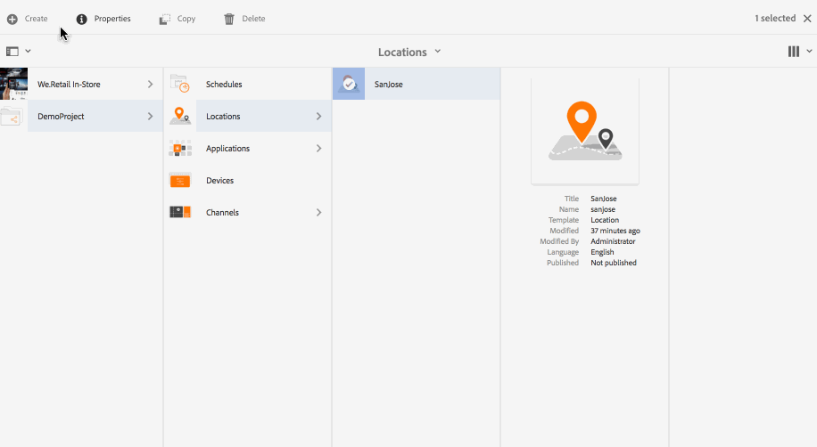
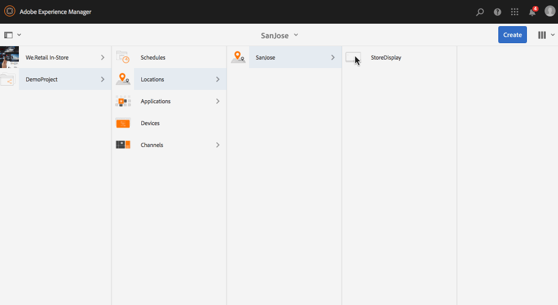
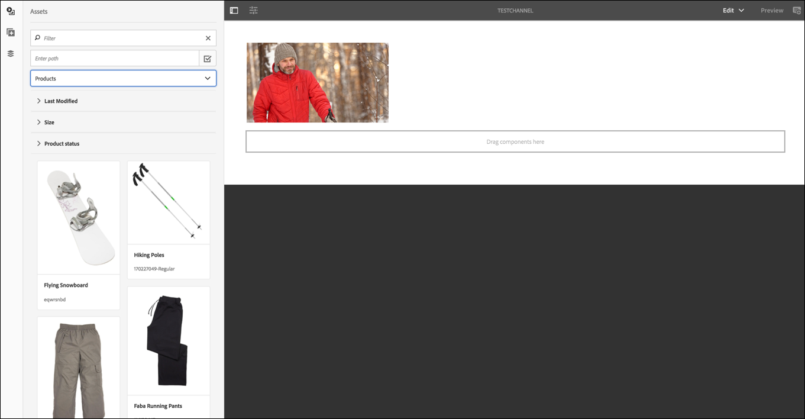
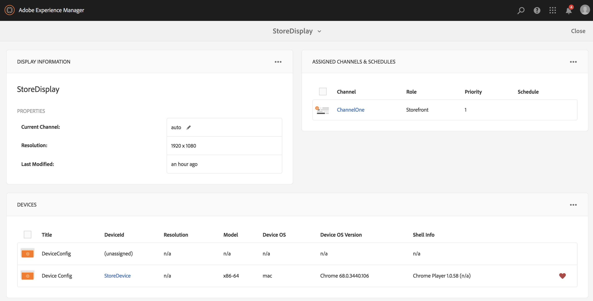
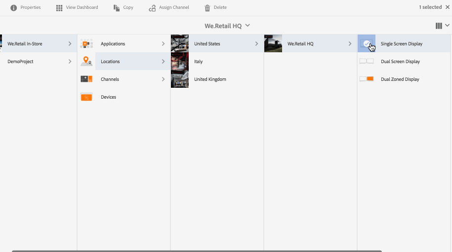
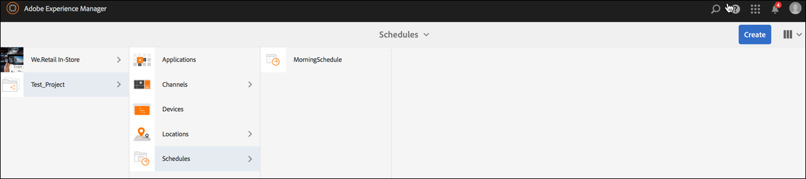

# Criando e Gerenciando Exibições {#creating-and-managing-displays}

>[!IMPORTANT]
>Esse conteúdo é válido para o AEM no local/AMS (AEM 6.5LTS e AEM 6.5). Para ver o conteúdo do AEM as a Cloud Service Screens, consulte o [guia do AEM as a Cloud Service](https://experienceleague.adobe.com/en/docs/experience-manager-cloud-service/content/screens-as-cloud-service/overview/introduction).

Uma exibição é um agrupamento virtual de telas posicionadas uma ao lado da outra. O visor é permanente para uma instalação. É o objeto com o qual os autores de conteúdo trabalham e sempre se referem como exibição lógica, em vez de suas contrapartes físicas.

Ao criar um local, é necessário criar uma exibição para o seu local.

Esta página mostra como criar e gerenciar exibições para o Screens.

**Pré-requisitos**:

* [Configuração e implantação do Screens](configuring-screens-introduction.md)
* [Criar e gerenciar projeto do Screens](creating-a-screens-project.md)
* [Criar e gerenciar canais](managing-channels.md)
* [Criar e Gerenciar Locais](managing-locations.md)

## Criação de uma nova exibição {#creating-a-new-display}

>[!NOTE]
>
>Crie um local antes de criar uma exibição. Consulte [Criar e Gerenciar Locais](managing-locations.md) para obter mais informações.

1. Navegue até o local apropriado, por exemplo `http://localhost:4502/screens.html/content/screens/TestProject`.
1. Clique na pasta de seu local e em **Criar**, que está ao lado do ícone de adição na barra de ações.
1. Clique em **Exibir** do assistente **Criar** e em **Avançar**.
1. Digite seu **Nome** e **Título** para o seu local de exibição.
1. Na guia **Exibir**, escolha os detalhes do Layout. Escolha a **Resolução** desejada, como **Full HD**. Escolha o número de dispositivos horizontal e verticalmente.
1. Clique em **Criar**.

A exibição (*StoreDisplay*) foi criada e adicionada ao local (*SanJose*).

Quando você tem uma exibição na posição, a próxima etapa é criar uma configuração de dispositivo para essa exibição específica.

>[!NOTE]
>
>**A Próxima Etapa**:
>
>Ao criar uma exibição para sua localização, atribua um canal à exibição para usar o conteúdo.
>
>Consulte a seção [Atribuir Canais](channel-assignment.md) para saber como atribuir um canal à exibição.

## Criando uma nova configuração de dispositivo {#creating-a-new-device-config}

Uma configuração de dispositivo atua como um espaço reservado para um dispositivo de sinalização digital real que ainda não está instalado.

1. Navegue até a exibição apropriada, por exemplo, `http://localhost:4502/screens.html/content/screens/TestProject/locations/newlocation`.
1. Clique na pasta de exibição e em **Exibir Painel** na barra de ações.
1. Clique em **+ Adicionar configuração de dispositivo** na parte superior direita do painel **Dispositivos**.

1. Clique em **Configuração do dispositivo** como o modelo necessário e clique em **Avançar**.

1. Insira as propriedades conforme necessário e clique em **Criar**.

A configuração do dispositivo é criada e adicionada à exibição atual (na demonstração a seguir, a nova configuração do dispositivo é *DeviceConfig*).

>[!NOTE]
>
>Quando uma configuração de dispositivo é definida para sua exibição no local, a próxima etapa será atribuir um canal à exibição.
>
>Como mostrado na figura abaixo, se a configuração do dispositivo for exibida como não atribuída no painel **DISPOSITIVOS**, se nenhum canal for atribuído a essa configuração de dispositivo específica.
>
>Você deve ter uma compreensão prévia da criação e do gerenciamento de canais. Consulte [Criar e gerenciar canais](managing-channels.md) para obter mais detalhes.

## Exibir painel {#display-dashboard}

O painel de exibição fornece painéis diferentes para gerenciar dispositivos de exibição. Ela também permite configurar seu dispositivo.

>[!NOTE]
>
>Você pode clicar nas listas de painéis e acionar ações em massa nos itens, em vez de percorrer cada item individualmente.
>
>Por exemplo, a imagem a seguir mostra como é possível clicar em vários canais no painel de exibição.

### Exibir painel de informações {#display-information-panel}

O Painel **INFORMAÇÕES DE EXIBIÇÃO** fornece as propriedades de exibição.

Clique em (**...**) no canto superior direito do painel **INFORMAÇÕES SOBRE A EXIBIÇÃO**, para que você possa exibir as propriedades e pré-visualizar a exibição.

#### Visualizando propriedades {#viewing-properties}

Clique em **Propriedades** para exibir ou alterar as propriedades da exibição.

Além disso, é possível ajustar o valor do temporizador de evento para o canal interativo na guia **Exibir**. O valor padrão está definido como *300 segundos*.

Use o **CRXDE Lite** para acessar a propriedade **idleTimeout**, ou seja, `http://localhost:4502/crx/de/index.jsp#/content/screens/we-retail/locations/demo/flagship/single/jcr%3Acontent/channels`.

### Painel Canais atribuídos {#assigned-channels-panel}

O painel **CANAIS ATRIBUÍDOS** exibe os canais atribuídos a este dispositivo.

### Painel Dispositivos {#devices-panel}

O painel **DISPOSITIVOS** fornece informações sobre as configurações do dispositivo.

Clique em (**...**) no canto superior direito do painel **DISPOSITIVOS**, para que você possa adicionar configurações de dispositivo e atualizar dispositivos.

Além disso, clique na configuração do dispositivo para exibir as propriedades, atribuir um dispositivo ou excluí-lo completamente.

#### Próximas etapas {#the-next-steps}

Quando terminar de criar uma exibição para sua localização, atribua um canal para a exibição.

Consulte [Atribuir canais](channel-assignment.md) para obter mais detalhes.

