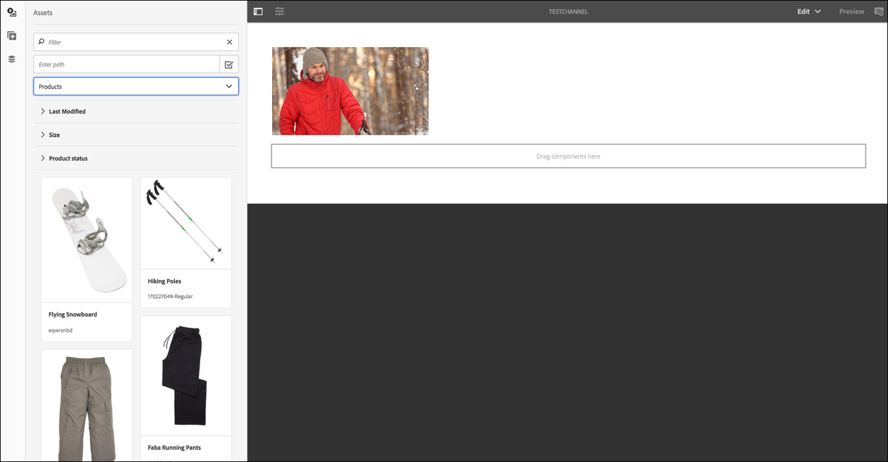

# Criando e Gerenciando Exibições {#creating-and-managing-displays}

Uma exibição é um agrupamento virtual de telas posicionadas uma ao lado da outra. O visor é permanente para uma instalação. Esse é o objeto com o qual os autores de conteúdo trabalham e sempre se referem como exibição lógica, em vez de suas contrapartes físicas.

Ao criar um local, é necessário criar uma exibição para o seu local.

Esta página mostra como criar e gerenciar exibições para o Screens.

**Pré-requisitos**:

* [Configuração e implantação do Screens](configuring-screens-introduction.md)
* [Criar e gerenciar projeto do Screens](creating-a-screens-project.md)
* [Criar e gerenciar canais](managing-channels.md)
* [Criar e Gerenciar Locais](managing-locations.md)

## Criação de uma nova exibição {#creating-a-new-display}

>[!NOTE]
>
>Crie um local antes de criar uma exibição. Consulte [Criar e Gerenciar Locais](managing-locations.md) para obter mais informações.

1. Navegue até o local apropriado, por exemplo `http://localhost:4502/screens.html/content/screens/TestProject`.
1. Selecione a pasta de local e **Criar** que está ao lado do ícone de adição na barra de ações.
1. Selecionar **Exibir** do **Criar** assistente e selecione **Próxima**.
1. Enter **Nome** e **Título** para o seu local de exibição.
1. No **Exibir** escolha os detalhes do Layout. Escolha o desejado **Resolução**, como **Full HD**. Escolha o número de dispositivos horizontal e verticalmente.
1. Selecione **Criar**.

A exibição (*StoreDisplay*) é criada e adicionada ao local (*San Jose*).

Quando a exibição estiver na posição, a próxima etapa é criar uma configuração de dispositivo para essa exibição específica.

>[!NOTE]
>
>**A próxima etapa**:
>
>Ao criar uma exibição para sua localização, atribua um canal à exibição para usar o conteúdo.
>
>Consulte [Atribuir canais](channel-assignment.md) para saber como atribuir um canal à exibição.

## Criando uma nova configuração de dispositivo {#creating-a-new-device-config}

Uma configuração de dispositivo atua como um espaço reservado para um dispositivo de sinalização digital real que ainda não está instalado.

1. Navegue até a exibição apropriada, por exemplo, `http://localhost:4502/screens.html/content/screens/TestProject/locations/newlocation`.
1. Selecione a pasta de exibição e selecione **Exibir painel** na barra de ações.
1. Selecionar **+ Adicionar configuração do dispositivo** na parte superior direita do **Dispositivos** painel.

1. Selecione o **Configuração do dispositivo** como o modelo necessário e selecione **Próxima**.

1. Insira as propriedades conforme necessário e selecione **Criar**.

A configuração do dispositivo é criada e adicionada à exibição atual (na demonstração a seguir, a nova configuração do dispositivo é *DeviceConfig*).

>[!NOTE]
>
>Quando uma configuração de dispositivo é definida para sua exibição no local, a próxima etapa será atribuir um canal à exibição.
>
>Como mostrado na figura abaixo, se a configuração do dispositivo for exibida como não atribuída na variável **DISPOSITIVOS** se nenhum canal estiver atribuído a essa configuração de dispositivo específica.
>
>Você deve ter conhecimento prévio sobre a criação e o gerenciamento de canais. Consulte [Criar e gerenciar canais](managing-channels.md) para obter mais detalhes.

## Exibir painel {#display-dashboard}

O painel de exibição fornece painéis diferentes para gerenciar dispositivos de exibição e configurações de dispositivo para seu dispositivo.

>[!NOTE]
>
>Você pode selecionar as listas de painéis e acionar ações em massa nos itens, em vez de percorrer cada item individualmente.
>
>Por exemplo, a imagem a seguir mostra como selecionar vários canais no painel de exibição.

### Exibir painel de informações {#display-information-panel}

A variável **EXIBIR INFORMAÇÕES** Panel fornece as propriedades de exibição.

Selecionar (**..**) no canto superior direito da janela **EXIBIR INFORMAÇÕES** para que você possa visualizar as propriedades e a exibição.

#### Visualizando propriedades {#viewing-properties}

Selecionar **Propriedades** para que você possa visualizar ou alterar as propriedades de sua exibição.

Além disso, é possível ajustar o valor do temporizador de evento para o canal interativo em **Tempo ocioso** propriedade em **Exibir** guia. O valor padrão está definido como *300 segundos*.

Uso **CRXDE Lite**, para acessar o **idleTimeout** propriedade, ou seja, `http://localhost:4502/crx/de/index.jsp#/content/screens/we-retail/locations/demo/flagship/single/jcr%3Acontent/channels` .

### Painel Canais atribuídos {#assigned-channels-panel}

A variável **CANAIS ATRIBUÍDOS** exibe os canais atribuídos a este dispositivo.

### Painel Dispositivos {#devices-panel}

A variável **DISPOSITIVOS** O painel fornece informações sobre as configurações do dispositivo.

Selecionar (**..**) no canto superior direito da janela **DISPOSITIVOS** para que você possa adicionar configurações de dispositivo e atualizar dispositivos.

Além disso, selecione a configuração do dispositivo para exibir propriedades, atribuir um dispositivo ou excluí-lo completamente.

#### Próximas etapas {#the-next-steps}

Quando terminar de criar uma exibição para sua localização, atribua um canal para a exibição.

Consulte [Atribuir canais](channel-assignment.md) para obter mais detalhes.
